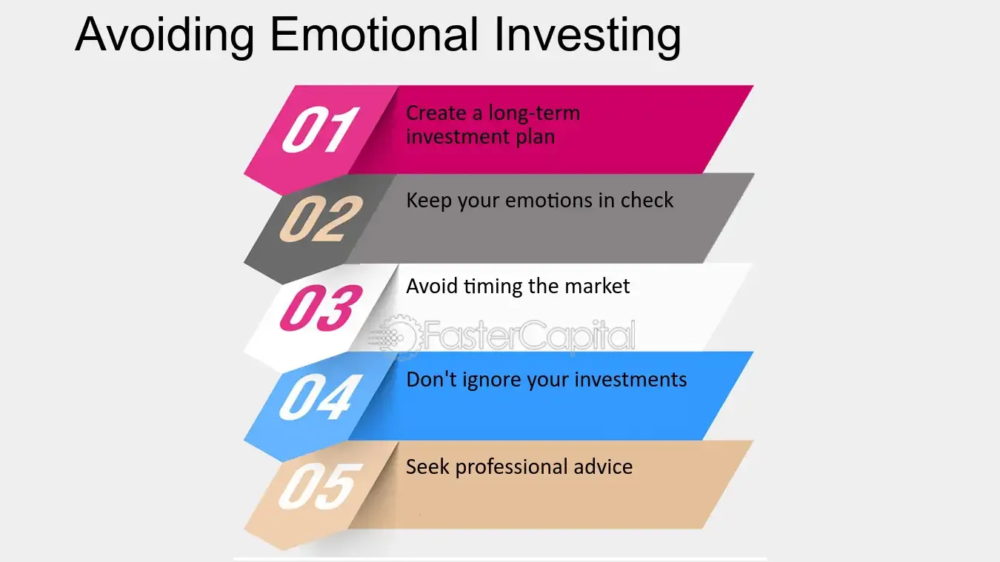

## Table of Contents

## What is emotional investing and why is it harmful?

Emotional investing is when people make choices about buying or selling investments based on their feelings instead of facts and careful thinking. For example, someone might buy a stock because they feel excited about a company, or they might sell all their stocks because they are scared the market will go down. This kind of investing can lead to bad decisions because feelings can change quickly and might not match what is really happening in the market.

Emotional investing is harmful because it often leads to buying high and selling low, which is the opposite of what smart investors do. When people feel good and confident, they might buy investments when prices are already high. But when they get scared or worried, they might sell those investments when prices are low. This can result in losing money instead of making it. It's better to make investment choices based on research and a clear plan, not on how you feel at the moment.

## How can beginners identify their emotional triggers when investing?

Beginners can identify their emotional triggers by paying attention to how they feel when they look at their investments. They should notice if they feel excited, scared, or worried when the market goes up or down. Keeping a journal can help. Every time they make a decision to buy or sell, they should write down what they felt at that moment. Over time, patterns will show up, like feeling nervous every time the market drops a little, which can help them see their emotional triggers.

Another way is to talk to someone else about their investment decisions. A friend or a financial advisor can ask questions that make them think about why they are making certain choices. If they find themselves saying things like "I just have a gut feeling" or "I'm scared it will go down more," these are signs of emotional triggers. By discussing their feelings, beginners can become more aware of when emotions are driving their decisions instead of facts and logic.

It's also helpful to take a step back and wait before making any big investment moves. If they feel a strong urge to buy or sell right away, waiting a day or two can help them calm down and think more clearly. During this time, they can look at the reasons behind their feelings and see if they are based on solid information or just emotions. This practice can teach them to recognize and manage their emotional triggers better.

## What are some basic strategies to manage emotions while investing?

One basic strategy to manage emotions while investing is to set clear goals and stick to a plan. Before you start investing, decide what you want to achieve and how long you want to invest for. Write down your plan and follow it, even when the market goes up and down. This helps you make decisions based on your goals, not on how you feel at the moment. If the market makes you feel nervous or excited, look at your plan and remind yourself why you are investing. This can help you stay calm and focused.

Another helpful strategy is to diversify your investments. This means spreading your money across different types of investments, like stocks, bonds, and real estate. When one type of investment goes down, another might go up, which can help balance out your feelings. If you see one part of your portfolio doing badly, you won't feel as worried because other parts might be doing well. Diversifying can make you feel more secure and less likely to make quick, emotional decisions.

Lastly, taking breaks from watching the market can also help manage your emotions. It's easy to check your investments every day or even every hour, but this can make you feel stressed or excited based on small changes. Try to check your investments less often, maybe once a week or once a month. This gives you time to think clearly and not react to every little up and down in the market. By stepping back, you can make better, more thoughtful decisions about your investments.

## How can setting clear investment goals help prevent emotional investing?

Setting clear investment goals helps prevent emotional investing by giving you a roadmap to follow. When you know exactly what you want to achieve, like saving for a house or retirement, you can make decisions based on those goals instead of how you feel at the moment. For example, if the market goes down and you feel scared, you can look at your goals and see that you are investing for the long term. This can help you stay calm and not sell your investments just because you are worried.

Having a plan also means you can check your progress and make adjustments without letting emotions take over. If you set a goal to save a certain amount of money by a specific date, you can see if you are on track and make changes if needed. This keeps you focused on the big picture and less likely to react to short-term market changes. By sticking to your goals, you can avoid making quick decisions based on fear or excitement, which can lead to better investment outcomes.

## What role does a well-defined investment plan play in avoiding emotional decisions?

A well-defined investment plan acts like a guide that keeps you on track and helps you avoid making decisions based on emotions. When you have a clear plan, you know what you want to achieve, like saving for a new car or your kid's college. This helps you focus on your long-term goals instead of getting caught up in how you feel when the market goes up or down. For example, if the stock market drops and you start to feel scared, you can look at your plan and remember that you are investing for the long term, not just for today.

Sticking to a well-defined investment plan also means you can make adjustments calmly and logically. If your plan includes regular check-ins to see how you are doing, you can make changes without letting fear or excitement take over. This keeps you from selling everything when the market goes down or buying too much when it goes up. By following your plan, you can stay calm and make smart decisions that help you reach your goals, instead of reacting to every little change in the market.

## How can diversification reduce the emotional impact of market fluctuations?

Diversification helps reduce the emotional impact of market fluctuations by spreading your money across different types of investments. When you have all your money in one thing, like one company's stock, you might feel really worried if that stock goes down. But if you have your money in different things, like stocks, bonds, and real estate, you won't feel as scared when one of them goes down. This is because other parts of your investments might still be doing well, which can make you feel more secure and less likely to panic.

Having a mix of investments can also help you stay calm when the market is up and down. When you see that one part of your portfolio is not doing great, you can look at the other parts that might be doing better. This balance can keep you from making quick, emotional decisions, like selling everything when the market drops a little. By spreading your money around, you can feel more confident and stick to your long-term plan, even when the market makes you feel nervous.

## What are the benefits of using stop-loss orders to manage emotional responses?

Using stop-loss orders can help you manage your emotions when you invest. A stop-loss order is like a safety net that automatically sells your investment if it drops to a certain price. This can stop you from losing too much money if the market goes down a lot. When you know you have a stop-loss order in place, you might feel less worried about the market going down because you know you have a plan to limit your losses.

Stop-loss orders can also help you avoid making quick, emotional decisions. Sometimes, when the market goes down, you might feel scared and want to sell everything right away. But with a stop-loss order, you don't have to make that choice in the moment. The order will do it for you if the price hits your set limit. This can give you peace of mind and help you stick to your investment plan, instead of letting your feelings take over.

## How can regular portfolio reviews help in maintaining an unemotional approach to investing?

Regular portfolio reviews help you keep an unemotional approach to investing by giving you a chance to check on your investments without letting your feelings take over. When you look at your portfolio regularly, like once a month or every few months, you can see how your investments are doing without getting too excited or worried about small changes in the market. This helps you make decisions based on facts and your long-term goals, not on how you feel right now.

During these reviews, you can see if you need to make any changes to stay on track with your plan. If you find that one investment is doing really well or really badly, you can think about it calmly and decide what to do next. By doing this regularly, you won't feel rushed or scared into making quick decisions. Instead, you'll be able to adjust your investments thoughtfully, which can help you avoid emotional reactions and stick to your overall strategy.

## What advanced techniques can be used to analyze and mitigate emotional biases in investing?

One advanced technique to analyze and mitigate emotional biases in investing is to use behavioral finance tools. These tools help you understand how your feelings can affect your choices. For example, you might use a software that tracks your decisions and shows you patterns in your behavior. It can point out when you tend to buy or sell based on fear or excitement. By seeing these patterns, you can learn to recognize your emotional triggers and work on making more rational decisions.

Another technique is to practice mindfulness and self-reflection. This means taking time to think about your feelings and why you are making certain investment choices. You can do this by keeping a journal where you write down your thoughts and emotions before and after you make a decision. Over time, this can help you see when your emotions are leading you astray. By being more aware of your feelings, you can pause and think more clearly before you act, which can help you avoid emotional biases and stick to a more logical investment strategy.

## How can investors use mindfulness and meditation to control emotional investing?

Investors can use mindfulness and meditation to control emotional investing by learning to be more aware of their feelings. When you practice mindfulness, you pay attention to what you are thinking and feeling right now, without judging yourself. This can help you notice when you are feeling scared or excited about your investments. By recognizing these emotions, you can take a step back and think about why you feel this way. Instead of making a quick decision based on how you feel, you can wait and make a choice based on your long-term goals and plans.

Meditation can also help you stay calm and focused when the market goes up and down. When you meditate regularly, you get better at staying relaxed and not letting your emotions control you. This can be really helpful when you are investing because the market can make you feel nervous or excited. By staying calm through meditation, you can make better decisions and avoid buying or selling just because you are feeling emotional. Over time, using mindfulness and meditation can help you become a more thoughtful and less emotional investor.

## What are the psychological theories behind emotional investing and how can they be countered?

Emotional investing often comes from psychological theories like prospect theory and loss aversion. Prospect theory says that people feel the pain of losing money more than the joy of gaining the same amount. So, when the market goes down, investors might feel really scared and want to sell their investments to avoid losing more money, even if it's not a good time to sell. Loss aversion is similar; it's when people are so afraid of losing what they have that they make choices that might not be smart in the long run. These theories show how our feelings can make us do things that aren't good for our investments.

To counter these emotional biases, investors can use strategies like setting clear goals and sticking to a plan. By knowing what they want to achieve and how long they want to invest, they can focus on the big picture instead of reacting to every up and down in the market. Another helpful strategy is to practice mindfulness and meditation. These practices can help investors stay calm and make decisions based on facts, not feelings. By understanding the psychological theories behind emotional investing and using these strategies, investors can make better choices and avoid letting their emotions control their investments.

## How can expert investors leverage technology and algorithms to minimize emotional investing?

Expert investors can use technology and algorithms to help them make better choices and avoid letting their feelings get in the way. They can use automated trading systems that follow a set of rules to buy and sell investments. These systems don't get scared or excited like people do, so they can stick to a plan without being affected by emotions. For example, an algorithm might be programmed to buy a stock when it reaches a certain price and sell it when it hits another price, without caring about what the market is doing overall. This can help investors avoid making quick decisions based on fear or excitement.

Another way technology helps is by using data analysis tools to look at lots of information and find patterns that people might miss. These tools can show investors what is really happening in the market, not just what they feel is happening. By using these tools, investors can make choices based on facts and numbers, not on their emotions. Over time, relying on technology and algorithms can help expert investors stay calm and focused on their long-term goals, instead of reacting to every little change in the market.

## References & Further Reading

[1]: Bergstra, J., Bardenet, R., Bengio, Y., & Kégl, B. (2011). ["Algorithms for Hyper-Parameter Optimization."](https://papers.nips.cc/paper/4443-algorithms-for-hyper-parameter-optimization) Advances in Neural Information Processing Systems 24.

[2]: ["Advances in Financial Machine Learning"](https://www.amazon.com/Advances-Financial-Machine-Learning-Marcos/dp/1119482089) by Marcos Lopez de Prado

[3]: ["Evidence-Based Technical Analysis: Applying the Scientific Method and Statistical Inference to Trading Signals"](https://www.amazon.com/Evidence-Based-Technical-Analysis-Scientific-Statistical/dp/0470008741) by David Aronson

[4]: ["Machine Learning for Algorithmic Trading"](https://github.com/stefan-jansen/machine-learning-for-trading) by Stefan Jansen

[5]: ["Quantitative Trading: How to Build Your Own Algorithmic Trading Business"](https://www.amazon.com/Quantitative-Trading-Build-Algorithmic-Business/dp/1119800064) by Ernest P. Chan