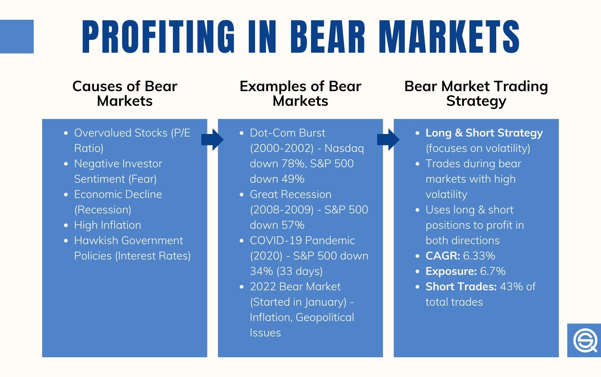

## Table of Contents

## What is a bear market and how can it impact investments?

A bear market is when the prices of stocks and other investments go down a lot, usually by at least 20% from their highest point. This can happen because people are worried about the economy or because something big and bad happens in the world. When people think things are going to get worse, they start selling their investments, which makes the prices fall even more.

When there's a bear market, it can be tough on your investments. If you have money in stocks or funds, you might see the value of your savings go down. It can be scary and make you want to sell your investments, but if you do that, you might lose money. It's usually better to wait and keep your investments, because the market can go back up after a while.

## What is a bull market and what opportunities does it present?

A bull market is when the prices of stocks and other investments go up a lot, usually by at least 20% from their lowest point. This happens when people feel good about the economy and think things will keep getting better. When people are optimistic, they buy more stocks, which makes the prices go up even more.

During a bull market, there are good opportunities for making money on your investments. If you have money in stocks or funds, you might see the value of your savings go up. It's a good time to buy investments because they are likely to keep growing in value. But remember, it's important not to get too excited and make risky choices just because the market is doing well.

## How can diversification help in managing risks during bear and bull markets?

Diversification means spreading your money across different kinds of investments, like stocks, bonds, and real estate. This can help you manage risks during both bear and bull markets. In a bear market, when stock prices are falling, having some money in bonds or other safer investments can help protect your savings. These safer investments might not go down as much, or might even go up a bit, which can balance out the losses from stocks.

In a bull market, when stock prices are going up, diversification can still be useful. If you have all your money in one type of stock or one industry, and that stock or industry suddenly does badly, you could lose a lot of money. But if your money is spread out, a problem in one area won't hurt your whole investment. Plus, having different kinds of investments can help you take advantage of different opportunities as they come up in the market.

Overall, diversification helps you stay safer in both good times and bad times. It's like not putting all your eggs in one basket. By spreading your money around, you can lower the risk of losing a lot and increase your chances of making some gains, no matter what the market is doing.

## What are the common strategies for profiting in a bull market?

In a bull market, when stock prices are going up, one common strategy for making money is to buy stocks and hold onto them. This is called a "buy and hold" strategy. You pick good companies that you think will keep growing and you keep your money in them for a long time. As the market goes up, the value of your stocks goes up too. This way, you can make money without having to guess when the market will go up or down.

Another strategy is called "momentum investing." This means you look for stocks that are already going up fast and you buy them, hoping they will keep going up. You might not keep these stocks for a long time; instead, you sell them when you think they've gone up enough. This can be riskier because if the market changes suddenly, you could lose money. But if you're good at [picking](/wiki/asset-class-picking) the right stocks at the right time, you can make a lot of money this way.

Lastly, some people use a strategy called "sector rotation." This means they move their money from one part of the market to another, depending on which part is doing well at the time. For example, if technology stocks are going up, they might put more money into tech companies. Then, if another part of the market starts doing better, they move their money there. This can help you take advantage of different opportunities as they come up in a bull market.

## What defensive strategies can be used to protect investments during a bear market?

In a bear market, when stock prices are falling, one good way to protect your investments is to move some of your money into safer investments like bonds or cash. Bonds are loans you give to companies or the government, and they usually pay you back with interest. They don't go up and down as much as stocks, so they can help keep your money safer when the stock market is doing badly. Having some money in cash is also a good idea because it won't lose value like stocks might.

Another strategy is to use something called "stop-loss orders." This means you tell your broker to sell a stock if it falls to a certain price. This can help you limit how much money you lose on a stock that's going down fast. It's like having a safety net that automatically kicks in to protect your money. But be careful, because if the market goes back up quickly, you might miss out on gains if your stocks were sold too soon.

Lastly, you can also try to find stocks that do well even when the market is doing badly. These are called "defensive stocks." They are often in industries like healthcare or utilities, where people always need the products or services, no matter what the economy is doing. By putting some of your money into these kinds of stocks, you can help protect your investments from the worst of a bear market.

## How does dollar-cost averaging work in both bear and bull markets?

Dollar-cost averaging is a way of investing where you put the same amount of money into an investment at regular times, like every month. This means you buy more shares when the price is low and fewer shares when the price is high. In a bear market, when prices are going down, dollar-cost averaging helps you because you end up buying more shares at lower prices. This can be good because when the market goes back up, those cheaper shares can make you more money.

In a bull market, when prices are going up, dollar-cost averaging still works well. Even though you might buy fewer shares when prices are high, you're still investing regularly. This helps you take advantage of the market going up without trying to guess the best time to buy. Over time, dollar-cost averaging smooths out the ups and downs of the market, helping you build wealth steadily no matter if it's a bear or a bull market.

## What role do stop-loss orders play in managing risks in volatile markets?

Stop-loss orders are a tool that can help you manage risks when the market is going up and down a lot. A stop-loss order is when you tell your broker to sell a stock if it falls to a certain price. This way, you can limit how much money you lose if a stock starts going down fast. It's like having a safety net that automatically sells your stock to stop you from losing too much money.

In a volatile market, where prices can change a lot very quickly, stop-loss orders can be really helpful. They help you protect your money without having to watch the market all the time. But you need to be careful because if the market goes back up right after your stock is sold, you might miss out on making money. So, it's important to set the stop-loss order at a price that makes sense for you and your investment goals.

## How can investors use options and futures to hedge against market downturns?

Investors can use options and futures to protect their money when the market goes down. Options give you the right, but not the obligation, to buy or sell a stock at a certain price before a certain time. If you think the market might go down, you can buy a "put option" on a stock you own. This means you can sell the stock at the price you set, even if the market price falls lower. This can help you limit your losses because you know you can sell at a better price than the market might give you.

Futures are a bit different. They are agreements to buy or sell something at a set price on a future date. If you think the market will go down, you can sell futures contracts on an index like the S&P 500. If the market does go down, the value of your futures contract will go up, helping to offset the losses in your stock portfolio. Both options and futures can be complicated, so it's important to understand them well before using them to protect your investments.

## What are the key indicators to watch for predicting shifts between bear and bull markets?

To predict when the market might shift from a bear market to a bull market, or the other way around, you should watch some key indicators. One important indicator is the overall economy. If the economy is growing and people are feeling good about their jobs and money, it might be a sign that a bull market is coming or already here. On the other hand, if the economy is slowing down and people are worried about their jobs and money, it could mean a bear market is on its way or already happening. Another big indicator is interest rates. If the government raises interest rates, borrowing money becomes more expensive, which can slow down the economy and lead to a bear market. If they lower interest rates, borrowing becomes cheaper, which can help the economy grow and lead to a bull market.

Another indicator to watch is the stock market itself. If you see stock prices going up a lot over a few months, it might mean a bull market is starting. If stock prices are going down a lot, it could be a sign of a bear market. You can also look at something called the "market sentiment," which is how people feel about the market. If everyone is feeling positive and buying stocks, it can help push the market into a bull market. But if everyone is feeling negative and selling stocks, it can lead to a bear market. Watching these indicators can help you get a sense of where the market might be heading.

## How can sector rotation be used as a strategy to profit in different market conditions?

Sector rotation is a strategy where you move your money from one part of the market to another, depending on which part is doing well at the time. Different parts of the economy, like technology, healthcare, or energy, do better at different times. For example, if the economy is growing fast, you might want to put your money into sectors like technology or consumer goods, because people are spending more money and businesses are doing well. But if the economy is slowing down, you might want to move your money into safer sectors like utilities or healthcare, because people always need those services no matter what's happening with the economy.

Using sector rotation can help you make money no matter what the market is doing. If you pay attention to what's happening in the economy and the news, you can guess which sectors will do well next. Then, you can move your money into those sectors before they start going up. This way, you can take advantage of the ups and downs of the market and make money even when some parts of the market are going down. It's like surfing; you need to catch the right wave at the right time to ride it to the shore.

## What advanced technical analysis tools can be used to maximize profits in bull markets?

In bull markets, when stock prices are going up, you can use some advanced tools to help you make more money. One tool is called moving averages. This tool helps you see the average price of a stock over a certain time, like 50 days or 200 days. When the shorter-term moving average (like 50 days) goes above the longer-term moving average (like 200 days), it's called a "golden cross." This can be a sign that the stock is going to keep going up, so it might be a good time to buy. Another tool is the Relative Strength Index (RSI). This tool measures how fast a stock's price is going up or down. If the RSI is above 70, it might mean the stock is getting too expensive and could go down soon. But if it's below 30, it might be a good time to buy because the stock could be a bargain.

Another useful tool is the Bollinger Bands. These are lines drawn above and below the moving average of a stock's price. When the price of the stock gets close to the upper band, it might be a sign that the stock is getting too expensive and could go down. But when the price gets close to the lower band, it might be a good time to buy because the stock could be a good deal. You can also use something called the MACD (Moving Average Convergence Divergence). This tool helps you see when the short-term trend of a stock is starting to change compared to the long-term trend. If the MACD line crosses above the signal line, it might be a good time to buy because the stock could be starting to go up. Using these tools together can help you make smarter choices about when to buy and sell stocks in a bull market.

## How can contrarian investing be effectively applied in bear markets to achieve high returns?

Contrarian investing means going against what most people are doing. In a bear market, when everyone is selling their stocks because they're scared, a contrarian investor looks for good companies that are being sold too cheaply. They believe that even though the market is going down now, it will go back up eventually. By buying stocks when they're cheap, contrarian investors can make a lot of money when the market turns around. The key is to find strong companies that are just going through a tough time because of the bear market, not because they have big problems.

To do this well, you need to do a lot of research. Look for companies that have good finances, a strong business plan, and a history of doing well even when times are tough. These companies might be in industries that people always need, like food or medicine. When you find these companies, you can buy their stocks at a low price during the bear market. Then, when the market starts to go up again, the value of your stocks will go up too. This way, you can make high returns by being patient and buying when others are selling.

## What are effective investment strategies for bear markets?

Bear markets, defined by prolonged price declines and negative investor sentiment, pose significant challenges but also unique opportunities for investors equipped with effective strategies. These downturns require a proactive approach to mitigate risks and exploit potential gains from falling markets. Three common strategies include short selling, buying put options, and investing in short Exchange-Traded Funds (ETFs).

### Short Selling

Short selling involves borrowing shares of a stock and selling them with the expectation that the price will fall. The investor aims to repurchase the shares at a lower price, return them to the lender, and pocket the difference. This strategy can be profitable in bear markets as it directly benefits from declining stock prices. However, short selling carries significant risks, including unlimited potential losses if the stock price unexpectedly rises. Hence, it requires precise timing and a thorough understanding of market conditions.

### Buying Put Options

Put options give investors the right, but not the obligation, to sell a stock at a predetermined price within a specified timeframe. This strategy allows investors to hedge against potential losses in a bear market by securing the right to sell at a higher strike price than the market price. If the stock price declines as anticipated, the value of the put option increases, offering potential profits or mitigating losses on existing positions. The Black-Scholes model is often used to value options, with the formula:

$$
C = S_0 N(d_1) - X e^{-rT} N(d_2)
$$

Where:
- $C$ is the call option price,
- $S_0$ is the current price of the stock,
- $X$ is the strike price,
- $r$ is the risk-free interest rate,
- $T$ is the time to maturity,
- $N$ is the cumulative distribution function of the standard normal distribution,
- $d_1 = \frac{\ln(S_0/X) + (r + \sigma^2/2)T}{\sigma \sqrt{T}}$,
- $d_2 = d_1 - \sigma \sqrt{T}$, and
- $\sigma$ is the volatility of the stock's returns.

### Investing in Short ETFs

Short ETFs are designed to produce returns inversely related to a specific index or sector. By investing in these funds, investors can potentially profit from market declines without directly engaging in short selling. These ETFs are constructed using derivative instruments such as swaps or futures to achieve their goals. While they offer a convenient way to hedge portfolios or speculate on market declines, they also come with management fees and can experience tracking errors.

### Hedging Techniques

In addition to the aforementioned strategies, hedging can play a crucial role in protecting portfolios from severe losses during bear markets. Diversification across asset classes, such as bonds and commodities, can mitigate risks. Additionally, tactics like the use of stop-loss orders and strategic rebalancing can preserve capital. Utilizing more advanced hedging instruments like futures contracts and [volatility](/wiki/volatility-trading-strategies) indexes can further refine an investor's risk management strategy.

By employing these strategies, investors can navigate bear markets more effectively. Despite their inherent challenges, these markets provide opportunities for those who are well-prepared, disciplined, and vigilant in executing their investment strategies.

## What are effective investment strategies for bull markets?

Bull markets provide a fertile ground for investors to capitalize on rising asset prices. Investors often employ a variety of strategies to make the most of this optimistic environment. Among the most common approaches are taking long positions, buying call options, and investing in growth-oriented Exchange Traded Funds (ETFs). 

A long position, the most straightforward strategy, involves purchasing stocks with the expectation that their prices will increase over time. This approach benefits directly from the upward [momentum](/wiki/momentum) characteristic of a bull market. Calculating potential returns on long positions can be straightforward; assuming a stock is bought at price $P_0$ and sold at price $P_1$, the return $R$ is given by the formula:

$$
R = \frac{P_1 - P_0}{P_0}
$$

Call options represent another strategy wherein investors purchase the right, but not the obligation, to buy a stock at a predetermined price (the strike price) before the option expires. This strategy allows investors to leverage their capital and potentially achieve significant gains if the stock price exceeds the strike price.

Investing in growth-oriented ETFs is also a favored strategy during bull markets. Growth ETFs typically comprise stocks of companies expected to grow at an above-average rate compared to other companies. These ETFs provide diversification and professional management, reducing the risk compared to investing in individual stocks.

While these strategies aim to maximize profits by harnessing market gains, managing risk remains critical. Bull markets can rapidly reverse, either due to economic shifts or investor sentiment changes. Therefore, employing risk management techniques, such as setting stop-loss orders or diversifying investments across various sectors, helps protect against unexpected downturns. Investors must remain vigilant, continuously monitoring market conditions to safeguard their portfolios against the inherent volatility of financial markets.

## How can you spot market reversals?

Recognizing shifts from bull to bear markets or vice versa is a critical skill for strategic investing. Identifying these reversals early can provide investors with significant advantages, enabling them to adjust their portfolios for optimized results. Technical indicators and market analysis tools are indispensable for spotting these changes.

One notable technical indicator is the advance/decline (A/D) line, which offers insights into market breadth and potential turning points. The A/D line is calculated by taking the difference between the number of advancing stocks and the number of declining stocks. Mathematically, this can be represented as:

$$
\text{A/D Line} = (\text{Advancing Stocks} - \text{Declining Stocks})
$$

A rising A/D line indicates broad market participation in an upward trend, suggesting a sustained bull market. Conversely, a declining A/D line, particularly when the market index is still rising, can indicate underlying weakness and potential bearish reversals.

Another critical concept for spotting market reversals is divergence. Divergence occurs when the movement of a market indicator contradicts the movement of a market index. For instance, if a stock index reaches a new high, but the relative strength index (RSI) does not exceed its previous high, it signals a bearish divergence, an indication that a market reversal might be imminent.

For those employing algorithmic strategies, integrating these indicators into code can be beneficial. Below is a Python snippet showing how one might begin to track A/D line movements and look for divergences:

```python
import pandas as pd

# Sample DataFrame with columns 'date', 'advancing', 'declining', and 'index_price'
data = pd.read_csv('market_data.csv')

# Calculate A/D line
data['AD_line'] = (data['advancing'] - data['declining']).cumsum()

# Detect divergence
data['index_high'] = data['index_price'].cummax()
divergence = data[(data['index_price'] == data['index_high']) & (data['AD_line'].diff() < 0)]

print("Potential Divergence Detected:")
print(divergence[['date', 'index_price', 'AD_line']].to_string(index=False))
```

This code evaluates market data, computes the A/D line, and identifies divergence patterns, aiding investors in anticipating market reversals. Recognizing such indicators and employing algorithms for their detection can significantly enhance investment strategies, allowing for timely portfolio adjustments aligned with market dynamics.

## References & Further Reading

[1]: Bergstra, J., Bardenet, R., Bengio, Y., & Kégl, B. (2011). ["Algorithms for Hyper-Parameter Optimization."](https://dl.acm.org/doi/10.5555/2986459.2986743) Advances in Neural Information Processing Systems 24.

[2]: ["Advances in Financial Machine Learning"](https://www.amazon.com/Advances-Financial-Machine-Learning-Marcos/dp/1119482089) by Marcos Lopez de Prado

[3]: ["Evidence-Based Technical Analysis: Applying the Scientific Method and Statistical Inference to Trading Signals"](https://www.amazon.com/Evidence-Based-Technical-Analysis-Scientific-Statistical/dp/0470008741) by David Aronson

[4]: ["Machine Learning for Algorithmic Trading"](https://github.com/PacktPublishing/Machine-Learning-for-Algorithmic-Trading-Second-Edition) by Stefan Jansen

[5]: ["Quantitative Trading: How to Build Your Own Algorithmic Trading Business"](https://books.google.com/books/about/Quantitative_Trading.html?id=j70yEAAAQBAJ) by Ernest P. Chan