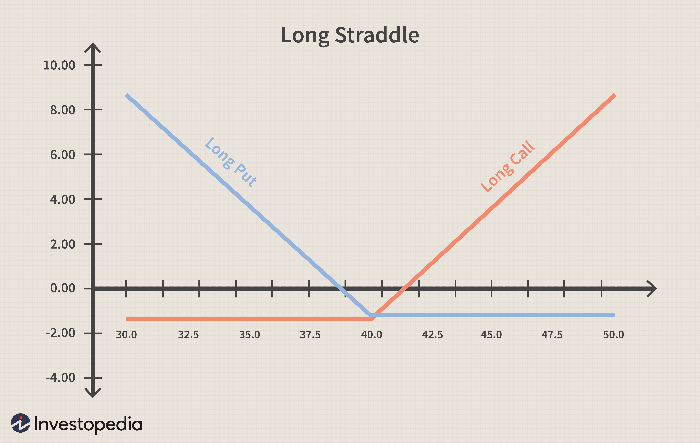

## Table of Contents

## What is market volatility and why does it matter?

Market volatility refers to how much and how quickly the prices of stocks, bonds, or other financial products change. Imagine you're on a boat; if the water is calm, the boat moves smoothly. But if the water gets choppy, the boat rocks a lot. In the same way, when the market is volatile, the prices go up and down a lot in a short time.

This matters because it can affect your investments. If you need to sell your investments during a time of high volatility, you might get less money than you expected. On the other hand, if you can wait out the ups and downs, you might buy things at lower prices and sell them later when prices go up. Understanding volatility helps you make smarter choices about when to buy or sell, and how to manage the risk of losing money.

## How can beginners identify periods of high market volatility?

Beginners can identify periods of high market volatility by looking at how much the prices of stocks or other investments are moving up and down. One easy way to do this is by watching the news. If there are big events like elections, economic reports, or even natural disasters, these can make the market move a lot. Also, you can use tools like the Volatility Index (VIX), which is sometimes called the "fear gauge." When the VIX number is high, it means people expect the market to be more volatile.

Another way to spot high volatility is by looking at stock charts. If you see the lines on the chart going up and down a lot over short periods, that's a sign of volatility. Many websites and apps show these charts for free, so you can check them often. Also, paying attention to how much the prices change from one day to the next can help. If the prices are jumping around a lot, that's another clue that the market is volatile. By keeping an eye on these things, beginners can get a good sense of when the market is going through a rough patch.

## What are the basic strategies for profiting from market volatility?

One basic strategy for profiting from market volatility is called swing trading. This means buying stocks when their prices are low and selling them when the prices go up. During times of high volatility, prices can swing a lot in a short time, so if you can guess when the price will go up, you can make money. It's a bit like trying to catch a ball that's bouncing around; you need to be quick and ready to act.

Another strategy is to use options. Options are like bets on whether a stock's price will go up or down. When the market is volatile, the prices of options can change a lot, and you can make money if you guess right. It's a bit riskier, but it can be very profitable if you know what you're doing. Just remember, like any game, you need to learn the rules and practice before you can get good at it.

A third way is to invest in volatility itself, like buying shares in the Volatility Index (VIX). When the market gets bumpy, the VIX goes up, and if you own part of it, you can make money from that. It's like betting on the storm rather than trying to sail through it. But be careful, because this can be tricky and it's not for everyone.

## How does diversification help in managing volatility?

Diversification means spreading your money across different kinds of investments, like stocks, bonds, and maybe even real estate. When you do this, you're not putting all your eggs in one basket. If one type of investment goes down because of market volatility, the others might stay the same or even go up. This can help smooth out the ups and downs in your overall investment value.

Think of it like having a team of players in a game. If one player has a bad day, the whole team doesn't lose if the other players are doing well. By having different investments, you're building a team that can handle the rough times better. This way, even when the market is jumping around a lot, your whole investment doesn't get too shaken up.

## What are the risks associated with trading during volatile markets?

Trading during volatile markets can be risky because prices can change a lot very quickly. If you buy a stock and the price suddenly drops, you might lose money fast. It's like trying to catch a ball that's bouncing all over the place; it's hard to predict where it will go next. This quick movement can make you feel stressed and might lead you to make quick decisions without thinking them through, which can lead to more losses.

Another risk is that during volatile times, the market can be influenced by emotions like fear and greed. If everyone starts selling their stocks because they're scared, the prices can fall even more. This is called a panic sell-off. On the other hand, if people start buying a lot because they think prices will go up, it can create a bubble that might burst later. So, trading in volatile markets requires a cool head and a good plan, or you might end up losing more than you gain.

## How can options be used to profit from market volatility?

Options can be a way to make money when the market is moving a lot. They are like bets on whether a stock's price will go up or down. If you think a stock will go up, you can buy a "call" option. If you think it will go down, you can buy a "put" option. When the market is very volatile, the prices of these options can change a lot, so if you guess right, you can make a lot of money. It's like betting on a horse race where the horses are moving all over the place; if you pick the right horse, you can win big.

But using options during volatile times can also be risky. If you guess wrong about which way the stock will move, you can lose all the money you spent on the option. It's like betting on a game where the rules keep changing. Also, options have an expiration date, so if the stock doesn't move the way you thought it would before that date, your option could become worthless. So, while options can be a way to profit from market volatility, they require careful planning and a good understanding of how they work.

## What role do stop-loss orders play in a volatile market?

Stop-loss orders are like safety nets for your investments during times when the market is jumping around a lot. Imagine you bought a stock for $50, and you don't want to lose more than $5 if the price drops. You can set a stop-loss order at $45. If the stock price falls to $45, your stock will be sold automatically, so you won't lose more than you're okay with losing. This can help you protect your money when things get wild in the market.

However, stop-loss orders can also have a downside. In a very volatile market, the price of a stock can drop suddenly and then bounce back up just as fast. If your stop-loss order gets triggered during that quick drop, you might sell your stock at a low price, only to see it go back up right after. So, while stop-loss orders can help you avoid big losses, they might also make you miss out on gains if the market swings back in your favor.

## How can technical analysis assist in navigating market volatility?

Technical analysis is like using a map to find your way through a stormy sea. It involves looking at charts and patterns to guess where the market might go next. During times when the market is moving a lot, technical analysis can help you see trends and patterns that might not be obvious at first. For example, if you see a stock's price making lower highs and lower lows, it might be a sign that the price will keep going down. By watching these signals, you can decide when to buy or sell to make the most of the ups and downs.

One common tool in technical analysis is the moving average, which smooths out the price changes over time. If a stock's price is above its moving average, it might be a good time to buy because it could keep going up. But if the price is below the moving average, it might be a warning that the price could drop more. By using these tools, you can make smarter choices about when to jump in or out of the market, even when it's acting like a wild roller coaster.

## What advanced strategies can be employed to capitalize on volatility?

One advanced strategy to make money from market volatility is called straddling. This means buying both a call option and a put option on the same stock at the same time. If the stock price moves a lot in either direction, you can make money. It's like betting that the horse will move, but you don't care which way. This can be a good way to profit from big swings in the market, but it's also risky because if the stock price doesn't move much, you could lose the money you spent on the options.

Another strategy is called delta-neutral trading. This is a bit trickier, but it involves balancing your investments so that they are not affected by small changes in the stock price. Instead, you're betting on the big moves. You do this by buying and selling stocks and options in a way that your overall position stays steady unless there's a big jump in the market. It's like trying to stay balanced on a tightrope while the wind is blowing; if you can keep your balance, you can make money from the big gusts. Both of these strategies need a lot of knowledge and practice, so they're not for beginners.

## How do macroeconomic indicators influence market volatility?

Macroeconomic indicators, like unemployment rates, inflation numbers, and GDP growth, can make the market go up and down a lot. When these numbers come out, they can surprise people. If the numbers are better than expected, like if unemployment goes down a lot, people might feel good about the economy and start buying stocks, making prices go up. But if the numbers are worse than expected, like if inflation goes up a lot, people might get worried and start selling their stocks, which can make prices drop fast. So, these big reports can shake up the market because they change how people feel about the future.

Sometimes, these indicators can also make the market calm down if they show that things are going as expected. If the numbers are just what people thought they would be, there might not be a big reaction. But even small changes can cause big swings if the market is already nervous. For example, if everyone is worried about a possible recession, even a small increase in unemployment can make people panic and sell their stocks. So, keeping an eye on these indicators can help you understand why the market is acting the way it is and make better choices about your investments.

## What are the psychological aspects of trading in volatile markets?

Trading in volatile markets can make you feel all sorts of emotions. When prices are jumping around a lot, it's easy to get scared or excited. If you see your investments going down fast, you might feel fear and want to sell everything right away to stop the losses. On the other hand, if prices are going up and down quickly, you might get greedy and want to keep buying, hoping to make a lot of money. These strong feelings can make you do things without thinking, like selling at the wrong time or buying too much.

To do well in a volatile market, you need to keep your emotions in check. It's important to have a plan and stick to it, even when the market is going crazy. If you've decided to buy or sell at certain prices, try not to change your mind just because you're feeling scared or excited. Taking a step back and looking at the big picture can help you make smarter choices. Remember, everyone feels the same way during volatile times, so staying calm can give you an edge over others who are letting their feelings take over.

## How can algorithmic trading be optimized for volatile market conditions?

Algorithmic trading can be made better for times when the market is moving a lot by using special rules that watch how prices change. These rules can be set to buy or sell things very quickly when the market goes up or down a lot. This is helpful because it can catch the big swings in prices before they go away. For example, if the market is going crazy and prices are jumping around, the computer can be told to buy when prices dip a little and sell when they go up a bit. This way, it can make money from the ups and downs without a person having to watch the market all the time.

Another way to make algorithmic trading work better in a volatile market is by using something called volatility filters. These filters help the computer know when the market is acting wild and when it's calm. When the market is really moving, the computer can change how it trades, maybe by trading more often or by being more careful. This can help it make the most of the big changes in prices while also trying not to lose too much money. By setting up these rules and filters, the computer can handle the ups and downs better than a person might, especially when things are happening very fast.

## References & Further Reading

[1]: Bergstra, J., Bardenet, R., Bengio, Y., & Kégl, B. (2011). ["Algorithms for Hyper-Parameter Optimization."](https://dl.acm.org/doi/10.5555/2986459.2986743) Advances in Neural Information Processing Systems 24.

[2]: ["Advances in Financial Machine Learning"](https://www.amazon.com/Advances-Financial-Machine-Learning-Marcos/dp/1119482089) by Marcos Lopez de Prado

[3]: ["Evidence-Based Technical Analysis: Applying the Scientific Method and Statistical Inference to Trading Signals"](https://www.amazon.com/Evidence-Based-Technical-Analysis-Scientific-Statistical/dp/0470008741) by David Aronson

[4]: ["Machine Learning for Algorithmic Trading"](https://github.com/stefan-jansen/machine-learning-for-trading) by Stefan Jansen

[5]: ["Quantitative Trading: How to Build Your Own Algorithmic Trading Business"](https://www.amazon.com/Quantitative-Trading-Build-Algorithmic-Business/dp/1119800064) by Ernest P. Chan