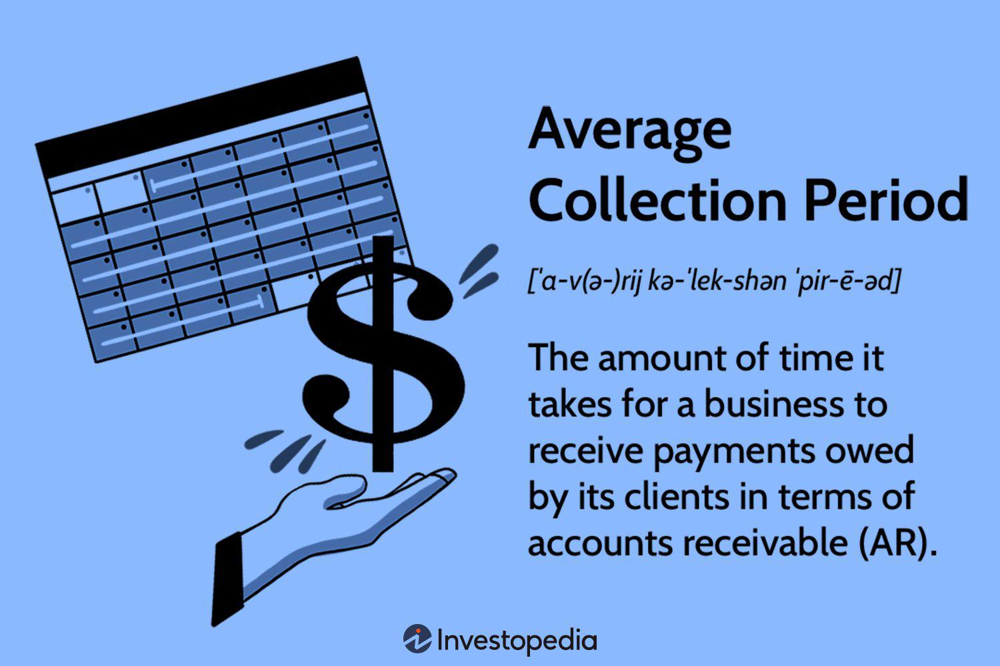

In today's rapidly evolving financial landscape, optimizing collection practices and implementing innovative financial technologies are crucial for maintaining competitiveness. Financial institutions and businesses alike face the challenge of managing cash flows effectively while leveraging technology to enhance their financial operations. This article explores the interplay between creditor collection practices, average collection period management, and the impact of algorithmic trading on financial strategies, crucial aspects that contribute to a company's financial health and strategic advantage.

An organization's ability to efficiently manage its collections and average collection period is paramount for ensuring robust financial health and liquidity. The average collection period, a key performance indicator, measures the time a company takes to collect payments from its customers. Shortening this period indicates efficient collection practices and improved cash flow management, essential for sustaining operations and funding growth.



Algorithmic trading, another transformative element in modern finance, revolutionizes how market participants engage with financial instruments. By employing advanced algorithms to automate trading decisions, firms can execute trades with high precision and speed, often beyond human capabilities. This form of trading enhances market participation and can significantly improve financial performance by providing opportunities for arbitrage and optimizing investment strategies.

As we navigate the complexities of modern financial environments, understanding and integrating these strategies are vital for sustainable success. By examining efficient collection practices, optimizing collection periods, and embracing the advancements in algorithmic trading, organizations are better positioned to thrive in today's competitive market. This article serves as a guide through these critical aspects, offering insights and strategies for organizations aiming to enhance their financial operations and maintain a competitive edge in a rapidly changing world.

## Table of Contents

## Understanding the Average Collection Period

The average collection period is a fundamental financial metric that quantifies the average number of days it takes for a company to collect payments from its credit customers. It is pivotal in assessing the efficiency of a company’s credit and collection practices. A shorter average collection period is preferable, as it indicates that a company is retrieving its owed cash more quickly, which enhances cash flow management and reduces the risk of bad debts.

To calculate the average collection period, one uses the following formula:

$$
\text{Average Collection Period} = \frac{\text{Average Accounts Receivable}}{\text{Net Credit Sales}} \times 365
$$

Where:
- **Average Accounts Receivable** is the average amount of money owed to the company by its customers over a certain period.
- **Net Credit Sales** refers to the total sales made on credit, excluding cash sales, returns, and allowances.

Understanding this metric is vital for effective financial management, as it helps businesses evaluate their credit policies and refine their accounts receivable processes. A company with an extended average collection period may face [liquidity](/wiki/liquidity-risk-premium) challenges, making it crucial to implement efficient credit terms and follow-ups.

For businesses seeking to achieve a favorable average collection period, several practices are recommended:
- **Thorough Credit Assessment:** Conducting comprehensive credit evaluations for new customers to mitigate the risk of non-payment.
- **Clear Invoicing Procedures:** Ensuring that invoices are detailed and sent promptly to minimize confusion and disputes, thereby encouraging timely payments.
- **Incentive Programs:** Offering discounts for early payments can motivate customers to settle their accounts more quickly.
- **Regular Monitoring:** Continuously tracking accounts receivable and collection periods allows businesses to identify and address issues proactively.

By adhering to these practices, companies can effectively manage their average collection period, bolstering cash flow stability and overall financial health.

## Strategies for Improving Average Collection Period

Efficient management of accounts receivable is fundamental in reducing the average collection period, thereby enhancing liquidity and cash flow and minimizing financial risks. To achieve this, businesses can adopt several strategic measures that optimize collection processes.

Firstly, implementing consistent invoicing systems is crucial. This begins with ensuring invoices are clear, detailed, and devoid of ambiguities that might delay payment. Streamlined invoices should include all necessary information such as itemized charges, payment terms, due dates, and contact details for inquiries. A lack of clarity in invoicing can lead to payment delays due to disputes or misunderstandings.

Automating payment reminders is another effective method to reduce the average collection period. In today’s digital age, automation tools can be utilized to send regular payment reminders to customers, thus minimizing the chances of overdue payments. These reminders can be configured to alert customers at various intervals, such as a week before the due date and on the due date itself. 

Flexible payment options also play a vital role in efficient accounts receivable management. By offering customers multiple payment methods—such as credit card payments, bank transfers, and digital wallets—businesses can remove potential barriers to prompt payment. This flexibility caters to customer preferences and facilitates a smoother payment process.

Offering incentives for early payments is an additional strategy that can drive quicker settlements. Businesses may offer discounts or rebates to clients who pay their invoices ahead of time. For instance, offering a 2% discount for payments received within ten days can effectively encourage clients to settle their accounts earlier than required, thus improving cash flow.

Collectively, these strategies help maintain a healthy financial position by ensuring sufficient liquidity and reducing the exposure to bad debts. Adopting a systematic approach to managing accounts receivable not only enhances operational efficiency but also supports sustained financial health by mitigating potential financial risks.

## Algorithmic Trading: Revolutionizing Financial Strategies

Algorithmic trading leverages advanced technologies to automate trading decisions, offering several advantages over traditional manual trading methods. By employing algorithms, traders can process large volumes of market data to execute trades with speed and precision, a level of efficiency unattainable by human traders. This technological advancement has fundamentally transformed financial markets, providing increased accuracy and minimizing the chances of human error.

At its core, [algorithmic trading](/wiki/algorithmic-trading) involves using pre-programmed instructions as defined by mathematical models to place trades at optimal times across various financial instruments. This process allows for rapid analysis of market conditions, evaluating vast datasets on factors such as price, [volume](/wiki/volume-trading-strategy), and timing. The common types of algorithms used in trading include trend-following strategies, [arbitrage](/wiki/arbitrage) opportunities, and mean reversion models.

One of the primary benefits of algorithmic trading is its impact on market liquidity. By continuously operating in the market, algorithmic traders contribute to a higher volume of transactions, thereby increasing liquidity. Enhanced liquidity ensures that large trades can be executed with minimal impact on market prices, stabilizing market operations.

Python, a popular programming language in this field, is often used to develop and implement algorithmic trading strategies. A simplified example of an algorithmic trading Python script might look like this:

```python
import alpaca_trade_api as tradeapi

api = tradeapi.REST('APCA-API-KEY-ID', 'APCA-API-SECRET-KEY', base_url='https://paper-api.alpaca.markets')

# Define the parameters of the trading algorithm
symbol = 'AAPL'
moving_average_window = 20
data = api.get_barset(symbol, 'minute', limit=moving_average_window).df[symbol]

# Calculate the moving average
moving_average = data['close'].mean()

# Get the current price
current_price = data['close'][-1]

# Define a simple moving average crossover strategy
if current_price > moving_average:
    api.submit_order(symbol, qty=10, side='buy', type='market', time_in_force='gtc')
elif current_price < moving_average:
    api.submit_order(symbol, qty=10, side='sell', type='market', time_in_force='gtc')
```

While algorithmic trading offers many advantages, it also presents challenges and risks, particularly concerning high-frequency trading ([HFT](/wiki/high-frequency-trading-strategies)). HFT refers to the use of powerful computers to execute thousands to millions of trades in fractions of a second. Despite its potential to profit from minor price discrepancies, HFT can lead to market [volatility](/wiki/volatility-trading-strategies) and pose systemic risks due to its speed and scale. A notable example is the "Flash Crash" of May 6, 2010, when the Dow Jones Industrial Average plunged about 1,000 points within minutes, partly due to aggressive HFT strategies.

Understanding these aspects is essential for businesses to leverage algorithmic trading effectively. By carefully designing and continually assessing algorithmic strategies, firms can optimize trading outcomes, achieve cost efficiencies, and maintain a competitive edge in financial markets. Additionally, regulatory considerations must be addressed to ensure that algorithmic practices comply with market rules and safeguard against systemic risks. 

Algorithmic trading, by digitizing and refining market participation, presents a dynamic frontier in financial strategy, promising a blend of innovation and precision for modern traders.

## Interconnection of Financial Metrics and Tools

Understanding the synergy between financial metrics like the average collection period and advanced financial tools such as algorithmic trading is essential for effective strategic financial management. By integrating these elements, businesses can gain comprehensive insights, which can be leveraged to enhance their financial strategies and decision-making processes.

Financial analysis, particularly the management of the average collection period, provides crucial information about a company's cash flow and liquidity. This metric helps in assessing how efficient a company is in collecting its receivables. By reducing the average collection period, businesses can improve their cash flow, thereby ensuring that they have the necessary liquidity to meet short-term obligations. Integrating this financial metric with algorithmic trading can offer novel insights and efficiencies.

Algorithmic trading, which utilizes complex algorithms and high-speed data processing, can analyze vast datasets to make trading decisions swiftly. It enhances market liquidity and operational stability by enabling rapid execution of trades based on real-time data. When synchronized with a thorough analysis of financial metrics such as the average collection period, businesses can optimize their resource allocation and risk management strategies.

For instance, a firm could use algorithms to predict cash flows based on historical average collection periods and adjust its trading strategies to address potential liquidity issues. By doing so, companies can ensure that their trading activities are well-aligned with their cash flow forecasts, reducing the risk of liquidity shortages. For example, a Python script could be used to analyze historical receivables data to forecast future cash flows:

```python
import pandas as pd
from sklearn.linear_model import LinearRegression

# Sample data: Days outstanding and cash collections
data = {'Days_Outstanding': [30, 28, 35, 27, 25], 'Cash_Collected': [100, 110, 95, 115, 120]}
df = pd.DataFrame(data)

# Calculate the average collection period
average_collection_period = df['Days_Outstanding'].mean()

# Simple linear regression to predict cash collections
X = df['Days_Outstanding'].values.reshape(-1,1)
y = df['Cash_Collected'].values

model = LinearRegression().fit(X, y)
predicted_cash = model.predict([[average_collection_period]])

print(f"Predicted Cash Collection for Average Collection Period: {predicted_cash[0]}")
```

Real-world applications of such integrations are evident in businesses that have merged their accounting systems with trading platforms. These integrations allow for a seamless flow of financial data, enabling more accurate forecasting and strategic adjustments. Such approaches have proven beneficial in optimizing liquidity management, reducing financial risks, and enhancing overall financial performance.

The strategic utilization of financial metrics along with advanced trading tools helps companies maintain competitiveness and financial stability in a volatile market environment. By fostering continuous adaptation and strategic evolution, businesses can secure a robust financial position, ensuring sustainable growth and success.

## Conclusion

Optimizing collection practices and embracing financial innovations are critical for navigating the challenges of today's financial landscape. The average collection period stands out as a crucial metric for evaluating and enhancing accounts receivable management. By effectively managing this period, businesses can improve their cash flow and liquidity, reducing the risks associated with delayed payments. 

Algorithmic trading, meanwhile, offers businesses a powerful tool to execute trades with precision and without emotional bias, thereby enhancing market efficiency. These algorithms process extensive market data quickly and accurately, allowing for informed decision-making and cost-effective trading strategies. The speed and accuracy of algorithmic trading also contribute to increased market liquidity and reduced transaction costs.

Integrating efficient collection practices with cutting-edge financial technologies like algorithmic trading positions organizations to achieve improved financial health and maintain a competitive edge. This dual approach promotes sustainability and resilience against market fluctuations.

In conclusion, the continuous adaptation and strategic planning are vital in the ever-evolving financial sector. Businesses must remain vigilant, embracing innovations that optimize operations and financial outcomes. Through sustained efforts in improving collection practices and leveraging advanced trading technologies, organizations can secure a stable and prosperous future.

## References & Further Reading

[1]: ["Advances in Financial Machine Learning"](https://www.amazon.com/Advances-Financial-Machine-Learning-Marcos/dp/1119482089) by Marcos Lopez de Prado

[2]: Bergstra, J., Bardenet, R., Bengio, Y., & Kégl, B. (2011). ["Algorithms for Hyper-Parameter Optimization."](https://dl.acm.org/doi/10.5555/2986459.2986743) Advances in Neural Information Processing Systems 24.

[3]: ["Evidence-Based Technical Analysis: Applying the Scientific Method and Statistical Inference to Trading Signals"](https://www.amazon.com/Evidence-Based-Technical-Analysis-Scientific-Statistical/dp/0470008741) by David Aronson

[4]: ["Machine Learning for Algorithmic Trading"](https://github.com/stefan-jansen/machine-learning-for-trading) by Stefan Jansen

[5]: ["Quantitative Trading: How to Build Your Own Algorithmic Trading Business"](https://www.amazon.com/Quantitative-Trading-Build-Algorithmic-Business/dp/1119800064) by Ernest P. Chan