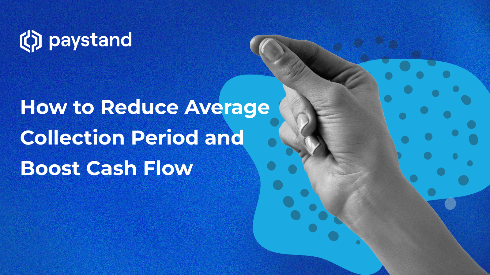

## Table of Contents

## What is the average collection period and why is it important for businesses?

The average collection period is the amount of time it takes for a business to receive payments from its customers after a sale. It is calculated by dividing the average accounts receivable by the total net credit sales, then multiplying the result by the number of days in the period. This number tells a business how long it takes to turn its sales into cash.

Understanding the average collection period is important for businesses because it helps them manage their cash flow. If the collection period is too long, the business might struggle to pay its own bills on time. A shorter collection period means the business can use the money to buy more inventory, pay employees, or invest in growth. By keeping track of this number, a business can make better decisions about credit policies and improve its financial health.

## How can a company calculate its average collection period?

To calculate the average collection period, a company needs to know two main things: the average accounts receivable and the total net credit sales for a certain period, like a year. The average accounts receivable is found by adding the accounts receivable at the start of the period to the accounts receivable at the end of the period, then dividing by two. The total net credit sales are the sales made on credit minus any returns or discounts.

Once you have these numbers, you can find the average collection period. First, divide the average accounts receivable by the total net credit sales. This gives you a fraction that shows how much of the sales are still owed. Then, multiply that fraction by the number of days in the period you are looking at. The result is the average collection period, which tells you how many days it takes, on average, for the company to collect payments from its customers.

## What are the common reasons for a long average collection period?

A long average collection period can happen for a few reasons. One reason is if a company gives its customers a lot of time to pay their bills. This might be because the company wants to attract more customers by offering longer payment terms. Another reason could be that the company is not good at collecting payments. Maybe they don't remind customers to pay, or they don't have strict rules about when payments are due.

Also, economic problems can make the average collection period longer. If customers are having money troubles, they might pay their bills more slowly. This can happen if there's a recession or if people are losing their jobs. Sometimes, a long collection period can be a sign that a company needs to change its credit policies or work harder to collect payments from customers.

## What are the basic strategies a beginner can implement to reduce the average collection period?

A beginner can start by setting clear payment terms for customers. This means telling them exactly when they need to pay, like within 30 days of receiving the bill. You can put these terms on your invoices and remind customers about them. Also, sending invoices right away after a sale can help. The sooner customers get the bill, the sooner they might pay it.

Another simple strategy is to follow up on late payments. If a customer hasn't paid on time, send them a reminder. You can do this by email or phone. Being polite but firm can help. Sometimes, offering a small discount for early payment can also encourage customers to pay sooner. This way, you get your money faster, and they save a bit of money.

Lastly, keeping good records is important. Make sure you know who owes you money and how much. Use a computer program or a simple spreadsheet to track your invoices and payments. This helps you see if someone is late and reminds you to follow up. By doing these things, you can help shorten the time it takes to get paid and keep your business running smoothly.

## How does offering early payment discounts impact the average collection period?

Offering early payment discounts can make the average collection period shorter. When you give customers a little discount for paying early, they might choose to pay sooner to save money. For example, if you say, "Pay within 10 days and get a 2% discount," some customers will want to take that deal. This means you get your money faster than if you waited the full 30 days or more.

However, early payment discounts might not work for everyone. Some customers might not care about the discount if it's too small, or they might not have the money to pay early even with a discount. So, while discounts can help shorten the average collection period, they don't always work for all customers. You need to find the right balance to make sure the discounts are attractive enough but don't hurt your profits too much.

## What role does credit policy play in managing the average collection period?

Credit policy is very important for managing the average collection period. It's like a set of rules that a business makes about giving credit to customers. If a company has a strict credit policy, it might ask customers to pay quickly, like within 15 days. This can make the average collection period shorter because customers know they have to pay soon. On the other hand, if the credit policy is loose, it might let customers take longer to pay, like 60 days. This can make the average collection period longer.

By changing the credit policy, a business can try to control how long it takes to get paid. For example, a company might decide to only give credit to customers who have a good history of paying on time. Or, they might start charging late fees to encourage faster payments. By making these changes, a business can help make sure it gets its money back faster and keeps its cash flow healthy.

## How can a company use technology to streamline its accounts receivable process?

A company can use technology to make its accounts receivable process easier and faster. One way is by using accounting software. This software can send out invoices automatically right after a sale, so customers get their bills quickly. It can also keep track of who owes money and send reminders if payments are late. This helps the company get paid faster and cuts down on the time spent on paperwork.

Another way technology helps is through online payment systems. These systems let customers pay their bills online with a few clicks. It's easier for customers, so they are more likely to pay on time. Plus, the payments go straight into the company's bank account, which makes everything faster and more efficient. By using these tools, a company can shorten its average collection period and keep its cash flow strong.

## What advanced analytical techniques can be used to predict payment behaviors and reduce the average collection period?

Advanced analytical techniques like machine learning can help predict how customers will pay their bills. By looking at past data, like how quickly customers have paid before, what they bought, and even things like their credit scores, a computer can learn to guess who will pay on time and who might be late. This helps the company decide who to give credit to and how long to give them to pay. For example, if the computer sees that a customer usually pays late, the company might ask for payment sooner or not give them as much credit.

Another technique is using data analytics to spot trends and patterns in payment behavior. By looking at big sets of data, a company can see if there are certain times of the year when people pay slower, or if certain types of customers take longer to pay. With this information, the company can change its credit policies to fit these patterns. For instance, if payments are slower in winter, the company might offer bigger discounts for early payment during those months. By using these advanced techniques, a company can better manage its accounts receivable and reduce the average collection period.

## How can a company improve its credit management practices to shorten the collection period?

A company can improve its credit management practices by setting clear and strict credit terms. This means telling customers exactly when they need to pay, like within 30 days, and sticking to it. If customers know they have to pay on time, they are more likely to do so. The company can also check a customer's credit history before giving them credit. This helps make sure they only give credit to people who are likely to pay on time. If someone has a bad history of paying late, the company might ask for payment sooner or not give them as much credit.

Another way to shorten the collection period is by following up on late payments quickly. If a customer doesn't pay on time, the company should send a reminder right away. This can be done through email, phone calls, or even text messages. Being polite but firm can help get the payment faster. The company can also offer discounts for early payment to encourage customers to pay sooner. Keeping good records of who owes money and how much is also important. By using a computer program or a simple spreadsheet to track invoices and payments, the company can see who is late and remind them to pay. These steps can help the company get its money back faster and keep its cash flow healthy.

## What are the potential risks and benefits of outsourcing collections to reduce the average collection period?

Outsourcing collections can help a company get paid faster and save time. When a company hires a professional collections agency, these experts know how to get money from customers who are late on their payments. This can make the average collection period shorter because the agency works hard to collect the money. Also, the company's own employees can focus on other important jobs instead of chasing late payments, which can make the business run smoother.

However, there are some risks to outsourcing collections. It can cost money to hire a collections agency, and this might eat into the company's profits. Sometimes, customers might not like dealing with a collections agency, which could hurt the company's reputation. If the agency is too aggressive, it might even lose customers. So, the company needs to choose a good agency that will work well with their customers and not cause problems.

## How can a company integrate its sales and finance departments to optimize the collection process?

A company can integrate its sales and finance departments to make the collection process better by having them work together closely. When the sales team makes a sale, they can share important details like the customer's payment history and creditworthiness with the finance team right away. This helps the finance team set the right payment terms and keep track of when payments are due. By working together, both teams can make sure that invoices are sent out quickly and that customers understand when they need to pay.

Also, regular meetings between the sales and finance teams can help solve any problems with collections faster. If a customer is late on a payment, the sales team can talk to the customer and find out if there's a reason for the delay. They can then share this information with the finance team, who can decide if they need to change the payment terms or send reminders. By keeping the lines of communication open, the company can make sure that everyone is working towards the same goal of getting paid on time, which helps shorten the average collection period.

## What are the industry-specific strategies for reducing the average collection period in sectors like healthcare or manufacturing?

In the healthcare industry, reducing the average collection period can be tricky because patients and insurance companies often take a long time to pay. One way to help is by using electronic health records and billing systems. These systems can send bills right away and keep track of who owes money. Hospitals and clinics can also work with insurance companies to make sure claims are processed quickly. Another strategy is to offer payment plans to patients. This can help them pay over time, which might mean the healthcare provider gets some money sooner rather than waiting for a big payment that might be late.

In the manufacturing industry, companies often sell to other businesses on credit, which can lead to a long collection period. To shorten this, manufacturers can use strict credit terms and check a buyer's credit history before selling to them. They can also use supply chain financing, where a third party pays the manufacturer quickly and then collects the money from the buyer later. Another way is to offer early payment discounts to encourage buyers to pay sooner. By keeping a close eye on their accounts receivable and working with their customers, manufacturers can get paid faster and keep their cash flow healthy.

## What is the Average Collection Period and How Can It Be Understood?

The average collection period is a fundamental financial metric that quantifies the average number of days it takes for a company to collect payments from its credit customers. It is pivotal in assessing the efficiency of a company’s credit and collection practices. A shorter average collection period is preferable, as it indicates that a company is retrieving its owed cash more quickly, which enhances cash flow management and reduces the risk of bad debts.

To calculate the average collection period, one uses the following formula:

$$
\text{Average Collection Period} = \frac{\text{Average Accounts Receivable}}{\text{Net Credit Sales}} \times 365
$$

Where:
- **Average Accounts Receivable** is the average amount of money owed to the company by its customers over a certain period.
- **Net Credit Sales** refers to the total sales made on credit, excluding cash sales, returns, and allowances.

Understanding this metric is vital for effective financial management, as it helps businesses evaluate their credit policies and refine their accounts receivable processes. A company with an extended average collection period may face [liquidity](/wiki/liquidity-risk-premium) challenges, making it crucial to implement efficient credit terms and follow-ups.

For businesses seeking to achieve a favorable average collection period, several practices are recommended:
- **Thorough Credit Assessment:** Conducting comprehensive credit evaluations for new customers to mitigate the risk of non-payment.
- **Clear Invoicing Procedures:** Ensuring that invoices are detailed and sent promptly to minimize confusion and disputes, thereby encouraging timely payments.
- **Incentive Programs:** Offering discounts for early payments can motivate customers to settle their accounts more quickly.
- **Regular Monitoring:** Continuously tracking accounts receivable and collection periods allows businesses to identify and address issues proactively.

By adhering to these practices, companies can effectively manage their average collection period, bolstering cash flow stability and overall financial health.

## References & Further Reading

[1]: ["Advances in Financial Machine Learning"](https://www.amazon.com/Advances-Financial-Machine-Learning-Marcos/dp/1119482089) by Marcos Lopez de Prado

[2]: Bergstra, J., Bardenet, R., Bengio, Y., & Kégl, B. (2011). ["Algorithms for Hyper-Parameter Optimization."](https://dl.acm.org/doi/10.5555/2986459.2986743) Advances in Neural Information Processing Systems 24.

[3]: ["Evidence-Based Technical Analysis: Applying the Scientific Method and Statistical Inference to Trading Signals"](https://www.amazon.com/Evidence-Based-Technical-Analysis-Scientific-Statistical/dp/0470008741) by David Aronson

[4]: ["Machine Learning for Algorithmic Trading"](https://github.com/stefan-jansen/machine-learning-for-trading) by Stefan Jansen

[5]: ["Quantitative Trading: How to Build Your Own Algorithmic Trading Business"](https://www.amazon.com/Quantitative-Trading-Build-Algorithmic-Business/dp/1119800064) by Ernest P. Chan