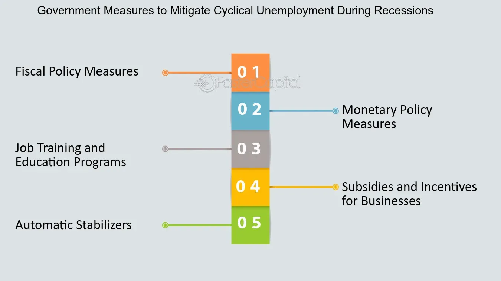

## Table of Contents

## What is cyclical unemployment?

Cyclical unemployment is a type of unemployment that happens because the economy goes through ups and downs. When the economy is not doing well, businesses might not make as much money, so they might lay off workers. This kind of unemployment is linked to the natural cycles of the economy, where there are times of growth and times of slowdown.

During a recession, which is a period when the economy is shrinking, more people lose their jobs because companies are cutting back. When the economy starts to recover and grow again, businesses start hiring more people, and the unemployment rate goes down. Cyclical unemployment is different from other types of unemployment because it depends on how well the economy is doing at that time.

## How does cyclical unemployment differ from other types of unemployment?

Cyclical unemployment is different from other types because it happens when the economy goes through its natural ups and downs. When the economy is doing badly, like during a recession, businesses make less money and might have to let workers go. This means more people are out of work until the economy gets better. When the economy starts to grow again, businesses start hiring, and the number of people without jobs goes down. So, cyclical unemployment is all about the economy's cycles.

Other types of unemployment include frictional and structural unemployment. Frictional unemployment happens when people are between jobs or looking for new ones. It's normal and happens even when the economy is doing well. Structural unemployment is when there's a mismatch between the skills workers have and the jobs that are available. This can happen because of changes in technology or the economy, and it's not directly tied to the economy's ups and downs like cyclical unemployment is.

So, while cyclical unemployment is linked to the economy's performance, frictional and structural unemployment have different causes. Frictional unemployment is about the time it takes to find a new job, and structural unemployment is about a mismatch in the job market. Understanding these differences helps us see why people might be out of work and what can be done to help them.

## What causes cyclical unemployment?

Cyclical unemployment happens because the economy goes through good times and bad times. When the economy is doing badly, like during a recession, businesses make less money. They might have to let workers go because they can't afford to pay them. This means more people are out of work. It's called cyclical because it follows the cycles of the economy, going up when things are good and down when things are bad.

The main cause of cyclical unemployment is a drop in demand for goods and services. When people and businesses spend less money, companies sell less and make less profit. To save money, these companies might cut back on their workforce. This leads to more people being unemployed until the economy starts to recover. When people start spending more money again, businesses can hire more workers, and the unemployment rate goes down.

## What are the economic impacts of cyclical unemployment?

Cyclical unemployment can hurt the economy in big ways. When a lot of people lose their jobs because the economy is doing badly, they have less money to spend. This means they buy fewer things, which makes businesses sell less and can lead to even more layoffs. It's like a circle that keeps going around, making the economy worse. Governments might have to spend more money to help people who are out of work, which can lead to bigger budget deficits.

On the other hand, when the economy starts to get better, businesses begin to hire more people again. This means more people have jobs and can spend more money, which helps the economy grow. But if the recovery is slow, cyclical unemployment can last a long time, causing long-term problems. It's important for governments and businesses to find ways to help the economy recover quickly so that people can get back to work and the economy can start to grow again.

## What are some basic strategies that policymakers can use to reduce cyclical unemployment?

Policymakers can use a few key strategies to help lower cyclical unemployment. One big way is by using something called fiscal policy. This means the government can spend more money on things like building roads, schools, and hospitals. When the government does this, it creates jobs and helps people who are out of work to find new jobs. The government can also cut taxes so that people have more money to spend. When people spend more, businesses make more money and might hire more workers.

Another strategy is monetary policy, which is controlled by the central bank. The central bank can lower interest rates, making it cheaper for businesses to borrow money. When businesses can borrow money more easily, they might decide to grow and hire more people. The central bank can also print more money to help the economy grow, but they have to be careful not to cause too much inflation. By using these tools, policymakers can help the economy recover faster and reduce cyclical unemployment.

## How can fiscal policy be used to combat cyclical unemployment?

Fiscal policy can help fight cyclical unemployment by having the government spend more money on things like building roads, schools, and hospitals. This spending creates new jobs, which helps people who are out of work find new jobs. When the government builds things, it needs workers, so it hires people. This means more people have jobs and can spend money, which helps the economy grow. The government can also give money to people who are out of work, like through unemployment benefits. This helps them keep buying things, which also helps the economy.

Another way fiscal policy can help is by cutting taxes. When the government lowers taxes, people and businesses have more money to spend. If people spend more money, businesses make more money and might hire more workers. This can help reduce the number of people who are out of work. By using these strategies, the government can help the economy recover faster and get people back to work, which is important for reducing cyclical unemployment.

## What role does monetary policy play in reducing cyclical unemployment?

Monetary policy is another way to help lower cyclical unemployment. It's controlled by the central bank, which can change interest rates to help the economy. When the central bank lowers interest rates, it becomes cheaper for businesses to borrow money. If it's easier for businesses to get loans, they might decide to grow and hire more workers. This means more people can find jobs, which helps reduce unemployment.

The central bank can also print more money to help the economy grow. When there's more money in the economy, people and businesses can spend more. This can lead to more jobs because businesses need more workers to meet the higher demand. But the central bank has to be careful not to print too much money, because that could cause inflation, which is when prices go up a lot. By using these tools wisely, the central bank can help the economy recover and get people back to work faster.

## Can labor market policies help in reducing cyclical unemployment? If so, how?

Labor market policies can help reduce cyclical unemployment by making it easier for people to find jobs when the economy is doing badly. One way is by offering training programs. These programs can teach people new skills that are in demand, so they can find jobs even when the economy is not doing well. Another way is by helping people look for jobs through job search assistance programs. These programs can help people find job openings and learn how to apply for them, which can speed up the process of getting back to work.

Another important labor market policy is unemployment benefits. When people lose their jobs during a recession, unemployment benefits give them money to live on while they look for new work. This helps them keep spending money, which is good for the economy. Also, some countries have policies that encourage businesses to keep workers even during tough times, like offering subsidies or tax breaks. By keeping people employed, these policies can help reduce the number of people who are out of work because of the economy's ups and downs.

## What are the potential drawbacks of using government intervention to reduce cyclical unemployment?

Using government intervention to reduce cyclical unemployment can have some downsides. One big problem is that it can cost a lot of money. When the government spends more on things like building roads or giving out unemployment benefits, it might have to borrow money or raise taxes. This can lead to bigger budget deficits, which means the government owes more money. If the government keeps spending a lot of money, it might cause inflation, where the prices of things go up a lot, making life more expensive for everyone.

Another issue is that government intervention might not always work as planned. For example, if the government lowers taxes to help people spend more, it might not lead to more spending right away. People might decide to save the extra money instead of spending it. Also, if the government spends money on projects that are not really needed, it might not create as many jobs as hoped. It's important for the government to think carefully about how to use its money so that it really helps people find jobs and makes the economy better.

## How can international cooperation help in managing cyclical unemployment?

International cooperation can help manage cyclical unemployment by making it easier for countries to work together when their economies are doing badly. When countries share information and ideas, they can learn from each other about what works best to help people find jobs. For example, one country might have a good program for training workers, and other countries can use that idea to help their own people. Also, when countries work together, they can help each other out by buying more goods and services from each other. This can create more jobs and help reduce unemployment.

Another way international cooperation helps is by making sure that the global economy stays stable. When countries work together to keep the economy strong, it can prevent big problems like recessions from happening. If a recession does happen, countries can support each other by sharing resources and money. For example, international organizations like the International Monetary Fund (IMF) can give loans to countries that need help. This can help those countries keep their economies going and reduce the number of people out of work. By working together, countries can make the world economy better and help more people find jobs.

## What advanced economic models are used to predict and manage cyclical unemployment?

Economists use different models to help predict and manage cyclical unemployment. One popular model is the Dynamic Stochastic General Equilibrium (DSGE) model. This model looks at how different parts of the economy, like businesses and people, interact with each other. It uses math to figure out how things like interest rates and government spending can affect unemployment. By using this model, economists can make guesses about what might happen to the economy in the future and what the government can do to help.

Another model that helps with cyclical unemployment is the Phillips Curve. This model shows the relationship between unemployment and inflation. It says that when unemployment is low, inflation tends to be high, and when unemployment is high, inflation tends to be low. By understanding this relationship, policymakers can try to keep both unemployment and inflation at good levels. They might use tools like changing interest rates or government spending to balance the economy and reduce cyclical unemployment.

## How can policymakers evaluate the effectiveness of their strategies in reducing cyclical unemployment?

Policymakers can evaluate the effectiveness of their strategies by looking at the unemployment rate. When they use tools like spending more money or lowering interest rates, they want to see if fewer people are out of work. They can compare the unemployment rate before and after they use their strategies. If the rate goes down, it means their strategies are working. They can also look at other things like how many new jobs are created and how long it takes for people to find work again. By keeping track of these numbers, policymakers can see if their plans are helping the economy and people find jobs.

Another way to check if strategies are working is by looking at how much money people are spending. When people have jobs, they spend more money, which helps businesses grow and hire more workers. Policymakers can use surveys and data to see if people are spending more after they use their strategies. If spending goes up, it's a good sign that the economy is getting better and cyclical unemployment is going down. By looking at all these different signs, policymakers can tell if their efforts are making a difference and adjust their plans if they need to.

## What is Cyclical Unemployment and How Can We Understand It?

Cyclical unemployment is a type of unemployment that emerges due to the natural fluctuations within the business cycle. During phases of economic contraction, also known as recessions, there is a marked decrease in consumer and business demand for goods and services. This decline generally leads to reduced production needs from businesses, consequently resulting in layoffs and increased levels of unemployment. 

The business cycle, characterized by periods of economic expansion followed by contraction, directly influences cyclical unemployment. During the contraction phase, businesses experience decreased revenues and profitability, often triggering cost-cutting measures, including workforce reductions. The relationship between business cycles and employment can be quantitatively expressed using Okun's Law, which illustrates the correlation between unemployment and economic growth, typically represented as:

$$
\Delta U = -\beta(\Delta Y - \bar{Y})
$$

where $\Delta U$ is the change in unemployment rate, $\Delta Y$ represents the change in real GDP, $\bar{Y}$ is potential GDP, and $\beta$ captures the sensitivity of the unemployment rate to changes in economic output.

Several factors contribute to cyclical unemployment, including consumer confidence, government policies, and external economic shocks. Consumer confidence, which gauges consumer sentiment about economic conditions, can significantly influence spending behaviors affecting aggregate demand. Low consumer confidence typically results in reduced spending, exacerbating unemployment during economic downturns.

Government policies, both fiscal and monetary, play a crucial role in either mitigating or exacerbating cyclical unemployment. For instance, contractionary policies during a downturn can worsen unemployment, whereas expansionary policies can help cushion the effects of a recession.

External shocks, such as global financial crises or natural disasters, also impact cyclical unemployment. These shocks can disrupt economic stability and contribute to sudden drops in consumer and business confidence, leading to increased unemployment.

Historical recessions offer concrete examples of cyclical unemployment, notably the Great Recession of 2007-2009. During this period, the collapse of major financial institutions and a consequent global financial crisis resulted in widespread economic contraction. As a result, there was a notable increase in unemployment rates worldwide, illustrating the direct impact of cyclical economic downturns on employment levels. According to the U.S. Bureau of Labor Statistics, the unemployment rate in the United States peaked at 10% in October 2009, up from 4.7% at the start of the recession in December 2007. This drastic increase underscored the cyclical nature of unemployment linked to economic contractions.

## References & Further Reading

[1]: Mankiw, N. G. (2019). ["Macroeconomics"](https://www.macmillanlearning.com/college/us/product/Macroeconomics/p/1319263909). Worth Publishers.

[2]: Baker, S. R., Bloom, N., & Davis, S. J. (2016). ["Measuring Economic Policy Uncertainty."](https://academic.oup.com/qje/article/131/4/1593/2468873) The Quarterly Journal of Economics, 131(4), 1593-1636.

[3]: Lin, J. (2021). ["The Impact of Algorithmic Trading on Liquidity in Stock Markets."](https://onlinelibrary.wiley.com/doi/pdf/10.1002/fut.22224) Theory and Decision, 90(3), 313-334.

[4]: Filardo, A. J., & Rungcharoenkitkul, P. (2016). ["Quantitative Easing: Experiences and Implications."](https://www.bis.org/publ/work594.htm) Bank for International Settlements Quarterly Review.

[5]: ["High-Frequency Trading: A Practical Guide to Algorithmic Strategies and Trading Systems"](https://www.ahmetbeyefendi.com/wp-content/uploads/2020/07/High-Frequency-Trading-Irene-Aldridge.pdf) by Irene Aldridge.

[6]: ["The New Financial Order: Risk in the 21st Century"](https://www.jstor.org/stable/j.ctt7rhkh) by Robert J. Shiller.

[7]: Goolsbee, A., & Krueger, A. B. (2015). ["A Retrospective Look at Rescuing and Restructuring General Motors and Chrysler."](https://www.nber.org/system/files/working_papers/w21000/w21000.pdf) Journal of Economic Perspectives, 29(2), 3-24.