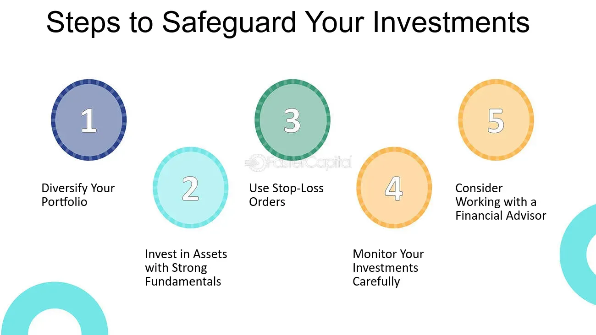

## Table of Contents

## What is a mutual fund and how does it work?

A mutual fund is a type of investment where many people put their money together to buy different things like stocks, bonds, and other investments. It's like a big basket where everyone's money goes in, and a professional manager decides what to buy and sell to try to make the basket grow in value. When you invest in a mutual fund, you are buying a small piece of that big basket.

The way it works is simple. You give your money to the mutual fund, and in return, you get shares in the fund. The price of each share goes up or down depending on how well the investments in the basket are doing. If the investments do well, the value of your shares goes up, and you can make money. If they don't do well, the value of your shares can go down. At any time, you can sell your shares back to the fund and get your money back, although the amount you get might be more or less than what you originally paid.

## What is a financial crisis and how can it impact mutual funds?

A financial crisis is when the money system has big problems. It can happen when banks, businesses, or even whole countries have trouble paying their debts. This can make people scared and they might start taking their money out of banks or selling their investments quickly. When this happens, it can make the crisis even worse because everyone is trying to get their money back at the same time.

When a financial crisis happens, it can really affect mutual funds. Since mutual funds invest in things like stocks and bonds, if these things lose value during a crisis, the value of the mutual fund goes down too. People who have money in the mutual fund might get worried and want to take their money out. But if a lot of people want their money back at the same time, the mutual fund might have to sell its investments quickly, which can make the prices drop even more. This can make it harder for the mutual fund to give people their money back and can lead to bigger losses for everyone involved.

## What are the common types of mutual funds and their risk levels?

There are several common types of mutual funds, each with different levels of risk. One type is money market funds, which are usually the safest. They invest in short-term, high-quality investments like government securities and have a low risk of losing money. Another type is bond funds, which can be a bit riskier. They invest in bonds, which are like loans to companies or governments. The risk depends on the type of bonds the fund buys; government bonds are safer, while corporate bonds can be riskier.

Then there are stock funds, which can be pretty risky. They invest in stocks, which are shares in companies. Stock funds can go up and down a lot, depending on how the companies are doing. Within stock funds, there are growth funds, which invest in companies that are expected to grow a lot, and they can be very risky. There are also value funds, which invest in companies that might be undervalued and could be a bit less risky than growth funds.

Finally, there are balanced funds, which mix stocks and bonds to try to balance risk and reward. They are usually less risky than pure stock funds but riskier than bond funds. And there are target-date funds, which automatically change their mix of investments based on a specific future date, like when you plan to retire. These can start out riskier and get safer over time.

## How can diversification help in protecting mutual funds during a crisis?

Diversification means spreading your money across different types of investments. When you have a mutual fund that is diversified, it might have a mix of stocks, bonds, and other things. If one type of investment does badly during a crisis, the other types might not do as badly or might even do okay. This can help protect your money because not all your eggs are in one basket. For example, if the stock market crashes, but the bond market stays steady, a diversified mutual fund with both stocks and bonds might not lose as much value.

Even though diversification can't stop a crisis from affecting your mutual fund, it can make the impact less bad. During a financial crisis, different parts of the economy can be hit in different ways. By having a mix of investments, a mutual fund can cushion the blow. If the fund manager has picked a good mix, the fund might recover faster after the crisis is over. So, while diversification doesn't make you immune to a crisis, it can help your mutual fund weather the storm better and bounce back quicker.

## What role does asset allocation play in safeguarding mutual funds?

Asset allocation is about deciding how much of your money to put into different types of investments, like stocks, bonds, and cash. It's like choosing how to divide your money in a way that fits your goals and how much risk you're okay with. When it comes to mutual funds, the fund manager does this for you. They decide what mix of investments will help the fund do well while trying to keep it safe. Good asset allocation can help a mutual fund do better during tough times because it spreads the risk around.

If a mutual fund has a smart asset allocation, it can be more protected during a financial crisis. For example, if the fund has some money in stocks, some in bonds, and some in cash, it won't be hit as hard if the stock market crashes. The bonds and cash can help balance things out. The fund manager might also change the allocation during a crisis, maybe moving more money into safer investments. This can help the fund lose less money and recover faster once the crisis is over.

## How can rebalancing a portfolio mitigate risks during financial downturns?

Rebalancing a portfolio means adjusting the mix of investments to keep it in line with your goals and how much risk you want to take. During a financial downturn, some investments might lose value more than others. If you don't do anything, your portfolio could end up being riskier than you planned. By rebalancing, you sell some of the investments that are doing okay and buy more of the ones that have lost value. This can help you buy low and sell high, which is a good way to manage risk.

When you rebalance during a downturn, you're making sure your portfolio stays balanced. This can help protect your money because you're not letting one type of investment take over your portfolio. If stocks are falling but bonds are holding steady, rebalancing might mean selling some bonds and buying more stocks while they're cheaper. This can set you up for better growth when the market starts to recover. Rebalancing helps keep your risk level in check and can make your portfolio more resilient during tough times.

## What are stop-loss orders and how can they be used to protect mutual fund investments?

Stop-loss orders are like safety nets for your investments. They are instructions you give to sell a certain investment if its price drops to a level you set. This can help you limit how much money you might lose if the market goes down. For example, if you own shares in a mutual fund and you set a stop-loss order at a certain price, the shares will be sold automatically if the price falls to that level. This way, you don't have to watch the market all the time and can still protect your money.

Using stop-loss orders with mutual funds can be a bit tricky because mutual funds are usually meant for long-term investing. But if you're worried about a big drop in the market, you might use a stop-loss order to sell your mutual fund shares before they lose too much value. Keep in mind that stop-loss orders don't guarantee you'll sell at the exact price you set, especially if the market is moving fast. But they can still be a useful tool to help manage risk and protect your investment during uncertain times.

## How can investors use dollar-cost averaging to manage investments during volatile markets?

Dollar-cost averaging is a way to invest money little by little over time instead of all at once. It means you put the same amount of money into an investment, like a mutual fund, at regular times, like every month. This can be really helpful during times when the market goes up and down a lot. When the market is down, your money buys more shares because the price is lower. When the market is up, you buy fewer shares because the price is higher. Over time, this can help you pay a lower average price for your investment.

Using dollar-cost averaging during volatile markets can help take some of the worry out of investing. Instead of trying to guess when the market will go up or down, you just keep investing the same amount regularly. This can smooth out the ups and downs of the market because you're buying at different prices. It's like a way to spread out your risk. So even if the market is going through a rough patch, you're still building your investment little by little, which can make it easier to stick with your investing plan.

## What are the benefits of investing in money market funds during a financial crisis?

Money market funds can be a good choice during a financial crisis because they are usually very safe. These funds invest in short-term, high-quality things like government securities and other safe investments. Because of this, they don't go up and down as much as other types of investments like stocks. If the market is going through a rough time, putting your money in a money market fund can help keep it safe. You might not make a lot of money, but you also won't lose a lot, which can be a big relief when everything else is falling.

Another benefit of money market funds during a crisis is that they give you easy access to your money. Unlike some other investments, you can usually get your money back quickly if you need it. This can be really important during tough times when you might need cash fast. So, while money market funds might not grow your money a lot, they can help you feel more secure and give you the flexibility to handle whatever comes your way during a financial crisis.

## How can understanding market cycles help in making strategic decisions for mutual funds?

Understanding market cycles can help you make smarter choices about when to buy or sell mutual funds. Market cycles are like the ups and downs that happen over time in the economy and the stock market. If you know where we are in a cycle, you can guess if prices might go up or down next. For example, if you think the market is at the start of a good cycle, it might be a good time to buy more shares in a mutual fund because prices could go up. If you think we're at the end of a good cycle and a bad cycle might be coming, you might want to sell some shares to protect your money.

By watching market cycles, you can also change your investment plan to match what's happening. If the market is going through a rough patch, you might move some of your money into safer investments like money market funds or bonds. When things start looking up again, you can move money back into stock funds to grow your money. Knowing about market cycles doesn't mean you can predict the future perfectly, but it can help you make better decisions and feel more in control of your investments during good times and bad.

## What advanced hedging strategies can be employed to protect mutual funds from severe market downturns?

One advanced hedging strategy to protect mutual funds during severe market downturns is using options. Options are like contracts that give you the right to buy or sell an investment at a certain price before a certain time. If you think the market might fall, you can buy put options on the stocks or indexes that your mutual fund is invested in. A put option lets you sell at a set price even if the market price drops lower. This can help limit how much money you lose if the market goes down a lot. Another way is to use index options to hedge against broad market movements, which can be especially useful if your mutual fund is diversified across many stocks.

Another strategy is using futures contracts. Futures are agreements to buy or sell something at a future date for a price set today. If you're worried about a market crash, you can sell futures on a stock index. This means you agree to sell the index at today's price at some point in the future. If the market does fall, the value of your futures contract goes up, which can help offset the losses in your mutual fund. This kind of hedging can be complex, but it's a way to protect your investments from big drops in the market. Both options and futures need careful management and understanding, but they can be powerful tools to help keep your mutual fund safe during tough times.

## How can financial advisors and professional management services aid in navigating mutual funds through a financial crisis?

Financial advisors and professional management services can really help when things get tough in the market. They know a lot about how to handle money and can give you good advice on what to do with your mutual funds during a financial crisis. They watch the market all the time and can see signs of trouble before it gets bad. This means they can help you make changes to your investments before the crisis hits hard. They might tell you to move some of your money into safer places, like money market funds, or they might help you use strategies like stop-loss orders or options to protect your money.

Having a professional by your side can also keep you calm when the market is going crazy. It's easy to get scared and make quick decisions that you might regret later. But a financial advisor can help you stick to your plan and not do anything too risky. They can explain what's happening in simple terms and help you understand why it's important to stay the course. This can make a big difference because it's hard to make good choices when you're feeling worried. So, having someone who knows what they're doing can help your mutual funds do better during a financial crisis and come out stronger on the other side.

## References & Further Reading

Statman, M. "Investment Strategies and Performance: The Case of Index Funds and Index-Based Investment." Financial Analysts Journal. This article explores how index funds and index-based investments play a pivotal role in modern portfolio management, providing a structured approach to investment that minimizes risk while seeking to maximize returns through strategic asset allocation.

Sharpe, W. F. "Capital Asset Prices: A Theory of Market Equilibrium Under Conditions of Risk." The Journal of Finance. Sharpe's work introduces the Capital Asset Pricing Model (CAPM), a key concept in finance that helps investors understand the relationship between expected return and risk in a balanced market environment. The equation for CAPM is given by $E(R_i) = R_f + \beta_i (E(R_m) - R_f)$, where $E(R_i)$ is the expected return of the investment, $R_f$ is the risk-free rate, $\beta_i$ is the beta of the investment, and $E(R_m)$ is the expected return of the market.

Elton, E. J., & Gruber, M. J. "Modern Portfolio Theory and Investment Analysis." John Wiley & Sons. This book offers a comprehensive examination of modern portfolio theory, emphasizing the importance of diversification and statistical measures such as variance and covariance in constructing efficient portfolios. The authors detail how to optimize portfolios using the Efficient Frontier, where investors can achieve the highest possible return for a given level of risk.

For additional insights into investment strategies and market behaviors, these resources provide a thorough grounding in both theoretical and applied aspects of finance, enabling investors to develop informed strategies that align with their risk tolerance and financial objectives.

