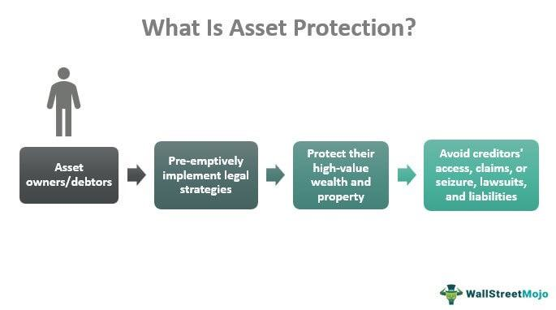

The world of investing continuously adapts to new challenges and opportunities, with financial crises underscoring the necessity for meticulous strategic planning. During times of economic uncertainty, investors are compelled to implement strategies that both safeguard their assets and enhance returns. This article focuses on investment strategies that are designed to protect financial assets amidst crises, specifically through the use of mutual funds and algorithmic trading.

Mutual funds and algorithmic trading are pivotal tools in the current financial landscape, helping investors mitigate risks and seize growth opportunities when markets face turbulence. Mutual funds, with their inherent diversification, offer a buffer against volatility, while algorithmic trading employs advanced computational techniques to optimize decisions in real time. Together, these approaches can significantly aid investors in navigating the complexities of today's financial markets.



This article will explore how these specific strategies can be effectively utilized to protect investments and potentially capitalize on market movements. Understanding and applying these methodologies can empower investors to navigate the intricate and often volatile world of financial markets with greater efficiency and confidence.

## Table of Contents

## Understanding Financial Crises

Financial crises are complex events that can arise from a multitude of factors, including economic downturns, geopolitical events, and market crashes. Such crises are often characterized by rapid declines in asset values and can significantly erode investor confidence.

Economic downturns, often measured by GDP contraction, can trigger a financial crisis by reducing corporate profits, increasing unemployment rates, and diminishing consumer spending. This downward economic spiral impacts stock markets as investors anticipate lower future cash flows and profitability for companies, leading to declining equity prices.

Geopolitical events, such as wars, trade disputes, or political instability, can also precipitate financial crises by creating uncertainty in global markets. These events can disrupt trade, hinder economic cooperation, and impact currency stability, leading to volatility in foreign exchange and capital markets.

Market crashes occur when asset prices fall unexpectedly and sharply, often exacerbated by panic selling, speculation, or excessive leverage. Crashes can lead to a loss of confidence in market mechanisms and cause significant destabilization across financial systems.

Asset devaluation during financial crises poses a serious threat to investments. For example, during the 2008 financial crisis, the collapse of major financial institutions and a decline in housing market values led to a global reduction in wealth and [liquidity](/wiki/liquidity-risk-premium). This example underscores the importance of preparing for financial crises through strategic asset allocation.

To mitigate the impact of financial crises, strategic asset allocation involves diversifying portfolios across various asset classes, such as equities, fixed income, commodities, and real estate. Diversification helps reduce the overall risk and impact of a crisis on a portfolio since different asset classes often react differently to economic or geopolitical shocks.

Investors must stay vigilant in recognizing early warning signs of a financial crisis. These can include inverted yield curves, widening credit spreads, decreasing consumer confidence indices, and significant declines in industrial production. By monitoring these indicators, investors can adjust their portfolios proactively to minimize potential losses.

In summary, understanding financial crises involves recognizing their triggers, potential impacts, and the importance of strategic asset allocation. By preparing for these events and adapting investment strategies accordingly, investors can better protect their portfolios from the adverse effects of financial instability.

## Investment Strategies for Crisis Protection

Diversification is a fundamental principle in reducing investment risk and protecting assets during volatile market conditions. By spreading investments across multiple asset classes, such as stocks, bonds, commodities, and real estate, investors can create a safety net that mitigates the impact of adverse economic events.

**Stocks:** Investing in equities can provide growth potential, but it is essential to select stocks strategically. Diversifying across various sectors, including technology, healthcare, and consumer goods, can help reduce sector-specific risks. Additionally, incorporating noncyclical or defensive stocks, which tend to perform well during economic downturns, can offer stability to the portfolio.

**Bonds:** Bonds are a crucial component of a diversified portfolio, offering fixed income and lower volatility compared to stocks. Investors should consider a blend of government and corporate bonds, as well as varying maturities, to enhance risk management. Government bonds, particularly those from stable economies, are often considered safe havens during financial crises.

**Commodities:** Exposure to commodities, such as gold and oil, can provide a hedge against inflation and currency fluctuations. Precious metals like gold are often sought after during periods of economic uncertainty, as they tend to retain value when traditional currencies falter.

**Real Estate:** Real estate investments offer tangible assets that often appreciate over time. While the real estate market can experience its own volatility, property investments can act as a hedge against inflation and provide a source of rental income.

Mutual funds present an efficient means of achieving diversification, as they pool resources from multiple investors to create a well-rounded portfolio managed by professionals. This diversification is inherent, reducing the individual investor's need to manually balance asset allocation.

Alternative funds, including hedge funds and private equity, can provide additional protection during economic turbulence. These funds often employ strategies that seek absolute returns, regardless of market conditions, and may hold nontraditional assets.

Inflation-protected funds, such as Treasury Inflation-Protected Securities (TIPS), are designed to safeguard against the erosion of purchasing power caused by inflation. These funds adjust their principal in line with inflation, ensuring that returns are maintained in real terms.

Foreign exposure is another critical aspect of diversification. By investing in international markets, investors can reduce the risks associated with localized economic downturns. Foreign investments can include stocks, bonds, and mutual funds from emerging and developed markets, providing access to different economic cycles and growth opportunities.

In conclusion, an effective investment strategy for crisis protection combines a diversified mix of asset classes, incorporating mutual funds, alternative investments, and inflation-protected funds. By adjusting portfolios to include noncyclical stocks and foreign exposure, investors can buffer against market [volatility](/wiki/volatility-trading-strategies) and protect their financial interests during economic uncertainty.

## The Role of Mutual Funds During Economic Uncertainty

Mutual funds are investment vehicles that pool resources from multiple investors to create a diversified portfolio managed by professional fund managers. These funds offer an effective means of managing investment risk, particularly during periods of economic uncertainty. Diversification is a fundamental principle of risk management, and mutual funds inherently provide this by investing across a wide array of asset classes such as stocks, bonds, and money market instruments. The structured nature of mutual funds helps distribute risk, making them a favorable option for investors seeking stability in turbulent economic times.

Mutual funds are categorized by the type of assets they hold. Stock funds, bond funds, and money market funds are some common types, each with distinct risk profiles and potential returns. Stock funds, investing primarily in equities, have the potential for high returns but come with increased volatility. Bond funds, investing in fixed-income securities, generally offer lower returns with less risk. Money market funds provide high liquidity and stable returns, making them an attractive option for conservative investors during market downturns.

One strategic approach in mutual fund investment during economic uncertainty is to avoid leveraged funds. Leveraged funds aim to amplify returns by using borrowed capital in addition to investor funds, which increases potential gains but also significantly magnifies risks. In uncertain times, the volatility associated with leveraged funds can lead to substantial losses, thus cautious investors may prefer funds that focus on stable government bonds. Government bonds are considered safer investments due to their backing by national governments, providing a steady income stream and capital preservation.

Liquidity is another significant advantage of mutual funds. They allow investors to easily convert shares into cash, typically within a couple of business days, providing financial flexibility. This liquidity ensures that investors can respond to markets swiftly, an advantage in volatile economic environments.

The professional management provided by mutual funds adds another layer of stability. Fund managers utilize their expertise to adjust the fund's portfolio in response to changing market conditions, aiming to optimize returns and minimize risks. This active management can be particularly beneficial during economic crises when market conditions are highly dynamic and require swift, informed decision-making.

In summary, mutual funds offer diversification, liquidity, and professional management, making them robust investment choices for those seeking to safeguard their assets during economic uncertainty. By selecting the appropriate type of mutual fund and employing cautious investment strategies, investors can potentially mitigate risks and preserve capital amidst financial instability.

## Algorithmic Trading: A Robust Tool for Modern Investors

Algorithmic trading leverages computer algorithms to execute trading decisions at speeds unattainable by human traders, offering enhanced efficiency in trade timing and execution while substantially reducing human error. It involves the use of pre-programmed trading instructions accounting for variables such as timing, price, and [volume](/wiki/volume-trading-strategy), enabling the execution of a large volume of orders swiftly and accurately.

Algorithmic trading supports high-frequency trading ([HFT](/wiki/high-frequency-trading-strategies)), a subset that involves executing orders within fractions of a second, significantly improving market liquidity and potentially increasing investor returns. An example is the use of [momentum](/wiki/momentum) strategies, whereby algorithms identify and trade based on the momentum of price movements, continuously adjusting positions to align with real-time market dynamics.

The efficiency of [algorithmic trading](/wiki/algorithmic-trading) is evident in the reduced transaction costs and increased market efficiency. By optimizing trade execution and minimizing the market impact, these algorithms take advantage of even the smallest price discrepancies across markets, a process known as [arbitrage](/wiki/arbitrage). This approach is particularly beneficial in markets where speed and precision are critical to gaining a competitive edge.

Despite these advantages, algorithmic trading is not without challenges. Technological issues such as hardware failures, software bugs, and network connectivity problems can disrupt trading operations. Regulatory considerations also pose significant challenges, as governing bodies increasingly scrutinize algorithmic trading practices to safeguard against market manipulation and systemic risks. For instance, algorithms must comply with regulations like the Markets in Financial Instruments Directive (MiFID II) in Europe, which mandates transparency and fairness in financial markets. 

Moreover, in fast-paced markets, the risk of cascading failures due to interlinked algorithmic systems is a concern. Flash crashes, abrupt crashes in security prices triggered by computer algorithms, highlight the need for robust risk management frameworks. Therefore, traders employing algorithmic strategies must continuously evaluate the performance and reliability of their systems, ensuring they adapt to evolving market conditions and regulatory environments. 

Overall, while the complexities and risks associated with algorithmic trading must be carefully managed, its ability to revolutionize trading practices by enhancing execution efficiency, lowering costs, and improving liquidity makes it a powerful tool for modern investors seeking to thrive in today's dynamic financial markets.

## Integrating Mutual Funds with Algorithmic Trading

The integration of mutual funds with algorithmic trading creates a robust mechanism for enhancing investment performance through technology. Mutual funds benefit from inherent diversification, professional management, and liquidity. However, by incorporating algorithmic trading, they can achieve greater efficiency and responsiveness to market dynamics.

Algorithmic tools are designed to optimize investment portfolios by executing trades based on comprehensive data analysis. These algorithms utilize historical data, market trends, and statistical models to forecast future price movements and identify optimal trading opportunities. For instance, algorithms can analyze past performance patterns to predict future price changes, helping fund managers make informed decisions.

By dynamically adjusting asset allocations, algorithmic strategies can mitigate market risks. Algorithms can automatically rebalance portfolios to maintain an optimal risk-reward balance, especially during market volatilities. For example, consider an algorithm designed to maintain a target asset allocation:  

```python
def rebalance_portfolio(current_allocations, target_allocations):
    trades = {}
    for asset, target in target_allocations.items():
        current = current_allocations.get(asset, 0)
        trade = target - current
        if trade != 0:
            trades[asset] = trade
    return trades

current_allocations = {'stocks': 50000, 'bonds': 25000}
target_allocations = {'stocks': 45000, 'bonds': 30000}
trades_needed = rebalance_portfolio(current_allocations, target_allocations)
print(trades_needed)  # {'stocks': -5000, 'bonds': 5000}
```

This script demonstrates a simplistic scenario where a portfolio needs rebalancing to align with target allocations, reflecting how algorithms can adjust holdings based on predetermined criteria.

The combination of traditional fund management with algorithmic techniques allows mutual funds to not only leverage data for informed decision-making but also capitalize on real-time market conditions. It results in enhanced portfolio agility. This hybrid approach utilizes the historical and industry expertise inherent in mutual funds while gaining the precision and speed of algorithmic trading, providing a competitive edge in the fast-paced financial markets.

## Challenges and Considerations for Investors

Algorithmic trading and mutual funds present a range of implementation risks that investors must carefully navigate. While both technologies offer significant opportunities for optimizing investment returns, they also require meticulous attention to system reliability, regulatory compliance, and data quality.

**System Reliability and Data Quality**

Ensuring system reliability is crucial in algorithmic trading, where trades are executed at [high frequency](/wiki/high-frequency-trading) and speed. Any malfunction or downtime can lead to significant financial losses. Investors should implement robust testing and monitoring systems to ensure their trading algorithms function correctly under various market conditions. Moreover, the reliability of mutual funds also hinges on the quality of data used for making investment decisions. Poor data quality can lead to inaccurate analyses and misguided strategies, underscoring the need for comprehensive data verification processes.

**Regulatory Compliance**

Navigating the complex regulatory landscape is another challenge for investors employing these investment tools. Algorithmic trading is subject to strict regulations aimed at preventing market manipulation and ensuring market stability. Such regulations may include restrictions on the frequency and volume of trades, as well as requirements for audit trails. Similarly, mutual funds are governed by a range of regulations that dictate disclosure requirements and investment limits. Investors must stay informed about relevant legal obligations to avoid costly penalties and ensure that their operations remain within legal boundaries.

**Adapting to Evolving Market Conditions**

The dynamic nature of financial markets necessitates continuous evaluation and adaptation of investment strategies. Market conditions can change rapidly due to various factors such as economic policies, geopolitical events, and technological advancements. Investors must therefore maintain a flexible approach, regularly reassessing their strategies and optimizing their portfolio allocations to align with current market conditions. This adaptability is crucial for mitigating potential losses and capitalizing on new opportunities.

**Awareness and Education**

Finally, investor education and awareness are paramount in effectively leveraging algorithmic trading and mutual funds. Both tools involve complex concepts and sophisticated technologies that require a solid understanding to be used effectively. Continuous learning and staying updated on industry developments are essential for making informed decisions and optimizing investment outcomes amidst market uncertainties.

In summary, while algorithmic trading and mutual funds offer potential benefits, they also present significant challenges. By focusing on system reliability, ensuring regulatory compliance, adapting to market changes, and enhancing educational efforts, investors can better navigate these challenges and optimize their investment strategies.

## Conclusion

Effective crisis investment strategies rely on a combination of diversification and technological innovation to safeguard financial assets. Mutual funds and algorithmic trading stand out as valuable tools that provide robust avenues for managing risk, particularly during turbulent economic periods.

Mutual funds inherently offer diversification by pooling resources to create a broad portfolio managed by professionals. This diversification reduces unsystematic risk linked to individual securities and sectors. By incorporating algorithmic trading, investors can further optimize this diversification, employing sophisticated algorithms to analyze market data and execute trades with precision. This combination enables portfolio adjustments in real-time in response to market fluctuations, preserving and potentially enhancing asset value.

The strategic alignment of mutual funds and algorithmic trading can significantly bolster the resilience of investment portfolios. Algorithmic trading allows for the automation of complex trading strategies, reducing human error and increasing the speed and efficiency of trades. Meanwhile, mutual funds provide stability through professional management and the inherent diversification they offer. By integrating these two approaches, investors can benefit from traditional asset management's stability and cutting-edge technological advancements.

However, investors must remain informed and adaptable to successfully navigate financial challenges. This includes keeping abreast of technological and regulatory developments, understanding how their chosen strategies are affected by market changes, and continuously evaluating the performance and risks associated with their investments. Being proactive in education and strategy adaptation enables investors to effectively leverage the strengths of mutual funds and algorithmic trading in their portfolios, enhancing their capacity to weather financial crises.

## References & Further Reading

Statman, M. "Investment Strategies and Performance: The Case of Index Funds and Index-Based Investment." Financial Analysts Journal. This article explores how index funds and index-based investments play a pivotal role in modern portfolio management, providing a structured approach to investment that minimizes risk while seeking to maximize returns through strategic asset allocation.

Sharpe, W. F. "Capital Asset Prices: A Theory of Market Equilibrium Under Conditions of Risk." The Journal of Finance. Sharpe's work introduces the Capital Asset Pricing Model (CAPM), a key concept in finance that helps investors understand the relationship between expected return and risk in a balanced market environment. The equation for CAPM is given by $E(R_i) = R_f + \beta_i (E(R_m) - R_f)$, where $E(R_i)$ is the expected return of the investment, $R_f$ is the risk-free rate, $\beta_i$ is the beta of the investment, and $E(R_m)$ is the expected return of the market.

Elton, E. J., & Gruber, M. J. "Modern Portfolio Theory and Investment Analysis." John Wiley & Sons. This book offers a comprehensive examination of modern portfolio theory, emphasizing the importance of diversification and statistical measures such as variance and covariance in constructing efficient portfolios. The authors detail how to optimize portfolios using the Efficient Frontier, where investors can achieve the highest possible return for a given level of risk.

For additional insights into investment strategies and market behaviors, these resources provide a thorough grounding in both theoretical and applied aspects of finance, enabling investors to develop informed strategies that align with their risk tolerance and financial objectives.

