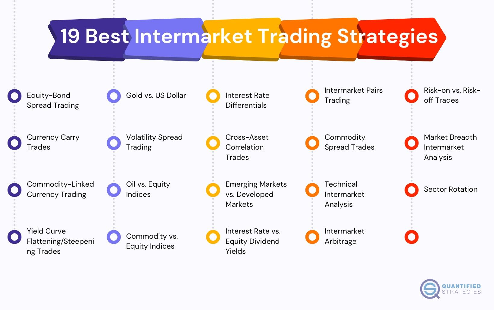

## Table of Contents

## What are international equity markets and why are they important?

International equity markets are places where people and companies from different countries can buy and sell shares of companies that are based in other countries. These markets include stock exchanges like the New York Stock Exchange, the Tokyo Stock Exchange, and the London Stock Exchange. When you invest in international equity markets, you are buying a small piece of a company that is located in another country.

These markets are important for a few reasons. First, they help companies get money they need to grow their business. When a company sells shares, it gets money that it can use to build new factories, hire more workers, or develop new products. Second, international equity markets let people from different countries invest in each other's economies. This can help spread risk because if one country's economy is not doing well, investors can still make money from companies in other countries. This can lead to more stable and connected global economy.

## What are the basic risks involved in investing in international equity markets?

Investing in international equity markets can be exciting, but it also comes with some risks. One big risk is currency risk. This means that the value of your investment can go up or down because of changes in the exchange rate between your country's money and the money of the country where the company is based. For example, if you invest in a Japanese company and the yen gets weaker compared to your currency, your investment might be worth less when you convert it back.

Another risk is political risk. This happens when the government or political situation in a country changes in a way that affects the companies you've invested in. For example, a new law might make it harder for a company to do business, or there could be a political crisis that makes investors nervous and causes stock prices to drop. It's important to keep an eye on what's happening in the countries where you're investing.

Lastly, there's market risk, which is the risk that comes from the ups and downs of the stock market itself. Even if a company is doing well, its stock price can still go down if the whole market is doing poorly. This can happen because of economic problems, like a recession, or because of events like a global health crisis. It's a good idea to spread your investments across different countries and types of companies to help manage this risk.

## How can diversification help in managing risks in international equity markets?

Diversification means spreading your money across different investments. When you invest in international equity markets, you can put your money in companies from many different countries. This helps because if one country's market goes down, you might still make money from other countries' markets. It's like not putting all your eggs in one basket. If one egg breaks, you still have others that are safe.

By diversifying, you can also lower the risk that comes from changes in currency values. If one country's currency gets weaker, your investments in other countries might not be affected as much. This can help keep your overall investment more stable. It's a way to protect yourself from big losses if something goes wrong in one place.

## What are currency risks and how can they be mitigated in international equity investments?

Currency risk is when the value of your investment changes because of changes in the exchange rate between your country's money and the money of the country where the company is based. For example, if you invest in a company in Japan and the yen gets weaker compared to your currency, your investment might be worth less when you convert it back to your own money. This can happen even if the company you invested in is doing well. It's a big risk when you invest in international equity markets because you can't control what happens with exchange rates.

To help with currency risk, you can use something called hedging. Hedging is like a safety net that can protect your investment from big changes in currency values. One way to hedge is by using financial tools like currency futures or options. These tools let you lock in an exchange rate for the future, so you know how much your investment will be worth when you convert it back. Another way to manage currency risk is by diversifying your investments across different countries. If you spread your money around, a drop in one currency might be balanced out by gains in another. This way, you're not relying on just one country's currency to do well.

## What role does geopolitical stability play in the safety of international equity markets?

Geopolitical stability is really important for keeping international equity markets safe. When a country is politically stable, it means there's less chance of sudden changes that could scare investors. If people feel safe and confident about a country's political situation, they are more likely to invest in companies from that country. This can help keep the stock market stable and growing. But if a country has a lot of political problems, like wars or big changes in government, investors might get worried and pull their money out. This can make stock prices go down and cause a lot of trouble for the companies and the people who invested in them.

To keep international equity markets safe, it's a good idea to watch what's happening around the world. If a country is going through a tough time politically, it might be riskier to invest there. But if a country is stable and things are going well, it could be a safer place to put your money. By paying attention to the news and understanding what's happening in different countries, you can make smarter choices about where to invest. This way, you can try to avoid places that might be too risky because of political problems.

## How can investors use hedging strategies to protect their investments in international equities?

Hedging is a way for investors to protect their money when they invest in companies from other countries. One common way to hedge is by using financial tools like currency futures or options. These tools help you lock in an exchange rate for the future, so you know exactly how much your investment will be worth when you change it back to your own money. This can be really helpful because it means you don't have to worry as much about the value of your investment going down if the other country's currency gets weaker.

Another way to hedge is by spreading your investments across different countries. This is called diversification. If you put your money in companies from many different places, a drop in one country's currency might not hurt as much because you still have investments in other countries that could be doing well. By doing this, you're not relying on just one country's currency to stay strong, which can make your overall investment safer. It's like having a safety net that catches you if one part of your investment falls.

## What are the key regulatory differences that affect safety in various international equity markets?

Different countries have different rules for their stock markets, and these rules can affect how safe it is to invest there. Some countries have very strict rules that make sure companies tell the truth about their business and how they're doing. This helps investors feel more confident because they know they're getting honest information. Other countries might not have such strict rules, which can be riskier. If a company can hide problems or lie about how well it's doing, investors might lose money if they don't know the whole story.

Another important thing is how well a country's government watches over the stock market. In some places, there are strong government agencies that make sure everyone follows the rules and that the market is fair. This can make the market safer because investors know there's someone watching out for them. But in other countries, the government might not be as involved, which can make the market more unpredictable and riskier. So, when you're thinking about investing in a different country, it's a good idea to learn about their rules and how well they're enforced.

## How do economic indicators influence safety and investment decisions in international equity markets?

Economic indicators are like signs that tell us how a country's economy is doing. Things like unemployment rates, inflation, and how much people are spending can show if a country's economy is strong or weak. When these signs are good, it usually means the stock market in that country might be safer to invest in. Investors feel more confident because they think companies will do well and make more money. But if the signs are bad, like if a lot of people are out of work or prices are going up too fast, investors might worry. They might think companies will struggle, so they might not want to invest as much, which can make the stock market riskier.

These indicators also help investors decide where to put their money. If one country's economy looks strong, investors might want to buy more stocks from companies in that country. They think those stocks will go up in value because the economy is doing well. On the other hand, if another country's economy looks weak, investors might sell their stocks from that country or not buy any new ones. They want to avoid losing money if the economy gets worse. By watching these economic signs, investors can make smarter choices about where to invest their money in international equity markets.

## What advanced analytical tools can be used to assess the safety of investments in international equity markets?

Advanced analytical tools can help investors figure out how safe their investments in international equity markets might be. One tool is called quantitative analysis, which uses math and numbers to look at things like a company's past performance, how much money it makes, and how much risk it might have. This can help investors see if a company is likely to do well in the future. Another tool is technical analysis, which looks at stock prices and trading patterns to predict what might happen next. By studying charts and graphs, investors can try to spot trends and make better guesses about when to buy or sell stocks.

Another useful tool is [fundamental analysis](/wiki/fundamental-analysis), which digs deep into a company's financial health, its business model, and the overall economy of the country it's in. This helps investors understand if a company is a good investment based on its real value, not just what the stock market says. There are also risk assessment models that use a lot of data to measure how risky an investment might be. These models can look at things like political stability, currency changes, and economic indicators to give investors a clearer picture of the risks they might face. By using these tools, investors can make smarter decisions and feel more confident about their investments in international equity markets.

## How can investors evaluate the political risk associated with different international equity markets?

Investors can evaluate political risk in different international equity markets by keeping an eye on what's happening in the countries where they want to invest. This means watching the news to see if there are any big changes in the government or if there are any conflicts or protests happening. They can also look at reports from organizations like the World Bank or the International Monetary Fund, which often talk about the political situation in different countries. If a country is going through a lot of political changes or if there's a lot of unrest, it might be riskier to invest there because these things can make the stock market go up and down a lot.

Another way to evaluate political risk is by using something called a political risk index. These indexes are made by experts who study how stable a country's government is and how likely it is to change in a way that could hurt businesses. The index gives a score to each country, and a lower score usually means more risk. Investors can use these scores to compare different countries and decide which ones are safer to invest in. By understanding the political situation and using tools like political risk indexes, investors can make better choices about where to put their money in international equity markets.

## What are the best practices for monitoring and adjusting an international equity portfolio for safety?

Keeping your international equity portfolio safe means you need to watch it closely and be ready to make changes when things happen around the world. Start by checking the news often to see if there are any big political changes, economic problems, or other events that could affect the countries where you've invested. Use tools like economic indicators and political risk indexes to get a better idea of what's going on. If you see that a country's situation is getting worse, you might want to sell some of your investments there to avoid losing money. It's also a good idea to use financial websites and apps that give you updates on your investments and let you know if there are any big changes.

Another important thing is to keep your investments spread out across different countries and types of companies. This is called diversification, and it helps protect you from big losses if one country or one type of company does badly. If you notice that one part of your portfolio is doing much better or worse than the others, you might want to adjust it. For example, if one country's market is growing a lot, you could put a bit more money there. But if another country's market is going down, you might want to take some money out. By staying on top of things and making smart adjustments, you can help keep your international equity portfolio safe.

## How do expert investors integrate macroeconomic forecasts into their strategies for safety in international equity markets?

Expert investors use macroeconomic forecasts to help them make safer choices about where to put their money in international equity markets. They look at predictions about things like how fast a country's economy will grow, what interest rates might do, and how much people will spend. These forecasts help them guess if a country's stock market will go up or down. If the forecasts say a country's economy will do well, investors might decide to buy more stocks from that country because they think the prices will go up. But if the forecasts say a country's economy will struggle, investors might sell some of their stocks there to avoid losing money.

To use these forecasts, expert investors also think about how different parts of the world are connected. They know that what happens in one country can affect others, so they look at the big picture. For example, if a big economy like the United States is expected to slow down, it might affect other countries too. By understanding these connections, investors can adjust their portfolios to be safer. They might spread their money across different countries and types of companies to lower their risk. This way, even if one country's market goes down, their overall investment might still be okay.

## References & Further Reading

[1]: Lewis, K. K. (1999). ["Trying to Explain Home Bias in Equities and Consumption"](https://www.aeaweb.org/articles?id=10.1257/jel.37.2.571). Journal of Economic Perspectives, 13(2), 217-236.

[2]: DeMiguel, V., Garlappi, L., & Uppal, R. (2009). ["Optimal versus naïve diversification: How inefficient is the 1/N portfolio strategy?"](https://www.jstor.org/stable/30226017) The Review of Financial Studies, 22(5), 1915-1953.

[3]: Black, F. (1972). ["Capital market equilibrium with restricted borrowing."](https://econpapers.repec.org/RePEc:ucp:jnlbus:v:45:y:1972:i:3:p:444-55) The Journal of Business, 45(3), 444-455.

[4]: ["Algorithmic Trading: Winning Strategies and Their Rationale"](https://onlinelibrary.wiley.com/doi/pdf/10.1002/9781118676998.fmatter) by Ernest P. Chan

[5]: Campbell, J. Y., & viceira, L. M. (2002). ["Strategic Asset Allocation: Portfolio Choice for Long-Term Investors,"](https://academic.oup.com/book/6093) Oxford University Press.