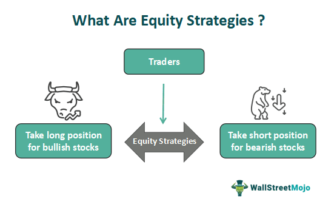

In today's globalized economy, investing in international stocks emerges as a compelling strategy for diversifying investment portfolios. By tapping into global markets, investors can exploit opportunities across a myriad of economic landscapes, potentially enhancing returns while distributing risk. The allure of international stocks lies in their capacity to capture growth prospects that domestic markets might not offer. However, this expansive view comes with its own set of complexities. Investing across borders demands a nuanced understanding of foreign equity markets characterized by diverse regulatory landscapes, economic conditions, and currency dynamics.

Navigating these complexities safely requires keen attention to investment safety and meticulous risk management strategies. Investors must be acutely aware of the political, economic, and market-specific risks that can significantly impact the value of international stocks. Currency fluctuations, for example, can erode profits, while geopolitical instability might lead to sudden market downturns. Effective investment strategies often involve tools and mechanisms such as derivatives, foreign exchange hedges, and diversified funds that can mitigate these risks.

This article seeks to shed light on the multi-layered dynamics of international stock investments. It examines the role of algorithmic trading which has transformed the trading landscape by enabling rapid, data-driven decision-making, thereby increasing market efficiency and reducing human error. Additionally, this article presents strategies that investors can employ to bolster the safety of their international investments, ensuring that the pursuit of global opportunities does not come at the expense of undue risk. With the right approach, international stocks can significantly contribute to a well-rounded and resilient investment portfolio.

## Table of Contents

## Understanding International Equity Markets

International equity markets serve as a gateway for investors to diversify their portfolios by gaining exposure to both emerging and developed global economies. These markets are dynamic and influenced by a myriad of factors that contribute to their complexity and appeal.

One of the primary factors influencing international equity markets is the political and economic stability of a country. Stable governments and robust economies tend to attract more investment as they are perceived to [carry](/wiki/carry-trading) lower risk. Conversely, countries experiencing political turmoil or economic instability may deter investors due to potential volatility and unpredictability. For instance, political changes such as elections or shifts in government policies can directly impact the stock market performance of a nation. Economic indicators such as GDP growth rates, inflation, and employment levels also play a crucial role in determining market attractiveness.

Another key consideration for international investors is the regulatory environment of the foreign markets. Regulatory frameworks govern the operations of financial markets, affecting corporate governance, transparency, and the protection of investor rights. Countries with well-established regulatory systems often provide a secure environment for investing, whereas those with weak regulatory oversight might pose higher risks due to potential fraud or mismanagement.

Currency fluctuations present both opportunities and risks in international equity investments. Changes in foreign exchange rates can significantly affect investment returns, making currency risk a crucial element to consider. For example, if an investor from the United States invests in a European company and the euro strengthens against the dollar, the investor stands to gain from currency appreciation. Conversely, if the euro weakens, the value of the investment may decrease when converted back to dollars. Investors often use hedging strategies to mitigate these currency risks.

Emerging markets are particularly noteworthy for their potential for substantial growth, despite their associated risks. These markets are often characterized by rapid industrialization, burgeoning middle classes, and increasing consumer demand. Countries like China, India, and Brazil exemplify emerging markets that have shown remarkable economic growth and investment opportunities due to factors such as technological advancement, urbanization, and significant infrastructure development. However, investing in emerging markets requires careful consideration of inherent risks, including political instability, lower [liquidity](/wiki/liquidity-risk-premium), and potentially less stringent regulatory environments compared to developed economies.

In summary, international equity markets offer diverse opportunities for growth by providing access to various economic landscapes. The interplay of political stability, regulatory frameworks, and currency fluctuations, along with the high growth potential of emerging markets, shapes the investment landscape and informs strategic decision-making for investors seeking to expand beyond domestic borders.

## Investment Safety in International Stocks

Managing risks in international investments is crucial for safeguarding capital. Investors face several challenges when venturing into foreign equity markets. These challenges include lack of transparency, currency risk, and market [volatility](/wiki/volatility-trading-strategies), each requiring thorough research and risk assessment to navigate effectively.

Lack of transparency is a significant concern in international markets. Regulatory environments vary widely between countries, and different levels of disclosure and corporate governance can expose investors to unexpected risks. Conducting comprehensive due diligence and selecting markets with robust regulatory frameworks can mitigate these challenges. Investors should favor countries with established financial reporting standards and governance practices.

Currency risk is another critical [factor](/wiki/factor-investing) impacting international investments. Changes in exchange rates can significantly affect the return on investment. For example, if an investor holds stocks in a foreign currency and that currency depreciates relative to their home currency, the investor may experience a loss even if the stock’s value increases in its local market. To manage currency risk, investors can use hedging strategies such as currency futures, options, or investing in currency-hedged funds.

Market volatility in international stocks can be more pronounced than in domestic markets, especially in emerging economies where political and economic uncertainties are more common. This unpredictability necessitates a vigilant approach to risk management. Diversifying investments across multiple countries and sectors can help mitigate the impact of volatility.

To alleviate some of these risks, investors can utilize various tools such as American Depositary Receipts (ADRs), Exchange-Traded Funds (ETFs), and mutual funds. ADRs allow investors to buy shares of foreign companies listed on U.S. stock exchanges, offering a more straightforward and regulated way to gain international exposure. ETFs provide diversification across a basket of international securities, reducing the exposure to individual stock volatility. Mutual funds managed by experienced portfolio managers offer the advantage of professional oversight and diversification.

By incorporating these strategies and tools, investors can enhance investment safety in international stocks, protecting their capital while exploring global opportunities.

## The Role of Algo Trading in International Stock Markets

Algorithmic trading, often referred to as algo trading, has fundamentally transformed international stock markets by introducing a high level of efficiency and precision into trading processes. This approach leverages sophisticated algorithms to execute trades automatically based on pre-established criteria, significantly minimizing the possibility of human error.

The core advantage of [algorithmic trading](/wiki/algorithmic-trading) in international markets lies in its efficiency. Algorithms can process vast amounts of data much faster than a human ever could, allowing them to identify and exploit trading opportunities within milliseconds. This speed is particularly advantageous in volatile market environments, where conditions can change rapidly. By executing trades at such high speeds, algorithmic trading systems can capitalize on fleeting market inefficiencies that would be impossible for human traders to detect and act upon in time.

An example of the power of algorithmic trading can be seen in its ability to execute trades across multiple markets and asset classes simultaneously. This multi-market and multi-asset strategy maximizes the potential for profit while optimizing risk management. Moreover, algorithms can be programmed to trade 24/7, taking advantage of global time differences and ensuring that opportunities are not missed when various markets open and close.

Despite these advantages, algorithmic trading is not without its challenges and risks. One of the primary concerns involves system failures. Given that algo trading relies heavily on technology, any unforeseen technical glitch or hardware malfunction can have significant consequences, such as incorrect trade executions or missed opportunities. Additionally, market anomalies present another layer of risk. These anomalies can be triggered by unexpected events or irregularities that are not accounted for by the algorithm, leading to substantial losses if not properly managed.

To mitigate such risks, rigorous [backtesting](/wiki/backtesting) and stress testing of algorithms are crucial. Backtesting involves running the algorithm through historical market data to evaluate how it would have performed, whereas stress testing assesses how the algorithm performs under extreme market conditions. Moreover, continuous monitoring and timely updates to the trading algorithms are necessary to ensure they remain effective and relevant in ever-evolving market conditions.

In conclusion, while algorithmic trading has enhanced the efficiency and effectiveness of trading in international stock markets, a cautious approach is essential. The benefits of speed and precision provided by these automated systems are balanced by the potential risks of system failures and market anomalies. Thus, maintaining robust checks and oversight mechanisms is vital to harness the full potential of algorithmic trading while minimizing its vulnerabilities.

## Strategies for Safe Investing in International Markets

Diversification across various markets and sectors is a cornerstone strategy in safeguarding investments in international stocks. By spreading investments across multiple geographical locations and industries, investors can reduce the risk of adverse impacts from market-specific or geopolitical events. This practice ensures that the overall portfolio remains resilient to individual market fluctuations. For instance, while a downturn in one country's market might negatively impact some investments, gains in another market can offset those losses, thereby stabilizing the portfolio's overall performance.

Regular portfolio rebalancing is crucial to enhancing investment outcomes. Financial markets are dynamic, and changes in economic conditions, political events, and market performance can shift the risk and return profile of a portfolio. By periodically assessing and adjusting the asset allocation, investors can maintain their desired risk exposure and capitalize on new opportunities. This process involves selling overperforming assets and reinvesting in underperforming ones to align with the investor's financial goals and market conditions.

Staying vigilant on geopolitical developments is also essential. Geopolitical events can significantly influence market dynamics and economic conditions. Investors should monitor international news and assess how political changes, trade policies, and diplomatic relations might impact their investments. This proactive approach enables them to make informed decisions, such as reallocating resources or hedging against potential risks, thereby safeguarding their investments against unforeseen events.

Incorporating algorithms responsibly into the investment process can provide a competitive edge. Algorithmic trading systems utilize advanced mathematical models and large datasets to analyze market trends and execute trades automatically. This can enhance decision-making by providing data-driven insights and optimizing trade execution. However, it is important to use these systems with caution, considering the potential risks associated with technical failures and market anomalies. Investors should ensure that algorithms are well-designed, thoroughly tested, and continuously monitored to ensure they function correctly in volatile environments. Such integration can streamline investment processes, reduce human error, and allow investors to respond swiftly to market changes.

## Conclusion

Investing in international stocks involves navigating a complex landscape characterized by both challenges and opportunities. These challenges include understanding diverse regulatory environments, managing currency risks, and adapting to varied market conditions. However, when approached with appropriate strategies, these challenges can be transformed into opportunities for investors aiming to diversify their portfolios and enhance their returns.

Algorithmic trading, when aligned with strategic risk management, offers a pathway to unlocking the potential of global markets. Automated systems allow for improved efficiency and precision in executing trades, minimizing human error, and capitalizing on market movements swiftly. By incorporating algorithmic solutions, investors can respond quickly to market signals, ensuring they maximize their investment returns while minimizing potential downsides.

Understanding the distinct characteristics of international equity markets remains crucial. This includes recognizing the economic indicators of emerging and developed economies, being attuned to geopolitical shifts, and the ongoing need to mitigate risks through diversification and regular portfolio assessment. By taking these elements into account, investors are better equipped to harness the growth potential of international stocks while safeguarding their investments against unforeseen market volatility.

In conclusion, a well-informed approach that combines algorithmic trading with sound risk management strategies can lead to successful outcomes in international stock markets. As investors gain insight into the complexities of global equity markets, they stand to reap substantial rewards while ensuring their investments are protected.

## References & Further Reading

[1]: Lewis, K. K. (1999). ["Trying to Explain Home Bias in Equities and Consumption"](https://www.aeaweb.org/articles?id=10.1257/jel.37.2.571). Journal of Economic Perspectives, 13(2), 217-236.

[2]: DeMiguel, V., Garlappi, L., & Uppal, R. (2009). ["Optimal versus naïve diversification: How inefficient is the 1/N portfolio strategy?"](https://www.jstor.org/stable/30226017) The Review of Financial Studies, 22(5), 1915-1953.

[3]: Black, F. (1972). ["Capital market equilibrium with restricted borrowing."](https://econpapers.repec.org/RePEc:ucp:jnlbus:v:45:y:1972:i:3:p:444-55) The Journal of Business, 45(3), 444-455.

[4]: ["Algorithmic Trading: Winning Strategies and Their Rationale"](https://onlinelibrary.wiley.com/doi/pdf/10.1002/9781118676998.fmatter) by Ernest P. Chan

[5]: Campbell, J. Y., & viceira, L. M. (2002). ["Strategic Asset Allocation: Portfolio Choice for Long-Term Investors,"](https://academic.oup.com/book/6093) Oxford University Press.