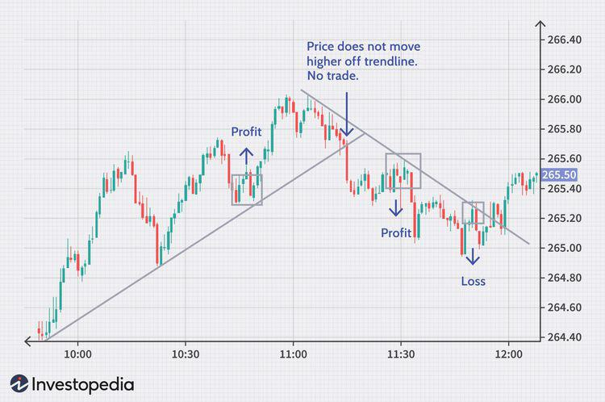

## Table of Contents

## What is intraday trading and how does it differ from other types of trading?

Intraday trading, also known as day trading, is when someone buys and sells stocks or other financial products within the same day. The goal is to make money from small price changes that happen during the day. People who do intraday trading usually watch the market very closely and use special tools to help them decide when to buy and sell.

Intraday trading is different from other types of trading because it focuses on short-term gains rather than holding onto investments for a long time. For example, in long-term investing, people might buy stocks and keep them for months or years, hoping the value will go up over time. On the other hand, intraday traders are not interested in what happens to the price of a stock tomorrow or next week; they only care about what happens today. This makes intraday trading more fast-paced and requires a lot of attention and quick decision-making.

## What are the basic principles beginners should know before starting intraday trading?

Before you start intraday trading, it's important to understand that it involves a lot of risk. You need to be okay with the fact that you might lose money. One key principle is to always have a plan. Decide ahead of time which stocks you want to trade, at what price you will buy them, and at what price you will sell them to make a profit or cut your losses. This is called setting your entry and exit points. Another important principle is to use stop-loss orders. These are automatic orders that sell your stock if the price drops to a certain level, helping you limit how much money you can lose.

It's also crucial to manage your money wisely. Never risk more money than you can afford to lose. A common rule is to only use a small part of your total trading money on any single trade. This way, even if you lose, you still have money left to keep trading. Lastly, keep learning and stay informed. The stock market can change quickly, and successful intraday traders are always learning about new trends and strategies. They also keep up with news that might affect the stocks they are trading.

## How can one identify stocks that are suitable for intraday trading?

To find good stocks for intraday trading, you need to look at how much the stock's price changes during the day. Stocks that move a lot are better for intraday trading because you can make more money from their ups and downs. You can check this by looking at the stock's average daily range, which shows how much the price typically changes in a day. Another thing to consider is the stock's [volume](/wiki/volume-trading-strategy), which is how many shares are traded each day. High volume means more people are buying and selling the stock, making it easier to get in and out of trades quickly.

Also, it's helpful to look at the stock's [volatility](/wiki/volatility-trading-strategies). Volatility means how much the price can swing up and down. Stocks with high volatility can be good for intraday trading, but they are also riskier. You can use tools like the beta of a stock to measure its volatility compared to the overall market. Lastly, keep an eye on the news and events that might affect the stock's price. Things like earnings reports or big announcements can cause the stock to move a lot, making it a good candidate for intraday trading. Always do your research and use the tools available to find the best stocks for your trading strategy.

## What technical indicators are most useful for beginners in selecting stocks for intraday trading?

For beginners in intraday trading, a few key technical indicators can be very helpful. The first one is the Moving Average, which helps you see the average price of a stock over a certain time. A common one is the 50-day moving average. If the stock price is above this average, it might be a good time to buy because the stock is doing well. If it's below, it might be a good time to sell. Another useful indicator is the Relative Strength Index (RSI). The RSI tells you if a stock is overbought or oversold. If the RSI is above 70, the stock might be overbought and due for a price drop. If it's below 30, it might be oversold and ready for a price increase.

Another important indicator is the Bollinger Bands. These are lines drawn above and below the moving average of a stock's price. When the price touches the upper band, it might be a good time to sell because the price could go down soon. When it touches the lower band, it might be a good time to buy because the price could go up. Lastly, the Volume indicator is crucial. It shows how many shares are being traded. High volume means more people are interested in the stock, which can make it easier to buy and sell quickly. These indicators can help beginners make better decisions when [picking](/wiki/asset-class-picking) stocks for intraday trading.

## How can volume analysis help in selecting stocks for intraday trading?

Volume analysis is a key tool for picking stocks for intraday trading. It shows how many shares of a stock are being bought and sold in a day. When the volume is high, it means a lot of people are interested in the stock. This can make it easier to buy and sell quickly, which is important for intraday trading. You want to find stocks with high volume because they are more liquid. This means you can get in and out of your trades without big changes in the price.

You can also use volume to spot when a stock might be about to move a lot in price. If the volume suddenly goes up a lot, it might mean big news or events are happening with the stock. This could be a good time to trade because the price might change quickly. By watching the volume, you can see if a stock is getting more attention and might be a good pick for intraday trading.

## What are the common intraday trading strategies for intermediate traders?

Intermediate intraday traders often use a strategy called "[scalping](/wiki/gamma-scalping)." This means they make many small trades throughout the day to earn small profits from tiny price changes. They watch the market very closely and use tools like the Relative Strength Index (RSI) and Moving Averages to help them decide when to buy and sell. The goal is to add up these small profits to make a bigger total at the end of the day. Scalping requires quick thinking and a lot of attention, but it can be a good way to make money if done right.

Another common strategy is "[momentum](/wiki/momentum) trading." This involves finding stocks that are moving a lot in price and trading in the same direction as the trend. Intermediate traders look for stocks with high volume and big price changes, often using indicators like the Average Directional Index (ADX) to see if the trend is strong. They buy when the stock is going up and sell when it starts to go down. Momentum trading can be risky because trends can change quickly, but it can also lead to big profits if you catch the right moves.

A third strategy is "[breakout](/wiki/breakout-trading) trading." This means watching for a stock's price to break through a certain level, like a resistance or support line. When the price breaks out, it often keeps moving in that direction for a while. Intermediate traders use tools like Bollinger Bands to spot these breakouts. They buy when the price breaks above resistance and sell when it breaks below support. This strategy can be very profitable if you time your trades well, but it also needs careful watching and quick action to work best.

## How can one use candlestick patterns effectively in intraday stock selection?

Candlestick patterns are really useful for picking stocks to trade during the day. They show you how a stock's price has moved in a certain time, like a few minutes or an hour. Some patterns, like the "hammer" or "doji," can tell you if the stock might start going up or down soon. For example, if you see a hammer pattern at the bottom of a price drop, it might mean the stock is about to go up. You can use this info to decide when to buy or sell the stock during the day.

Using candlestick patterns well means you need to watch them closely and understand what they mean. It's not just about seeing one pattern; you also need to look at other things like the stock's volume and where the price is compared to its moving averages. If you see a bullish pattern like an "engulfing" pattern and the volume is high, it might be a good time to buy. But always remember, candlestick patterns are just one tool. Use them with other indicators to make the best choices for intraday trading.

## What role does market sentiment play in choosing stocks for intraday trading?

Market sentiment is how people feel about the stock market or a specific stock. It can really affect which stocks you pick for intraday trading. If people feel good about the market, they might buy more stocks, making prices go up. If they feel bad, they might sell, making prices go down. So, if you see that people are feeling positive about a stock, it might be a good one to trade during the day because its price could keep going up.

You can check market sentiment by looking at the news, social media, and what other traders are saying. If there's a lot of good news about a company, or if a lot of people on social media are talking about it in a positive way, that stock might be a good choice for intraday trading. But remember, market sentiment can change fast, so you need to keep an eye on it all the time. It's just one part of picking the right stocks, but it can help you make better choices if you use it with other tools like technical indicators and volume analysis.

## How can advanced traders use algorithmic trading to enhance their stock selection process?

Advanced traders can use [algorithmic trading](/wiki/algorithmic-trading) to make their stock selection process better and faster. They write computer programs, called algorithms, that can look at a lot of data quickly. These programs can find patterns and trends in the stock market that might be hard for a person to see. For example, an algorithm can watch many stocks at the same time and pick the ones that are moving in a way that matches the trader's strategy. This can help traders find good stocks for intraday trading without spending a lot of time looking at charts and data themselves.

Using algorithms also helps traders make decisions based on clear rules, not just feelings. The programs can be set up to buy or sell stocks when certain things happen, like when a stock's price reaches a certain level or when the volume changes a lot. This can make trading more consistent and can help traders stick to their plan. But, it's important for traders to keep an eye on their algorithms and make sure they are working well, because the market can change and what worked before might not work in the future.

## What are the risks associated with high-frequency trading in intraday stock selection?

High-frequency trading ([HFT](/wiki/high-frequency-trading-strategies)) is a way of trading stocks very quickly, often using computers to make lots of trades in a short time. One big risk with HFT is that it can make the market move very fast. If a lot of people are using HFT, the price of a stock can change a lot in just a few seconds. This can be risky because it's hard to predict what will happen next. If the price suddenly drops, you might lose money before you can sell your stock.

Another risk is that high-frequency trading can sometimes cause big problems in the market. For example, if many HFT systems start selling at the same time, it can lead to a "flash crash," where stock prices drop a lot very quickly. This can be scary and might make other people start selling too, making the problem even worse. Also, because HFT uses a lot of computer power and special tools, it can be hard for regular traders to compete. This might make the market less fair for people who don't use HFT.

## How can expert traders integrate macroeconomic indicators into their intraday trading strategy?

Expert traders can use macroeconomic indicators to make better choices when trading stocks during the day. These indicators, like unemployment rates, inflation numbers, and GDP growth, give a big picture of how the economy is doing. If the economy is doing well, people might feel more confident and buy more stocks, which can push prices up. On the other hand, if the economy is struggling, people might sell their stocks, making prices go down. By keeping an eye on these indicators, expert traders can guess which way the market might move and pick stocks that will do well in that situation.

For example, if a trader sees that the unemployment rate is going down, they might think the economy is getting better and choose to buy stocks that do well when people have more money to spend. They can use this information to decide which stocks to trade during the day. But, it's important to remember that macroeconomic indicators are just one part of the puzzle. Expert traders also need to look at other things like technical indicators and market sentiment to make the best choices. By mixing all these pieces of information together, they can make smarter trades and maybe make more money.

## What advanced risk management techniques should be employed by expert traders in intraday trading?

Expert traders use advanced risk management techniques to protect their money when trading stocks during the day. One important technique is position sizing, which means deciding how much money to put into each trade. They use a formula to figure out the right amount based on how much risk they want to take and how much money they have. This helps them avoid losing too much on any one trade. Another technique is using stop-loss orders in a smart way. Instead of setting them at fixed prices, expert traders might use trailing stop-loss orders that move with the stock's price. This can help them lock in profits while still protecting against big losses.

Another advanced technique is diversification, but not just in the usual way of buying different stocks. Expert traders might trade across different sectors or even different types of financial products like stocks, options, and futures. This can help spread out their risk. They also use something called risk-reward ratios to make sure the possible profit from a trade is worth the risk. For example, they might only take trades where the potential profit is at least three times the possible loss. Finally, expert traders often use stress testing, where they look at how their trading strategy would do in really bad market conditions. This helps them be ready for anything and adjust their plan to handle tough times.

## What are effective strategies for stock selection in intraday trading?

Selecting the right stocks is a cornerstone of successful intraday trading, where the goal is to take advantage of short-term price fluctuations within a single trading day. Traders seek stocks that are highly liquid and volatile, as these characteristics enhance the potential for profitable trades. 

### Liquidity Considerations

Liquidity is paramount for intraday traders. It refers to how quickly a stock can be bought or sold without causing a significant impact on its price. High [liquidity](/wiki/liquidity-risk-premium) ensures traders can smoothly execute large trades without encountering substantial bid-ask spreads or price slippage. Several factors contribute to a stock's liquidity:

1. **Trading Volume**: High trading volume indicates a more liquid market, as many buyers and sellers are actively engaged. It is often measured by the number of shares traded over a specific period. Stocks with consistently high average daily volumes are preferred by intraday traders as they facilitate easier entry and exit points.

2. **Bid-Ask Spread**: This is the difference between the price a buyer is willing to pay for a stock (bid) and the price a seller asks for it (ask). Lower bid-ask spreads generally indicate higher liquidity, allowing traders to execute trades more cost-effectively.

3. **Order Books**: Analyzing the order book provides insights into supply and demand at various price levels. A dense order book with many orders at close price intervals indicates a more liquid stock.

### Volatility Metrics

Volatility is crucial for intraday traders because it provides opportunities to profit from rapid price movements. Traders utilize various metrics to evaluate stock volatility:

1. **Historical Volatility**: This measures the extent of past price fluctuations of a stock. It is often calculated using the standard deviation of historical price changes. A higher historical volatility indicates more pronounced price movements.
$$
   \text{Historical Volatility (HV)} = \sqrt{\frac{\sum (R_t - \bar{R})^2}{N - 1}}

$$

   Where $R_t$ is the log return at time $t$, $\bar{R}$ is the average log return, and $N$ is the number of observations.

2. **Implied Volatility**: Derived from the market price of stock options, it reflects the market's expectation of future volatility. A higher implied volatility suggests that the market anticipates significant future price movements.

3. **Beta**: Beta measures a stock's volatility relative to the overall market. A beta greater than one indicates higher volatility compared to the market, suitable for traders seeking aggressive trades.

### Stock Selection Insights

To align with market movements, traders can employ various tools and strategies for stock selection:

- **Screening Tools**: Utilization of stock screeners can help filter stocks based on specific liquidity and volatility criteria. Common filters include minimum daily volume thresholds and stocks with significant price changes.

- **Technical Indicators**: Indicators such as Average True Range (ATR) help measure market volatility and can assist in identifying highly volatile stocks suitable for intraday trading.

- **News and Events**: Stocks that are the subject of recent news or earnings announcements often exhibit higher volatility. Staying informed about such catalysts can help traders select stocks with potential for rapid price movements.

Overall, a well-rounded approach to stock selection involves a balanced consideration of both liquidity and volatility metrics, ensuring that traders are poised to capitalize on market opportunities efficiently and effectively.

## References & Further Reading

[1]: Bergstra, J., Bardenet, R., Bengio, Y., & Kégl, B. (2011). ["Algorithms for Hyper-Parameter Optimization."](https://papers.nips.cc/paper/4443-algorithms-for-hyper-parameter-optimization) Advances in Neural Information Processing Systems 24.

[2]: ["Advances in Financial Machine Learning"](https://www.amazon.com/Advances-Financial-Machine-Learning-Marcos/dp/1119482089) by Marcos Lopez de Prado

[3]: ["Evidence-Based Technical Analysis: Applying the Scientific Method and Statistical Inference to Trading Signals"](https://www.amazon.com/Evidence-Based-Technical-Analysis-Scientific-Statistical/dp/0470008741) by David Aronson

[4]: ["Machine Learning for Algorithmic Trading"](https://github.com/stefan-jansen/machine-learning-for-trading) by Stefan Jansen

[5]: ["Quantitative Trading: How to Build Your Own Algorithmic Trading Business"](https://www.amazon.com/Quantitative-Trading-Build-Algorithmic-Business/dp/1119800064) by Ernest P. Chan