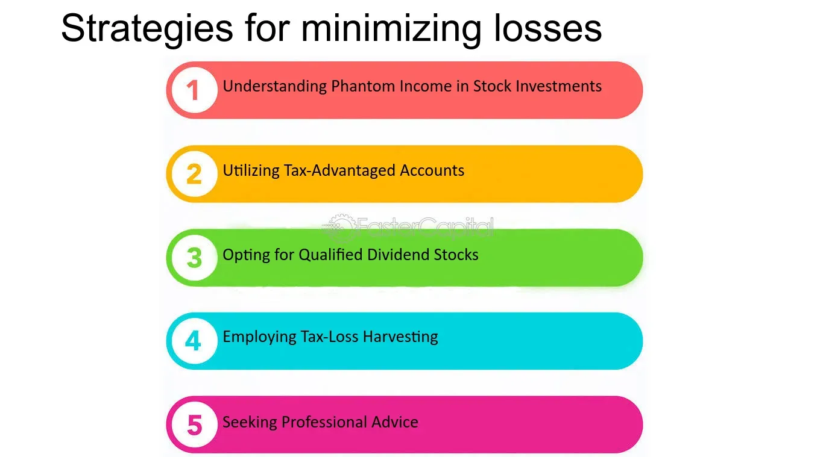

## Table of Contents

## What is a loss-making investment?

A loss-making investment is when you spend money on something hoping it will grow or make more money, but instead, it ends up being worth less than what you paid for it. This can happen with things like stocks, real estate, or even a business you start. When the value of your investment goes down, and you sell it for less than you bought it, you experience a financial loss.

For example, if you buy a stock for $100 and later its value drops to $50, selling it at that point would mean you lose $50. Loss-making investments can be disappointing and can affect your overall financial plans. It's important to understand that all investments carry some risk, and sometimes, despite careful planning, they don't turn out as expected.

## Why might someone need to sell a loss-making investment?

Someone might need to sell a loss-making investment because they need the money for something important. Maybe they have a big bill to pay or they lost their job and need cash to live on. When this happens, they might have to sell their investment even if it's worth less than what they paid for it. It's not what they wanted, but sometimes you have to do it to take care of more urgent needs.

Another reason could be that they think the investment will keep losing value. If they believe the stock or whatever they invested in will go down even more, they might decide to sell it now to lose less money. It's like trying to stop a small hole from becoming a big one. By selling at a loss, they can use the money for a better investment or just to keep it safe.

Sometimes, selling a loss-making investment can also help with taxes. In some places, if you sell an investment at a loss, you can use that loss to reduce the taxes you owe on other money you made. It's a way to make the best of a bad situation. So, even though it's sad to lose money, selling at a loss can sometimes be a smart move for other reasons.

## What are the basic steps to identify a loss-making investment?

To identify a loss-making investment, first, you need to know what you paid for it. This is called the purchase price. Then, you need to check the current value of your investment. You can do this by looking at the stock price if it's a stock, or by getting an appraisal if it's something like real estate. If the current value is less than what you paid, you have a loss-making investment.

Next, you should think about why the value went down. Sometimes it's because of things happening in the world, like a recession, or because the company you invested in is not doing well. It's important to understand these reasons because they can help you decide what to do next. If you think the value will keep going down, you might want to sell the investment to lose less money.

Remember, it's normal for investments to go up and down in value. Just because an investment is losing money right now doesn't mean it will always be that way. But if you need the money or think the investment will keep losing value, selling it at a loss might be the best choice for you.

## How can tax implications affect the decision to sell a loss-making investment?

Tax implications can make selling a loss-making investment a smart move even though it feels bad to lose money. When you sell an investment at a loss, you can use that loss to lower the taxes you owe on other money you made. This is called a tax loss harvest. If you made money from other investments or from your job, the loss from selling your investment can help you pay less in taxes. So, even though you're losing money on the investment itself, you can save money on taxes, which can make the decision to sell a bit easier.

It's important to think about your overall tax situation when deciding whether to sell a loss-making investment. For example, if you have a lot of other income that you'll have to pay taxes on, selling the investment at a loss could really help you save on taxes. But if you don't have much other income, the tax benefit might not be as big. Also, there are rules about how much you can use a loss to lower your taxes each year, so you might need to talk to a tax professional to understand all the details. They can help you figure out if selling the investment at a loss makes sense for your specific situation.

## What are the psychological barriers to selling loss-making investments?

One big reason people don't want to sell a loss-making investment is because they feel bad about losing money. It's called loss aversion. When we lose money, it feels much worse than when we gain the same amount. So, even if selling the investment is the smart thing to do, it's hard to do it because we don't want to face the fact that we lost money. We hope the investment will go back up in value, and we can avoid feeling that loss.

Another psychological barrier is something called the endowment effect. This is when we value something more just because we own it. Even if the investment is losing money, we might feel attached to it and think it's worth more than it really is. This makes it hard to let go of the investment, even when selling it would be the best choice. We get emotionally attached, and that can cloud our judgment about what to do next.

Lastly, there's the sunk cost fallacy. This is when we keep putting more time or money into something because we've already spent so much on it. We think, "I've already lost money on this investment, so I should keep it and hope it gets better." But that thinking can keep us stuck with a bad investment instead of cutting our losses and moving on. These psychological barriers make it really tough to make the decision to sell a loss-making investment, even when it might be the smartest thing to do.

## What are some common strategies for selling loss-making investments?

One common strategy for selling loss-making investments is tax loss harvesting. This means selling the investment at a loss to reduce the taxes you owe on other income or gains. By doing this, you can use the loss to offset any capital gains you made from other investments, or even reduce your taxable income. It's a way to make the best of a bad situation, turning a financial loss into a tax benefit. However, you need to be careful about the "wash-sale" rule, which says you can't buy the same or a similar investment within 30 days before or after the sale if you want to claim the tax loss.

Another strategy is to set a stop-loss order. This is an order you place with your broker to sell the investment if it drops to a certain price. It helps you limit your losses by automatically selling the investment before it loses too much value. This can be helpful if you're worried the investment will keep going down, but you don't want to watch it every day. It takes the emotion out of the decision and helps you stick to a plan.

Lastly, some people use a strategy called dollar-cost averaging out. This means selling a little bit of the investment at regular intervals, instead of selling it all at once. It can help you avoid selling all your investment at a low point. By spreading out the sales, you might end up getting a better average price for your investment. This strategy can be less stressful because you're not making one big decision, but a series of smaller ones over time.

## How can timing impact the sale of a loss-making investment?

Timing can really affect how much money you lose when you sell a loss-making investment. If you sell right when the value is at its lowest, you'll lose the most money. But if you wait and the value goes up a bit, you might lose less. It's hard to know the perfect time to sell because the value of investments can change a lot. Sometimes, waiting a little longer can help you get a better price, but waiting too long might make things worse if the value keeps dropping.

Another thing to think about with timing is taxes. If you sell your investment at the end of the year, you can use the loss to lower your taxes for that year. This can be a good reason to sell at a certain time, even if the value hasn't gone up. But if you need the money right away, you might have to sell when the value is low, even if it's not the best time for taxes. So, timing can be tricky, and it's important to think about both the value of the investment and your tax situation when deciding when to sell.

## What role does market analysis play in deciding when to sell a loss-making investment?

Market analysis can help you figure out the best time to sell a loss-making investment. By looking at what's happening in the market, like how other similar investments are doing or what's going on in the economy, you can guess if your investment might go up in value soon or keep going down. For example, if lots of people are selling the same kind of investment and the economy is not doing well, it might be a good idea to sell your investment before it loses even more value. On the other hand, if you see signs that the market might get better, you might want to wait a bit longer before selling.

Using market analysis can also help you feel more confident about your decision. When you see that your investment is part of a bigger trend, it can make it easier to decide to sell, even if it's at a loss. This is important because selling a loss-making investment can be an emotional decision, and market analysis gives you facts to help you make a smart choice. By understanding the market, you can try to sell at a time that will lose you the least amount of money, or at least help you make the best of a bad situation.

## How can diversification help manage the risks associated with loss-making investments?

Diversification is like spreading your money around different types of investments instead of putting it all in one place. This can help you manage the risks of loss-making investments because if one investment goes down in value, the others might still be doing okay. It's like not putting all your eggs in one basket. If one egg breaks, you still have others that are safe. By having a mix of stocks, bonds, real estate, or other investments, you can lower the chance that a loss in one will hurt your whole investment plan.

When you diversify, you're less likely to lose a lot of money all at once. If one of your investments turns out to be a loss-maker, the other investments might help balance things out. This can make it easier to handle selling a loss-making investment because you know you have other investments that are doing well. Diversification doesn't stop you from having loss-making investments, but it can make the impact of those losses smaller and easier to deal with.

## What advanced techniques can be used to minimize losses when selling investments?

One advanced technique to minimize losses when selling investments is called tax loss harvesting. This means selling an investment that's losing money to use that loss to lower the taxes you owe on other money you made. It's like turning a bad thing into a little bit of a good thing. But you have to be careful about the "wash-sale" rule, which says you can't buy the same or a similar investment within 30 days before or after the sale if you want to claim the tax loss. By doing tax loss harvesting the right way, you can save money on taxes and make the loss hurt a little less.

Another technique is using stop-loss orders. This is when you tell your broker to sell your investment if it drops to a certain price. It's like setting a safety net so you don't lose too much money. Stop-loss orders can help you sell before the investment loses even more value, which can be really helpful if you're worried it will keep going down. It takes the emotion out of the decision and helps you stick to a plan, which can make selling a loss-making investment a bit easier.

Lastly, you can use a strategy called dollar-cost averaging out. This means selling a little bit of your investment at regular times instead of all at once. It can help you avoid selling everything when the price is really low. By spreading out the sales, you might end up getting a better average price for your investment. This strategy can be less stressful because you're not making one big decision, but a series of smaller ones over time. It can help you minimize losses by not selling all your investment at the worst possible time.

## How do professional investors approach the sale of loss-making investments?

Professional investors often use a mix of strategies when they need to sell investments that are losing money. They might use tax loss harvesting, which means selling the investment at a loss to reduce the taxes they owe on other money they made. This can help them save money on taxes and make the loss hurt a little less. They also pay close attention to market trends and economic news to decide the best time to sell. If they see that the market is going down, they might sell the investment before it loses even more value. They use tools like stop-loss orders to automatically sell the investment if it drops to a certain price, helping them limit their losses.

Another thing professional investors do is diversify their investments. This means they spread their money across different types of investments, so if one goes down, the others might still be doing okay. This can help them handle selling a loss-making investment because they know they have other investments that are doing well. They also might use a strategy called dollar-cost averaging out, where they sell a little bit of the investment at regular times instead of all at once. This can help them get a better average price for their investment and make the decision to sell a bit less stressful. By using these strategies, professional investors try to minimize the impact of loss-making investments on their overall portfolio.

## What are the long-term effects of selling loss-making investments on an investment portfolio?

Selling loss-making investments can help keep your investment portfolio healthy over the long term. When you sell an investment that's losing money, you can use that money to buy other investments that might do better. This can help you avoid losing even more money if the bad investment keeps going down. Also, by selling at a loss, you can use tax loss harvesting to lower the taxes you owe on other money you made, which can save you money and help your portfolio grow.

But selling loss-making investments can also have some downsides. If you sell too quickly, you might miss out on the investment going back up in value. Sometimes, investments that go down can come back up later. Also, selling at a loss can be hard emotionally, and it might make you feel like you failed. But if you have a good plan and keep your portfolio diversified, selling loss-making investments can help you manage risk and keep your investments on track for the long term.

## References & Further Reading

[1]: Bergstra, J., Bardenet, R., Bengio, Y., & Kégl, B. (2011). ["Algorithms for Hyper-Parameter Optimization."](https://papers.nips.cc/paper/4443-algorithms-for-hyper-parameter-optimization) Advances in Neural Information Processing Systems 24.

[2]: ["Advances in Financial Machine Learning"](https://www.amazon.com/Advances-Financial-Machine-Learning-Marcos/dp/1119482089) by Marcos Lopez de Prado

[3]: ["Evidence-Based Technical Analysis: Applying the Scientific Method and Statistical Inference to Trading Signals"](https://www.amazon.com/Evidence-Based-Technical-Analysis-Scientific-Statistical/dp/0470008741) by David Aronson

[4]: ["Machine Learning for Algorithmic Trading"](https://github.com/PacktPublishing/Machine-Learning-for-Algorithmic-Trading-Second-Edition) by Stefan Jansen

[5]: ["Quantitative Trading: How to Build Your Own Algorithmic Trading Business"](https://www.amazon.com/Quantitative-Trading-Build-Algorithmic-Business/dp/1119800064) by Ernest P. Chan