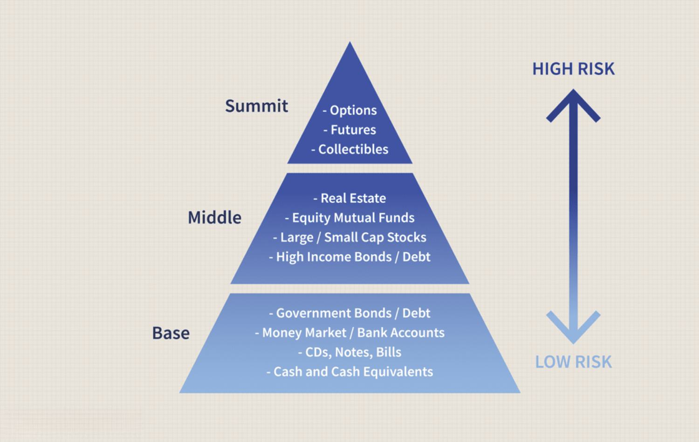

Investing in stocks involves a myriad of complexities and inherent risks that require a nuanced approach to ensure financial growth and wealth preservation. Stock markets are influenced by a host of factors such as economic indicators, geopolitical events, and company-specific news, each contributing to volatile price movements. Consequently, this volatility underscores the necessity for robust investment strategies that emphasize loss management as a means to safeguard capital and optimize returns. 

Effective investment strategies are crucial in guiding decisions about when to buy, hold, or sell stocks. These strategies serve as essential blueprints for achieving specific financial objectives while navigating the uncertainties of the financial markets. In this context, algorithmic trading emerges as a valuable tool capable of enhancing decision-making processes by leveraging complex algorithms to execute trades based on predefined criteria, such as price movements, timing, or volume. Algorithmic trading allows investors to make data-driven decisions that optimize their portfolios more efficiently than traditional methods.



This article aims to explore the pivotal topics of loss management, discerning when to sell stocks, and the role of algorithmic trading in refining investment strategies. By examining these key components, we will provide insights into effective investment practices that can help mitigate risks and enhance profitability. The discussion will delve into various investment strategies, techniques for minimizing losses, and scenarios that necessitate stock selling, alongside an analysis of how algorithmic trading is transforming modern investment landscapes. By understanding these elements, investors can better navigate the intricate world of stock investing, adapting and refining their techniques to align with both personal and market-driven goals.

## Table of Contents

## Understanding Investment Strategies

Investment strategies are systematic plans designed to guide the allocation of resources in a way that aligns with an investor's financial goals. These strategies are crucial because they involve making informed decisions about which stocks to buy, hold, or sell, thereby influencing the overall performance of an investment portfolio. 

Several types of investment strategies cater to different financial objectives and risk tolerances. Growth strategies, for instance, focus on investing in companies with strong potential for future expansion, offering the possibility of significant capital gains. These companies often reinvest earnings into the business instead of paying dividends. In contrast, value strategies aim to identify undervalued stocks—those trading for less than their intrinsic value—assuming the market will eventually recognize their worth, leading to price appreciation.

Income-oriented strategies prioritize generating consistent returns through dividends or fixed income from bonds. Such strategies are popular among investors seeking steady cash flow, particularly retirees or those with low risk tolerance. Each of these strategies frames the decision-making process regarding when to buy, hold, or sell stocks, significantly impacting a portfolio's risk and return profile. 

Aligning investment strategies with personal risk tolerance and prevailing market conditions is imperative for optimizing portfolio performance. An investor must assess their ability and willingness to risk potential losses against the associated market risks. For example, younger investors with a longer investment horizon might tolerate higher risk for greater returns, thus preferring growth strategies. Conversely, those nearing retirement might prioritize capital preservation, opting for more conservative or income-driven approaches.

An essential part of crafting an effective investment strategy involves considering both macroeconomic indicators and company-specific factors. This alignment ensures the investor can adapt to changes in economic conditions, such as interest rates or inflation, that impact asset valuations. By tailoring strategies to these personal and market dynamics, investors can better manage their portfolios to achieve their financial objectives.

## Loss Management in Investments

Loss management is a crucial aspect of investment strategy, primarily because investments [carry](/wiki/carry-trading) inherent risks and the potential for financial loss. Effective loss management can safeguard an investor's capital, allowing them to endure market [volatility](/wiki/volatility-trading-strategies) and achieve long-term investment goals. Various techniques are employed to minimize losses, each crucial for maintaining and eventually enhancing the portfolio's value.

Diversification is a fundamental technique used to reduce risk by spreading investments across various asset classes. Simply put, instead of putting all funds into a single type of asset or stock, investors can diversify across equities, bonds, real estate, and other asset classes. This strategy's underlying principle is that different assets tend to react differently to market conditions. By holding a mix of assets, the adverse performance of certain assets may be offset by the better performance of others, thus reducing potential losses.

Stop-loss orders are another critical tool for managing losses. A stop-loss order is a predefined price level at which an investor chooses to sell an asset, effectively limiting the potential downside of holding onto a losing investment. For instance, an investor buys a stock at $100 and sets a stop-loss order at $90. If the stock price falls to $90, the stop-loss order triggers a sale, preventing further loss.

Risk assessment is an ongoing process where investors evaluate the potential risks associated with their portfolios. It involves analyzing the volatility of securities, economic indicators, and market trends to reallocate assets as necessary. By continuously assessing risk, investors can make informed decisions to mitigate potential losses.

The concept of cutting losses early is vital for preserving capital. It involves recognizing when an investment is underperforming with little chance of recovery and deciding to [exit](/wiki/exit-strategy) the position. This approach can save investors from prolonged downturns, freeing up capital for more promising opportunities. For instance, adhering to a predetermined loss threshold (e.g., 10% below purchase price) and selling promptly helps in maintaining a focused investment strategy.

However, managing losses is not without challenges. A common pitfall is emotional investing, where investors hold onto losing stocks hoping for a rebound or selling prematurely during short-term market dips. Such decisions, driven by fear or greed, can lead to suboptimal financial outcomes. Another typical mistake is neglecting to adapt strategies to changing market conditions; what worked in the past might not be applicable in future scenarios.

In summary, effective loss management in investments requires employing diverse strategies such as diversification, stop-loss orders, and holistic risk assessment. By cutting losses early and understanding common pitfalls, investors can better navigate market volatility, protecting their capital and positioning themselves for long-term success.

## When to Sell Stocks – Key Considerations

Selling stocks is a crucial aspect of investment management, serving as a means to protect one’s initial investment, manage risk, and capitalize on favorable market conditions. Several scenarios can make selling stocks a necessary decision.

One primary reason to sell stocks is to preserve the initial investment or manage risk exposure. Investors may decide to liquidate their holdings when a stock's price begins to fall, threatening to erode significant portions of their invested capital. This decision is often guided by loss management strategies, such as setting a predefined stop-loss order, a tool that automatically sells a stock when it hits a certain price. This strategy helps to limit potential losses and protect an investor’s capital.

Changes in market conditions often signal the need to reevaluate and possibly sell an investment. Economic indicators, geopolitical events, or industry-specific disruptions can adversely affect stock performance. In such circumstances, investors rely on [fundamental analysis](/wiki/fundamental-analysis) to assess whether these external factors may significantly impact their investment. Fundamental analysis focuses on a company's financial health, including its earnings, revenue, and growth prospects. By examining changes in key financial metrics and market sentiment, investors can determine whether to hold onto a stock or sell it.

Technical analysis plays a crucial role in identifying optimal exit points for stocks. This method involves analyzing statistical trends gathered from trading activity, such as price movement and [volume](/wiki/volume-trading-strategy). Technical analysts utilize various indicators, such as moving averages, relative strength index (RSI), and chart patterns (e.g., head and shoulders, double top), to predict potential price movements. For example, if a stock's price falls below its moving average, it might signal an upcoming downtrend, suggesting a potential selling opportunity.

Tax implications are another vital consideration when selling stocks. Investors need to be aware of capital gains tax, which is levied on the profit made from selling stock. However, tax-loss harvesting offers a strategic advantage; by selling underperforming stocks at a loss, investors can offset gains, thus reducing their overall tax liability. Suppose an investor sells Stock A at a $10,000 gain and Stock B at a $3,000 loss. The net capital gain subject to taxation would be $7,000, assuming no other transactions are considered. This strategy not only mitigates tax burdens but also enables portfolio rebalancing towards more promising investments.

In conclusion, understanding when to sell stocks involves a multifaceted approach that includes assessing risk management, market conditions, and financial analysis. By appreciating these complexities, investors stand a better chance of safeguarding and realizing their financial objectives.

## Algorithmic Trading: Enhancing Investment Strategies

Algorithmic trading, the use of computer algorithms to automate trading activities, has become a cornerstone of modern investing. Its rising prominence is characterized by the ability to process vast amounts of data quickly, execute trades at optimal prices, and reduce costs associated with human intervention. By leveraging technology, [algorithmic trading](/wiki/algorithmic-trading) assists investors in executing complex investment strategies with greater precision and speed.

One of the primary ways algorithmic trading enhances investment strategies is through the automation of decision-making processes. Algorithms can be programmed to follow specific rules for trading based on factors like price, timing, and volume. This minimizes the psychological biases and emotional responses that often impact human traders. For example, a simple algorithm might be based on a moving average crossover strategy, where it buys or sells a stock when its short-term moving average crosses above or below a long-term moving average.

Popular algorithmic trading strategies include:

1. **Trend Following**: This involves algorithms triggering buy or sell orders based on established trends in asset prices. These strategies capitalize on the principle that prices are more likely to continue in the direction of a trend than to move against it.

2. **Mean Reversion**: This strategy is based on the hypothesis that asset prices tend to revert to their mean values over time. Algorithms identify securities whose current price significantly deviates from their historical average and execute trades anticipating a return to the mean.

3. **Arbitrage**: Algorithms search for price discrepancies across different markets or instruments and execute trades to exploit the price differences, often simultaneously, to generate a risk-free profit.

4. **Market Making**: Involves placing both buy and sell orders for a security to capture the spread, or the difference between the buy and sell price, while providing liquidity to the markets.

The success of algorithmic trading is heavily reliant on data quality and robust risk management practices. High-quality, real-time data enables algorithms to make informed and timely decisions. Furthermore, risk management strategies, such as setting stop-loss limits or diversifying portfolios, are crucial to mitigate potential losses due to market volatility or unexpected events.

Python has become a popular language in algorithmic trading due to its extensive libraries and frameworks for financial analysis and [machine learning](/wiki/machine-learning). For instance, the following Python code snippet illustrates a simple mean reversion strategy using the Pandas library to calculate moving averages:

```python
import pandas as pd

# Assume we have a DataFrame 'data' with Date and Close price columns
data['20_day_MA'] = data['Close'].rolling(window=20).mean()
data['50_day_MA'] = data['Close'].rolling(window=50).mean()

data['Signal'] = 0
data['Signal'][data['20_day_MA'] > data['50_day_MA']] = 1
data['Signal'][data['20_day_MA'] < data['50_day_MA']] = -1

# Generate trading orders (1 for buy, -1 for sell)
data['Position'] = data['Signal'].diff()
```

In summary, algorithmic trading transforms how investment strategies are executed by enhancing efficiency, precision, and scalability. The integration of high-quality data and sound risk management practices is essential for maximizing the potential benefits of algorithmic trading. As technology evolves, the capacity for more sophisticated and adaptive algorithms continues to grow, offering new opportunities for investors.

## Challenges and Considerations in Algorithmic Trading

Algorithmic trading, a widely used mechanism in modern financial markets, often carries with it several misconceptions that can obscure its true nature and utility. One common misunderstanding is that algorithmic trading guarantees profits or that it's purely about speed. While it can enhance the efficiency and execution of trades, it does not inherently eliminate risks or assure gains. It's crucial to recognize that algorithmic trading tools require strong underlying strategies, much like traditional trading.

Potential pitfalls of algorithmic trading include overfitting and the oversight of transaction costs. Overfitting occurs when a trading model is excessively complex and tailored to historical data, performing well on past market scenarios but failing in real-time trading due to its lack of generalizability. This can lead to poor decision-making and unexpected financial losses. To mitigate overfitting, a thorough validation process should be employed, involving techniques such as cross-validation and the use of out-of-sample data to test model robustness.

Ignoring transaction costs is another significant hazard. These costs can significantly erode the profitability of frequent trading strategies. Every buy or sell order incurs a cost, including brokerage fees and slippage, which is the difference between the expected price of a trade and the actual price. When formulating algorithmic strategies, these costs should be carefully estimated and included in the model to ensure that expected returns are not merely theoretical but attainable net profits.

Regulatory and ethical considerations also play pivotal roles in algorithmic trading. Compliance with financial regulations is mandatory, and understanding the legal framework governing the use of these trading systems is essential. Ethical concerns, such as the potential for market manipulation or the creation of unfair advantages through high-frequency trading, must also be addressed. Transparency in trading algorithms and their outcomes can help in aligning practices with ethical standards and fostering trust in the financial system.

For newcomers eager to explore algorithmic trading responsibly, there are a few recommended steps:

1. **Education and Research**: Beginners should immerse themselves in learning about financial markets and the technical aspects of algorithmic systems. Online courses, books, and simulations can serve as valuable resources to build a foundational understanding.

2. **Start Simple**: Initially, it's advisable to begin with straightforward strategies that they can easily comprehend and analyze. Complexity can be incrementally added as one gains confidence and experience.

3. **Gradual Testing**: They should utilize paper trading or simulation environments to test their algorithms under different market conditions without risking real capital. This phase is crucial for the refinement and adjustment of strategies.

4. **Risk Management**: New traders must incorporate robust risk management techniques to protect against unexpected market movements. This includes setting stop-loss levels, diversifying trades, and maintaining adequate capital reserves.

5. **Continuous Evaluation**: The financial market is dynamic, thus continuous monitoring and re-evaluation of algorithms are necessary to maintain alignment with current market conditions and to adjust to new data inputs.

In summary, while algorithmic trading offers numerous advantages, it demands a thoughtful and informed approach. Understanding its limitations and challenges, while steadfastly adhering to regulatory and ethical standards, is vital for responsible and effective utilization.

## Conclusion

In wrapping up our discussion on investment strategies, loss management, and algorithmic trading, it's crucial to underscore the pivotal role these elements play in the realm of investing. Investment strategies provide a roadmap for aligning financial goals with market opportunities, helping investors navigate complex financial landscapes. Through strategies such as growth, value, and income-oriented approaches, investors can make informed decisions about buying, holding, and selling stocks, tailored to their risk tolerance and market conditions.

Loss management serves as a critical component in safeguarding investments. Techniques like diversification, stop-loss orders, and proactive risk assessment are integral to preserving capital and limiting potential downsides. By recognizing and avoiding common pitfalls in managing losses, investors can maintain their financial health even amidst market volatility.

Algorithmic trading offers a modern dimension to investment execution, leveraging technology to optimize decision-making processes. Algorithms can enhance the effectiveness of investment strategies by executing transactions efficiently and minimizing human biases. However, the success of algorithmic trading hinges on the quality of data and robust risk management practices.

Balancing analytical insight with strategic foresight remains a cornerstone of successful investing. This balance allows investors to not only interpret data and market signals with precision but also anticipate future trends and opportunities with prudence. Continuous learning and adaptation to evolving market conditions are essential for maintaining a competitive edge.

In conclusion, integrating these strategies into one's investment approach can lead to more resilient and successful outcomes. By embracing a comprehensive understanding of investment strategies, rigorous loss management practices, and embracing algorithmic trading, investors are well-positioned to enhance their financial portfolios and achieve their long-term goals. As you refine your approach, consider the insights shared in this article to inform your investment journey.

## References & Further Reading

[1]: Bergstra, J., Bardenet, R., Bengio, Y., & Kégl, B. (2011). ["Algorithms for Hyper-Parameter Optimization."](https://papers.nips.cc/paper/4443-algorithms-for-hyper-parameter-optimization) Advances in Neural Information Processing Systems 24.

[2]: ["Advances in Financial Machine Learning"](https://www.amazon.com/Advances-Financial-Machine-Learning-Marcos/dp/1119482089) by Marcos Lopez de Prado

[3]: ["Evidence-Based Technical Analysis: Applying the Scientific Method and Statistical Inference to Trading Signals"](https://www.amazon.com/Evidence-Based-Technical-Analysis-Scientific-Statistical/dp/0470008741) by David Aronson

[4]: ["Machine Learning for Algorithmic Trading"](https://github.com/PacktPublishing/Machine-Learning-for-Algorithmic-Trading-Second-Edition) by Stefan Jansen

[5]: ["Quantitative Trading: How to Build Your Own Algorithmic Trading Business"](https://www.amazon.com/Quantitative-Trading-Build-Algorithmic-Business/dp/1119800064) by Ernest P. Chan