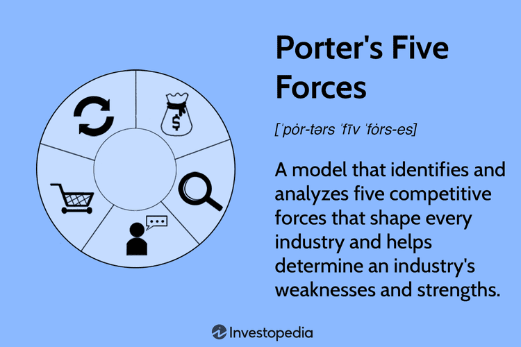

In today's complex financial markets, investors continually seek strategies to surpass average market returns. Understanding investment strategies and their performance is essential for achieving this ambition. Among the various methodologies available, algorithmic trading has emerged as a formidable tool, harnessing cutting-edge technologies to execute trades with speed and precision far surpassing traditional methods.

Algorithmic trading leverages computer algorithms to make trading decisions based on pre-defined criteria such as price, timing, or quantity. This strategic advantage enables traders to process vast datasets and execute orders at optimal times, minimizing the impact of human error and market fluctuations. As financial markets grow more sophisticated, the role of algorithmic trading has expanded, allowing for innovative approaches to achieving superior returns. For example, high-frequency trading is one technique that focuses on executing a high volume of trades at extremely rapid speeds. This approach capitalizes on minuscule price discrepancies that are uneconomical for human traders to exploit manually.



This article aims to explore various investment strategies, assess their historical performance, and understand how algorithmic trading can potentially outperform conventional benchmarks. It will address key metrics crucial for evaluating trading strategies, such as Sharpe Ratio and Maximum Drawdown, which are instrumental in discerning risk-adjusted returns and potential losses. Additionally, the article will consider the challenges inherent in both active and passive trading, highlighting the benefits of automated trading systems in navigating these complexities.

Furthermore, readers will gain insights into strategic investment approaches designed to maximize returns. By comprehensively analyzing past performances and continuously refining strategies, investors can enhance their capabilities to achieve superior outcomes in an ever-evolving financial landscape. Through learning and adaptation, the potential of algorithmic trading and other sophisticated techniques can be fully harnessed in pursuit of financial success.

## Table of Contents

## Understanding Investment Strategies

Investment strategies are systematic plans employed by investors with the objective of achieving specific financial goals. These strategies are heavily influenced by individual investor preferences, risk tolerance, market conditions, and the nature of the financial assets involved. Understanding and selecting an appropriate investment strategy is paramount for an investor’s success.

One of the most prevalent strategies is the **buy-and-hold strategy**, which involves purchasing securities and holding them over a long period regardless of fluctuations in the market. This method is grounded in the belief that, despite short-term [volatility](/wiki/volatility-trading-strategies), markets historically trend upwards over the long term. The buy-and-hold strategy often appeals to investors seeking to minimize transaction costs and the impact of short-term market movements.

**Active trading**, on the other hand, is characterized by frequent buying and selling of securities, often within short timeframes, to exploit market inefficiencies and capitalize on short-term price movements. Active traders aim to outperform market averages through techniques like technical analysis and market timing. This strategy generally involves higher transaction costs and greater time commitment but offers the potential for superior short-term returns.

Another well-known strategy is **value investing**, which involves selecting stocks that appear to be undervalued by the market based on [fundamental analysis](/wiki/fundamental-analysis). Value investors look for companies with strong fundamentals that are trading for less than their intrinsic value, providing a margin of safety. This approach requires thorough research and analysis, making it ideal for investors with a long-term perspective.

Conversely, **growth investing** focuses on companies expected to grow at an above-average rate compared to their industry or the overall market. Growth investors prioritize capital appreciation and typically invest in companies with high revenue or earnings growth potential. This involves higher risk, as such companies might be trading at high multiples, reflecting optimistic future growth assumptions.

Finally, **passive strategies** like index investing aim to replicate the performance of a specific index, such as the S&P 500. This strategy involves less frequent trading and is designed to achieve market-average returns with reduced management costs. Passive investing is based on the efficient market hypothesis, which suggests that it is difficult to consistently outperform the market through active management.

Each investment strategy comes with its own risk-reward profile. Investors must consider their financial goals, time horizon, and risk tolerance when selecting a strategy. By aligning these factors, investors can systematically manage their portfolios and aim to achieve their desired financial outcomes.

## Market Performance and Outperforming the Market

Market performance is typically evaluated by comparing the investment returns of a portfolio against widely recognized benchmark indices such as the S&P 500. These benchmarks serve as a standard, reflecting the average performance of a broad section of the market. Therefore, outperforming the market essentially involves achieving a return on investment (ROI) that exceeds these benchmark averages.

For investors aiming to outperform the market, active trading strategies play a crucial role. Active traders employ various techniques, including technical analysis and market timing, to capitalize on short-term price movements and gain an advantage over passive investment approaches. Technical analysis involves studying price charts and patterns to forecast future price movements, while market timing requires predicting the optimal moments to buy or sell assets based on market trends.

Several factors contribute to market performance, influencing the effectiveness of different investment strategies. Some of the key factors include macroeconomic indicators such as interest rates, inflation, and employment figures, which can have significant impacts on market conditions and investor sentiment. Additionally, geopolitical events, technological advancements, or industry-specific developments can also shift market dynamics.

A crucial component in refining investment strategies is understanding these factors and their potential impacts on market performance. By doing so, investors can adapt their strategies to leverage favorable market conditions or mitigate risks during downturns. Historical performance analysis is another essential tool in this process, allowing investors to assess how specific strategies have fared over various market cycles.

Quantitative analysis can also be employed to enhance strategy evaluation and performance. One common approach is to use the Capital Asset Pricing Model (CAPM) to estimate expected returns based on systematic risk. The formula is given by:

$$
\text{Expected Return} = \text{Risk-Free Rate} + \beta \times (\text{Market Return} - \text{Risk-Free Rate})
$$

Where $\beta$ represents the sensitivity of the portfolio returns to the market returns, and it measures the systematic risk.

Python can be used to perform such calculations and analyze market data effectively. For example:

```python
# Example code to calculate expected return using CAPM
def calculate_expected_return(risk_free_rate, beta, market_return):
    return risk_free_rate + beta * (market_return - risk_free_rate)

# Example usage
risk_free_rate = 0.02  # 2% risk-free rate
beta = 1.2  # Beta of the portfolio
market_return = 0.08  # 8% market return
expected_return = calculate_expected_return(risk_free_rate, beta, market_return)
print(f"Expected Return: {expected_return:.2%}")
```

By skillfully combining such analytical tools with a keen understanding of market drivers, investors can develop refined strategies that not only aim to meet their financial objectives but also maintain robustness across varying market conditions.

## The Role of Algorithmic Trading

Algorithmic trading involves the use of computer algorithms to automatically execute financial transactions according to predefined strategies. This approach leverages various technical indicators, historical data, and, increasingly, [machine learning](/wiki/machine-learning) models to facilitate rapid and informed trading decisions. The primary advantage of [algorithmic trading](/wiki/algorithmic-trading) is its ability to minimize human errors and execute trades with high speed and efficiency, which is particularly important in today's fast-paced financial markets.

One of the core methods employed in algorithmic trading is high-frequency trading ([HFT](/wiki/high-frequency-trading-strategies)), where transactions occur at extremely high speeds, often measured in milliseconds. HFT strategies can exploit short-term inefficiencies in the market and quickly respond to market events. For example, a typical HFT algorithm might utilize a statistical [arbitrage](/wiki/arbitrage) strategy, where price discrepancies between related financial instruments are identified and traded upon to capture small profits that accumulate over numerous trades.

Trend following is another prevalent technique utilized by algorithmic traders. This approach capitalizes on the propensity of securities prices to move in observable and sustained directions or trends. Algorithms in this category might analyze moving averages or other [momentum](/wiki/momentum) indicators to signal buying or selling opportunities. The implementation of a simple trend-following algorithm can be demonstrated in Python as follows:

```python
import numpy as np

def moving_average(prices, window_size):
    return np.convolve(prices, np.ones(window_size), 'valid') / window_size

def simple_trend_following(prices, short_window, long_window):
    short_ma = moving_average(prices, short_window)
    long_ma = moving_average(prices, long_window)

    buy_signals = short_ma > long_ma
    sell_signals = short_ma < long_ma

    return buy_signals, sell_signals

# Example prices and strategy execution
prices = np.array([110, 112, 115, 114, 117, 120, 123, 125, 121, 119])
buy, sell = simple_trend_following(prices, short_window=2, long_window=3)
```

Additionally, [statistical arbitrage](/wiki/statistical-arbitrage) involves analyzing large sets of data to identify and exploit statistical mispricings in assets. This strategy often requires sophisticated mathematical models and extensive [backtesting](/wiki/backtesting) to ensure profitability and manage risks.

Algorithmic trading systems are continuously evolving, integrating advancements in data science and [artificial intelligence](/wiki/ai-artificial-intelligence), such as machine learning. These technologies allow algorithms to learn from vast datasets and recognize patterns that may not be apparent through traditional analytical methods. This evolution underscores the ongoing importance and potential of algorithmic trading in enhancing market efficiency and enabling investors to achieve competitive returns.

## Key Metrics for Assessing Trading Strategies

Performance metrics are essential for evaluating the efficacy of trading strategies, providing quantitative measures to assess risk, rewards, and potential areas for optimization. These metrics allow investors and traders to make data-driven decisions, ensuring alignment with financial goals and risk tolerance levels.

**1. Sharpe Ratio:**
The Sharpe Ratio is a widely used metric that evaluates the risk-adjusted return of an investment strategy. It is calculated by subtracting the risk-free rate from the expected return of the strategy and then dividing the result by the standard deviation of the strategy’s returns. Mathematically, it is expressed as:

$$
\text{Sharpe Ratio} = \frac{\bar{R} - R_f}{\sigma}
$$

where $\bar{R}$ is the average return of the strategy, $R_f$ is the risk-free rate, and $\sigma$ is the standard deviation of the strategy’s returns. A higher Sharpe Ratio indicates better risk-adjusted performance.

**2. Maximum Drawdown:**
Maximum Drawdown measures the largest decline in portfolio value from its peak before a new peak is achieved. It is a critical metric for understanding the worst-case scenario of loss an investor might face. It is calculated as the maximum observed loss between a peak and a trough of the portfolio, expressed as a percentage of the peak value:

$$
\text{Maximum Drawdown} = \frac{\text{Peak Value} - \text{Trough Value}}{\text{Peak Value}} \times 100\%
$$

**3. Win Rate:**
Win Rate quantifies the percentage of profitable trades out of the total number of trades executed. A higher win rate signifies greater consistency in generating profits across trades. It is calculated as:

$$
\text{Win Rate} = \frac{\text{Number of Profitable Trades}}{\text{Total Number of Trades}} \times 100\%
$$

**4. Profit Factor:**
Profit Factor assesses the profitability of a trading strategy by comparing gross profits to gross losses. A profit [factor](/wiki/factor-investing) greater than 1 indicates that the strategy is profitable:

$$
\text{Profit Factor} = \frac{\text{Gross Profits}}{\text{Gross Losses}}
$$

**5. Average Trade:**
Average Trade provides an estimate of the expected profit or loss per trade, offering insights into the overall efficiency of a trading strategy. It is calculated by dividing the total net profit or loss by the total number of trades:

$$
\text{Average Trade} = \frac{\text{Net Profit/Loss}}{\text{Total Number of Trades}}
$$

Together, these performance metrics equip traders and investors with tools to assess and refine their trading approaches. By analyzing these metrics, one can identify strengths and vulnerabilities in a strategy, thereby optimizing for higher returns and controlled risks. Continuous evaluation and refinement are vital to maintaining an effective trading strategy attuned to market dynamics.

## Challenges and Considerations in Algorithmic Trading

Algorithmic trading, while offering numerous advantages in execution speed and efficiency, is not without its challenges. One of the main challenges is the risk of overfitting to historical data. Overfitting occurs when a trading algorithm is excessively tailored to historical data, capturing noise rather than underlying trends. This results in poor performance when exposed to new data. To mitigate this, traders should ensure that their strategies are robust by using a diverse set of datasets for training and validation. Cross-validation techniques and walk-forward analysis can be employed to test the algorithm’s adaptability to different market conditions.

Another significant consideration is transaction costs. Though algorithmic trading can execute trades rapidly, these trades often incur costs, such as bid-ask spreads, commissions, and slippage. These costs can accumulate, reducing overall profitability. It is crucial for traders to factor in transaction costs when evaluating the viability of a trading strategy. An effective algorithm should seek to minimize these costs while maintaining its performance targets.

Adapting to changing market conditions is also vital in algorithmic trading. Markets are dynamic, influenced by macroeconomic indicators, geopolitical events, and changes in investor sentiment. A strategy that performs well in a trending market may falter in a volatile one. Therefore, it is essential for traders to continuously backtest and refine their algorithms. This involves recalibrating parameters and updating models to reflect the latest market data and trends.

A balance between robustness and flexibility is key to a successful algorithmic trading strategy. Robustness ensures that the strategy is reliable across various market scenarios, while flexibility allows the algorithm to adjust to new patterns or anomalies. By employing machine learning and adaptive algorithms, traders can enhance their strategy's ability to respond to unseen challenges, thereby maintaining consistent performance.

Ensuring continuous improvement is essential. Traders should keep track of performance metrics, conduct regular audits of their algorithm’s performance, and incorporate feedback mechanisms to promptly detect and correct any deficiencies. By doing so, they can optimize their algorithms to better cope with the complexities of financial markets.

## Steps for Evaluating and Improving Performance

Evaluating trading strategies involves a rigorous process of data collection, backtesting, and performance analysis to ensure that they are robust and effective under various market conditions. 

Systematic data collection is the foundation of any trading strategy evaluation. Investors should gather historical market data, which includes price information, [volume](/wiki/volume-trading-strategy), and other relevant financial indicators. This data serves as the basis for developing and testing trading strategies. High-quality data ensures that the backtesting results are accurate and reliable, providing a realistic insight into how a strategy might perform in live market conditions.

Backtesting is a critical step where the collected data is used to simulate trading strategies against historical market conditions. This process allows investors to see how the strategy would have performed in the past, offering insights into its potential future performance. The accuracy of backtesting relies heavily on the data quality and the assumptions made during the simulation. It's crucial to account for transaction costs, slippage, and market impact to get a realistic picture of a strategy's performance.

Performance analysis involves calculating relevant metrics to assess the effectiveness and efficiency of a trading strategy. Key metrics include the Sharpe Ratio, which measures risk-adjusted returns, Maximum Drawdown to evaluate peak-to-trough declines, and the Profit Factor, which compares the profitability of winning trades to losing ones. These metrics provide a comprehensive view of a strategy's performance, enabling investors to make informed decisions.

Iterative optimization is essential for refining trading strategies. This involves adjusting parameters and re-testing the strategy to enhance its performance. Caution is needed to avoid overfitting, where the strategy becomes too tailored to past data and fails in live markets. Regular monitoring of the strategy's performance in real-time trading is vital to ensure it remains effective under changing market conditions. This involves updating the model based on new data and adapting to shifts in market dynamics.

In conclusion, evaluating and improving the performance of trading strategies is a continuous process that combines robust data analysis with strategic refinement. This ensures that the strategies not only meet investors' financial goals but also adapt to the ever-evolving nature of financial markets.

## Conclusion

Investment strategies play a pivotal role in shaping financial outcomes, influencing both returns and risk exposures. Algorithmic trading has emerged as a sophisticated tool capable of potentially outperforming traditional approaches through informed and strategic decision-making. The application of algorithmic trading encompasses a variety of techniques and technologies, from basic rule-based systems to complex machine learning models, all aimed at optimizing the execution of trading strategies.

The comprehension of diverse trading strategies and rigorous performance analysis can significantly enhance an investor's ability to achieve superior returns. Applying a systematic approach to evaluate and refine strategies is paramount. For example, the Sharpe Ratio is a valuable metric for assessing risk-adjusted returns, calculated as:

$$
\text{Sharpe Ratio} = \frac{R_p - R_f}{\sigma_p}
$$

where $R_p$ represents the portfolio return, $R_f$ is the risk-free rate, and $\sigma_p$ is the standard deviation of the portfolio's excess return. Using such metrics allows investors to quantify the effectiveness of their strategies.

Continual learning, adaptation, and refinement are essential to leverage trading strategies in dynamically evolving financial markets. Adaptive algorithms, capable of learning from new data without user intervention, represent a significant advancement in this area. In Python, tools like Scikit-learn and TensorFlow provide frameworks for implementing adaptive models and backtesting strategies to iteratively improve upon historical performance.

Moreover, the synthesis of market data analysis, strategy optimization, and automated execution forms a robust foundation for achieving market outperformance. Investors are encouraged to foster flexibility in their strategies to respond effectively to market fluctuations. By embracing a mindset of ongoing improvement and leveraging cutting-edge technologies, investors can position themselves to navigate the complexities of the market landscape successfully.

## References & Further Reading

[1]: Bergstra, J., Bardenet, R., Bengio, Y., & Kégl, B. (2011). ["Algorithms for Hyper-Parameter Optimization."](https://papers.nips.cc/paper/4443-algorithms-for-hyper-parameter-optimization) Advances in Neural Information Processing Systems 24.

[2]: ["Advances in Financial Machine Learning"](https://www.amazon.com/Advances-Financial-Machine-Learning-Marcos/dp/1119482089) by Marcos Lopez de Prado

[3]: ["Evidence-Based Technical Analysis: Applying the Scientific Method and Statistical Inference to Trading Signals"](https://www.amazon.com/Evidence-Based-Technical-Analysis-Scientific-Statistical/dp/0470008741) by David Aronson

[4]: ["Machine Learning for Algorithmic Trading"](https://github.com/stefan-jansen/machine-learning-for-trading) by Stefan Jansen

[5]: ["Quantitative Trading: How to Build Your Own Algorithmic Trading Business"](https://www.amazon.com/Quantitative-Trading-Build-Algorithmic-Business/dp/1119800064) by Ernest P. Chan