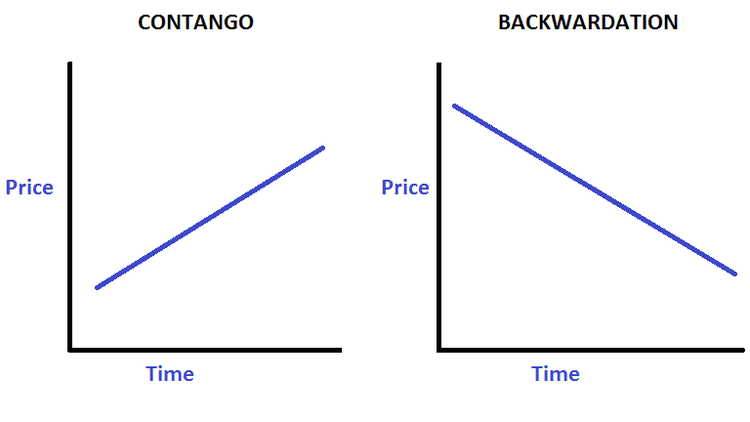

Futures trading plays a vital role in the global financial markets by allowing participants to hedge against risks and speculate on price movements across a wide array of assets, including commodities, currencies, and indexes. This ability to manage risk and anticipate market trends is crucial for businesses and investors alike, offering protection against adverse price changes and opportunities to profit from favorable movements.

One of the critical market conditions influencing futures trading is backwardation. This scenario occurs when the futures price of a commodity is lower than its current spot price, suggesting either higher present demand or limited supply availability. Backwardation can lead to profitable opportunities for traders who are adept at analyzing these conditions and formulating strategies to take advantage of them. Such understanding can be integral for effectively managing asset portfolios and optimizing returns.



In an era where speed and precision are paramount, algorithmic trading emerges as a pivotal tool in navigating markets characterized by backwardation. By employing computer algorithms, traders can execute orders at speeds and frequencies far beyond human capability, enabling swift responses to market inefficiencies. Algorithmic trading facilitates the development and implementation of sophisticated trading strategies, enhancing decision-making under volatile market conditions and improving overall trading performance.

This article will explore various futures trading strategies within markets marked by backwardation, with a particular focus on the transformative role of algorithmic trading. Through this exploration, we aim to provide insights into how traders can efficiently harness these market conditions, leveraging technology to gain a competitive edge.

## Table of Contents

## Understanding Backwardation

Backwardation is a market condition where the futures price of a commodity is lower than the current spot price for that commodity. This scenario typically indicates heightened demand or a reduced supply in the present, prompting investors to value the immediate delivery of the commodity over future deliveries. It contrasts with contango, another market condition where futures prices exceed spot prices, often reflecting expectations of increased costs or supply over time.

Markets can shift into backwardation due to several short-term factors. Geopolitical events, such as conflicts or sanctions, can disrupt supply chains, causing immediate shortages that drive up spot prices. For example, political instability in major oil-producing regions can affect [crude oil](/wiki/crude-oil) availability, leading to backwardation in oil futures markets. Natural disasters like hurricanes or droughts can similarly impact supply by hindering production or distribution processes. These events create immediate scarcity, pushing the spot price above the futures price as market participants rush to secure limited resources.

Unexpected demand surges also contribute to backwardation. For instance, a sudden increase in energy demand during an exceptionally cold winter can lead to higher spot prices for natural gas or heating oil, even if future supplies are anticipated to stabilize. In such situations, backwardation reflects the market's urgent need for immediate inventory, making the commodity more valuable today than in the future. Understanding backwardation is crucial for traders and investors to navigate these often volatile market environments successfully.

## Climates Associated with Backwardation

Backwardation often occurs in market environments where demand significantly exceeds supply. This imbalance can result from various factors, often with their roots in unpredictable and external events. For example, extreme weather conditions such as droughts or floods can severely impact agricultural yields, reducing the availability of commodities like wheat or corn. In such scenarios, the immediate demand to secure existing stock boosts the spot price, often making it higher than futures prices, which ordinarily reflect more stable, longer-term expectations.

Similarly, political instability can disrupt supply chains, particularly for commodities like oil. When political events threaten the steady delivery of oil from key regions, the uncertainty increases the demand for current stock, pressing the spot price upwards relative to future deliveries. This mismatch between immediate availability and anticipated future stability creates backwardation.

Understanding these scenarios is crucial for traders as they can anticipate potential market moves and adjust their strategies to exploit these conditions. For instance, if a significant geopolitical event is anticipated in an oil-producing region, traders might expect a surge in spot prices relative to future prices, signaling the onset of backwardation. Such foresight can be leveraged to develop trading strategies that maximize the opportunity from the expected price movements, allowing for effective hedging against future uncertainties.

By analyzing these external factors and monitoring changes in supply and demand, traders can better prepare for backwardated markets. This preparedness can include potentially modifying existing positions or initiating new trades to capitalize on the shifting market dynamics, all while considering the broader economic and political landscapes influencing these trends.

## Identifying Backwardation Futures

To identify backwardation in futures markets, traders focus on the relationship between futures prices and spot prices, particularly by examining the spread between contracts with different maturities. The key here is to analyze the difference between the near-month futures contract and those with longer maturity dates. If the futures prices for these near-month contracts are lower than the current spot price, backwardation is likely occurring. This condition indicates that there may be immediate demand pressures or supply constraints driving spot prices higher than future prices.

The spread analysis involves observing the price differences across contracts with varying expiration dates. Mathematically, this can be represented as:

$$
\text{Spread} = \text{Spot Price} - \text{Futures Price}
$$

When the spread is positive, it suggests backwardation: the market expects future prices to decline, aligning with the current spot price upon maturity. This scenario reflects traders' sentiments about the underlying asset's supply and demand dynamics, often shaped by factors such as geopolitical tensions, natural disasters, or economic shifts affecting immediate supply.

For traders, identifying backwardation helps recognize potential trading opportunities that capitalize on the current market dislocation. One common approach is to use the spread as a basis for trading strategies oriented towards price convergence over time, often through techniques like reverse cash-and-[carry](/wiki/carry-trading) [arbitrage](/wiki/arbitrage) or speculative positioning anticipating a shift in market conditions.

Tools such as Python can aid in analyzing market data to spot backwardation. For example, leveraging libraries like `pandas` and `numpy` enables traders to automate the monitoring of spreads and identify backwardation efficiently:

```python
import pandas as pd
import numpy as np

# Sample data: spot and futures prices
data = {'Spot_Price': [105, 108, 110],
        'Futures_Price_Near_Month': [100, 102, 104],
        'Futures_Price_Far_Month': [98, 99, 101]}
df = pd.DataFrame(data)

# Calculate spread
df['Spread'] = df['Spot_Price'] - df['Futures_Price_Near_Month']

# Identify backwardation
df['Backwardation'] = df['Spread'] > 0

print(df)
```

This code snippet reads price data into a DataFrame, calculates the spread, and easily flags cases of backwardation. Such analytical tools are crucial for traders seeking to understand market conditions and align their strategies accordingly. Identifying backwardation not only aids in anticipating market movements but also in designing robust trading strategies that leverage these insights.

## Trading Strategies in Backwardation

Reverse Cash-and-Carry Arbitrage is a fundamental trading strategy in backwardated markets. This strategy exploits the pricing discrepancy between spot markets and futures markets. In backwardation, the futures price is usually lower than the current spot price. Traders can capitalize on this by selling the physical commodity in the spot market and simultaneously buying a futures contract. The core idea is to benefit from the convergence of the futures price toward the spot price as the contract nears expiration.

Consider an example where the current spot price of a commodity is $100, while the corresponding futures contract price is $95. By selling the commodity in the spot market at $100 and buying the futures contract at $95, an arbitrageur locks in a profit of $5 per unit of the commodity when the futures price rises to the spot level by expiration.

Another strategy focuses on selling near contracts. This approach involves short-selling the futures contract with a nearer expiration, expecting the futures prices to increase as they approach the spot prices. When the market is in backwardation, the later prices tend to move upwards, aligning with the spot prices as expiration approaches. Traders can leverage this movement by entering short positions on the near-month contracts, profiting as those futures eventually rise.

In addition to short-term tactics, long-term positioning can also be advantageous in backwardated markets. As the market corrects itself over time, the disparity between futures and spot prices is expected to narrow, resulting in potential profitability for traders who hold futures contracts anticipating this movement. By adopting a long-term stance, traders may benefit from systematic price adjustments, potentially yielding significant returns.

Overall, exploiting backwardation requires careful analysis of market conditions, contract spreads, and timing. Traders must remain vigilant about potential changes in supply-demand dynamics and other external factors that might influence the correction process. Robust modeling and real-time monitoring tools can aid in optimizing these trading strategies, ensuring traders maximize their insights and capital gains.

## The Role of Algorithmic Trading

Algorithmic trading is a strategy that leverages computer algorithms to execute trades based on pre-defined criteria, offering significant advantages in markets characterized by backwardation. The ability to quickly adapt to market inefficiencies is one of the primary benefits of [algorithmic trading](/wiki/algorithmic-trading). In backwardated markets, where futures prices are lower than spot prices, these algorithms can swiftly identify and capitalize on arbitrage opportunities, helping traders optimize their positions.

A notable advantage of algorithmic trading is its capacity to adjust trading strategies in real-time. This flexibility is crucial in backwardated markets, which can experience rapid and unpredictable changes due to supply constraints or increased demand. Algorithms can continuously monitor market data, like price differences and trading volumes, and execute trades when specific conditions are met, thereby ensuring that trading decisions are both timely and data-driven.

Python is among the most popular tools for developing and deploying trading algorithms because of its robust libraries and frameworks for data analysis and [machine learning](/wiki/machine-learning). Libraries such as Pandas and NumPy enable efficient data manipulation and numerical processing, while scikit-learn and TensorFlow provide advanced capabilities for building predictive models and analyzing market patterns. Below is a simple Python script demonstrating how an algorithm may monitor the price spread between futures and spot prices to detect backwardation:

```python
import pandas as pd

# Sample data representing futures and spot prices
data = {'date': ['2023-11-01', '2023-11-02', '2023-11-03'],
        'spot_price': [105, 107, 110],
        'futures_price': [100, 102, 104]}

df = pd.DataFrame(data)

# Calculate the spread
df['spread'] = df['spot_price'] - df['futures_price']

# Identify backwardation
backwardated_days = df[df['spread'] > 0]

print("Days with backwardation:")
print(backwardated_days[['date', 'spread']])
```

This script calculates the spread between futures and spot prices for given data points and identifies days when backwardation is present. Such tools can be integrated into a larger trading system that employs machine learning models to forecast future movements, optimize trade execution, and manage risk.

In backwardated markets, the precision of algorithmic trading becomes even more critical, as it reduces the latency between identifying and executing trades. As machine learning models continue to evolve, their ability to predict market trends improves, yielding more accurate and profitable trading strategies. Consequently, traders using algorithmic methods can handle vast datasets and adapt their strategies with greater agility than manual trading approaches, providing them with a competitive edge in complex market environments.

## Risks and Risk Management

Trading in backwardation can present substantial risks, largely due to the inherent price [volatility](/wiki/volatility-trading-strategies) and the unpredictability of market events. This volatility stems from the supply and demand dynamics that characterize backwardation, where immediate demand can drive prices up unexpectedly, leaving traders exposed to sudden market shifts.

Effective risk management becomes essential under such market conditions. One key strategy involves hedging, which can protect against adverse price movements. Hedging typically involves taking an offsetting position in a related market. For example, a trader might sell a futures contract to hedge against potential losses in the physical commodity market. This strategy can mitigate the risk of unfavorable price changes and stabilize returns.

Continuous monitoring of market conditions is another critical component of risk management in backwardated markets. By staying alert to fluctuations and trends, traders can adapt their strategies promptly. Tools like moving averages, volatility indices, and [momentum](/wiki/momentum) indicators can be employed to gauge market sentiment and anticipate shifts.

Moreover, adaptive trading plans are crucial. These plans should be flexible enough to accommodate new information or changes in market conditions. Algorithmic trading systems can aid in this adaptability, offering real-time analysis and the ability to swiftly execute trades based on evolving criteria. A sample implementation of a simple moving average crossover strategy in Python could look like this:

```python
import numpy as np
import pandas as pd

# Sample data: 'data.csv' contains 'Date' and 'Close' price columns.
data = pd.read_csv('data.csv')
data['SMA_short'] = data['Close'].rolling(window=50).mean()
data['SMA_long'] = data['Close'].rolling(window=200).mean()

# Identify signals: Buy when short-term average crosses above long-term average, sell when opposite happens.
data['Signal'] = np.where(data['SMA_short'] > data['SMA_long'], 1, 0)
data['Position'] = data['Signal'].diff()

# Trading signals
buy_signals = data[data['Position'] == 1]
sell_signals = data[data['Position'] == -1]
```

Investors also need to keep abreast of broader economic and geopolitical factors that could influence market dynamics. Political instability, regulatory changes, global economic trends, and major geopolitical events can all impact supply and demand forces, thus affecting futures prices. Understanding these macroeconomic variables is essential for anticipating potential market shifts and adjusting strategies accordingly.

In summary, while trading in backwardation poses significant risks, employing robust risk management strategies can help mitigate these risks. Through hedging, continuous market monitoring, adaptive plans, and attentive observation of economic and geopolitical trends, traders can better navigate the complexities and uncertainties inherent in backwardated markets.

## Conclusion

Backwardation presents traders with distinct opportunities to capitalize on market anomalies, where futures prices dip below current spot prices due to heightened demand or supply constraints. Successfully exploiting these market conditions necessitates strategic planning and execution. Strategic trading approaches, such as reverse cash-and-carry arbitrage, enable traders to take advantage of price convergence over time. In backwardated markets, traders can benefit by selling physical commodities at spot prices while purchasing futures contracts, anticipating that futures prices will align closely with spot prices as contracts near expiration.

Algorithmic trading plays a crucial role in enhancing the execution of trading strategies within backwardated markets. By employing algorithms, traders can systematically and swiftly react to market inefficiencies, enabling real-time adjustments based on precise criteria. For instance, the use of Python and machine learning tools facilitates the analysis of complex market data, allowing for informed decision-making and execution of trades with heightened accuracy. Algorithms can identify price divergences or anomalies that may offer profitable arbitrage opportunities and execute trades at optimal times to maximize returns.

However, trading in backwardation is inherently risky, requiring robust risk management frameworks. The volatility associated with fluctuating demand and supply, coupled with potential geopolitical or economic disruptions, can lead to significant price swings. Effective risk management strategies include hedging, diversification, and continuous market surveillance to mitigate potential losses. Traders must remain vigilant and responsive to evolving market dynamics, incorporating adaptive plans to address unforeseen market events and maintain stability.

Continuous learning and adaptation are paramount for sustained success in the futures trading landscape. With advancements in technology and market conditions shifting rapidly, traders need to update their strategies and tools regularly to ensure competitiveness. Engaging with educational resources, market analysis, and peer discussions can contribute to a deeper understanding and improved adaptability in this ever-evolving sector.

In conclusion, while backwardation offers attractive trading prospects, only those who employ strategic, data-driven approaches coupled with algorithmic tools and rigorous risk management will be able to harness these opportunities effectively. Remaining informed and flexible are integral attributes for thriving in the dynamic and competitive world of futures trading.

## References & Further Reading

[1]: Bergstra, J., Bardenet, R., Bengio, Y., & Kégl, B. (2011). ["Algorithms for Hyper-Parameter Optimization."](https://dl.acm.org/doi/10.5555/2986459.2986743) Advances in Neural Information Processing Systems 24.

[2]: ["Advances in Financial Machine Learning"](https://www.amazon.com/Advances-Financial-Machine-Learning-Marcos/dp/1119482089) by Marcos Lopez de Prado

[3]: ["Evidence-Based Technical Analysis: Applying the Scientific Method and Statistical Inference to Trading Signals"](https://www.amazon.com/Evidence-Based-Technical-Analysis-Scientific-Statistical/dp/0470008741) by David Aronson

[4]: ["Machine Learning for Algorithmic Trading"](https://github.com/stefan-jansen/machine-learning-for-trading) by Stefan Jansen

[5]: ["Quantitative Trading: How to Build Your Own Algorithmic Trading Business"](https://github.com/LucindaYa/quant-resources/blob/master/Quantitative%20Trading%20How%20to%20Build%20Your%20Own%20Algorithmic%20Trading%20Business.pdf) by Ernest P. Chan