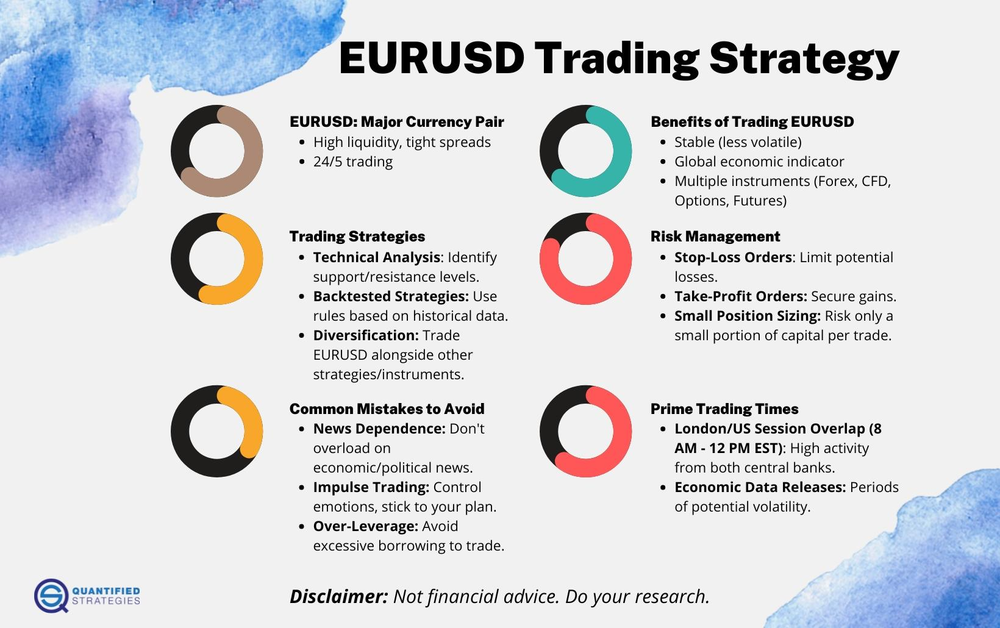

In the fast-paced world of forex trading, the EUR/USD currency pair stands out as a pivotal market player. Known for its high liquidity and reduced slippage, this pair attracts numerous traders worldwide who seek to capitalize on its significant price movements. Trading the EUR/USD pair offers an enticing combination of opportunities, mainly owing to its frequent volatility and the broad range of factors influencing its price.

This article focuses on the intricacies of developing effective currency strategies within the forex market, particularly emphasizing Euro trading alongside the innovative application of algorithmic trading (algo trading) strategies. The integration of technology into trading has increasingly become a cornerstone, enhancing the ability to execute trades with speed and precision. Algo trading, in this context, provides a systematic approach to analyzing market data, identifying profitable trends, and minimizing emotional decision-making.



Understanding how to harness these elements can allow traders to effectively craft and execute strategies that capitalize on the dynamic movements characteristic of the EUR/USD pair. The EUR/USD pair is not only the most traded currency pair but also a reflection of the broader economic health and monetary policies of the Eurozone and the United States. Through strategic alignment of fundamental and technical analysis, traders can optimize their engagement strategies, seeking to enhance profitability while managing risks effectively. This comprehensive examination aims to equip traders with the knowledge to navigate the complexities of forex trading, where the interplay of market forces demands both strategic insight and technological acumen.

## Table of Contents

## Understanding the EUR/USD Currency Pair

The EUR/USD currency pair is the most traded and liquid pair in the global forex market, making it a focal point for traders. The high [liquidity](/wiki/liquidity-risk-premium) of the EUR/USD pair results from the significant economic relationship between the Eurozone and the United States, which are both economic powerhouses on the global stage. This large trading volume provides traders with numerous opportunities to enter and exit positions with minimal slippage, meaning trades can often be executed at desired prices due to the high number of buyers and sellers.

Representing the value of the Euro relative to the U.S. Dollar, the pair is profoundly influenced by economic indicators and geopolitical factors from both regions. In the Eurozone, metrics such as GDP growth, unemployment rates, inflation [statistics](/wiki/bayesian-statistics), and trade balances offer insights into the economic health and future outlook of the Euro. Similarly, in the United States, indicators like the Non-Farm Payrolls, Consumer Price Index (CPI), and Gross Domestic Product (GDP) reports play pivotal roles in determining the strength and stability of the U.S. Dollar.

Central banks, notably the European Central Bank (ECB) and the Federal Reserve, play a critical role in influencing the EUR/USD exchange rate through their monetary policy decisions. Interest rates set by these institutions can lead to significant movements in the currency pair. For instance, if the Federal Reserve raises interest rates while the ECB maintains them, the USD might appreciate against the EUR, causing the EUR/USD pair to decline. Conversely, a lower interest rate in the U.S. compared to the Eurozone could devalue the USD relative to the EUR, thus increasing the EUR/USD rate.

Political events and policies also add layers of complexity to currency valuation. Elections, fiscal policies, and international trade agreements can introduce [volatility](/wiki/volatility-trading-strategies) and influence investor sentiment, which in turn affects the exchange rates. Consequently, traders often keep a keen eye on the political landscape in both regions to predict potential market movements.

In summary, the EUR/USD currency pair remains a cornerstone of [forex](/wiki/forex-system) trading, with its dynamics heavily swayed by a diverse array of economic indicators, central bank policies, and political events in both the Eurozone and the United States. Understanding these factors is essential for traders aiming to navigate the opportunities presented by this prominent currency pair.

## Currency Trading Strategies for EUR/USD

In forex trading, mastering effective strategies for the EUR/USD pair can significantly enhance a trader's success. Here are three proven strategies for navigating this popular currency pair: Buy the Pullback, Buy the Breakout/Sell the Breakdown, and Enter Narrow Range Patterns.

### Buy the Pullback

Buying the pullback involves entering the market after a temporary reversal in the direction of the prevailing trend. This strategy seeks to take advantage of brief price retracements during an uptrend or downtrend:

1. **Identify the Trend**: Use moving averages, such as the 50-day and 200-day moving averages, to determine the direction of the trend.
2. **Determine Pullback Levels**: Recognize support levels during uptrends and resistance levels during downtrends where pullbacks are likely to reverse. These levels can be identified through tools like Fibonacci retracement.
3. **Execute Entry**: Once the price reaches a known support or resistance, enter the trade in the direction of the ongoing trend. Stop-loss orders should be placed just below the support during an uptrend or above the resistance during a downtrend.

### Buy the Breakout/Sell the Breakdown

This strategy focuses on entering trades when the price breaks out of key support or resistance levels, signaling a robust price movement:

1. **Identify Key Levels**: Use chart patterns such as triangles and rectangles to find significant support and resistance areas.
2. **Monitor Volume**: An increase in trading volume during a breakout suggests stronger momentum and confirms the price movement.
3. **Execute Trade**: Enter a long position when the price breaks above a resistance level or a short position when it breaks below a support level. Protect your trades with stop-loss orders just below the breakout point for buys or just above for sells.

### Enter Narrow Range Patterns

Narrow range patterns signify low volatility periods which often precede significant price movements, making them ideal for strategic entries:

1. **Spotting Narrow Ranges**: Use technical indicators, such as Bollinger Bands, to detect periods of reduced volatility where the bands converge.
2. **Waiting for Expansion**: Watch for the price to move outside of the narrow range, indicating increased volatility and potential trend direction.
3. **Trade Execution**: Similar to breakout trading, enter a long position when the price breaks upwards from the narrow range or a short position if it breaks downwards. Implement tight stop-loss orders to manage risk.

These strategies capitalize on the EUR/USD pair's trending movements and trading ranges, offering traders systematic methods to identify and act on profitable opportunities.

## Algorithmic Trading in Forex

Algorithmic trading, commonly known as algo trading, utilizes automated systems to execute trading strategies predefined by market data analysis. This method has transformed forex markets, providing traders with tools to enhance efficiency and decision-making. 

The primary benefit of [algorithmic trading](/wiki/algorithmic-trading) lies in its speed. Automated systems can process vast data and execute trades at speeds beyond human capability. This rapid execution is crucial in the fast-paced forex market, where exchange rates can change in fractions of a second, particularly in a liquid pair like EUR/USD.

Another advantage of algo trading is the reduced emotional impact. Human traders often fall prey to emotions such as fear and greed, which can lead to irrational decision-making. Automated systems, however, operate based on pre-established criteria, devoid of emotional interference, ensuring consistent adherence to a trading strategy.

Algo trading also allows traders to leverage precise timing. Algorithms can be programmed to monitor market conditions continuously and execute trades when specific criteria are met, ensuring optimal entry and [exit](/wiki/exit-strategy) points. This precision is particularly valuable in exploiting short-term opportunities in the EUR/USD currency pair.

Crafting algorithmic trading strategies begins with defining clear trading goals and identifying the market conditions to capitalize on. A well-rounded strategy often combines technical indicators with [fundamental analysis](/wiki/fundamental-analysis). For instance, moving averages and the Moving Average Convergence Divergence (MACD) can help identify trends and [momentum](/wiki/momentum), crucial for timing trades.

In addition, [backtesting](/wiki/backtesting) plays a vital role in the development of effective algo trading strategies. It involves running the algorithm against historical market data to evaluate its performance. This process not only assesses the strategy's profitability but also identifies potential risks and inefficiencies. 

Optimization follows backtesting, where the parameters of the algorithm are adjusted to enhance performance. This ongoing process requires attention to detail, as over-optimization can lead to curve fitting, where the model works well on historical data but fails in live trading.

In the context of the EUR/USD trading, algorithms can be fine-tuned to react to economic news and market sentiment in real-time. These elements are particularly influential in this currency pair due to the geopolitical and economic interplay between the Eurozone and the United States. Integrating real-time economic indicators with technical tools can significantly enhance an algorithm’s adaptability and effectiveness.

Overall, the integration of algorithmic trading in the forex market, particularly for trading the EUR/USD pair, offers significant advantages. By harnessing speed, emotional neutrality, and optimal timing, traders can maximize their potential for success. The continual process of crafting, backtesting, and optimizing trading algorithms ensures they remain effective in an ever-changing market environment.

## Creating Effective EUR/USD Algo Trading Strategies

To create effective EUR/USD algorithmic trading strategies, the integration of fundamental analysis with technical indicators is essential to maximize trading profitability and adaptability. Fundamental analysis involves evaluating economic factors that can influence the EUR/USD exchange rate, such as changes in Gross Domestic Product (GDP), [interest rate](/wiki/interest-rate-trading-strategies) policies from the European Central Bank (ECB) or the U.S. Federal Reserve, and political events that might affect market sentiment.

Technical analysis, on the other hand, relies on historical price and [volume](/wiki/volume-trading-strategy) data to make informed trading decisions. Technical indicators, such as moving averages and the Moving Average Convergence Divergence (MACD), help in identifying trends, support and resistance levels, and potential entry and exit points for trades.

### Technical Tools

**Moving Averages**: Moving averages smooth out price data to identify the direction of the trend. The simple moving average (SMA) is calculated by averaging a set number of past prices. A moving average crossover, where a short-term moving average crosses above a long-term moving average, can signal a buy opportunity. Conversely, a cross below can signal a sell opportunity.

$$
\text{SMA} = \frac{\sum_{i=1}^{n} P_i}{n}
$$

where $P_i$ denotes the price at a given point and $n$ the number of periods.

**MACD**: The MACD indicator is used to reveal changes in the strength, direction, momentum, and duration of a trend. It is calculated by subtracting the 26-day Exponential Moving Average (EMA) from the 12-day EMA. A signal line, which is a 9-day EMA of the MACD, is plotted on top of the MACD line. When the MACD crosses above the signal line, it indicates a bullish signal, suggesting a potential buy.

### Utilizing Python for Technical Indicator Calculation

Python can be employed to automate the calculation of these technical indicators:

```python
import pandas as pd

def calculate_sma(prices, n):
    return prices.rolling(window=n).mean()

def calculate_macd(prices, short_window=12, long_window=26, signal_window=9):
    ema_short = prices.ewm(span=short_window, adjust=False).mean()
    ema_long = prices.ewm(span=long_window, adjust=False).mean()
    macd_line = ema_short - ema_long
    signal_line = macd_line.ewm(span=signal_window, adjust=False).mean()
    return macd_line, signal_line

# Usage example
prices = pd.Series([your_price_data_here])
sma = calculate_sma(prices, n=20)
macd_line, signal_line = calculate_macd(prices)
```

### Integration of Real-Time Economic News

Algorithmic trading strategies can be significantly enhanced by incorporating real-time economic news and market sentiment analysis. By using sentiment analysis tools or APIs that process news headlines or social media feeds, algorithms can adjust trading strategies based on shifts in market sentiment.

For instance, a sudden positive sentiment towards the Euro due to an unexpected ECB policy announcement can prompt the algorithm to prioritize buy signals based on technical indicators.

By combining these elements, traders can craft EUR/USD algorithmic trading strategies that are both robust and adaptable, allowing for better navigation through the ever-changing forex market landscape.

## Backtesting and Risk Management

Backtesting trading strategies using historical data is an essential process for evaluating the potential profitability and associated risks of those strategies. By simulating trades that would have occurred in the past, traders can gain insights into how a strategy may perform under similar market conditions in the future. The primary goal of backtesting is to establish a measure of confidence before deploying a strategy in live trading.

To effectively execute backtesting, traders often utilize programmable environments such as Python, which allows for sophisticated data analysis and strategy implementation. A basic Python framework for backtesting might involve fetching historical price data, applying the strategy logic, and calculating key performance metrics such as total return, drawdown, and Sharpe ratio. Here's a simple Python snippet demonstrating a backtesting setup:

```python
import pandas as pd
import numpy as np

# Load historical price data
data = pd.read_csv('eur_usd_historical.csv')
prices = data['Close']

# Define a simple moving average crossover strategy
short_window = 40
long_window = 100

signals = pd.DataFrame(index=prices.index)
signals['signal'] = 0.0
signals['short_mavg'] = prices.rolling(window=short_window, min_periods=1).mean()
signals['long_mavg'] = prices.rolling(window=long_window, min_periods=1).mean()

# Generate trading signals
signals['signal'][short_window:] = np.where(signals['short_mavg'][short_window:] > signals['long_mavg'][short_window:], 1.0, 0.0)   
signals['positions'] = signals['signal'].diff()

# Calculate strategy returns
initial_capital= float(100000.0)
positions = pd.DataFrame(index=signals.index).fillna(0.0)
positions['EUR/USD'] = 100*signals['positions']

portfolio = positions.multiply(prices, axis=0)
pos_diff = positions.diff()

portfolio['holdings'] = (positions.multiply(prices, axis=0)).sum(axis=1)
portfolio['cash'] = initial_capital - (pos_diff.multiply(prices, axis=0)).sum(axis=1).cumsum() 
portfolio['total'] = portfolio['cash'] + portfolio['holdings']
portfolio['returns'] = portfolio['total'].pct_change()

# Output performance metrics
total_return = portfolio['total'][-1] / initial_capital - 1
sharpe_ratio = np.sqrt(252) * (portfolio['returns'].mean() / portfolio['returns'].std())

print(f"Total Return: {total_return:.2%}")
print(f"Sharpe Ratio: {sharpe_ratio:.2f}")
```

In addition to understanding the historical performance of a trading strategy, effective risk management is indispensable to guard against potential losses. Key risk management practices include:

1. **Position Sizing:** Properly adjusting the size of trading positions according to the risk tolerance and account size ensures that an unfavorable outcome will not lead to catastrophic losses.

2. **Leverage Management:** Leverage can amplify both gains and losses; hence, controlling leverage levels is crucial to maintaining the account's long-term viability. Responsible leverage management can be achieved by adhering to conservative leverage ratios and monitoring margin levels.

3. **Stop-Loss Orders:** Stop-loss orders automatically close a position when the price reaches a predefined level, limiting the potential downside. Implementing stop-loss orders helps maintain discipline and prevent emotional decision-making during volatile market conditions.

These risk management techniques are vital elements of any trading strategy. They can significantly increase the robustness and resilience of trading algorithms when navigating the dynamic forex market. Ultimately, combining rigorous backtesting with sound risk management can enhance a trader's ability to seize opportunities in the EUR/USD pair while safeguarding their investments.

## Selecting the Right Forex Broker for Algo Trading

Selecting the right forex broker for algorithmic trading in the EUR/USD market is critical for ensuring seamless and efficient trade execution. When evaluating potential brokers, traders should focus on several key factors:

**Spreads and Trading Costs**: Spreads, the difference between the bid and ask price, are pivotal in determining trading costs. Tight spreads can significantly enhance profitability, particularly for high-frequency trading strategies used in algo trading. It is essential to assess both fixed and variable spreads offered by brokers and evaluate them in the context of typical market conditions.

**Regulatory Compliance**: Regulatory oversight ensures brokers adhere to industry standards, maintain transparency, and protect clients' funds. Traders should opt for brokers regulated by reputed authorities such as the U.S. Commodity Futures Trading Commission (CFTC), the U.K. Financial Conduct Authority (FCA), or the Australian Securities and Investments Commission (ASIC). Regulatory compliance provides a level of security and trust, reducing the risk of fraud.

**Platform Capability**: A broker's trading platform must support automation features crucial for algo trading. Platforms like MetaTrader 4/5 and cTrader offer comprehensive support for automatic execution and are widely adopted in the industry. These platforms allow the deployment of Expert Advisors (EAs) or custom trading bots, which are essential for automated strategy implementation.

**Broker Reliability and Execution Time**: Reliability encompasses both the technical robustness of the broker's infrastructure and their ability to execute trades swiftly without significant delays. For algo traders, latency, or the delay in processing trades, can erode profits, especially in fast-moving markets. It's critical to select a broker with high uptime and low latency, ensuring trades are executed at the desired levels.

**Customer Support**: Efficient customer support is invaluable, particularly in the event of technical malfunctions or account issues. Brokers with responsive support teams via multiple channels (such as chat, phone, or email) can greatly mitigate potential trading disruptions.

Ensuring these criteria are met can enhance traders' ability to execute effective algorithmic trading strategies in the EUR/USD market, optimizing both profitability and trading efficiency.

## Conclusion

The EUR/USD currency pair remains a critical component of the forex market, providing traders with significant opportunities when combined with effective currency strategies and algorithmic trading techniques. By leveraging technology and precise market analysis, traders can gain an edge in the competitive forex landscape. Algorithmic trading, or algo trading, enables the execution of trading strategies with high efficiency and low latency, automating processes that would otherwise be susceptible to human error and emotional influence. This approach allows traders to exploit market inefficiencies and seize favorable entry and exit points with greater precision.

Market indicators, such as moving averages and the MACD (Moving Average Convergence Divergence), serve as invaluable tools in assessing market trends and price movements. Incorporating these technical indicators with real-time economic news and market sentiment analysis enhances the strategic adaptability of forex traders. Furthermore, systematically evaluating trading strategies through rigorous backtesting against historical data ensures that they are not only theoretically sound but also practically effective.

To capitalize on the dynamic movements of the EUR/USD pair, traders must also adopt sound risk management practices. Position sizing, leverage control, and the implementation of stop-loss orders are essential for safeguarding against excessive losses and maintaining a balanced risk-reward ratio.

In the ever-evolving forex market, selecting a reliable forex broker that offers robust trading platforms with automation capabilities is crucial. This choice affects the efficiency and speed of trade execution, ultimately influencing trading outcomes.

By embracing the confluence of technology, strategic analysis, and disciplined execution, traders can unlock the potential of the EUR/USD currency pair and enhance their prospects for success in the forex market.

## References & Further Reading

[1]: Dacorogna, M., Gençay, R., Müller, U., Olsen, R., & Pictet, O. (2001). ["An Introduction to High-Frequency Finance."](https://archive.org/details/an-introduction-to-high-frequency-finance) Academic Press.

[2]: Savov, Stoyan V. (2020). ["Algorithmic Trading and Quantitative Strategies."](https://books.google.com/books/about/Algorithmic_Trading_and_Quantitative_Str.html?id=vvb2DwAAQBAJ) Edward Elgar Publishing.

[3]: Cartea, Á., Jaimungal, S., & Penalva, J. (2015). ["Algorithmic and High-Frequency Trading."](https://assets.cambridge.org/97811070/91146/frontmatter/9781107091146_frontmatter.pdf) Cambridge University Press.

[4]: Aldridge, I. (2013). ["High-Frequency Trading: A Practical Guide to Algorithmic Strategies and Trading Systems."](https://onlinelibrary.wiley.com/doi/pdf/10.1002/9781119203803.fmatter) Wiley.

[5]: Narang, R. K. (2009). ["Inside the Black Box: A Simple Guide to Quantitative and High-Frequency Trading."](https://onlinelibrary.wiley.com/doi/book/10.1002/9781118267738) Wiley.