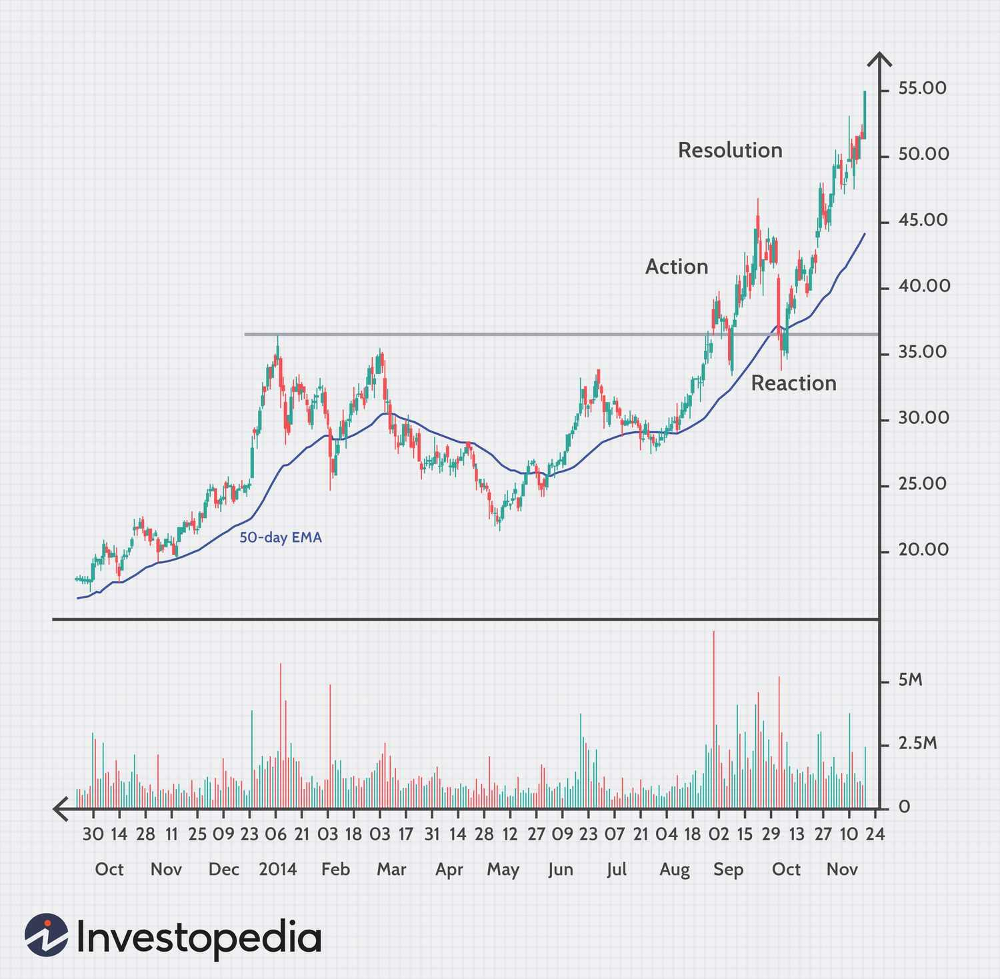

The world of stock trading has undergone a transformative change, driven by technological advancements. One of the most significant innovations in this domain is algorithmic trading, often referred to as algo trading. This approach has become central to achieving new heights in the stock market, primarily due to its ability to enhance transaction speed, accuracy, and ultimately, profitability.

Algorithmic trading employs automated, pre-programmed instructions to execute financial transactions at a speed and frequency impossible for a human trader. These algorithms can process vast amounts of data, identify trends, and execute trades in milliseconds. This capability has opened up a myriad of opportunities for traders, allowing them to capitalize on market inefficiencies and fluctuations in real-time.



This article seeks to explore various trading strategies that have been enabled and refined through the use of algorithms. From momentum trading, which relies on the strength of existing market trends, to arbitrage strategies that exploit price discrepancies, algo trading covers a wide spectrum of methodologies. Each strategy employs a distinct set of algorithms tailored to optimize trading outcomes in dynamic market environments.

For traders, understanding these algorithmic strategies is crucial. Not only does it enhance their ability to identify lucrative market opportunities, but it also equips them with the tools needed to navigate the complexities of modern-day trading. Whether one is a novice stepping into the world of stock trading or a seasoned trader looking to fine-tune their approach, mastering these strategies can be a game-changer.

In summary, as technology continues to advance, those who adapt and employ sophisticated trading strategies stand to gain significantly in the stock market. This article will provide insight into how these automated methodologies can be leveraged for optimum trading performance, paving the way for achieving all-time highs.

## Table of Contents

## Understanding Stock Trading Basics

Stock trading is the process of buying and selling shares of publicly traded companies with the primary goal of generating profit. This basic activity forms the foundation of the financial markets and remains the cornerstone for both individual and institutional investors. At its core, trading involves predicting the future price movements of stocks, driven by various market forces, and acting upon these predictions.

Historically, stock trading was conducted manually, with traders relying on physical exchanges to execute buy and sell orders. However, the advent of technology has introduced algorithm-based strategies, greatly enhancing the efficiency of stock trading by allowing for quicker execution, reduced transaction costs, and minimized human errors.

A fundamental understanding of market trends and financial indicators is critical for successful trading. Market trends reflect the general direction in which a market is moving, which can be upward (bull market), downward (bear market), or sideways. Recognizing these trends allows traders to align their strategies with the prevailing market sentiment.

Additionally, financial indicators such as earnings reports, economic data releases, and [interest rate](/wiki/interest-rate-trading-strategies) changes provide key insights into a company's performance and its stock's likely trajectory. Indicators like Moving Averages (MA), Relative Strength Index (RSI), and Bollinger Bands are often employed to assess price movements and identify potential entry or [exit](/wiki/exit-strategy) points.

The impact of news cannot be overstated, as both financial and geopolitical news can cause significant price fluctuations. Sudden news about economic policy changes, corporate scandals, or technological breakthroughs can trigger rapid market reactions, making it imperative for traders to stay informed and respond swiftly to such developments.

A solid foundation in these principles empowers traders to explore and implement advanced strategies such as [algorithmic trading](/wiki/algorithmic-trading), which requires familiarity with programming and data analysis techniques. Mastery of these basics equips traders with the necessary skills to adapt to the evolving landscape of stock trading and optimize their decision-making processes.

## The Rise of Algo Trading

Algorithmic trading, colloquially referred to as algo trading, employs sophisticated computer algorithms to execute trades based on pre-established criteria. These algorithms are designed to perform trades at speeds and frequencies unimaginable to human traders, thereby minimizing human errors and facilitating rapid decision-making processes. By leveraging these capabilities, algo trading contributes to more efficient stock markets.

High-frequency trading ([HFT](/wiki/high-frequency-trading-strategies)), a prominent subset of algo trading, involves making a large number of transactions at high speeds. This is typically achieved through powerful computing systems that execute millions of trades in fractions of a second. The high velocity and [volume](/wiki/volume-trading-strategy) of trades are intended to capture small price discrepancies that may exist for only brief periods, often leading to substantial cumulative profits.

The rise of data analytics has bolstered the efficacy of algorithmic trading significantly. Traders now have at their disposal extensive historical data, which they use to backtest trading strategies before deployment in live markets. Backtesting allows for the simulation of trading strategies over historical data to evaluate their potential effectiveness. This retrospective testing helps in optimizing strategies by adjusting parameters for better future performance.

The transformative impact of algo trading on the stock market is evident through its enhancement of consistency and reliability in trading operations. Algorithms can analyze multiple markets and securities simultaneously, executing trades at optimal times without the delay inherent in human intervention. This precision not only increases trading efficiency but also reduces transaction costs by executing trades at the most opportune times.

Overall, algorithmic trading has redefined the landscape of stock trading. Its ability to execute complex strategies swiftly and accurately provides both traders and the markets with significant advantages, contributing to more liquid and stable financial environments.

## Popular Trading Strategies for All-Time Highs

Momentum trading is a strategy that seeks to capitalize on the persistence of existing market trends. This approach assumes that once a trend is established, it is likely to continue in the same direction for some time. Traders implementing this strategy often use technical indicators, such as moving averages or the Relative Strength Index (RSI), to identify the strength and sustainability of a trend. Strategies are typically executed when indicators suggest strong upward or downward [momentum](/wiki/momentum). Python libraries like pandas and numpy are often used for data manipulation and analysis in momentum trading algorithms.

Mean reversion strategy, on the other hand, operates on the principle that prices and returns eventually move back to their historical averages. This strategy assumes that any deviation from the average is temporary and will revert over time. For example, Bollinger Bands are commonly used to identify potential reversal points by examining standard deviation bands around a moving average. The strategy calculates a z-score for a stock's current price relative to its historical mean, aiming to trade when prices are significantly above or below this mean. The formula for z-score is $z = \frac{x - \mu}{\sigma}$, where $x$ is the stock price, $\mu$ is the mean, and $\sigma$ is the standard deviation.

Arbitrage trading exploits price discrepancies of identical or similar financial instruments in different markets or forms. A common form of this strategy is spatial [arbitrage](/wiki/arbitrage), where a trader may buy an asset in one market at a lower price and simultaneously sell it in another market at a higher price, profiting from the difference. Algorithmic trading platforms enable these opportunities to be identified and executed rapidly. Programming skills are crucial in developing robust algorithms that can efficiently monitor different markets and spot arbitrage opportunities.

Scalping is a strategy aimed at making profits from small price changes. It involves executing a large number of trades over the [course](/wiki/best-algorithmic-trading-courses) of a day to 'scalp' tiny profits from each trade. Scalpers rely on high-frequency trading systems and algorithms to place numerous trades with very short holding times. The success of [scalping](/wiki/gamma-scalping) strategies often depends on the ability to act faster than other market participants, emphasizing the importance of latency and execution speed in algorithmic design.

Each trading strategy has distinct algorithms catered to optimize performance and minimize risks. Advanced data analytics tools and programming languages such as Python provide the means for traders to back-test strategies and refine their algorithms for better market predictability. In essence, the dynamic nature and application of these strategies demand continuous monitoring and adaptation to ensure they align with market conditions and trader objectives.

## Implementing Technology in Trading

Technology plays a critical role in executing trading strategies by enhancing efficiency and accuracy. Platforms that offer algorithm-based solutions provide traders with real-time data and analytics, enabling informed decision-making. These platforms are designed to handle vast amounts of data instantaneously, offering insights that would be impossible to gather manually.

Machine learning (ML) and [artificial intelligence](/wiki/ai-artificial-intelligence) (AI) further refine trading algorithms by helping them adapt to market conditions. For example, ML algorithms can learn from historical data to identify patterns and forecast future price movements. AI-driven models can execute trades with precision and speed, reducing the time lag that human traders face. A common application of AI in trading is sentiment analysis, where algorithms assess market sentiment by analyzing news articles, social media feeds, and other textual data sources.

Choosing the right trading platform and algorithm is crucial for success in algorithmic trading. Factors such as latency, data integration, and user interface are significant in determining a platform's suitability. Platforms like MetaTrader or TradeStation offer customizable algorithms, real-time data feeds, and robust security, making them popular choices among traders.

Integration of these technologies into trading strategies is an ongoing process that requires continuous learning and adaptation. The ever-changing nature of financial markets demands that traders regularly update their algorithms to remain effective. This involves monitoring the performance of algorithms, [backtesting](/wiki/backtesting) them against historical data, and tweaking parameters to optimize results.

To illustrate the use of technology in trading, consider the following Python code for a simple moving average crossover strategy, a popular trading algorithm:

```python
import numpy as np
import pandas as pd

# Load historical stock data
data = pd.read_csv('historical_data.csv')

# Calculate short-term and long-term moving averages
short_window = 40
long_window = 100

data['Short_MA'] = data['Close'].rolling(window=short_window, min_periods=1).mean()
data['Long_MA'] = data['Close'].rolling(window=long_window, min_periods=1).mean()

# Generate signals
data['Signal'] = 0.0
data['Signal'][short_window:] = np.where(data['Short_MA'][short_window:] 
                                         > data['Long_MA'][short_window:], 1.0, 0.0)
data['Positions'] = data['Signal'].diff()

# Visualize the strategy
import matplotlib.pyplot as plt

plt.figure(figsize=(10, 5))
plt.plot(data['Close'], label='Stock Price', color='black', alpha=0.5)
plt.plot(data['Short_MA'], label='40-Day MA', color='green')
plt.plot(data['Long_MA'], label='100-Day MA', color='red')

plt.plot(data.loc[data.Positions == 1.0].index, 
         data.Short_MA[data.Positions == 1.0], 
         '^', markersize=10, color='g', label='Buy Signal')
plt.plot(data.loc[data.Positions == -1.0].index, 
         data.Short_MA[data.Positions == -1.0], 
         'v', markersize=10, color='r', label='Sell Signal')

plt.title('Moving Average Crossover Strategy')
plt.legend()
plt.show()
```

This script calculates short-term and long-term moving averages from historical stock prices and generates buy and sell signals based on their crossover points. Such algorithms can be further refined using advanced AI techniques to improve accuracy and responsiveness to market dynamics.

In conclusion, the effective implementation of technology in trading relies on selecting suitable tools and continually updating strategies to reflect market conditions. By embracing technological advancements, traders can achieve better outcomes and maintain a competitive edge.

## Challenges and Risks of Algo Trading

Algorithmic trading, while offering significant benefits in terms of speed and precision, presents several challenges and risks that must be comprehensively addressed to mitigate potential pitfalls. 

One of the primary risks associated with algorithmic trading is technical failure. Such failures can arise from hardware malfunctions, software bugs, or network disruptions, potentially causing substantial financial losses. Automated trading systems operate with minimal human intervention, which means that any technical issues can quickly result in a series of unintended trades. For instance, during high-frequency trading (HFT), where trades occur within microseconds, any delay or glitch can have significant financial implications. It is crucial for traders to implement fail-safes and conduct routine system stress tests to minimize the impact of technical failures.

Market [volatility](/wiki/volatility-trading-strategies) and unforeseen global events also pose significant risks to algorithmic strategies. Algorithms are typically designed based on historical data and pre-defined criteria; however, they can struggle to adapt to sudden market movements caused by events such as economic disturbances, political instability, or natural disasters. Such unpredictability can lead to algorithms making erroneous decisions if they are not programmed to account for atypical market behavior. 

Another significant risk involves the potential over-reliance on automated systems. While algorithms can efficiently process large volumes of data, they lack the intuitive judgment and context understanding that human oversight provides. The risk here lies in traders putting excessive faith in automated systems without regular monitoring, which could lead to oversight of critical market signals that are not captured within the algorithm's parameters. It is important for traders to combine algorithmic strategies with human judgment to optimize decision-making processes.

Furthermore, understanding these risks is imperative for developing effective risk management strategies. Robust risk management entails diversifying algorithms to cover various market scenarios, maintaining a dynamic approach to strategy modification, and ensuring continuous oversight and adjustments based on evolving market conditions. Traders should adopt a holistic risk management structure that integrates regular performance reviews, compliance checks, and comprehensive backtesting of trading algorithms to continuously assess and refine their effectiveness. 

Through acknowledging and addressing these challenges, traders can better protect themselves from the inherent risks of algorithmic trading and improve their overall strategic approach.

## Future Opportunities in Algorithmic Trading

Algorithmic trading continues to evolve, driven by technological advancements that promise to reshape its landscape. One promising development is the integration of blockchain technology and distributed ledger systems. These technologies can enhance the transparency and security of transactions by providing an immutable record of trades that is accessible to all market participants. This not only reduces the risk of fraudulent activities but also enables more accurate auditing processes, potentially increasing trust in algorithmic trading platforms.

Regulatory frameworks around algorithmic trading are also evolving. Increased regulatory clarification can streamline trading operations by defining clear guidelines regarding market participation, data usage, and the ethical deployment of trading algorithms. As regulations become more precise, they can minimize misunderstandings and disputes, thereby improving the operational efficiency of algo trading systems.

Big data analytics plays an increasingly critical role in the innovation of trading strategies. The ability to process vast amounts of market data in real time allows traders to identify patterns and trends that are not immediately visible. Advanced analytical tools and [machine learning](/wiki/machine-learning) algorithms can be employed to improve predictive models, resulting in more informed decision-making. This can lead to the development of sophisticated strategies that leverage historical and real-time data to maximize returns.

Traders who are proactive in adapting to these technological and regulatory shifts are likely to gain a competitive edge. By integrating new technologies and leveraging advanced analytics, they can refine their trading strategies to respond more dynamically to market changes. This adaptability is crucial in a fast-paced trading environment where speed and accuracy can significantly influence profitability. 

In conclusion, as the landscape of algorithmic trading continues to transform, embracing these future opportunities can provide traders with the necessary tools to maintain and enhance their competitive position.

## Conclusion

Algorithmic trading is fundamentally transforming the stock market by enhancing both efficiency and precision in trade executions. The inherent capability of algorithmic trading to process vast amounts of data swiftly and execute trades under predefined criteria empowers traders to optimize their strategies effectively. By understanding and utilizing various algorithmic trading strategies, such as momentum trading, mean reversion, arbitrage, and scalping, traders can strategically position themselves to achieve all-time highs in their portfolio performance.

However, while technology opens numerous opportunities, it simultaneously introduces associated risks. Technical failures, market volatility, and unforeseen events pose significant threats that can lead to substantial financial losses. Therefore, it is imperative for traders to not only employ advanced algorithms but also implement rigorous risk management protocols to safeguard against these challenges.

Remaining informed and adaptable is crucial for traders to successfully navigate the swiftly evolving landscape of stock trading. The successful integration of technology and strategy will persist as a pivotal [factor](/wiki/factor-investing). As advancements in machine learning, artificial intelligence, blockchain, and data analytics continue to reshape the future of trading, those who embrace innovation and continuously adapt their methodologies are likely to maintain a competitive edge. 

Through this vigilant approach, traders can harness the full potential of algorithmic trading, propelling themselves toward refined decision-making and consistent market success. The dynamic interplay between technological progress and strategic acumen will undoubtedly shape the future of stock market trading.

## References & Further Reading

[1]: Bergstra, J., Bardenet, R., Bengio, Y., & Kégl, B. (2011). ["Algorithms for Hyper-Parameter Optimization."](https://papers.nips.cc/paper/4443-algorithms-for-hyper-parameter-optimization) Advances in Neural Information Processing Systems 24.

[2]: ["Advances in Financial Machine Learning"](https://www.amazon.com/Advances-Financial-Machine-Learning-Marcos/dp/1119482089) by Marcos Lopez de Prado

[3]: ["Evidence-Based Technical Analysis: Applying the Scientific Method and Statistical Inference to Trading Signals"](https://www.amazon.com/Evidence-Based-Technical-Analysis-Scientific-Statistical/dp/0470008741) by David Aronson

[4]: ["Machine Learning for Algorithmic Trading"](https://github.com/stefan-jansen/machine-learning-for-trading) by Stefan Jansen

[5]: ["Quantitative Trading: How to Build Your Own Algorithmic Trading Business"](https://www.amazon.com/Quantitative-Trading-Build-Algorithmic-Business/dp/1119800064) by Ernest P. Chan