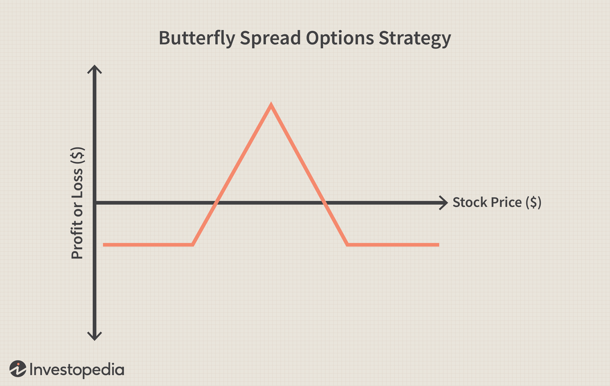

## Table of Contents

## What is volatility and why is it important in options trading?

Volatility is a measure of how much the price of a stock or other asset moves up and down over time. Think of it as how "wild" or "calm" the price changes are. If a stock's price jumps around a lot, it has high volatility. If it stays pretty steady, it has low volatility. In options trading, volatility is really important because it affects the price of options. Options are contracts that give you the right to buy or sell a stock at a certain price, and their value goes up when there's more uncertainty or bigger price swings in the stock.

Understanding volatility helps options traders make better decisions. When volatility is high, options prices tend to be higher because there's a bigger chance the stock price will move a lot, making the option more valuable. On the other hand, when volatility is low, options prices are usually lower because there's less chance of big price moves. Traders use different tools, like the VIX index, to measure and predict volatility, helping them decide when to buy or sell options. Knowing how to read and use volatility can make a big difference in how successful an options trader can be.

## How can beginners identify volatility in the market?

Beginners can identify volatility in the market by looking at how much a stock's price changes over time. One simple way to do this is by checking the stock's price chart. If the price line on the chart goes up and down a lot, that means the stock has high volatility. If the price line stays pretty flat, the stock has low volatility. Another way to see volatility is by using a tool called the Average True Range (ATR). This tool measures how much a stock's price moves on average over a certain period, like 14 days. A higher ATR number means more volatility, and a lower number means less volatility.

Another helpful way for beginners to identify [volatility](/wiki/volatility-trading-strategies) is by looking at something called the VIX index, which is often called the "fear gauge." The VIX measures how much people expect the stock market to move in the next 30 days. If the VIX number is high, it means people expect a lot of movement and volatility in the market. If the VIX number is low, it means people expect the market to be calmer. By keeping an eye on the VIX, beginners can get a sense of the overall market's volatility. This can help them make better decisions about when to buy or sell options or stocks.

## What are the basic options strategies for trading volatility?

When trading options based on volatility, one basic strategy is to buy options when you think volatility will go up. This is called a "long volatility" strategy. You might buy call options if you think the stock price will go up a lot, or buy put options if you think it will go down a lot. When volatility increases, the price of these options usually goes up too, so you can make money if your guess is right. This strategy can be good when the market is unsure or when big news is expected, because these situations often lead to more volatility.

Another basic strategy is to sell options when you think volatility will stay the same or go down. This is called a "short volatility" strategy. You might sell call options if you think the stock price won't go up much, or sell put options if you think it won't go down much. When volatility stays the same or decreases, the price of these options usually goes down, so you can make money if your guess is right. This strategy can be good when the market is calm or when there's not much news expected, because these situations often lead to less volatility.

Both strategies have risks. Buying options (long volatility) can be risky because you could lose all the money you spent on the options if the stock price doesn't move enough. Selling options (short volatility) can also be risky because if the stock price moves a lot, you might lose more money than you expected. So, it's important for beginners to understand these risks and maybe start with small trades to learn how volatility affects options prices.

## How does the VIX index relate to options trading and volatility?

The VIX index, often called the "fear gauge," is a tool that measures how much people expect the stock market to move in the next 30 days. It's important for options trading because it gives traders an idea of how much volatility they can expect in the market. When the VIX number is high, it means people expect a lot of ups and downs in the stock market, which can make options more valuable. On the other hand, when the VIX number is low, it means people expect the market to stay pretty calm, and options might not be as valuable.

Traders use the VIX to make decisions about their options strategies. If the VIX is high and they think it might go even higher, they might buy options to take advantage of the expected increase in volatility. This is called a "long volatility" strategy. If the VIX is low and they think it will stay low or go lower, they might sell options, hoping to profit from the lack of big price moves. This is called a "short volatility" strategy. Understanding the VIX can help traders better manage their options trades and potentially make more informed decisions.

## What are straddles and strangles, and how do they work in volatile markets?

Straddles and strangles are two options trading strategies that can be used when you think a stock's price will move a lot but you're not sure which way it will go. A straddle involves buying both a call option and a put option at the same strike price and expiration date. For example, if you think a stock's price will move a lot after an earnings report, you might buy a straddle. If the stock's price goes up a lot, the call option will make money. If the stock's price goes down a lot, the put option will make money. You win as long as the stock's price moves enough to cover the cost of both options.

A strangle is similar to a straddle, but it uses options with different strike prices. You buy a call option with a higher strike price and a put option with a lower strike price, both with the same expiration date. This strategy is a bit cheaper than a straddle because the options are less likely to be in the money at expiration. In a volatile market, a strangle can be useful if you expect big moves but want to spend less money upfront. If the stock's price goes up a lot, the call option will make money. If it goes down a lot, the put option will make money. Both strategies can help you profit from big price swings without having to guess the direction of the move.

## How can traders use options to hedge against volatility?

Traders can use options to hedge against volatility by buying options that will increase in value if the market becomes more volatile. One common way to do this is by buying a straddle or a strangle. A straddle involves buying both a call option and a put option at the same strike price and expiration date. A strangle involves buying a call option with a higher strike price and a put option with a lower strike price. Both strategies can help protect against big price swings because if the stock price moves a lot in either direction, one of the options will gain value, helping to offset any losses in the trader's other investments.

Another way to hedge against volatility is by using options to protect a stock position. For example, if you own a stock and you're worried about its price dropping due to increased volatility, you can buy a put option on that stock. The put option gives you the right to sell the stock at a certain price, so if the stock's price falls, the put option will increase in value and help reduce your losses. This strategy is called a protective put. By using options in these ways, traders can manage the risks associated with volatility and protect their investments from big price swings.

## What advanced options strategies can be used to profit from high volatility?

One advanced options strategy to profit from high volatility is called a long straddle. In this strategy, you buy both a call option and a put option at the same strike price and expiration date. This works well when you expect a big move in the stock price but aren't sure which way it will go. If the stock price goes up a lot, the call option will make money. If it goes down a lot, the put option will make money. The key is that the stock needs to move enough to cover the cost of both options. This strategy can be expensive because you're buying two options, but it can lead to big profits if there's a lot of volatility.

Another strategy is called a long strangle. This is similar to a long straddle, but you buy a call option with a higher strike price and a put option with a lower strike price, both with the same expiration date. This strategy is cheaper than a straddle because the options are less likely to be in the money at expiration. If the stock price goes up a lot, the call option will make money. If it goes down a lot, the put option will make money. Like the straddle, the stock needs to move enough to cover the cost of both options. A long strangle is a good choice when you expect big moves but want to spend less money upfront.

A third strategy is called a butterfly spread. This involves buying one call option at a lower strike price, selling two call options at a middle strike price, and buying another call option at a higher strike price, all with the same expiration date. This strategy profits from high volatility if the stock price moves a lot but stays within a certain range. If the stock price moves outside this range, the strategy can lose money. Butterfly spreads can be complex but can be very effective in volatile markets when used correctly.

## How do implied volatility and historical volatility affect options pricing?

Implied volatility and historical volatility both play big roles in how options are priced. Implied volatility is what people think the future volatility of a stock will be. It's like a guess about how much the stock's price might move up or down in the future. When implied volatility is high, it means people expect big price swings, so options become more expensive. This is because there's a bigger chance that the option will end up being worth something at expiration. On the other hand, when implied volatility is low, options are cheaper because people expect the stock's price to stay pretty steady.

Historical volatility, on the other hand, looks at how much a stock's price has actually moved in the past. It's like looking back at a record of the stock's price changes. If a stock has had big price swings in the past, it has high historical volatility. This can make options pricier because it suggests that the stock might keep moving a lot in the future. But if a stock's price has been pretty stable, it has low historical volatility, and options might be cheaper. Traders often compare implied and historical volatility to see if options are a good deal or if they're overpriced.

## What are the risks associated with trading volatility using options?

Trading volatility using options can be risky because the market can be unpredictable. When you buy options to bet on high volatility, like with a straddle or strangle, you're hoping the stock price will move a lot. But if the stock price doesn't move enough, you could lose all the money you spent on the options. This is because options have an expiration date, and if they're not worth anything by that date, they become worthless. So, it's a big risk if the stock stays calm and doesn't move as much as you expected.

On the other hand, selling options to bet on low volatility can also be risky. If you sell options and the stock price moves a lot, you might lose more money than you expected. This is because when you sell options, you're on the hook for any big moves in the stock price. If the stock goes up a lot and you sold a call option, or if it goes down a lot and you sold a put option, you might have to pay a lot to cover the losses. Both buying and selling options to trade volatility need careful planning and an understanding of the risks involved.

## How can traders manage and mitigate these risks effectively?

Traders can manage and mitigate the risks of trading volatility by using stop-loss orders. A stop-loss order is like a safety net that automatically sells an option if its price drops to a certain level. This can help limit how much money you lose if the market doesn't move the way you expected. Another way to manage risk is by only trading with money you can afford to lose. This means not using money you need for bills or other important things, so if you lose it, it won't hurt your life too much.

It's also important to do a lot of research and understand the market before you start trading. Learning about the stock you're trading and keeping an eye on things like the VIX index can help you make better guesses about where the market might go. Another good idea is to start small. Instead of jumping into big trades right away, start with smaller trades to learn how volatility affects options prices. This way, you can practice and get better at trading without risking too much money at first.

## What role does market sentiment play in volatility trading?

Market sentiment is what people think and feel about the market. It can really affect how much a stock's price moves around, which is what we call volatility. When people are scared or unsure about the market, they might sell their stocks, causing big price swings. This makes volatility go up. On the other hand, when people feel good and confident about the market, they might buy more stocks, which can keep the prices more steady and make volatility go down. So, understanding how people feel about the market can help traders guess how much the stock prices might move.

Traders can use market sentiment to decide when to buy or sell options. If they think people are getting scared and that might make the market more volatile, they might buy options to take advantage of the big price moves. This is called a long volatility strategy. If they think people are feeling calm and the market might stay steady, they might sell options, hoping to make money from the lack of big moves. This is called a short volatility strategy. By keeping an eye on market sentiment, traders can make better guesses about how to trade options based on how much they think the market will move around.

## How can expert traders use volatility skew to their advantage in options trading?

Volatility skew is when the expected volatility of options at different strike prices is not the same. It's like if you looked at a bunch of options for the same stock but with different prices to buy or sell it, and you saw that some options were expected to move a lot more than others. Expert traders can use this information to make smarter trades. For example, if they see that options with lower strike prices have higher volatility, it might mean people are more worried about the stock price dropping. So, they might buy put options at those lower strike prices to make money if the stock goes down a lot.

By understanding volatility skew, expert traders can also find options that might be priced too high or too low. If they think an option's price doesn't match its expected volatility, they can buy or sell that option to take advantage of the difference. This can help them make money even if the stock price doesn't move as much as they expected. Using volatility skew can be a powerful tool for expert traders because it helps them see what other people in the market are thinking and feeling, and then make trades based on that information.

## What is the role of volatility in options trading?

Volatility in options trading refers to the degree of variation in the price of an underlying asset over time and is a crucial element in determining option prices. It signifies the uncertainty or risk related to the size of changes in an asset's value. Options traders focus on volatility due to its direct impact on the pricing models used to value options. The Black-Scholes model, one of the most widely used option pricing models, incorporates volatility as a key input.

**Historical Volatility vs. Implied Volatility**

Historical volatility (HV) is a measure of the price movement of an asset over a historical period. HV is calculated by computing the standard deviation of daily returns, assuming daily returns are normally distributed. The formula for historical volatility (σ) over a given period is:

$$
\sigma = \sqrt{\frac{\sum_{i=1}^{N} (R_i - \bar{R})^2}{N-1}}
$$

where $R_i$ represents the return on day $i$, $\bar{R}$ is the mean return, and $N$ is the total number of observations.

Implied volatility (IV), on the other hand, reflects the market's expectations of future volatility and is derived from the market price of an option. Unlike historical volatility, which is backward-looking, implied volatility offers a forward-looking estimate of the stock's volatility. Traders extract implied volatility from the option's current price using models like Black-Scholes. The level of implied volatility can indicate market sentiment and can drive option pricing more than historical movements.

**Using Volatility as an Indicator**

Traders use volatility not only to price options but also to anticipate potential market movements. High implied volatility suggests that the market anticipates significant price swings, which could lead to profitable opportunities for options traders through increased option premiums. Conversely, low implied volatility indicates subdued market expectations.

Volatility trading strategies often involve taking positions based on whether the trader expects future volatility to be higher or lower than the current implied volatility. For example, traders might engage in strategies such as long straddles or strangles if they anticipate an increase in volatility, as these positions benefit from significant price movements regardless of direction. Conversely, strategies such as writing straddles or condors might be applied in periods of low expected volatility to earn premium income.

In practice, traders also monitor the volatility skew—the pattern of implied volatilities across different strike prices—especially around significant events like earnings announcements, which tend to increase implied volatility and can cause spikes in option premiums. Understanding and trading based on the nuances of implied and historical volatility enables traders to better hedge their positions and capitalize on changing market conditions.

## References & Further Reading

[1]: Black, F., & Scholes, M. (1973). ["The Pricing of Options and Corporate Liabilities."](https://www.cs.princeton.edu/courses/archive/fall09/cos323/papers/black_scholes73.pdf) Journal of Political Economy, 81(3), 637-654.

[2]: Hull, J. C. (2015). ["Options, Futures, and Other Derivatives"](https://www.semanticscholar.org/paper/Options%2C-Futures%2C-and-Other-Derivatives-Hull/89bdee500c8623864fc9eb7a471546aa713acc44) (9th ed.). Pearson.

[3]: Taleb, N. N. (2010). ["The Black Swan: The Impact of the Highly Improbable"](https://en.wikipedia.org/wiki/The_Black_Swan:_The_Impact_of_the_Highly_Improbable) (2nd ed.). Random House Trade Paperbacks.

[4]: Gatheral, J. (2006). ["The Volatility Surface: A Practitioner's Guide"](https://www.wiley.com/en-us/The+Volatility+Surface%3A+A+Practitioner%27s+Guide-p-9780471792512). Wiley.

[5]: Chan, E. (2009). ["Quantitative Trading: How to Build Your Own Algorithmic Trading Business"](https://github.com/ftvision/quant_trading_echan_book). Wiley.

[6]: Jabbour, G. M., & Liu, X. (2001). ["The Impact of Options Trading on Stock Return Volatility: Evidence from the Introduction of Weeklies."](https://pmc.ncbi.nlm.nih.gov/articles/PMC8107361/) Review of Quantitative Finance and Accounting, 17, 119-141.