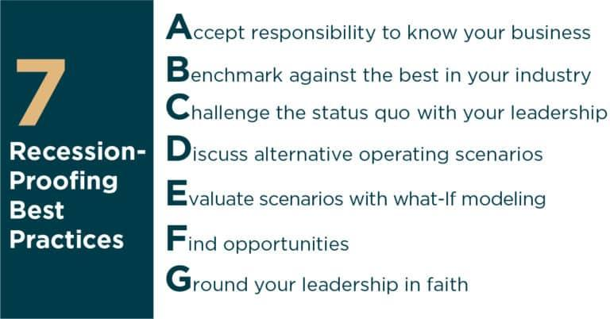

## Table of Contents

## What is an economic recession and how is it defined?

An economic recession is a time when the economy of a country is not doing well. It means that for a while, usually six months or more, things like jobs, money people earn, and how much stuff people buy all go down. During a recession, many people might lose their jobs, and businesses might make less money or even close down. It can be a tough time for everyone because people have less money to spend, and this can make the economy even worse.

A recession is officially defined by something called the National Bureau of Economic Research in the United States. They look at many things, but the main thing they watch is the Gross Domestic Product, or GDP, which is the total value of all the goods and services a country produces. If the GDP goes down for two quarters in a row, which is six months, it's often considered a recession. But they also look at other things like how many people have jobs and how much people are spending. So, a recession is not just about numbers; it's about how it affects people's lives.

## What are the common causes of an economic recession?

Economic recessions can happen for many reasons, but one big reason is when people and businesses start spending less money. When people feel unsure about the future, they might decide to save their money instead of buying things. This can lead to businesses selling less, which means they might have to lay off workers or even close down. When workers lose their jobs, they have even less money to spend, and this can start a cycle that makes the economy worse.

Another common cause of recessions is when there's a big shock to the economy, like a financial crisis or a sudden increase in oil prices. For example, if banks start failing or lending less money, it can be hard for businesses to get the money they need to grow or even keep running. This can slow down the whole economy. Also, if the price of oil goes up a lot, it can make everything more expensive, from gas to shipping goods, which can lead to less spending and more economic trouble.

Sometimes, recessions can also happen because of problems in other countries that affect the whole world. If a big economy like the United States or China goes into a recession, it can impact other countries that trade with them. When global trade slows down, it can lead to less business and more job losses everywhere. So, what happens in one part of the world can sometimes start a recession in another.

## How can individuals identify opportunities during an economic recession?

During an economic recession, people can find opportunities by looking for businesses that are still doing well or might do better because of the recession. For example, some businesses like discount stores or repair services might see more customers because people are trying to save money or fix things instead of buying new ones. People can also look for jobs in industries that are growing, even during tough times, like healthcare or education. By keeping an eye on what's happening around them and being ready to learn new skills, individuals can find ways to make money or even start their own business.

Another way to spot opportunities is by investing in things that might go up in value after the recession. When the economy is down, prices for things like stocks or real estate can be lower. If someone can afford to buy these things during a recession, they might be able to sell them for more money later when the economy gets better. It's important to be careful and do a lot of research before investing, but it can be a good way to make money in the long run. By staying positive and looking for chances to grow, people can turn a tough economic time into a chance to do well.

## What are the basic strategies for investing during a recession?

Investing during a recession can be tricky, but there are some basic strategies that can help. One strategy is to look for good deals. When the economy is down, prices for things like stocks or real estate can be lower. If you have money saved up, buying these things during a recession can be a good idea because you might be able to sell them for more money later when the economy gets better. It's important to do a lot of research before you buy anything, to make sure it's a good investment.

Another strategy is to invest in things that people always need, no matter what the economy is doing. For example, companies that make food, medicine, or basic household items usually keep doing well, even during a recession. These kinds of investments can be safer because they are less likely to lose value. By focusing on these kinds of businesses, you can protect your money and still have a chance to make some profit.

Lastly, it's a good idea to keep some money in safe places, like savings accounts or bonds. These might not make you a lot of money, but they can help you get through tough times without losing everything. Balancing your investments between things that could grow a lot and things that are safe can help you manage the risks of investing during a recession.

## How can businesses adapt their operations to thrive during a recession?

Businesses can adapt to a recession by focusing on what customers need most during tough times. When people have less money to spend, they often look for cheaper options or ways to save money. Businesses can respond by offering discounts, promoting budget-friendly products, or providing services that help customers save money, like repair services instead of buying new items. It's also important for businesses to keep a close eye on their spending and cut costs where they can, maybe by reducing hours or finding cheaper suppliers. By being smart about what they sell and how they spend, businesses can keep going even when the economy is struggling.

Another way businesses can thrive during a recession is by being flexible and ready to change. This might mean trying new things, like selling online if they didn't before, or offering new products that meet the changing needs of customers. Businesses can also look for new opportunities, like buying other businesses that are struggling or investing in areas that are still growing, like technology or healthcare. By staying positive and looking for ways to grow, businesses can turn a tough economic time into a chance to do well.

## What sectors typically perform well during economic downturns?

During economic downturns, some sectors tend to do better than others. One of these is the healthcare sector. People always need healthcare, no matter how the economy is doing. So, hospitals, clinics, and companies that make medicine usually keep making money even when other businesses are struggling. Another sector that often does well is consumer staples. This includes things like food, toilet paper, and cleaning supplies. People need these things every day, so they keep buying them even if they have less money to spend on other things.

Another sector that can do well during a recession is the discount retail sector. When people have less money, they look for cheaper places to shop. Stores like dollar stores or discount supermarkets can see more customers during tough economic times. Also, the utility sector, which includes companies that provide electricity, water, and gas, usually stays stable. People need these services no matter what, so these companies keep making money. By focusing on these sectors, businesses can find ways to keep going even when the economy is down.

## How can one safely invest in stocks during a recession?

Investing in stocks during a recession can be scary, but there are ways to do it safely. One way is to look for companies that make things people always need, like food or medicine. These companies usually do well even when the economy is down because people still have to buy their products. Another way to be safe is to spread your money around. Instead of putting all your money into one stock, you can buy a little bit of many different stocks. This way, if one stock goes down, you won't lose all your money. It's like not putting all your eggs in one basket.

Another good strategy is to use something called a dollar-cost averaging. This means you invest a little bit of money regularly, instead of putting all your money in at once. By doing this, you can buy stocks at different prices, which can help you pay less on average. It's also important to keep some of your money in safe places, like savings accounts or bonds. These won't make you rich, but they can help you get through tough times without losing everything. By being careful and spreading your money around, you can invest in stocks during a recession without taking too much risk.

## What role do government policies play in creating recession opportunities?

Government policies can play a big role in helping businesses and people find opportunities during a recession. When the economy is struggling, governments often try to help by making new rules or giving money to certain industries. For example, they might give tax breaks or loans to businesses that are doing important work, like building new roads or making medicine. This can help these businesses keep going and even grow during tough times. By supporting these industries, the government can create jobs and help the economy get better faster.

Another way government policies can create opportunities is by helping people who are having a hard time. During a recession, the government might give money to people who lost their jobs or can't pay their bills. This can help people keep spending money on things they need, which can help businesses stay open. When people have a little more money, they might also be more willing to try new things, like starting their own business. By helping people and businesses, government policies can turn a tough economic time into a chance for growth and new opportunities.

## How can real estate be a viable investment option during a recession?

Real estate can be a good investment during a recession because prices often go down when the economy is struggling. When fewer people can afford to buy homes, sellers might lower their prices to attract buyers. If you have money saved up, you can buy a house or property at a lower price during a recession. Later, when the economy gets better, you might be able to sell it for more money. This can help you make a profit. But it's important to do a lot of research and make sure you can afford to keep the property, even if it takes a while for the economy to recover.

Another way real estate can be a good investment during a recession is by renting out properties. When people lose their jobs or have less money, they might not be able to buy a home and will need to rent instead. If you own a rental property, you can still make money from rent payments, even when the economy is down. Plus, if you buy a property at a lower price during a recession, the rent you charge might be enough to cover your costs and even make some extra money. Just make sure you pick a good location where people will want to live, and be ready to take care of the property and any problems that come up.

## What advanced financial instruments can be used to hedge against recession risks?

One advanced financial instrument that can help protect against recession risks is called a put option. A put option is like an insurance policy for your investments. If you own stocks and you're worried they might lose value during a recession, you can buy a put option. This gives you the right to sell your stocks at a certain price, even if the market price goes lower. So, if the economy goes down and your stocks lose value, you can use the put option to sell them at the higher price you agreed on, which can help you lose less money.

Another tool is something called a futures contract. Futures contracts let you agree to buy or sell something at a set price in the future. During a recession, prices can change a lot, so using futures can help you lock in prices for things like commodities or currencies. If you think the price of oil or gold might go down during a recession, you can use a futures contract to sell it at today's price, even if the price drops later. This can help you make money or at least not lose as much as you might have if you just held onto the commodity.

Lastly, there are inverse exchange-traded funds (ETFs). These are special funds that go up in value when the market goes down. If you think a recession is coming and the stock market will go down, you can invest in an inverse [ETF](/wiki/etf-trading-strategies). This way, as the market loses value, your investment in the inverse ETF can gain value, helping you make money or at least protect your savings. But remember, these instruments can be complicated and risky, so it's important to understand them well before using them.

## How can global economic trends be analyzed to predict and capitalize on recession opportunities?

To predict and capitalize on recession opportunities, it's important to keep an eye on global economic trends. One way to do this is by watching economic indicators like unemployment rates, inflation, and Gross Domestic Product (GDP) from different countries. If many big economies are showing signs of slowing down, like higher unemployment or lower GDP growth, it might mean a global recession is coming. Also, paying attention to what big organizations like the International Monetary Fund (IMF) or the World Bank say about the world economy can give you clues. These organizations often release reports that can help you understand what's happening and what might happen next.

Once you have a good idea of what's going on around the world, you can start looking for opportunities. For example, if you see that some countries are doing better than others, you might want to invest in businesses or stocks from those countries. Or, if you notice that certain industries, like healthcare or technology, are growing even during tough times, you might want to put your money into those areas. By understanding global trends and acting on them, you can find ways to make money or protect your savings, even when the economy is struggling.

## What case studies illustrate successful strategies during past recessions?

One great example of a successful strategy during a recession is what happened with Netflix during the 2008 financial crisis. When the economy was bad, a lot of people lost their jobs and had less money to spend. But instead of just watching TV, many people started looking for cheaper ways to have fun at home. Netflix saw this and kept their prices low, making it easy for people to sign up and watch movies and shows without spending a lot of money. They also started making their own shows, which helped them stand out from other companies. By understanding what people needed during tough times and giving it to them, Netflix grew a lot during the recession and became a big name in entertainment.

Another good example is how McDonald's did well during the 2008 recession. When people have less money, they often look for cheaper places to eat. McDonald's saw this and started offering more affordable meals, like their famous dollar menu. They also made their restaurants more modern and comfortable, so people would want to come in and stay a while. By focusing on what customers needed during a recession—cheap, good food in a nice place—McDonald's was able to keep growing and even open new restaurants. This shows that by being smart about what you offer and how you offer it, businesses can do well even when the economy is down.

## What are some strategies for navigating economic recessions?

Economic recessions pose significant challenges for investors due to increased market [volatility](/wiki/volatility-trading-strategies) and economic uncertainty. Navigating these periods successfully requires a strategic approach to investment that can preserve capital and capitalize on emerging opportunities.

**Defensive Investment Strategies:**

1. **Dollar-Cost Averaging (DCA):** 

Dollar-cost averaging is a disciplined investment strategy that involves regularly investing a fixed amount of money regardless of market conditions. This method reduces the impact of volatility because it results in buying more shares when prices are low and fewer when prices are high, effectively lowering the average cost per share over time. Mathematically, it can be represented as:

$$
\text{Average Purchase Price} = \frac{\sum (\text{Investment Amount at Each Interval})}{\sum (\text{Shares Purchased})}
$$

By averaging the purchase price, investors can mitigate timing risks associated with attempting to predict market bottoms.

2. **Investing in Consumer Staples:**

Consumer staples refer to essential products such as food, beverages, household items, and healthcare products. These goods maintain stable demand regardless of economic conditions, making them relatively recession-proof. Investing in companies that produce consumer staples can provide a stable return, as these businesses often experience less revenue decline in downturns.

**Dividend-Paying Stocks:**

Dividend-paying stocks are attractive during recessions because they provide regular income in the form of dividends, which can help offset declines in capital value. Companies with a history of stable or growing dividends are typically well-established and financially secure, offering a degree of safety. The dividend yield, given by:

$$
\text{Dividend Yield} = \frac{\text{Annual Dividends per Share}}{\text{Price per Share}} \times 100\%
$$

serves as an indicator of potential income relative to the stock's price, allowing investors to assess income generation relative to their investment.

**Diversification and Asset Allocation:**

Diversification and asset allocation are essential for risk management during economic recessions. By spreading investments across various asset classes—such as equities, bonds, commodities, and cash—investors can reduce the overall risk of their portfolio. Diversification diminishes the impact of a poor-performing asset, while asset allocation aligns investments with an individual's risk tolerance and financial goals. Diversified portfolios tend to exhibit lower volatility and potentially higher risk-adjusted returns.

**Fiscal and Monetary Policy:**

Governments and central banks play a crucial role in stabilizing economies during recessions through fiscal and monetary policy interventions. Fiscal policy, involving government spending and tax measures, aims to stimulate demand and economic activity. For example, tax cuts increase disposable income, potentially boosting consumer spending.

Monetary policy, orchestrated by central banks, uses instruments like interest rates and quantitative easing to influence money supply and borrowing costs. Lowering interest rates reduces the cost of borrowing, encouraging investment and spending. Both policies work together to mitigate the adverse effects of recessions, support economic recovery, and maintain financial stability.

In summary, navigating economic recessions requires a strategic balance of defensive investment practices, an appreciation for income security offered by dividends, comprehensive diversification, and an understanding of macroeconomic policy impacts. These strategies help investors manage risks and potentially emerge stronger post-recession.

## References & Further Reading

[1]: Bergstra, J., Bardenet, R., Bengio, Y., & Kégl, B. (2011). ["Algorithms for Hyper-Parameter Optimization."](https://papers.nips.cc/paper/4443-algorithms-for-hyper-parameter-optimization) Advances in Neural Information Processing Systems 24.

[2]: ["Advances in Financial Machine Learning"](https://www.amazon.com/Advances-Financial-Machine-Learning-Marcos/dp/1119482089) by Marcos Lopez de Prado

[3]: ["Evidence-Based Technical Analysis: Applying the Scientific Method and Statistical Inference to Trading Signals"](https://www.amazon.com/Evidence-Based-Technical-Analysis-Scientific-Statistical/dp/0470008741) by David Aronson

[4]: ["Machine Learning for Algorithmic Trading"](https://github.com/stefan-jansen/machine-learning-for-trading) by Stefan Jansen

[5]: ["Quantitative Trading: How to Build Your Own Algorithmic Trading Business"](https://www.amazon.com/Quantitative-Trading-Build-Algorithmic-Business/dp/1119800064) by Ernest P. Chan