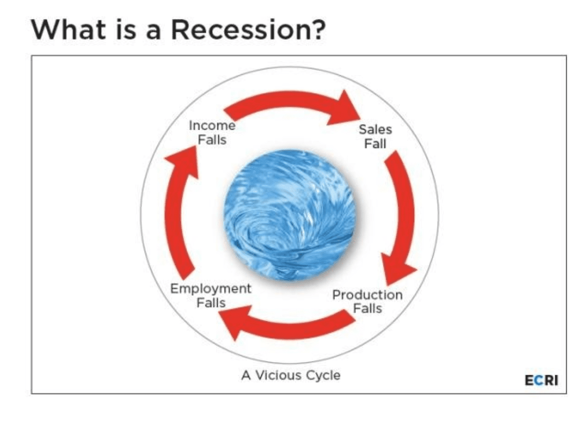

Economic recessions, characterized by a decline in economic activity across the economy lasting more than a few months, are an intrinsic part of the financial cycle. Typically marked by decreasing GDP, falling incomes, rising unemployment rates, and dwindling investment spending, recessions can significantly shake financial markets, creating an environment of heightened volatility and uncertainty. This turbulence often leads investors to seek strategies to mitigate potential losses and capitalize on emerging opportunities.

Strategic response development is crucial for investors and policymakers alike to cushion against the adverse effects of recessions. Crafting effective strategies involves understanding the cyclical nature of economies and recognizing opportunities even in downturns. This planning enables both risk mitigation and the potential for profit, emphasizing resilience and adaptability in investment portfolios.



Algorithmic trading, the use of computer algorithms to execute trades at optimal conditions, emerges as a powerful tool during economic downturns. This technology leverages the ability to process massive amounts of data and execute complex mathematical models to identify trade opportunities that may not be visible to human traders. In volatile markets, where rapid changes are common, algorithmic trading provides the speed and precision needed to respond to market fluctuations effectively.

The purpose of this article is to explore recession strategies and highlight how algorithmic trading can be employed to harness opportunities presented by economic cycles. By understanding the mechanics of recessions and employing advanced trading technologies, investors can navigate economic downturns more effectively, enhancing their chances of achieving favorable outcomes even during challenging times.

## Table of Contents

## Understanding Economic Recessions

Economic recessions are defined as significant declines in economic activity that last for a prolonged period of time, typically evident across indicators such as GDP, employment, and production. In general, a recession is typically recognized after two consecutive quarters of negative GDP growth. However, the National Bureau of Economic Research (NBER) also considers other economic variables such as income, employment, and industrial production to provide a more comprehensive overview of economic health. The characteristics of recessions include rising unemployment rates, decreased consumer spending, lower industrial production, and declining business investment activities.

Historically, recessions have occurred with varying frequency and severity depending on economic conditions. The Great Depression of the 1930s, the oil crisis of the 1970s, the dot-com bubble burst in the early 2000s, and the global financial crisis of 2008 are some of the notable recessions. These events have taught policymakers and economists valuable lessons about the vulnerabilities inherent in financial systems and the ripple effects that recessions can have across global markets. Historical data indicates that recession cycles can emerge from both systemic structural issues and external shocks.

The causes of economic recessions are multifaceted and can include factors such as excessive debt levels, asset bubble bursts, geopolitical tensions, and abrupt changes in monetary policy. For instance, the 2008 financial crisis was primarily triggered by a housing bubble and the proliferation of complex financial instruments like mortgage-backed securities and credit default swaps. Recessions have wide-ranging implications for financial markets; they often lead to decreases in stock prices, reduced [liquidity](/wiki/liquidity-risk-premium), greater [volatility](/wiki/volatility-trading-strategies), and shifts in interest rates as central banks attempt to stabilize economies.

Economic indicators play a critical role in predicting and managing recessions. The use of leading indicators like the yield curve, housing permits, and stock market performance can signal impending economic downturns. One famous example is the inverted yield curve, which has historically been a reliable predictor of recessions. When long-term interest rates fall below short-term rates, it suggests that investor confidence in future economic growth is declining. Analyzing these indicators allows policymakers and traders to devise strategies to mitigate the effects of recessions. Understanding these patterns is essential for mitigating risks and maintaining financial stability during economic downturns.

## Strategies for Navigating Economic Recessions

Economic recessions pose significant challenges for investors due to increased market volatility and economic uncertainty. Navigating these periods successfully requires a strategic approach to investment that can preserve capital and capitalize on emerging opportunities.

**Defensive Investment Strategies:**

1. **Dollar-Cost Averaging (DCA):** 

Dollar-cost averaging is a disciplined investment strategy that involves regularly investing a fixed amount of money regardless of market conditions. This method reduces the impact of volatility because it results in buying more shares when prices are low and fewer when prices are high, effectively lowering the average cost per share over time. Mathematically, it can be represented as:

$$
\text{Average Purchase Price} = \frac{\sum (\text{Investment Amount at Each Interval})}{\sum (\text{Shares Purchased})}
$$

By averaging the purchase price, investors can mitigate timing risks associated with attempting to predict market bottoms.

2. **Investing in Consumer Staples:**

Consumer staples refer to essential products such as food, beverages, household items, and healthcare products. These goods maintain stable demand regardless of economic conditions, making them relatively recession-proof. Investing in companies that produce consumer staples can provide a stable return, as these businesses often experience less revenue decline in downturns.

**Dividend-Paying Stocks:**

Dividend-paying stocks are attractive during recessions because they provide regular income in the form of dividends, which can help offset declines in capital value. Companies with a history of stable or growing dividends are typically well-established and financially secure, offering a degree of safety. The dividend yield, given by:

$$
\text{Dividend Yield} = \frac{\text{Annual Dividends per Share}}{\text{Price per Share}} \times 100\%
$$

serves as an indicator of potential income relative to the stock's price, allowing investors to assess income generation relative to their investment.

**Diversification and Asset Allocation:**

Diversification and asset allocation are essential for risk management during economic recessions. By spreading investments across various asset classes—such as equities, bonds, commodities, and cash—investors can reduce the overall risk of their portfolio. Diversification diminishes the impact of a poor-performing asset, while asset allocation aligns investments with an individual's risk tolerance and financial goals. Diversified portfolios tend to exhibit lower volatility and potentially higher risk-adjusted returns.

**Fiscal and Monetary Policy:**

Governments and central banks play a crucial role in stabilizing economies during recessions through fiscal and monetary policy interventions. Fiscal policy, involving government spending and tax measures, aims to stimulate demand and economic activity. For example, tax cuts increase disposable income, potentially boosting consumer spending.

Monetary policy, orchestrated by central banks, uses instruments like interest rates and quantitative easing to influence money supply and borrowing costs. Lowering interest rates reduces the cost of borrowing, encouraging investment and spending. Both policies work together to mitigate the adverse effects of recessions, support economic recovery, and maintain financial stability.

In summary, navigating economic recessions requires a strategic balance of defensive investment practices, an appreciation for income security offered by dividends, comprehensive diversification, and an understanding of macroeconomic policy impacts. These strategies help investors manage risks and potentially emerge stronger post-recession.

## Exploring Economic Opportunities in Recessionary Periods

Economic recessions, characterized by a significant decline in economic activity across the economy, present challenges but also unique opportunities. Certain sectors and industries exhibit resilience or even growth during such periods. Historical analyses have shown that consumer staples, healthcare, utilities, and discount retailers often perform well during economic downturns. These industries provide essential goods and services, ensuring continual demand irrespective of economic conditions. For instance, during the 2008 financial crisis, companies in these sectors demonstrated relative stability and even growth.

Successful business strategies during recessions often involve leveraging adaptable business models and fostering innovation. Companies that successfully navigated past recessions include Amazon, which during the dot-com bubble shifted its focus from expansion to profitability, and Netflix, which pivoted its business model from DVD rentals to streaming services during the 2008 recession. These examples underline the importance of innovation and adaptability in sustaining and growing businesses amid economic challenges.

Investing in undervalued assets and distressed industries is another strategy that has provided long-term gains during recessions. When asset prices fall during economic downturns, opportunities arise for investors to purchase quality stocks at reduced prices. Value investing, a strategy popularized by investors like Warren Buffet, emphasizes identifying undervalued stocks that have the potential for long-term growth. Distressed industries, while riskier, can also present high-reward opportunities, particularly as broader economic recovery begins and asset prices start to rebound.

Overall, strategic investment in sectors resilient to economic cycles, coupled with seizing opportunities within undervalued assets and distressed industries, constitutes a viable approach to capitalizing on recessionary periods. These strategies, underpinned by adaptive business models and innovation, can yield substantial benefits and position investors and businesses for success as economies recover.

## Algo Trading: A Modern Approach to Economic Downturns

Algorithmic trading is a significant development in modern finance, particularly beneficial during economic downturns. It involves the use of computer programs to execute trading decisions at speeds and frequencies that are impossible for human traders. This approach provides several benefits, especially in volatile markets where rapid decision-making can capitalize on transient opportunities and mitigate potential losses.

Incorporating economic indicators into [algorithmic trading](/wiki/algorithmic-trading) can enhance its effectiveness, especially during recessions. One valuable indicator is the Sahm Rule, which signals the onset of a recession when the three-month moving average of the unemployment rate rises by 0.5 percentage points or more above its low in the previous 12 months. Incorporating such indicators can make trading algorithms more responsive to macroeconomic shifts. For instance,:

```python
# Python code demonstrating a simple integration of the Sahm Rule into a trading algorithm

import pandas as pd

def check_sahm_rule(unemployment_rate):
    # Calculate the three-month moving average
    current_avg = unemployment_rate.rolling(window=3).mean()
    # Calculate the minimum unemployment rate over the past year
    past_year_min = unemployment_rate.rolling(window=12).min()
    # Check if the Sahm Rule condition is triggered
    return (current_avg - past_year_min) >= 0.5

# Example unemployment rate data
unemployment_data = pd.Series(...)  # Assume this is filled with unemployment rate data
if check_sahm_rule(unemployment_data).iloc[-1]:
    print("Recession signal detected!")
```

Algorithmic strategies during recessions often include market-neutral strategies, such as [pair trading](/wiki/pair-trading), which attempt to capitalize on price differentials between correlated assets while minimizing market risk. Another approach is the use of trend-following algorithms, which observe and exploit directional movement patterns in asset prices, often using tools like moving averages or [momentum](/wiki/momentum) indicators.

The rapid advancement of [artificial intelligence](/wiki/ai-artificial-intelligence) and [machine learning](/wiki/machine-learning) has further enhanced the capabilities of algorithmic trading. AI models can analyze vast datasets far beyond human capacity, identify subtle patterns, and adapt to market changes with minimal human intervention. Machine learning algorithms can be trained to predict market movements based on a wide range of historical data inputs and continuously refine their strategies through learning processes.

For instance, a [neural network](/wiki/neural-network) model can be trained to forecast asset price movements by recognizing complex patterns in historical price data, allowing traders to anticipate economic downturns and adjust portfolios proactively.

```python
# Sample code for a simple neural network model using TensorFlow for price prediction

import tensorflow as tf
from tensorflow.keras.models import Sequential
from tensorflow.keras.layers import Dense, LSTM

# Assume x_train and y_train are prepared with historical price data
model = Sequential([
    LSTM(50, return_sequences=True, input_shape=(x_train.shape[1], x_train.shape[2])),
    LSTM(50, return_sequences=False),
    Dense(25),
    Dense(1)
])

model.compile(optimizer='adam', loss='mean_squared_error')
model.fit(x_train, y_train, batch_size=1, epochs=1)

# Use the model to make predictions
predictions = model.predict(x_test)
```

The profound capability of these technologies to process and learn from extensive data ensures that algorithmic trading systems can remain adaptable, continuously optimizing strategies to address the challenges and opportunities presented by economic downturns. This adaptability is crucial in times of market turbulence, where traditional trading strategies might struggle to stay relevant.

## Limitations and Considerations of Algo Trading in Recessionary Markets

Algorithmic trading, while a cutting-edge approach to navigating financial markets, has its own set of challenges and considerations, particularly in the context of economic recessions. These constraints are crucial for investors and traders who rely on algorithmic systems to manage risks and seize opportunities during volatile periods.

One primary challenge is the over-reliance on algorithmic solutions. Algorithms operate on pre-defined parameters and historical data, which may not always account for unprecedented economic shifts during a recession. This limitation can lead to suboptimal trading decisions if market conditions deviate significantly from historical patterns. Hence, it is essential to continually reassess and update the algorithms to reflect the current economic climate.

Data accuracy and timely updates are critical to the effectiveness of algorithmic decision-making. In fast-evolving markets, the quality of data and the speed at which it is processed can significantly influence trading outcomes. Poor-quality or outdated data can mislead algorithms, resulting in faulty trades. Thus, maintaining robust data pipelines and ensuring real-time updates are crucial components of a successful algorithmic trading strategy.

Additionally, the risk of market manipulation and flash crashes associated with algorithmic trading presents another significant concern. The high-speed nature of algorithmic transactions can exacerbate market volatility, sometimes triggering rapid price swings known as flash crashes. Algorithmic traders must implement safeguards, such as circuit breakers or liquidity thresholds, to mitigate these risks.

To address these challenges, a balanced approach that combines traditional market analysis with algorithmic insights is vital. While algorithms excel at processing vast amounts of data and executing trades with precision, human judgment is indispensable for interpreting complex economic indicators and assessing qualitative factors that may impact market dynamics. This hybrid strategy can enhance decision-making by leveraging the strengths of both human intuition and technological efficiency.

In conclusion, while algorithmic trading offers numerous advantages in managing recessionary markets, its limitations necessitate a complementary approach. By ensuring data integrity, incorporating safeguards against market anomalies, and integrating human expertise, traders can harness the full potential of algorithmic strategies during economic downturns.

## Future Implications and Developments in Recession Strategies and Algo Trading

Emerging trends in economic analysis and algorithmic trading technologies are reshaping how recessions are navigated and opportunities are identified. The integration of artificial intelligence (AI) and neural networks into these domains has shown considerable promise in enhancing predictive accuracy. AI models, particularly those using techniques such as [deep learning](/wiki/deep-learning) and [reinforcement learning](/wiki/reinforcement-learning), enable the processing of vast amounts of economic data. These models can identify patterns and trends that are not immediately apparent through traditional analysis, allowing for more accurate predictions of economic cycles.

The long-term outlook for leveraging algorithmic solutions in economic cycle management is optimistic. Advanced algorithms can swiftly adapt to changing market conditions by recalibrating their parameters based on real-time data. This adaptability is crucial for addressing the non-linear and often unpredictable nature of economic downturns. For example, machine learning models can be trained to filter and analyze economic indicators like GDP growth rates, unemployment rates, and consumer confidence indices to forecast economic downturns and recoveries.

```python
import numpy as np
from sklearn.linear_model import LinearRegression

# Simulated data for GDP growth rates and time (could be expanded with real data)
gdp_growth = np.array([2.5, 2.0, 1.8, -0.5, -2.0, -1.5, 0.5, 1.2, 2.3])
time = np.array(range(len(gdp_growth)))

# Linear regression model to predict future GDP growth trends
model = LinearRegression()
model.fit(time.reshape(-1, 1), gdp_growth)

# Predicting future GDP growth rates
future_time = np.array([9, 10, 11]).reshape(-1, 1)
predicted_growth = model.predict(future_time)
```

The collaborative efforts between economists, technologists, and traders are increasingly pivotal in optimizing outcomes. These collaborations facilitate the development of comprehensive strategies that incorporate both macroeconomic theories and cutting-edge technological applications. By working together, these stakeholders can address limitations inherent in each discipline. For instance, while economists provide insights into economic fundamentals, technologists contribute expertise in computational models and data analysis, enhancing the overall decision-making process.

Looking ahead, the potential for AI and neural networks to further enhance the precision of economic forecasts and trading strategies is significant. As these technologies continue to evolve, they are likely to become even more integrated into the standard practices of economic analysis and algorithmic trading, thereby playing a critical role in managing and capitalizing on economic cycles.

## Conclusion

Strategic planning is critical in managing economic recessions, providing a framework to mitigate risks and seize potential opportunities. Recessions, characterized by widespread economic decline, have profound impacts on financial markets, influencing investment strategies and economic policies. By carefully structuring investment portfolios and leveraging economic indicators, investors can navigate these turbulent times more effectively.

Algorithmic trading stands out as a potent tool in identifying and exploiting market opportunities during economic downturns. By automating trading decisions based on predefined strategies, algorithmic trading can respond swiftly to market changes. The integration of sophisticated algorithms with real-time economic data allows traders to optimize their strategies, reducing risk and maximizing potential returns. As economic conditions evolve, these algorithms can adapt, continually reassessing and recalibrating in response to new market information.

Investors are encouraged to adopt a multi-faceted approach to capitalize on economic cycles. Diversification, a cornerstone of risk management, should not be limited to traditional asset classes but should also encompass algorithmic trading strategies. By combining traditional analysis with technological innovations, investors can develop a comprehensive strategy that harnesses the strengths of each approach.

The intersection of technology and economic strategy is reshaping modern finance, offering new avenues for understanding and interacting with financial markets. As artificial intelligence and machine learning continue to advance, their integration into economic strategies will enhance predictive accuracy, offering deeper insights into market dynamics. Collaborative efforts between economists, technologists, and traders promise to further refine these strategies, optimizing outcomes in both stable and recessionary periods. In conclusion, the fusion of strategic planning and technological innovation is not just beneficial but necessary for successfully navigating the complexities of modern economic cycles.

## References & Further Reading

[1]: Bergstra, J., Bardenet, R., Bengio, Y., & Kégl, B. (2011). ["Algorithms for Hyper-Parameter Optimization."](https://papers.nips.cc/paper/4443-algorithms-for-hyper-parameter-optimization) Advances in Neural Information Processing Systems 24.

[2]: ["Advances in Financial Machine Learning"](https://www.amazon.com/Advances-Financial-Machine-Learning-Marcos/dp/1119482089) by Marcos Lopez de Prado

[3]: ["Evidence-Based Technical Analysis: Applying the Scientific Method and Statistical Inference to Trading Signals"](https://www.amazon.com/Evidence-Based-Technical-Analysis-Scientific-Statistical/dp/0470008741) by David Aronson

[4]: ["Machine Learning for Algorithmic Trading"](https://github.com/stefan-jansen/machine-learning-for-trading) by Stefan Jansen

[5]: ["Quantitative Trading: How to Build Your Own Algorithmic Trading Business"](https://www.amazon.com/Quantitative-Trading-Build-Algorithmic-Business/dp/1119800064) by Ernest P. Chan