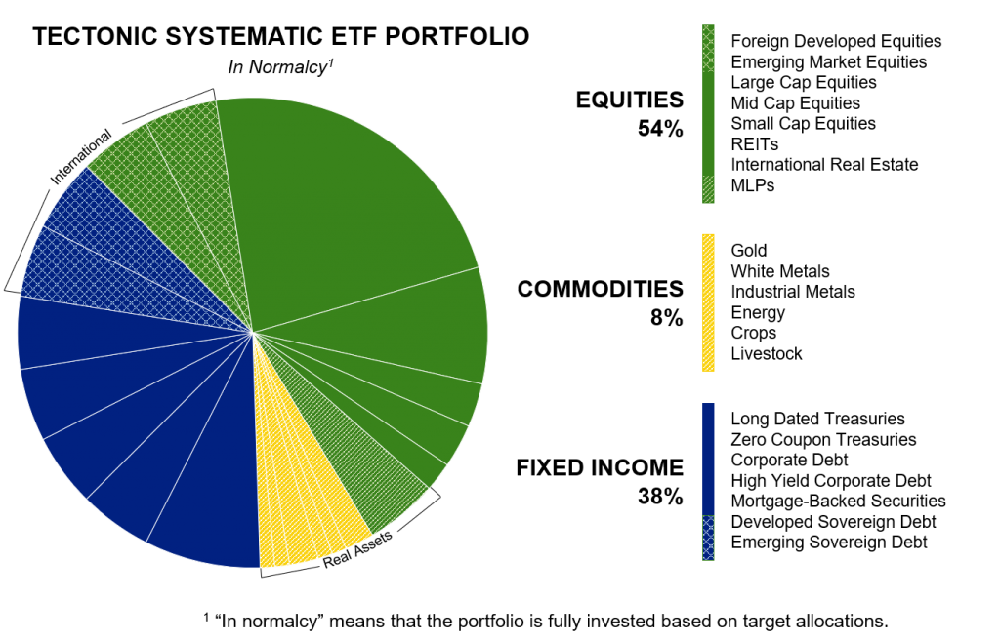

## Table of Contents

## What is an ETF and how does it differ from other investment vehicles?

An ETF, or Exchange-Traded Fund, is a type of investment that allows you to buy a collection of stocks, bonds, or other assets in one go. It's like buying a basket of different investments all at once. ETFs are traded on stock exchanges, just like individual stocks, which means you can buy and sell them throughout the trading day at market prices.

ETFs differ from other investment vehicles like mutual funds in a few key ways. While mutual funds are also a collection of investments, they are typically only bought or sold at the end of the trading day at a price calculated from the net asset value of the fund's holdings. ETFs, on the other hand, offer more flexibility because they can be traded anytime during the trading day. Additionally, ETFs often have lower fees than mutual funds, making them a cost-effective option for many investors.

## How can ETFs be used to diversify an investment portfolio?

ETFs are a great way to spread out your investments and lower your risk. They let you buy a bunch of different stocks or bonds all at once, which means you're not putting all your money into just one company or type of investment. For example, if you buy an ETF that follows the S&P 500, you're getting a piece of 500 big companies instead of just one. This can help protect your money because if one company does badly, it won't hurt your whole investment as much.

You can also use ETFs to invest in different areas of the market or different parts of the world. There are ETFs for almost anything you can think of, like technology, healthcare, or even countries like Japan or Brazil. By [picking](/wiki/asset-class-picking) ETFs from different sectors or regions, you can make sure your money is spread out and not all in one place. This kind of mix can help your portfolio stay strong even if some parts of the market go up and down.

## What are the benefits of using ETFs for long-term investment strategies?

ETFs can be a great choice for long-term investment because they help your money grow steadily over time. They usually follow a broad market or a specific sector, which means you're investing in a lot of different companies or assets at once. This can make your investment safer because if one company does badly, it won't hurt your whole investment as much. Also, ETFs often have lower fees than other types of investments, so more of your money stays in your pocket and can grow over time.

Another benefit of using ETFs for the long haul is that they are easy to buy and sell. You can trade them just like stocks, which means you can quickly adjust your investments if you need to. But because ETFs are meant for long-term growth, it's usually best to hold onto them for many years. This way, you can take advantage of the market's ups and downs and still come out ahead in the end. Plus, many ETFs pay out dividends, which can be reinvested to buy more shares, helping your investment grow even more over time.

## How do ETFs help in managing risk in a portfolio?

ETFs help manage risk in a portfolio by spreading your money across many different investments. Instead of betting on just one company or one type of investment, ETFs let you own a little bit of many companies or assets. This means if one company does poorly, it won't hurt your whole investment as much. It's like not putting all your eggs in one basket, which helps keep your money safer.

Another way ETFs help with risk is by offering choices for different parts of the market or different countries. You can pick ETFs that focus on things like technology, healthcare, or even places like Europe or Asia. By mixing these different types of ETFs in your portfolio, you can balance out the risks. If one area of the market goes down, another might go up, helping to keep your overall investment stable.

## What are the different types of ETFs available to investors?

ETFs come in many different types, so you can find one that fits what you want to invest in. There are ETFs that follow big stock indexes like the S&P 500, which means you're investing in a bunch of the biggest companies in the U.S. all at once. There are also ETFs that focus on specific sectors, like technology or healthcare, so you can invest in just those areas if you think they'll do well. And if you want to invest in other countries, there are ETFs for that too, like ones that focus on Europe or Asia.

Another type of [ETF](/wiki/etf-trading-strategies) is called a bond ETF, which invests in bonds instead of stocks. Bonds are like loans you give to companies or governments, and they pay you back with interest. Bond ETFs can be a safer way to invest because they usually don't go up and down as much as stocks. There are also ETFs that use fancy strategies, like ones that try to make more money by using things like leverage or short selling. These can be riskier, but they might also offer bigger rewards if you're willing to take the chance.

## How can investors use sector-specific ETFs to enhance their investment strategy?

Investors can use sector-specific ETFs to focus their money on parts of the economy they think will do well. For example, if you believe technology companies will grow a lot, you can buy a tech ETF. This way, you're not betting on just one tech company but on the whole tech sector. This can help you make more money if the sector does well, and it's also safer than picking just one company because if one tech company does badly, the others might still do well.

Another way to use sector-specific ETFs is to balance out your investments. If you already have a lot of money in one sector, like healthcare, you can add ETFs from other sectors, like energy or finance, to spread out your risk. This way, if healthcare doesn't do well, your other investments might help keep your money safe. Sector-specific ETFs let you easily move your money around to different parts of the economy, which can help you make the most of your investments over time.

## What are the tax implications of investing in ETFs?

Investing in ETFs can have different tax effects depending on how you buy and sell them. When you sell an ETF for more money than you paid for it, you have to pay capital gains tax. If you hold the ETF for more than a year before selling, you'll pay a lower long-term capital gains tax rate. But if you sell it in less than a year, you'll pay a higher short-term capital gains tax rate, which is the same as your regular income tax rate.

ETFs can also have other tax benefits. They are often more tax-efficient than mutual funds because they don't have to sell their holdings as often. This means they don't create as many taxable events. Also, some ETFs, like those that focus on bonds, might give you dividends. These dividends can be taxed at different rates depending on what kind of income they are. It's a good idea to talk to a tax advisor to understand all the tax rules that apply to your ETFs.

## How can ETFs be used in a tactical asset allocation strategy?

ETFs can be used in a tactical asset allocation strategy to quickly change your investments based on what's happening in the market. If you think a certain part of the market, like technology or healthcare, will do well soon, you can buy an ETF that focuses on that sector. This lets you move your money around without having to pick individual stocks. It's like being able to shift your gears to take advantage of what's happening right now.

This strategy can help you make more money if you're good at guessing where the market is going. But it also means you need to keep an eye on the market and be ready to change your investments often. ETFs are great for this because they're easy to buy and sell. Just remember, while tactical asset allocation can be exciting, it's also riskier than just holding onto your investments for the long haul.

## What are the costs associated with buying and holding ETFs?

When you buy and hold ETFs, you need to think about a few different costs. One cost is the expense ratio, which is a yearly fee that the ETF charges to cover its costs. This fee is a small percentage of the money you have in the ETF, and it's taken out of your investment automatically. Another cost is the trading fee, which is what you pay to your broker every time you buy or sell an ETF. Some brokers might not charge you this fee, but others might, so it's good to check before you start trading.

There can also be other costs that come up when you hold ETFs. If you sell your ETF for more money than you paid for it, you'll have to pay capital gains tax on the profit. The tax rate depends on how long you held the ETF. If you held it for more than a year, you'll pay a lower long-term capital gains tax. If you held it for less than a year, you'll pay a higher short-term capital gains tax, which is the same as your regular income tax. Also, if the ETF pays dividends, you might have to pay taxes on those too, depending on the type of dividends they are.

## How can advanced investors use leveraged and inverse ETFs?

Advanced investors can use leveraged ETFs to try to make more money in a short time. These ETFs use borrowed money to bet bigger on the market. If the market goes up, a leveraged ETF can make you more money than a regular ETF. But it's riskier because if the market goes down, you can lose more money too. It's like trying to win big at a casino, but you can also lose big. So, it's not something you should do if you're not ready to take big risks.

Inverse ETFs are another tool for advanced investors. These ETFs make money when the market goes down. If you think the market will drop, you can buy an inverse ETF to make money from that drop. It's like betting against the market. But just like leveraged ETFs, inverse ETFs can be very risky. If the market goes up instead of down, you can lose money quickly. So, these ETFs are best for people who really know what they're doing and are ready to handle the ups and downs.

## What role do ETFs play in a globally diversified portfolio?

ETFs are really helpful for making your investments more global. They let you put your money into different countries and parts of the world all at once. For example, you can buy an ETF that focuses on Europe or Asia, or even one that covers the whole world. This way, you're not just betting on one country or one part of the world. If one place doesn't do well, another might, which can help keep your money safer.

Using ETFs to spread your money around the world can also help you make the most of different opportunities. Some countries might have better chances for growth than others. By picking ETFs from different places, you can take advantage of these chances without having to pick individual companies in each country. This makes it easier to have a mix of investments from all over the world, which can help your money grow over time.

## How can investors use ETFs to implement a smart beta strategy?

Investors can use ETFs to follow a smart beta strategy, which is a way to pick investments that's different from just following a big index like the S&P 500. Smart beta ETFs focus on certain things about companies, like how big they are, how much they pay in dividends, or how fast they're growing. By choosing ETFs that look at these special factors, investors can try to do better than the overall market. For example, if you think companies that pay high dividends will do well, you can buy a smart beta ETF that only includes those kinds of companies.

Using smart beta ETFs can also help investors spread out their money in a smarter way. Instead of just putting money into the biggest companies, which is what a regular index ETF might do, smart beta ETFs let you focus on other things that might help your money grow. This can make your investments more balanced and might help you make more money over time. But remember, smart beta strategies can be a bit riskier than just following the market, so it's good to understand what you're getting into before you start.

## How can one build a successful investment portfolio?

A well-constructed investment portfolio is diversified across various asset classes, acting as a foundation for long-term financial success. Diversification involves spreading investments across different asset categories—such as stocks, bonds, real estate, and commodities—to reduce the risk associated with any single asset. This strategy not only helps mitigate risk but also enhances potential returns over time by smoothing out [volatility](/wiki/volatility-trading-strategies).

Assessing asset allocation is crucial in balancing risk and reward. Asset allocation refers to the percentage distribution of different asset classes within a portfolio and is largely determined by an investor’s financial goals, risk tolerance, and investment time horizon. For instance, a more aggressive investor with a longer time horizon may have a higher allocation in equities, while a conservative investor nearing retirement might prioritize bonds and other fixed-income securities. 

Regular reviews and rebalancing of an investment portfolio are essential to maintain alignment with one's investment goals. Over time, changes in market conditions and asset performance can shift the original allocation. Rebalancing involves realigning the portfolio back to its target allocation, ensuring that it stays within the risk parameters set by the investor. This process can entail selling over-performing assets and buying under-performing ones.

Understanding your portfolio's performance metrics is key in guiding future investment decisions. Key metrics include the portfolio's return on investment (ROI), standard deviation (a measure of volatility), and the Sharpe ratio (which assesses risk-adjusted returns). By analyzing these indicators, investors can evaluate how well their strategy meets their objectives and identify areas for improvement.

For example, the Sharpe ratio is calculated as follows:

$$
\text{Sharpe Ratio} = \frac{R_p - R_f}{\sigma_p}
$$

where $R_p$ is the return of the portfolio, $R_f$ is the risk-free rate of return, and $\sigma_p$ is the standard deviation of the portfolio's return. A higher Sharpe ratio indicates that the portfolio is generating better risk-adjusted returns.

Incorporating these principles can significantly enhance the strength and resilience of an investment portfolio, ultimately contributing to long-term financial security.

## References & Further Reading

[1]: Bergstra, J., Bardenet, R., Bengio, Y., & Kégl, B. (2011). ["Algorithms for Hyper-Parameter Optimization."](https://papers.nips.cc/paper/4443-algorithms-for-hyper-parameter-optimization) Advances in Neural Information Processing Systems 24.

[2]: ["Advances in Financial Machine Learning"](https://www.amazon.com/Advances-Financial-Machine-Learning-Marcos/dp/1119482089) by Marcos Lopez de Prado

[3]: ["Evidence-Based Technical Analysis: Applying the Scientific Method and Statistical Inference to Trading Signals"](https://www.amazon.com/Evidence-Based-Technical-Analysis-Scientific-Statistical/dp/0470008741) by David Aronson

[4]: ["Machine Learning for Algorithmic Trading"](https://github.com/stefan-jansen/machine-learning-for-trading) by Stefan Jansen

[5]: ["Quantitative Trading: How to Build Your Own Algorithmic Trading Business"](https://www.amazon.com/Quantitative-Trading-Build-Algorithmic-Business/dp/1119800064) by Ernest P. Chan