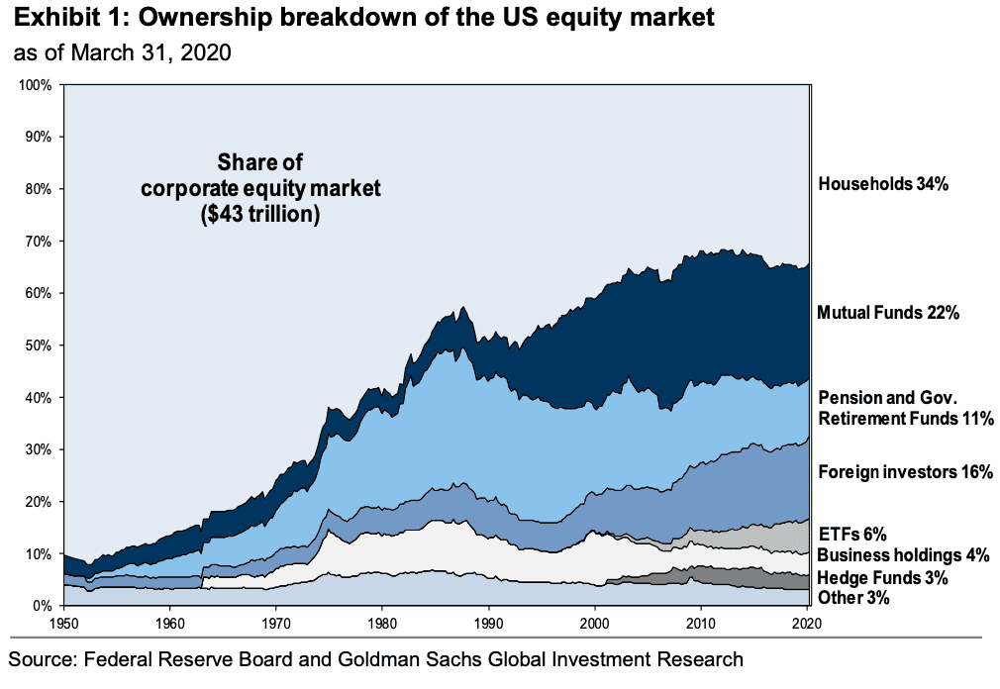

In the ever-evolving landscape of financial trading, algorithmic trading has emerged as a transformative force, reshaping the way market transactions are executed. This method uses automated systems driven by complex algorithms to conduct high-speed trading with precision and reliability. The automation of trading processes is primarily aimed at improving trading efficiency, reducing human errors, and taking advantage of fleeting market opportunities that might be missed by manual trading.

Strategists in algorithmic trading play a crucial role in this domain, tasked with designing and deploying sophisticated algorithms. Their work is fundamental to optimizing trading performance by ensuring that algorithms operate effectively across diverse market conditions. These professionals utilize mathematical models and quantitative techniques to craft strategies that can predict market movements, manage risks, and execute trades at optimal times.



With financial markets becoming more intricate, the demand for advanced algorithmic strategies has soared. This has given rise to a new breed of financial professionals who combine expertise in finance, mathematics, and computer science. By leveraging large sets of data and harnessing computational power, these strategists work to stay ahead in markets that are increasingly driven by data and digital transactions.

Algorithmic trading is not just an enhancement of traditional trading methods; it represents a paradigm shift in modern finance. By facilitating faster response times and enabling the management of larger volumes, it provides traders with a competitive edge. As financial institutions and individual traders continue to adopt these technologies, understanding the role of strategists and the methodologies they employ becomes more critical.

This article aims to expound on the complexities faced by strategists in algorithmic trading and to highlight their significance in shaping the future of financial trading. It will cover the foundations of algorithmic trading, the responsibilities of strategists, and the tools and technologies empowering their work, ultimately showcasing the transformative impact of algorithmic strategies in modern finance.

## Table of Contents

## Understanding Algorithmic Trading and Its Strategies

Algorithmic trading utilizes sophisticated computer algorithms to automate trading decisions based on predetermined criteria. These decisions are typically executed at speeds and frequencies that would be impossible for a human trader. The utilization of algorithms minimizes human error, enhances trading efficiency, and capitalizes on market opportunities.

Among the numerous strategies employed in [algorithmic trading](/wiki/algorithmic-trading), [trend following](/wiki/trend-following), mean reversion, and statistical [arbitrage](/wiki/arbitrage) are the most prevalent. Trend following strategies, as the name suggests, involve identifying and capitalizing on the [momentum](/wiki/momentum) in the price movement of assets. These strategies rely on technical indicators such as moving averages and momentum oscillators to determine the direction of the trend and establish entry and [exit](/wiki/exit-strategy) points.

Mean reversion strategies, on the other hand, are grounded on the belief that asset prices will revert to their historical average over time. When prices deviate significantly from their average, strategists perceive an opportunity to initiate trades, expecting the price to return to the average. This strategy often involves statistical techniques to determine when an asset is overbought or oversold.

Statistical arbitrage involves identifying pricing inefficiencies between related financial instruments through statistical methods and executing trades to exploit these inefficiencies. This strategy typically entails complex mathematical models and significant computational power to analyze large datasets and identify potential arbitrage opportunities rapidly.

Strategists play a crucial role in selecting and refining these strategies. They must possess a profound understanding of market dynamics, including [liquidity](/wiki/liquidity-risk-premium), [volatility](/wiki/volatility-trading-strategies), and the interdependencies among various assets and markets. Employing data-driven approaches, strategists analyze historical data to identify patterns and correlations that can inform the development and optimization of trading algorithms. By continuously [backtesting](/wiki/backtesting) these strategies against historical data and refining algorithm parameters, strategists aim to enhance the algorithm's predictive accuracy and robustness across different market conditions.

In summary, understanding algorithmic trading involves appreciating the complexity and intricacy of designing strategies capable of navigating diverse market conditions. The ability to integrate quantitative models with real-time data analysis sets the foundation for successful algorithmic trading strategies that can thrive in an automated and high-speed trading environment.

## Key Roles of Strategists in Algo Trading

Strategists in algorithmic trading are pivotal in developing, testing, and optimizing trading algorithms to achieve superior trading performance. Their role involves creating algorithms that can efficiently process vast amounts of data to identify profitable trading opportunities. The development process requires a deep understanding of quantitative analysis and financial markets, allowing strategists to design algorithms tailored to specific market conditions.

Ensuring the robustness and adaptability of these algorithms is central to a strategist's duties. Robust algorithms are designed to handle a range of market scenarios, minimizing the risk of significant losses during unforeseen market events. Adaptability is achieved through continuous algorithm refinement and iteration, incorporating feedback from real-world trading environments and evolving market dynamics.

Once developed, algorithms must be rigorously tested under various simulated conditions to validate their effectiveness and stability. This testing phase, known as backtesting, involves applying historical market data to the algorithm to evaluate its performance. Strategists often use statistical measures, such as the Sharpe ratio, to assess risk-adjusted returns and refine algorithms accordingly.

Optimization is another critical aspect of a strategist's role, involving the fine-tuning of algorithm parameters to enhance performance without compromising risk management. This process often employs advanced mathematical techniques and computational models to balance trade-offs between risk and return.

Continual monitoring and improvement are essential to maintain a competitive edge in the fast-paced world of algorithmic trading. As market conditions and technologies evolve, strategists must adapt algorithms to address emerging challenges and capitalize on new opportunities. This ongoing process ensures that trading strategies remain relevant and effective, providing firms with a significant advantage in financial markets.

Moreover, strategists must keep abreast of the latest advancements in data science and [machine learning](/wiki/machine-learning) to integrate innovative solutions into their trading algorithms. By leveraging these technologies, strategists can enhance the predictive power and efficiency of their algorithms, pushing the boundaries of what is possible in algorithmic trading.

## The Importance of Data in Algorithmic Strategy Development

Data quality and diversity are indispensable in crafting effective algorithmic trading strategies. High-quality data ensures that the algorithms are built on a reliable foundation, while diverse data sources contribute to robustness and adaptability in varying market conditions. 

Strategists rely on several data types, including historical market data, real-time trading information, and [alternative data](/wiki/best-alternative-data) sources. Historical market data, such as price, [volume](/wiki/volume-trading-strategy), and volatility metrics, provide the foundational knowledge necessary for developing trading models. Real-time trading information allows for immediate decision-making, enabling strategies to adapt to current market conditions. Alternative data, which encompasses social media sentiment, web traffic, and economic indicators, offers additional insights that can enhance predictive models and potentially provide an edge over competitors.

Proper data cleaning and preprocessing are crucial steps in preparing raw data for use in algorithms. These processes help minimize biases that can arise from outliers, missing values, and noise within the data sets. Data cleaning involves removing or correcting inaccurate records, whereas preprocessing may involve normalizing or transforming data to ensure consistency. 

By enhancing predictive power through robust data practices, strategists can increase the accuracy and effectiveness of their algorithms. This involves employing statistical and machine learning techniques to identify patterns and correlations within the data. For instance, techniques like feature engineering can be used to create new variables from existing data, thereby enriching models and potentially unveiling more profound insights.

Python libraries such as Pandas and NumPy are commonly used for handling and processing large datasets in algorithmic trading. For example, the following Python code snippet demonstrates basic data cleaning operations using Pandas:

```python
import pandas as pd

# Load data
data = pd.read_csv('market_data.csv')

# Fill missing values
data = data.fillna(method='ffill')

# Remove outliers
data = data[(data['price'] < data['price'].quantile(0.95)) & (data['price'] > data['price'].quantile(0.05))]

# Normalize data
data['price'] = (data['price'] - data['price'].mean()) / data['price'].std()
```

In conclusion, emphasizing the importance of high-quality and diverse data is essential for strategists seeking to develop robust algorithmic trading strategies. By leveraging historical, real-time, and alternative data sources, and implementing meticulous data cleaning and preprocessing, strategists can significantly enhance the performance and predictive accuracy of their trading algorithms.

## Challenges Faced by Algo Trading Strategists

Algorithmic trading strategists encounter numerous challenges while developing and optimizing trading models. One prominent issue is the risk of overfitting, a statistical modeling error that occurs when a model learns the training data too well, capturing noise along with the underlying pattern. This issue results in a model that performs well on historical data but poorly on new, unseen data. Overfitting can be counteracted through techniques such as cross-validation, regularization methods like L1 (Lasso) or L2 (Ridge) regularization, and maintaining a strong focus on out-of-sample testing.

Furthermore, strategists must maintain vigilance regarding transaction costs and slippage, which can significantly impact an algorithm's profitability. Transaction costs include brokerage fees and taxes, while slippage refers to the difference between the expected price of a trade and the actual price. High-frequency trading strategies are especially susceptible to these factors due to the high volume of transactions. To mitigate these impacts, strategists often incorporate transaction cost models into their algorithms to adjust trade sizes or timing dynamically.

Regulatory compliance introduces another layer of complexity for algorithmic trading strategists. Financial markets are governed by a comprehensive set of rules that vary across regions. Compliance with these regulations necessitates a thorough understanding of legal requirements, such as those established by the Securities and Exchange Commission (SEC) in the United States or the European Securities and Markets Authority (ESMA) in Europe. Non-compliance can lead to legal penalties and reputational damage.

Ethical considerations also play a crucial role in the work of strategists. Ensuring that algorithms do not contribute to market manipulation or unfair trading practices is essential. Ethical algorithmic trading extends to preventing predatory algorithms that exploit vulnerabilities in market microstructure or other participants' trading strategies.

In summary, algorithmic trading strategists must adeptly navigate the challenges of model overfitting, transaction costs, slippage, regulatory compliance, and ethical considerations. By integrating robust validation processes, cost-awareness, and adherence to legal and ethical standards, they can enhance the efficacy and sustainability of trading strategies.

## Tools and Technologies Empowering Algo Trading Strategists

Programming languages like Python and R are fundamental to the development of trading algorithms in algorithmic trading. Python is particularly favored due to its extensive libraries for data analysis and machine learning, such as pandas, NumPy, and scikit-learn, which provide the tools necessary for creating sophisticated trading strategies. R, meanwhile, is highly valued for its statistical analysis capabilities and is often used for quantitative finance research. These programming languages empower strategists to implement custom algorithms, test hypothesis-driven strategies, and perform rigorous data analysis, which are crucial for successful algorithmic trading.

Algorithmic trading platforms like MetaTrader and TradingView offer essential infrastructure for both backtesting and live trading. MetaTrader, for instance, allows traders to develop scripts and algorithms using the MQL4 or MQL5 languages, enabling automated trading directly on the platform. TradingView provides a cloud-based platform that facilitates strategy development and testing, offering powerful tools for technical analysis along with the ability to perform simulated trading across various asset classes. These platforms support algorithmic strategists by offering user-friendly interfaces, historical data, and connectivity to various financial markets, thus streamlining the development cycle from concept to execution.

APIs (Application Programming Interfaces) are critical in enhancing algorithmic trading capabilities by allowing for seamless integration of data feeds and execution of trades. Through APIs, strategists can access real-time market data, which includes price quotes, [order book](/wiki/order-book-trading-strategies) information, and transaction details. This accessibility allows algorithms to react almost instantaneously to market events, thereby optimizing trading decisions. Additionally, execution APIs enable direct interaction with brokerages to place and manage trades programmatically, reducing latency and increasing efficiency. The use of APIs is integral to creating agile and responsive trading systems that can operate synchronously with market movements.

Overall, these tools and technologies form the backbone of algorithmic trading, enabling strategists to harness computational power, access vast amounts of market data, and execute trades with precision and speed. By leveraging these technologies, algorithmic trading strategists can develop robust trading systems that are adaptable to the ever-changing landscape of financial markets.

## Future Trends in Algorithmic Trading Strategies

Machine learning techniques are increasingly pivotal in enhancing the predictive accuracy of algorithmic trading strategies. These techniques, ranging from supervised learning models like linear regression and support vector machines to more complex methods such as neural networks and [reinforcement learning](/wiki/reinforcement-learning), analyze vast datasets to uncover subtle market patterns and trends. By learning from historical data, machine learning algorithms can adapt and predict future price movements with greater precision. For instance, [deep learning](/wiki/deep-learning) techniques can model non-linear relationships within financial data, providing traders with robust tools for forecasting and decision-making.

Algorithmic trading is evolving towards more sophisticated, multi-strategy frameworks designed to capture diverse market signals. These frameworks integrate multiple trading strategies such as trend following, arbitrage, and mean reversion, allowing traders to diversify their approach and mitigate risk. Such hybrid models can adapt to varying market conditions, leveraging different methodologies to optimize returns. The combination of strategies also enables the identification of unique opportunities that singular approaches might miss, thus enhancing the overall trading performance.

The increased focus on real-time analytics and AI-driven insights is setting new benchmarks for trading efficiency. The capability to process and analyze data in real-time allows for immediate market action, reducing latency and improving execution speed. AI-driven tools can continuously scan the market for trading signals, providing continuous feedback and strategy refinement, which is critical in fast-moving markets. Additionally, the utilization of natural language processing (NLP) allows algorithms to incorporate textual data, such as news and social media, offering a more comprehensive analysis of market sentiment. 

These trends illustrate a profound shift towards leveraging cutting-edge technology and comprehensive data analysis. By integrating machine learning, constructing multi-strategy frameworks, and emphasizing real-time processing, algorithmic trading strategists are positioned to achieve improved trading outcomes and maintain a competitive edge in modern financial markets.

## Conclusion

Strategists in algorithmic trading play a pivotal role by effectively leveraging advanced technology to achieve financial market success. Their capacity to develop, implement, and refine complex algorithms contributes significantly to optimizing trading operations and identifying profitable opportunities. In a continuously evolving trading environment, strategists must prioritize innovation and flexibility to maintain a competitive advantage. This involves staying abreast of technological advancements, financial trends, and regulatory changes. 

To fully realize the potential of algorithmic trading, strategists need to possess a deep understanding of data intricacies. The ability to process and analyze large volumes of data efficiently is crucial for making informed predictions and minimizing risks. By addressing challenges such as overfitting, reducing transaction costs, and ensuring regulatory compliance, strategists can enhance the robustness and reliability of their trading algorithms.

Moreover, the integration of cutting-edge tools and technologies is fundamental. Programming languages like Python and R, along with trading platforms and APIs, empower strategists to build, test, and deploy algorithms with greater precision and speed. Machine learning and AI-driven insights are paving the way for more sophisticated strategies that can adapt in real-time to market fluctuations.

In summary, the role of strategists in algorithmic trading is indispensable in pushing the boundaries of trading efficiency. By effectively managing the complexities of data, overcoming operational hurdles, and embracing modern technological advancements, strategists can unlock unprecedented levels of trading success and continue to shape the future of financial markets.

## References & Further Reading

[1]: Bergstra, J., Bardenet, R., Bengio, Y., & Kégl, B. (2011). ["Algorithms for Hyper-Parameter Optimization."](https://proceedings.neurips.cc/paper/2011/file/86e8f7ab32cfd12577bc2619bc635690-Paper.pdf) Advances in Neural Information Processing Systems 24.

[2]: ["Advances in Financial Machine Learning"](https://www.amazon.com/Advances-Financial-Machine-Learning-Marcos/dp/1119482089) by Marcos Lopez de Prado

[3]: ["Evidence-Based Technical Analysis: Applying the Scientific Method and Statistical Inference to Trading Signals"](https://www.amazon.com/Evidence-Based-Technical-Analysis-Scientific-Statistical/dp/0470008741) by David Aronson

[4]: ["Machine Learning for Algorithmic Trading"](https://github.com/stefan-jansen/machine-learning-for-trading) by Stefan Jansen

[5]: ["Quantitative Trading: How to Build Your Own Algorithmic Trading Business"](https://books.google.com/books/about/Quantitative_Trading.html?id=j70yEAAAQBAJ) by Ernest P. Chan