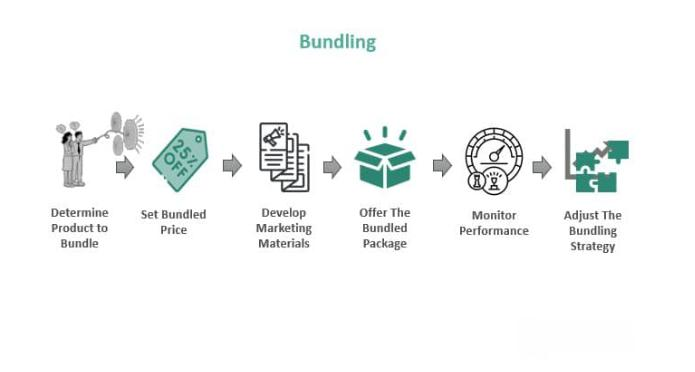

## Table of Contents

## What is Strategy Bundle 1 and why was it updated in 2022?

Strategy Bundle 1 is a set of guidelines and tools that help companies plan and make decisions. It includes different methods and ideas that businesses can use to set goals, analyze their situation, and choose the best ways to reach their targets. This bundle is important because it helps companies stay organized and focused on what they need to do to succeed.

In 2022, Strategy Bundle 1 was updated to keep up with changes in the business world. The update included new tools and methods that reflect current trends and technologies. This was done to make sure that the bundle remains useful and effective for companies dealing with modern challenges and opportunities.

## How does the inclusion of charts and metrics enhance Strategy Bundle 1?

Adding charts and metrics to Strategy Bundle 1 makes it easier for businesses to understand their progress and performance. Charts help show information in a visual way, which can make complex data simpler to grasp. For example, a bar chart can quickly show how different parts of a business are doing compared to each other. This helps leaders see at a glance where they need to focus their efforts.

Metrics give numbers that track how well a business is doing towards its goals. They are important because they provide clear, measurable targets that everyone in the company can work towards. When metrics are included in Strategy Bundle 1, it helps businesses make decisions based on real data, not just guesses. This can lead to better planning and more successful outcomes.

## What are the key components of Strategy Bundle 1?

Strategy Bundle 1 has several important parts that help businesses plan and make decisions. One key part is the goal-setting tools, which help companies decide what they want to achieve. Another part is the analysis tools, which let businesses look at their current situation and understand their strengths and weaknesses. These tools help companies see where they stand and what they need to work on.

Another important component is the decision-making frameworks, which guide businesses on how to choose the best ways to reach their goals. These frameworks include different methods that help companies weigh their options and make smart choices. Strategy Bundle 1 also includes action plans, which are step-by-step guides on how to put the chosen strategies into action. These plans help keep everyone on track and moving towards the same goals.

## Can you explain the basic metrics used in Strategy Bundle 1?

The basic metrics in Strategy Bundle 1 help businesses keep track of how well they are doing. Some of the main metrics include sales numbers, which show how much money a business is making from selling its products or services. Another important metric is customer satisfaction, which measures how happy customers are with what the business offers. This can be found out through surveys or feedback. Profit margins are also key, as they show how much money the business keeps after paying for costs like making the product or running the business.

Another set of metrics in Strategy Bundle 1 focuses on efficiency and growth. One such metric is employee productivity, which looks at how much work employees are getting done. This can help a business see if it needs to train its workers or change how work is done. Market share is another important metric, as it shows how much of the market a business controls compared to its competitors. Finally, growth rate is a metric that tracks how fast the business is growing, which can help leaders plan for the future and set realistic goals.

## How can beginners start using Strategy Bundle 1 effectively?

For beginners, the first step to using Strategy Bundle 1 effectively is to understand its main parts. Start by looking at the goal-setting tools. These help you decide what you want your business to achieve. Then, use the analysis tools to see where your business is now. This means looking at what your business does well and what it needs to work on. It's like taking a health check-up for your business.

Once you know your goals and where you stand, use the decision-making frameworks in Strategy Bundle 1. These will help you choose the best ways to reach your goals. Think of these frameworks as maps that guide you on your journey. After making your choices, create an action plan. This is a step-by-step guide on how to put your strategies into action. By following these steps, beginners can start using Strategy Bundle 1 to make their business better and reach their goals.

## What are some intermediate strategies for optimizing the use of Strategy Bundle 1?

Once beginners get comfortable with the basics of Strategy Bundle 1, they can move on to more advanced ways to use it. One way is to start connecting different parts of the bundle. For example, after setting goals with the goal-setting tools, use the analysis tools to keep checking how close you are to reaching those goals. This helps you see if you need to change your plans. Another intermediate strategy is to mix different decision-making frameworks to find the best solution for your business. This means trying out different methods and seeing which one works best for your situation.

Another important step for intermediate users is to use the metrics in Strategy Bundle 1 more deeply. Instead of just looking at the numbers, try to understand what they mean for your business. For example, if your sales numbers are going up, think about why that's happening and how you can keep it going. Also, start comparing your metrics with industry standards. This can show you how well you're doing compared to other businesses. By doing these things, you can get more out of Strategy Bundle 1 and make smarter decisions for your business.

## How do the new charts in Strategy Bundle 1 help in decision-making?

The new charts in Strategy Bundle 1 make decision-making easier by showing information in a clear and simple way. When you look at a chart, you can quickly see trends and patterns that might be hard to spot in a list of numbers. For example, a line chart can show how your sales are growing over time. This helps you see if your business is doing well or if you need to change your plan.

Charts also help you compare different parts of your business. A bar chart can show how different products or teams are doing compared to each other. This makes it easy to see where you should focus your efforts. By using these charts, you can make better decisions because you understand your business better.

## What advanced metrics are included in the 2022 update of Strategy Bundle 1?

The 2022 update of Strategy Bundle 1 brought in new advanced metrics to help businesses make even better decisions. One of these is the Customer Lifetime Value (CLV), which shows how much money a customer will likely spend with your business over time. This helps you see which customers are the most valuable and how to keep them happy. Another new metric is the Net Promoter Score (NPS), which measures how likely your customers are to recommend your business to others. This can show you how happy your customers are and if they are likely to help your business grow by spreading the word.

The update also includes Return on Investment (ROI) for different strategies, which tells you how much money you make back from what you spend on each plan. This helps you decide which strategies are worth continuing and which ones need to be changed. Additionally, there's a new metric called Employee Engagement Score, which measures how involved and happy your workers are. High engagement can lead to better work and more success for your business. These advanced metrics give you a deeper understanding of your business and help you make smarter choices.

## How can experts leverage the full potential of Strategy Bundle 1's updated features?

Experts can get the most out of Strategy Bundle 1's new features by using them all together. They should start by setting clear goals with the updated goal-setting tools. Then, they can use the new analysis tools to keep checking how close they are to those goals. This helps them see if they need to change their plans. They should also mix different decision-making frameworks to find the best solutions for their business. By doing this, they can make smarter choices and keep their business moving in the right direction.

Another way experts can use the full potential of Strategy Bundle 1 is by looking at the new advanced metrics like Customer Lifetime Value, Net Promoter Score, and Return on Investment. These metrics give a deeper understanding of how well the business is doing. Experts can use these numbers to see which customers are the most important, how happy customers are, and which strategies are working best. By paying attention to these metrics, experts can make decisions based on real data and keep improving their business.

## What are the best practices for integrating Strategy Bundle 1 into existing systems?

The best way to add Strategy Bundle 1 to your current systems is to start by understanding what your business already uses. Look at your current tools and see where Strategy Bundle 1 can fit in. You might need to change some parts of your existing systems to make room for the new tools. It's a good idea to talk to your team and get their thoughts on how to make the integration smooth. Make sure everyone knows how to use the new features and how they can help the business.

Once you've figured out how Strategy Bundle 1 can work with your current systems, start using it little by little. Begin with the parts that are most important for your business, like setting goals or analyzing data. As you get more comfortable, you can add more features. Keep checking how well the new tools are working and be ready to make changes if needed. By taking it slow and being open to adjustments, you can make sure Strategy Bundle 1 helps your business grow without causing too much disruption.

## How does Strategy Bundle 1 compare to other strategy bundles available in the market?

Strategy Bundle 1 is different from other strategy bundles because it has a lot of tools and methods that help businesses plan and make decisions. It's easy to use and has been updated to include new charts and metrics that show important information in a clear way. This makes it easier for businesses to see how they are doing and what they need to work on. Other bundles might not have as many tools or might not be as up-to-date with the latest trends and technology.

Another way Strategy Bundle 1 stands out is that it is designed to be used by everyone in the business, from beginners to experts. It has simple parts for people who are just starting out and more advanced features for those who know more about business planning. Some other strategy bundles might be too hard for beginners or not have enough advanced options for experts. Strategy Bundle 1 tries to be useful for everyone and helps businesses of all sizes and types reach their goals.

## What future updates can we expect for Strategy Bundle 1 beyond 2022?

Looking ahead, Strategy Bundle 1 will keep getting better with new updates. These updates will likely include even more advanced tools and metrics to help businesses understand their data better. They might add new ways to see how well the business is doing with customers, like more detailed customer feedback tools. Also, they could add more ways to measure how well the business is doing with its money, like new financial metrics. These updates will help businesses stay on top of new trends and keep making smart decisions.

The team behind Strategy Bundle 1 will also work on making it easier to use with other systems that businesses already have. This means they will try to make it simpler to add Strategy Bundle 1 to the tools and software that a business is already using. They might also add new training and support to help everyone in the business use the bundle better. This way, no matter how big or small the business is, they can use Strategy Bundle 1 to plan and grow.

## What does the Kerala Lottery Chart of 2009 show as a historical snapshot?

The Kerala Lottery Chart of 2009 provides a fascinating lens through which statistical patterns and potential predictive trends may be analyzed. During this year, the lottery system conducted regular draws, encompassing several different lottery schemes such as the Win-Win, Sthree Sakthi, Akshaya, and Karunya among others. Each of these had distinct prize structures and frequency of draws, which contributed to a comprehensive overview of lottery outcomes throughout the year.

### Key Features of the 2009 Kerala Lottery Chart

The 2009 Kerala Lottery Chart can be characterized by several critical elements. Each lottery draw in 2009 consisted of a random selection of numbers, with the winning numbers published systematically. Patterns emerge when observing the frequency distribution of winning numbers across the different lotteries within a year. This includes the recurrence rate of particular numbers and the clustering of winning numbers over specific periods.

For instance, an analysis might show that a specific number or combination of numbers appears with a certain regularity throughout the year. Such observations can lead to the identification of potential biases in number selection or generation during draws, although these would need empirical validation. The historical data tabulated over these draws provide a base for calculating probabilities or for modeling frequency distributions.

### Identifying Patterns and Trends

The recognition of patterns in lottery charts involves mathematical and statistical tools. Analysts can employ methods like frequency analysis to scrutinize the repetition of numbers. For example, if a number 'n' appears 'x' times in 'y' draws, the probability P(n) could be calculated as:

$$
P(n) = \frac{x}{y}
$$

Moreover, more complex analyzes might involve the use of statistical tests or pattern recognition algorithms to discern trends within series of draws. By applying time-series analysis, it is possible to model the data for cyclical patterns which might suggest non-random influences.

### Reliability for Predictive Analytics

The reliability of the 2009 Kerala Lottery data for predictive purposes bears scrutiny. Lotteries are inherently designed to be random, and thus, past results do not significantly influence future outcomes. The law of large numbers implies that over numerous draws, the distribution of results should even out, meaning individual predictions would likely be inconsistent.

In predictive analytics, employing such data sets is challenging due to their stochastic nature. While patterns and trends can be observed retrospectively, these do not necessarily confer predictive power due to the random independence of each draw. Thus, while historical lottery data like the 2009 chart can be useful in statistical exploration or in understanding systems of chance, its direct applicability in predictive modeling for future lottery draws is limited and should be approached with caution. Compliance with randomness is vital, and interpreting these results requires an acknowledgment of the principles of probability and [statistics](/wiki/bayesian-statistics) that underscore the concept of randomness.

## References & Further Reading

[1]: Bergstra, J., Bardenet, R., Bengio, Y., & Kégl, B. (2011). ["Algorithms for Hyper-Parameter Optimization."](https://proceedings.neurips.cc/paper/2011/file/86e8f7ab32cfd12577bc2619bc635690-Paper.pdf) Advances in Neural Information Processing Systems 24.

[2]: ["Advances in Financial Machine Learning"](https://www.amazon.com/Advances-Financial-Machine-Learning-Marcos/dp/1119482089) by Marcos Lopez de Prado

[3]: ["Evidence-Based Technical Analysis: Applying the Scientific Method and Statistical Inference to Trading Signals"](https://www.amazon.com/Evidence-Based-Technical-Analysis-Scientific-Statistical/dp/0470008741) by David Aronson

[4]: ["Machine Learning for Algorithmic Trading"](https://github.com/stefan-jansen/machine-learning-for-trading) by Stefan Jansen

[5]: ["Quantitative Trading: How to Build Your Own Algorithmic Trading Business"](https://books.google.com/books/about/Quantitative_Trading.html?id=j70yEAAAQBAJ) by Ernest P. Chan