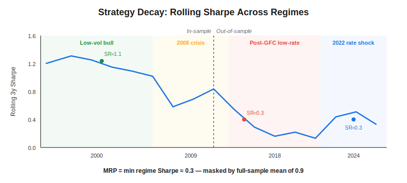
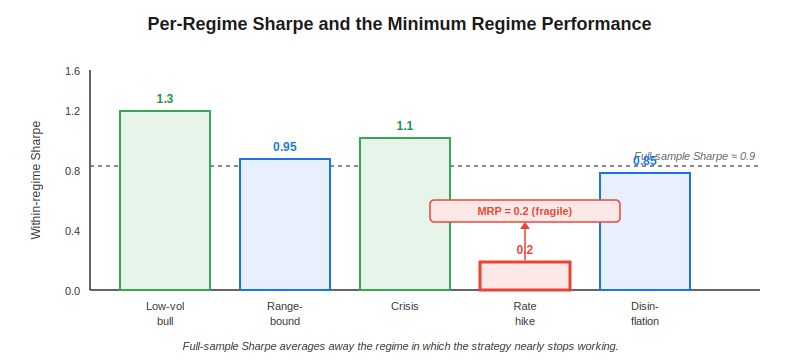
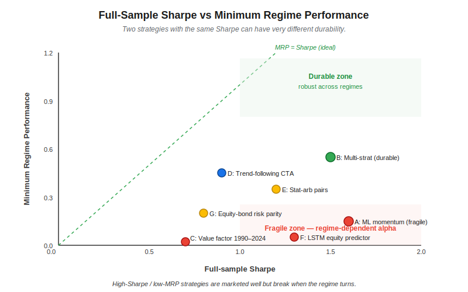

**Strategy decay risk** is the progressive erosion of a systematic strategy's edge as market regimes change. It is invisible to headline Sharpe ratios and standard drawdown statistics, yet it is the single most common reason live systematic strategies underperform their backtests. Minimum regime performance (MRP) is a recent framework proposed by Ricaud (2026) that quantifies this fragility directly: instead of averaging performance across the full sample, MRP reports the worst risk-adjusted return observed across distinct historical regimes. For algo traders deploying machine learning or factor strategies, MRP is closer to what actually goes wrong in production than any volatility-based metric.

## Table of Contents

## What Is Strategy Decay Risk?

Strategy decay risk is the tendency of a backtested edge to shrink — or vanish — because the data-generating process has moved away from the conditions the strategy was built on. Classic examples include the post-2008 collapse of cross-sectional equity momentum in the United States (average Sharpe falling from roughly 0.8 in 1990–2008 to below 0.3 in 2009–2020), the 2018–2020 value-factor drawdown of roughly 40%, and the near-universal 2022 underperformance of equity-bond risk parity once the stock-bond correlation flipped positive.

The mechanism is not overfitting in the narrow statistical sense. A strategy can be out-of-sample-validated, cross-validated with [purged k-fold](https://paperswithbacktest.com/wiki/combinatorial-purged-cross-validation-cpcv), and still decay — because the validation window itself belonged to a regime that has since ended. [Backtesting pitfalls](https://paperswithbacktest.com/wiki/backtesting-pitfalls-overfitting) catalog sample-specific bias; decay risk is the complementary problem of regime-specific bias. The [deflated Sharpe ratio](https://paperswithbacktest.com/wiki/deflated-sharpe-ratio) corrects for multiple testing. Neither adjustment answers the question MRP asks: *how did this strategy behave in the worst environment it has ever faced?*

## How Minimum Regime Performance Works

MRP requires three ingredients: a strategy return series, a regime partition, and a risk-adjusted performance metric. The regime partition splits history into $K$ non-overlapping periods that represent meaningfully different market conditions — for example, low-volatility bull, high-volatility bear, disinflation, stagflation, rate-hiking, rate-cutting. Any clustering method that produces interpretable labels can be used, including hidden Markov models, volatility regimes, and macro-state tagging.

Given regimes $\mathcal{R} = \{r_1, \dots, r_K\}$ and a performance functional $\text{SR}$ (typically the Sharpe ratio), MRP is simply

$$\text{MRP}(s) = \min_{k \in \{1, \dots, K\}} \text{SR}\!\left(s \mid r_k\right)$$

where $\text{SR}(s \mid r_k)$ is the within-regime Sharpe of strategy $s$ over regime $r_k$. Variants replace $\min$ with the 10th-percentile or 25th-percentile regime performance to avoid being dominated by a single pathological period. Sortino, Calmar, or return-over-max-drawdown can be substituted for Sharpe to emphasise downside behaviour.

The key modelling choice is the regime partition. Too few regimes (e.g. just "bull" and "bear") collapse interesting structure; too many (e.g. 20 monthly regimes) make each segment too short for a stable Sharpe estimate. A practical rule of thumb is 4–8 regimes over 15–25 years, each containing at least 250 trading days so that annualised Sharpe standard errors stay below roughly 0.4.

## MRP vs Sharpe, Drawdown, and Traditional Risk Measures

Full-sample Sharpe ratio, maximum drawdown, and annualised volatility can all look attractive for a strategy whose edge depends on a single regime. A momentum book that earned a Sharpe of 1.2 between 1995 and 2008 and roughly 0.1 afterwards will show a full-sample Sharpe near 0.7 — respectable — while its MRP in the post-2008 regime is close to zero.

| Metric | Captures | Blind spot | Best for |
|---|---|---|---|
| Sharpe ratio | Long-run risk-adjusted return | Regime-specific edge dilution | Marketing backtests |
| Max drawdown | Worst peak-to-trough loss | Recovery-speed, regime-conditional losses | Capital sizing |
| [Probabilistic Sharpe](https://paperswithbacktest.com/wiki/probabilistic-sharpe-ratio-psr) | Sampling uncertainty of Sharpe | Non-stationarity across regimes | Sample-size adequacy |
| Deflated Sharpe | Multiple-testing inflation | Regime changes post-selection | Strategy selection |
| **MRP** | **Worst-regime risk-adjusted return** | **Requires regime labels** | **Durability screening** |

Two strategies with identical full-sample Sharpe of 1.0 can have very different MRPs. Strategy A's Sharpe of 1.0 comes from averaging a 0.9 low-vol-regime result with a 1.1 high-vol-regime result — MRP is 0.9. Strategy B averages 1.8 and 0.2 across the same regimes — MRP is 0.2. The second strategy is twice as likely to be dead the day the regime changes. Full-sample statistics cannot distinguish them.

## Why Machine Learning Strategies Decay Faster

Decay is a particularly acute concern for ML-based quant strategies. Three mechanisms drive this.

First, neural networks and gradient-boosted trees latch on to high-capacity patterns that are specific to the training regime's volatility structure, liquidity profile, and cross-sectional dispersion. When any of those change, the learned representation becomes mismatched, not just miscalibrated. Studies of LSTM-based equity prediction have documented a roughly 40–60% Sharpe degradation when the test period includes a volatility regime absent from training.

Second, ML feature pipelines are often calibrated in-sample — winsorisation thresholds, neutralisation buckets, and target normalisations all embed assumptions about the return distribution. In a new regime, those preprocessing parameters stop matching live data, and the effect compounds through the model.

Third, the hyperparameter search used to build the model is itself an implicit selection for the training regime. Even with [walk-forward optimisation](https://paperswithbacktest.com/wiki/walk-forward-optimization), if every walk lies within a single macro regime, the chosen hyperparameters inherit that regime's bias. This is why ML strategies trained exclusively on 2010–2021 data — a low-volatility, low-rate environment — performed so poorly in 2022.

MRP addresses this by forcing a direct confrontation with regime-conditional performance. A strategy whose MRP collapses in the 2022 regime is flagged before a similar environment returns. Combining MRP with [ensemble methods](https://paperswithbacktest.com/wiki/ensemble-methods-trading) — training separate models per regime and dynamically routing — is one practical response to low-MRP diagnostics.

## Practical Considerations in Algo Trading

Deploying MRP in a live research workflow requires several pragmatic decisions.

Regime definition should come from outside the strategy's own signal. Using realised-volatility quintiles is a safe default. Using regime labels produced by the same model family that built the strategy risks circularity — the regime detector and the strategy will share blind spots.

Minimum sample size per regime matters. A regime with fewer than 125 observations (roughly six calendar months of daily data) yields Sharpe estimates whose 95% confidence interval can span plus or minus 0.8. Combine such short regimes into larger clusters, or exclude them from the MRP computation explicitly.

MRP is a *screening* tool, not a sizing tool. A strategy with an MRP of 0.1 is not necessarily un-tradable — it may be perfectly acceptable as a 5% portfolio sleeve inside a diversified book. What MRP should drive is the decision to retire, re-train, or down-weight a strategy whose worst-regime behaviour no longer meets the risk budget.

Realistic expectations for MRP on credible systematic strategies: a long-only US equity momentum book from 1990–2024 partitioned into four regimes has an MRP of roughly 0.1–0.2 Sharpe; a well-diversified multi-strategy [systematic trading](https://paperswithbacktest.com/wiki/systematic-trading-strategies) book targeting Sharpe 1.5 at the portfolio level typically shows an MRP of 0.4–0.6. Reaching MRP above 0.8 almost always indicates insufficient regime coverage in the data rather than a genuinely robust strategy.

Finally, MRP interacts with capacity constraints. A strategy that retains a positive edge in the worst regime often does so because it is capacity-limited to a slice of the market where anomalies persist. Scaling such a strategy can destroy the very robustness MRP was meant to measure.

## Conclusion

Minimum regime performance is a simple reframing of a problem every systematic trader already knows: backtests lie when regimes change. By collapsing a full-history performance record into its worst-regime slice, MRP makes strategy fragility legible in a single number, complementing rather than replacing Sharpe, drawdown, and deflated Sharpe. As ML-heavy quant stacks proliferate, expect MRP or close variants to become a standard acceptance gate alongside [regime detection](https://paperswithbacktest.com/wiki/regime-detection-financial-markets) and out-of-sample validation in live risk frameworks.

## References & Further Reading

[1]: [Measuring Strategy-Decay Risk: Minimum Regime Performance and the Durability of Systematic Investing (arXiv 2604.08356)](https://arxiv.org/abs/2604.08356)
[2]: [The Deflated Sharpe Ratio — Bailey & López de Prado (SSRN)](https://papers.ssrn.com/sol3/papers.cfm?abstract_id=2460551)
[3]: [A Data Science Solution to the Multiple-Testing Crisis in Financial Research — López de Prado (2019)](https://papers.ssrn.com/sol3/papers.cfm?abstract_id=3469964)
[4]: [Regime Shifts: Implications for Dynamic Strategies — Kritzman, Page & Turkington (2012)](https://www.cfainstitute.org/en/research/financial-analysts-journal/2012/regime-shifts-implications-for-dynamic-strategies)
[5]: [Factor Investing: Zoo or Zoo-keeper? — Harvey & Liu (2019)](https://papers.ssrn.com/sol3/papers.cfm?abstract_id=3341728)
