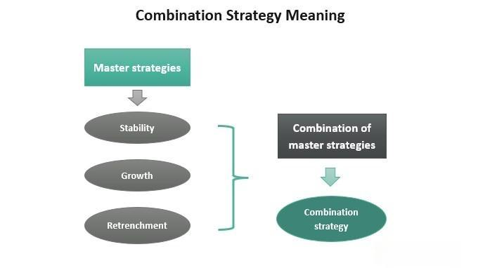

## Table of Contents

## What is strategy refinement and why is it important?

Strategy refinement is the process of making a plan better by looking at it closely and making changes. It's like when you draw a picture and then go back to fix the parts that don't look right. In business or in life, you start with a basic plan, and then you keep working on it to make it work better. You might find new information or see that some parts of your plan aren't working as well as you thought they would. So, you adjust your plan to make it stronger and more likely to succeed.

It's important because things change all the time. What worked yesterday might not work today. By refining your strategy, you can stay ahead of changes and keep moving towards your goals. It helps you use your time and resources better, and it can help you avoid big problems. When you keep refining your strategy, you're more likely to reach your goals because you're always trying to do things in the best way possible.

## What are the basic steps involved in refining a strategy?

Refining a strategy starts with looking at what you're doing now. You need to check if your current plan is working the way you want it to. This means looking at the results you're getting and seeing if they match what you hoped for. If things aren't going well, you need to figure out why. Maybe you didn't think about something important, or maybe something changed that you didn't expect. This step is all about understanding where you stand and what's not working.

Once you know what's wrong, you can start making changes. This is where you come up with new ideas or tweak the old ones to make them better. You might need to try different things to see what works best. It's important to be open to new ways of doing things and not be afraid to change your plan. After you make your changes, you need to keep an eye on how they're working. This means going back to the first step and checking again to see if your new plan is better. Refining a strategy is a cycle of checking, changing, and checking again to keep improving.

## How can a beginner start with strategy refinement?

If you're new to strategy refinement, start by writing down your current plan. Think about what you want to achieve and how you're trying to do it. Then, look at what's happening. Are you getting closer to your goal? If not, try to figure out why. Maybe you need more information or maybe something isn't working the way you thought it would. Don't worry if you don't get it right the first time. It's normal to make mistakes and learn from them.

Next, think about how you can make your plan better. You might need to change a little bit of it or a lot. Try out your new ideas and see if they help. It's okay to experiment and see what works best. Keep checking your progress and be ready to make more changes if you need to. Remember, refining a strategy is about trying, learning, and trying again until you find what works best for you.

## What common mistakes should be avoided during strategy refinement?

One common mistake during strategy refinement is not being open to change. Sometimes people get too attached to their original plan and don't want to change it, even when it's clear that it's not working. It's important to stay flexible and be willing to try new things. If you're not open to change, you might miss out on better ways to reach your goals.

Another mistake is not checking the results often enough. You need to keep an eye on how your plan is working and make sure you're moving in the right direction. If you wait too long to check, you might waste time and resources on something that isn't helping you. Regularly looking at your progress helps you catch problems early and fix them before they get bigger.

Lastly, some people forget to get feedback from others. It's helpful to ask for opinions from people who know about your goals or who have experience in the area you're working in. They might see things you missed or have ideas that can make your plan better. Not asking for help can make it harder to refine your strategy effectively.

## How does data analysis contribute to strategy refinement?

Data analysis is really important for refining a strategy because it helps you understand what's working and what's not. When you collect and look at data, you can see patterns and trends that show you where you're doing well and where you need to make changes. For example, if you're running a business, data can tell you which products are selling the most and which ones aren't. This information helps you decide where to focus your efforts and how to adjust your plan to meet your goals better.

By using data analysis, you can also make your decisions based on facts instead of guesses. This makes your strategy stronger and more likely to succeed. For instance, if you see from the data that customers are unhappy with a certain part of your service, you can fix that part to make them happier. Regularly looking at data helps you keep improving your plan and stay on track towards reaching your goals.

## What role does feedback play in refining strategies?

Feedback is super important when you're trying to make your strategy better. It's like having a friend who tells you what's working and what's not. When you get feedback from people who use your product or service, or from people who know a lot about what you're doing, you learn things you might not see on your own. They can tell you if something is confusing or if there's a better way to do things. Listening to feedback helps you understand what needs to change so you can make your plan stronger.

Using feedback well means you have to be open to hearing what people say, even if it's not what you want to hear. It's not just about fixing problems, but also about finding new ideas that can make your strategy even better. When you take feedback seriously and use it to make changes, you show that you care about doing things the best way possible. This can make people trust you more and help you reach your goals faster.

## How can intermediate strategists use scenario planning in strategy refinement?

Intermediate strategists can use scenario planning to think about different ways the future might go and how their strategy might need to change. They start by imagining different scenarios, like what if the economy gets worse, or what if a new competitor comes into the market. By thinking about these different possibilities, they can see how their current plan might work or not work in each case. This helps them prepare for different situations and make their strategy more flexible.

Once they have these scenarios, intermediate strategists can test their strategy against each one. They ask, "What would happen if this scenario came true? What parts of our plan would need to change?" By doing this, they can find weak spots in their strategy and fix them before they become big problems. Scenario planning helps them be ready for surprises and keep their strategy strong no matter what happens.

## What advanced tools and techniques can be used for strategy refinement?

Advanced strategists can use tools like simulation software to test their strategies in a safe, virtual environment. This software lets them create models of their business or project and see how different choices might play out. It's like playing a video game where you can try different moves and see the results without real-world risks. By using simulations, strategists can find the best path forward and make their plan stronger. They can also use big data analytics to look at huge amounts of information and find patterns that they might miss otherwise. This helps them make decisions based on solid evidence and adjust their strategy to be more effective.

Another powerful technique is using [artificial intelligence](/wiki/ai-artificial-intelligence) (AI) and [machine learning](/wiki/machine-learning). These technologies can analyze data much faster than humans and find insights that might be hard to see. AI can help predict what might happen in the future and suggest changes to the strategy based on those predictions. For example, AI can look at customer behavior and suggest new ways to reach them or improve products. By using AI, strategists can keep their plans up-to-date and responsive to changes in the market or environment.

## How do expert strategists incorporate risk management into strategy refinement?

Expert strategists know that risk management is key to refining their strategy. They start by figuring out what risks could mess up their plans. These could be things like losing money, not meeting goals, or facing new competition. Once they know what the risks are, they think about how likely each one is to happen and how bad it would be if it did. This helps them decide which risks to focus on and what to do about them. They might decide to avoid some risks, reduce others, or even take on some risks if they think the reward is worth it.

After figuring out the risks, expert strategists build risk management right into their strategy. They make plans for what to do if a risk becomes a problem. This might mean setting aside money to deal with unexpected costs, or having backup plans ready to go. They also keep an eye on risks all the time, updating their strategy as things change. By thinking about risks from the start and planning for them, expert strategists make their strategies stronger and more likely to succeed, even when things don't go as planned.

## What are the best practices for continuous strategy refinement in a dynamic environment?

In a world where things change all the time, the best way to keep your strategy strong is to always be looking and listening. This means you should keep checking how well your plan is working and be ready to change it if you need to. You can do this by gathering information all the time, like looking at data, asking people for feedback, and keeping up with what's happening around you. When you see something new or different, think about how it might affect your plan and be ready to adjust. It's important to stay flexible and not get too stuck on one way of doing things.

Another important thing is to keep everyone involved in the process. This means talking to your team, your customers, and anyone else who cares about your goals. They can give you new ideas and help you see things you might miss. By working together and sharing information, you can make better decisions and keep your strategy moving in the right direction. Remember, refining your strategy is not something you do once and then forget about it. It's a journey where you keep learning and improving as you go along.

## How can organizations align strategy refinement with their overall business goals?

To align strategy refinement with overall business goals, organizations need to make sure that every change they make to their strategy helps them get closer to what they want to achieve. They should start by clearly defining their business goals and making sure everyone knows what they are. Then, when they're refining their strategy, they should always ask if the changes they're thinking about will help them reach those goals. For example, if a business goal is to increase customer satisfaction, any changes to the strategy should focus on improving the customer experience. This way, the strategy stays in line with what the business is trying to do.

It's also important for organizations to keep checking how their strategy is working and if it's still aligned with their goals. They can do this by regularly looking at data and getting feedback from customers and employees. If they see that the strategy isn't helping them reach their goals, they need to make more changes. This might mean trying new things or going back to the drawing board. By keeping the strategy and the business goals connected, organizations can stay on track and make sure they're always moving towards what they want to achieve.

## What case studies demonstrate successful strategy refinement at an expert level?

One great example of expert strategy refinement is how Netflix changed from just mailing DVDs to streaming movies and TV shows online. At first, Netflix's goal was to make it easy for people to rent movies without going to a store. But when they saw that more people were using the internet, they started thinking about how they could use this to reach more customers. They began offering a streaming service, which let people watch movies and shows right away without waiting for a DVD to come in the mail. This big change helped Netflix grow a lot and become one of the biggest names in entertainment. They kept refining their strategy by making their own shows and movies, which helped them stand out from other streaming services.

Another example is how Apple turned around its business in the late 1990s. At that time, Apple was struggling and losing money. They brought back Steve Jobs, who helped them rethink their strategy. One big change was focusing on making products that were easy to use and looked good. They started with the iMac, a computer that was different from anything else out there. This helped Apple start making money again. Then, they kept refining their strategy by coming out with the iPod, iPhone, and iPad, which changed the way people listen to music, use phones, and work on the go. By always looking at what was working and what wasn't, and making smart changes, Apple became one of the most successful companies in the world.

## What is the Role of Backtesting in Strategy Refinement?

Backtesting is a fundamental aspect of refining strategies in [algorithmic trading](/wiki/algorithmic-trading). Through the process of [backtesting](/wiki/backtesting), traders can evaluate the viability and performance of a trading strategy by testing it against historical market data. This retrospective analysis allows traders to identify the strengths and weaknesses of their strategies, providing a clear understanding of how a particular algorithm would have performed in the past.

The process typically involves simulating trades using historical price data to calculate various performance metrics such as returns, [volatility](/wiki/volatility-trading-strategies), and drawdowns. These metrics offer insights into how the strategy performs under different market conditions. For instance, a trader might use key performance indicators like the Sharpe ratio, which measures the risk-adjusted return of an investment:

$$
\text{Sharpe Ratio} = \frac{E[R] - R_f}{\sigma_R}
$$

where $E[R]$ is the expected return of the strategy, $R_f$ is the risk-free rate, and $\sigma_R$ is the standard deviation of the excess return.

This empirical assessment is crucial for validating trading hypotheses and optimizing strategy parameters. By analyzing past performance, traders can tweak various elements of their algorithms, such as entry and [exit](/wiki/exit-strategy) signals, position sizing, and risk management rules, to enhance their effectiveness.

A robust backtesting framework ensures that any proposed improvements to an algorithmic strategy are grounded in data. This approach minimizes the reliance on intuition or guesswork, instead leveraging historic market behaviors to guide decision-making. Importantly, backtesting helps to prevent overfitting—a common problem where a model is excessively tailored to historical data, thus diminishing its applicability to future, unseen data.

Furthermore, backtesting is often accompanied by forward testing, also known as paper trading, where the strategy is tested in real-time without actual capital at risk. This step is essential to validate that the performance observed in backtests holds in live market conditions.

In summary, backtesting provides traders with a rigorous framework to refine and improve their algorithmic trading strategies. By ensuring that enhancements are supported by historical data, traders can develop more reliable and resilient algorithms poised for success in dynamic financial markets.

## References & Further Reading

[1]: Bergstra, J., Bardenet, R., Bengio, Y., & Kégl, B. (2011). ["Algorithms for Hyper-Parameter Optimization."](https://papers.nips.cc/paper/4443-algorithms-for-hyper-parameter-optimization) Advances in Neural Information Processing Systems 24.

[2]: ["Advances in Financial Machine Learning"](https://www.amazon.com/Advances-Financial-Machine-Learning-Marcos/dp/1119482089) by Marcos Lopez de Prado

[3]: ["Evidence-Based Technical Analysis: Applying the Scientific Method and Statistical Inference to Trading Signals"](https://www.amazon.com/Evidence-Based-Technical-Analysis-Scientific-Statistical/dp/0470008741) by David Aronson

[4]: ["Machine Learning for Algorithmic Trading"](https://github.com/stefan-jansen/machine-learning-for-trading) by Stefan Jansen

[5]: ["Quantitative Trading: How to Build Your Own Algorithmic Trading Business"](https://books.google.com/books/about/Quantitative_Trading.html?id=j70yEAAAQBAJ) by Ernest P. Chan