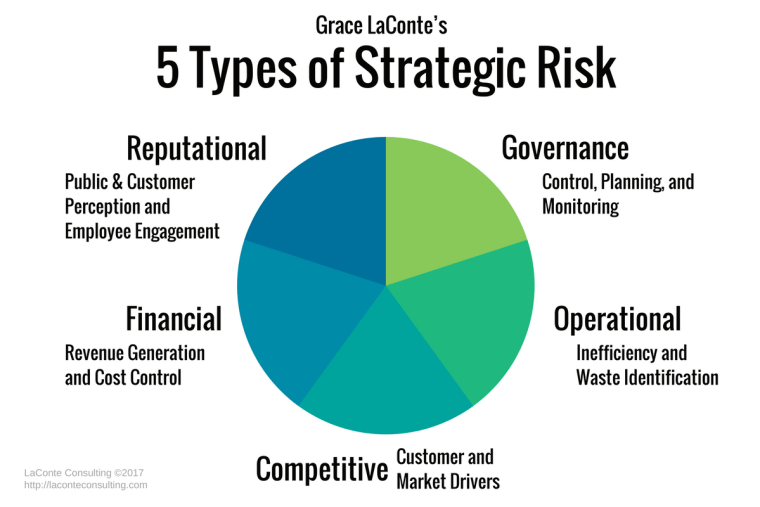

## Table of Contents

## What is strategy risk?

Strategy risk is the chance that the plans a company makes might not work out as expected. It happens when the goals and steps a company sets to reach those goals don't match up with what's actually happening in the market or with what the company can do. For example, if a company decides to focus on selling a new type of product but doesn't understand what customers want, they might not sell enough and lose money.

To manage strategy risk, companies need to keep an eye on changes in the market and be ready to change their plans if needed. This means they should always be learning about their customers and competitors, and be flexible with their strategies. By doing this, they can lower the chances of their plans failing and make sure they can keep up with or even stay ahead of the competition.

## Why is it important to consider strategy risk in business planning?

Considering strategy risk in business planning is important because it helps businesses prepare for things that might go wrong. When a company makes a plan, it's trying to guess what will happen in the future. But the future is hard to predict, and things can change quickly. By thinking about strategy risk, a business can see where its plans might fail and can come up with ways to avoid those problems before they happen.

Also, understanding strategy risk helps a company be more flexible. If a business knows what risks it might face, it can change its plans more easily when something unexpected happens. This means the business can keep moving forward even when things don't go as planned. It's like having a backup plan that helps the company stay strong and keep growing, no matter what challenges come up.

## What are the common types of strategy risks?

There are several common types of strategy risks that businesses face. One type is market risk, which happens when the market changes in ways the company didn't expect. For example, if a new competitor comes in and takes away customers, or if people start wanting different products, the company's plans might not work anymore. Another type is operational risk, which is when the company can't do what it planned because of problems inside the business, like not having enough workers or the right technology.

Another common strategy risk is financial risk, which is when the company's plans cost more money than expected or don't make as much money as hoped. This can happen if the costs of making a product go up, or if customers don't buy as much as the company thought they would. There's also regulatory risk, which is when new laws or rules change what the company can do. If a new law makes it harder to sell a product, the company's strategy might not work anymore.

Lastly, there's technology risk, which is when new technology changes the market or the way the company does business. If a new technology makes a company's product outdated, or if the company can't use new technology well, its plans might fail. Understanding these different types of strategy risks helps a business plan better and be ready for whatever might happen.

## How can strategy risk impact a company's performance?

Strategy risk can hurt a company's performance a lot. If a company doesn't think about the risks, its plans might not work out. For example, if a company makes a new product but doesn't know what customers want, it might not sell well. This can lead to less money coming in and more money going out, which can make the company lose money. If the company can't change its plans fast enough, it might even have to close down or lose its place in the market to other companies.

On the other hand, understanding strategy risk can help a company do better. If a company knows about the risks, it can make plans to avoid them. For example, if a company knows that a new law might change what it can do, it can start working on a different plan before the law comes into effect. This way, the company can keep making money and growing, even when things change. By being ready for risks, a company can stay strong and keep its customers happy.

## What are some basic tools and methods for assessing strategy risk?

One basic tool for assessing strategy risk is SWOT analysis. This tool helps a company look at its Strengths, Weaknesses, Opportunities, and Threats. By doing a SWOT analysis, a company can see what it's good at and what it needs to work on. It also helps the company spot chances to grow and dangers that might hurt its plans. This way, the company can make plans that use its strengths and fix its weaknesses, while also getting ready for any risks that might come up.

Another method is scenario planning. This means thinking about different things that could happen in the future and making plans for each one. For example, a company might think about what would happen if a new competitor came into the market, or if there was a big change in what customers want. By planning for different scenarios, the company can be ready to change its strategy if something unexpected happens. This helps the company keep moving forward no matter what challenges come up.

A third tool is risk matrices. A risk matrix is a simple chart that shows how likely different risks are to happen and how bad they would be if they did. By using a risk matrix, a company can see which risks are the biggest problems and need the most attention. This helps the company focus on the most important risks and make plans to deal with them. By using these tools, a company can better understand and manage strategy risks, making its plans more likely to succeed.

## How does strategy risk differ from operational risk?

Strategy risk and operational risk are two different kinds of risks that businesses face. Strategy risk is about the plans a company makes to reach its goals. It's the chance that these plans might not work out because of things like changes in the market, new competitors, or if the company doesn't understand what customers want. For example, if a company decides to sell a new product but people don't like it, that's a strategy risk. The focus is on whether the company's big plans and goals are the right ones for the future.

Operational risk, on the other hand, is about the day-to-day running of the business. It's the risk that the company can't do what it planned because of problems inside the business, like not having enough workers, the right technology, or if something goes wrong in the supply chain. For example, if a factory breaks down and the company can't make its products, that's an operational risk. The focus here is on the company's ability to [carry](/wiki/carry-trading) out its plans and keep things running smoothly every day.

## What are some real-world examples of strategy risk?

One real-world example of strategy risk is when Blockbuster failed to adapt to the rise of online streaming. Blockbuster was a company that rented out movies and games from stores. When Netflix started letting people watch movies online, Blockbuster didn't change its plans fast enough. They thought people would keep coming to their stores, but more and more people started using Netflix instead. Because Blockbuster didn't see this change coming and didn't change its strategy, it lost a lot of customers and eventually went out of business.

Another example is when Kodak didn't keep up with the shift to digital photography. Kodak was a big company that made film for cameras. They knew about digital cameras, but they thought people would always want to use film. They didn't change their plans to focus on digital technology. As digital cameras became more popular, Kodak lost a lot of its business. They didn't see the strategy risk of sticking with old technology, and it hurt them a lot. Eventually, they had to file for bankruptcy.

## How can a company mitigate strategy risk?

A company can mitigate strategy risk by always keeping an eye on what's happening in the market and being ready to change its plans. This means they need to understand what their customers want and what their competitors are doing. By doing regular research and talking to customers, a company can see if its plans are still good or if they need to change. If something unexpected happens, like a new law or a new competitor, the company can use this information to quickly adjust its strategy. This way, they can keep moving forward and avoid big problems.

Another way to mitigate strategy risk is by having a strong plan for different things that might happen in the future. This is called scenario planning. A company can think about different situations, like what would happen if the economy got worse or if a new technology came out. By making plans for these different situations, the company can be ready to change its strategy if one of them happens. This helps the company stay flexible and strong, no matter what challenges come up.

## What role does leadership play in managing strategy risk?

Leadership is really important when it comes to managing strategy risk. Leaders need to make sure the company's plans match what's happening in the market and what the company can do. They do this by always learning about customers and competitors. Good leaders also make sure everyone in the company knows about the risks and what to do if something goes wrong. They keep an eye on things and are ready to change plans if needed. This way, they can keep the company strong and moving forward.

Leaders also help by making plans for different things that might happen in the future. This is called scenario planning. They think about what could go wrong and make backup plans. This helps the company be ready for surprises. Good leaders also make sure the company can change quickly if something unexpected happens. By doing all these things, leaders can help the company avoid big problems and keep growing, even when things get tough.

## How can scenario planning be used to address strategy risk?

Scenario planning helps a company think about different things that might happen in the future. It's like making a few different plans, each one for a different situation. For example, a company might think about what would happen if a new law changed what they can do, or if a new competitor came into the market. By making plans for these different situations, the company can be ready to change its strategy if one of them happens. This way, they can keep moving forward and avoid big problems.

Using scenario planning also helps a company stay flexible. If something unexpected happens, the company can quickly switch to one of the plans they already thought about. This means they don't have to start from scratch when things change. By being ready for different situations, the company can keep its customers happy and keep growing, even when things get tough. Scenario planning is a smart way to manage strategy risk and keep the company strong.

## What advanced techniques are available for quantifying strategy risk?

One advanced technique for quantifying strategy risk is using Monte Carlo simulations. This technique uses computers to run lots of different versions of what might happen in the future. Each version changes a little bit, like how much customers might buy or how much it might cost to make a product. By looking at all these different versions, a company can see how likely it is that their plans will work out and how much money they might make or lose. This helps them understand the risks better and make smarter decisions.

Another technique is using decision trees. A decision tree is like a map that shows all the different choices a company might make and what could happen after each choice. It helps the company see how each decision could affect their plans and how risky each choice might be. By looking at the decision tree, the company can pick the best path to follow and be ready for any problems that might come up. This way, they can make plans that are more likely to succeed and avoid big risks.

## How can a company integrate strategy risk management into its overall corporate strategy?

A company can integrate strategy risk management into its overall corporate strategy by making it a key part of their planning process. This means the company should always be thinking about what could go wrong with their plans and what they can do to avoid those problems. They should use tools like SWOT analysis to look at their strengths, weaknesses, opportunities, and threats. They should also use scenario planning to think about different things that might happen in the future and make backup plans for each one. By doing this, the company can make sure their plans are strong and can handle whatever challenges come up.

Leaders play a big role in making sure strategy risk management is part of the corporate strategy. They need to keep everyone in the company aware of the risks and what to do if something unexpected happens. This means they should talk about risks often and make sure everyone knows the backup plans. Leaders should also use advanced tools like Monte Carlo simulations and decision trees to really understand how risky their plans are. By doing all these things, the company can manage strategy risk well and keep growing, even when things get tough.

## What are the common sources of strategy risk?

Common sources of strategy risk in [algorithmic trading](/wiki/algorithmic-trading) include overfitting, data snooping, and ignoring market changes. Each of these factors has the potential to undermine the effectiveness of trading algorithms and can result in substantial financial losses if not properly addressed.

**Overfitting** occurs when a trading algorithm is excessively optimized to reflect historical data patterns, causing it to perform well within the boundaries of the tested data set but poorly in live markets. This happens because the algorithm captures noise rather than the underlying market structure. Overfitting can be identified by examining an algorithm's performance across different, independent data sets, a process known as cross-validation. Mathematically, overfitting is likened to fitting a complex model to a limited set of sample data, resulting in a high variance in predictions when applied outside these data.

$$
\text{Model complexity leads to } \overbrace{\text{high variance}}^{\text{unpredictable results}}
$$

Implementing regular out-of-sample testing and setting constraints on model complexity, such as limiting the number of parameters, can help in reducing overfitting.

**Data snooping**, also referred to as look-ahead bias, involves repeatedly analyzing the same set of historical data to develop a strategy. Through this process, traders may inadvertently introduce bias by tailoring strategies to past data peculiarities that are unlikely to recur. Data snooping can be avoided by employing rigorous backtesting techniques on varied data sets and utilizing walk-forward analysis. This involves testing algorithms on sequential chunks of data, moving forward in time, to ensure performance is consistent over different periods.

**Ignoring market changes** is another risk factor where strategies fail to adapt to evolving market conditions. Markets are subject to various influences, ranging from regulatory changes to economic shifts or new technological developments, which can drastically alter trading dynamics. An algorithm that does not incorporate mechanisms for periodically reviewing and adjusting to these changes can quickly become obsolete. Traders should engage in regular updates and analysis of market conditions, ensuring that their strategies remain aligned with the current financial landscape.

By being aware of these sources of strategy risk and taking proactive measures to address them, traders can better protect their investments and improve the resilience of their algorithmic trading strategies.

## References & Further Reading

[1]: ["Algorithmic Trading: Winning Strategies and Their Rationale"](https://www.wiley.com/en-us/Algorithmic+Trading%3A+Winning+Strategies+and+Their+Rationale-p-9781118460146) by Ernest P. Chan

[2]: ["Advances in Financial Machine Learning"](https://www.amazon.com/Advances-Financial-Machine-Learning-Marcos/dp/1119482089) by Marcos Lopez de Prado

[3]: ["Quantitative Trading: How to Build Your Own Algorithmic Trading Business"](https://books.google.com/books/about/Quantitative_Trading.html?id=j70yEAAAQBAJ) by Ernest P. Chan

[4]: Lyon, A., Schumaker, R. P., & Chen, H. (2012). ["Financial News Prediction Using Support Vector Machines."](https://dl.acm.org/doi/10.1145/1462198.1462204) IEEE Intelligent Systems, 27(2), 18-25.

[5]: ["Evidence-Based Technical Analysis: Applying the Scientific Method and Statistical Inference to Trading Signals"](https://www.amazon.com/Evidence-Based-Technical-Analysis-Scientific-Statistical/dp/0470008741) by David Aronson