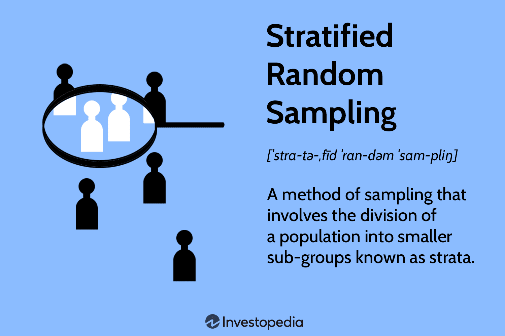

## Table of Contents

## What is stratified random sampling?

Stratified random sampling is a way of choosing a smaller group from a bigger group to study. It's like picking people for a team, but you make sure each type of person is included. First, you split the big group into smaller groups based on something they have in common, like age or where they live. These smaller groups are called strata. Then, you pick people randomly from each of these strata.

This method is useful because it makes sure that every important group is represented in your smaller study group. It's better than just picking people randomly from the whole big group because it can give you a more accurate picture of what's going on. For example, if you want to know about the health of people in a city, you might split them into groups by age and then pick people from each age group. This way, you won't miss out on important information from any age group.

## Why is stratified random sampling used in research?

Stratified random sampling is used in research because it helps make sure that the smaller group you study is a good match for the bigger group you're interested in. When you split the big group into smaller groups, or strata, based on something important like age or income, you can then pick people from each of these groups. This way, every important part of the big group gets a chance to be in your study. It's like making sure every color of candy is in your sample if you want to know about all the candies in the jar.

This method is really helpful because it can give you more accurate results. If you just picked people randomly from the whole big group, you might miss out on important information from some groups. For example, if you're studying how people vote and you only pick from one area of the city, you might not get the full picture. By using stratified random sampling, you make sure that all different kinds of people are included, which makes your study more reliable and useful.

## How does stratified random sampling differ from simple random sampling?

Stratified random sampling and simple random sampling are two ways to pick a smaller group from a bigger group for a study, but they do it differently. In simple random sampling, you pick people from the whole big group without any special rules. It's like [picking](/wiki/asset-class-picking) names out of a hat where everyone has an equal chance of being chosen. This method is easy and works well if the big group is pretty much the same all over.

Stratified random sampling, on the other hand, is used when the big group has different kinds of people that you want to make sure are included in your study. First, you split the big group into smaller groups, called strata, based on something important like age or where they live. Then, you pick people randomly from each of these smaller groups. This way, you make sure that every important part of the big group is represented in your smaller study group. It's like making sure you have a bit of every type of candy if you want to know about all the candies in the jar.

## What are the steps involved in conducting stratified random sampling?

To do stratified random sampling, you first need to split the big group into smaller groups called strata. You do this based on something important like age, income, or where people live. Think of it like sorting candies by color before you start picking them. Once you have your strata, you need to figure out how many people you want to pick from each one. This usually depends on how big each stratum is compared to the whole group. You want to make sure each stratum is represented fairly in your smaller study group.

After you've figured out how many people to pick from each stratum, you pick them randomly. This means everyone in each stratum has an equal chance of being chosen. It's like drawing names out of a hat, but you do it for each smaller group. Once you've picked people from all the strata, you put them together to make your smaller study group. This way, you've made sure that every important part of the big group is included in your study, which can make your results more accurate and useful.

## How do you determine the appropriate number of strata for a study?

Deciding how many strata to use in a study depends on what you're trying to learn and how the big group is made up. You want to split the group into smaller parts that are important for your study. For example, if you're looking at how people vote and you think age and where they live matter, you might make strata for different age groups and different areas. The key is to choose strata that will help you get a clear picture of the whole group without making things too complicated.

You also need to think about how much work it will be to use more strata. Each new stratum means more work to pick people randomly from it. So, you want to find a balance. If you use too few strata, you might miss out on important details about the group. But if you use too many, it can be hard to manage and might not add much useful information. A good rule is to use enough strata to cover the main differences in the group, but not so many that it becomes too hard to handle.

## What are common methods for allocating sample sizes to different strata?

One common way to decide how many people to pick from each stratum is called proportional allocation. This means you pick the same share of people from each stratum as there are in the whole group. If one stratum is 20% of the big group, you pick 20% of your sample from that stratum. This method makes sure each part of the group is represented in the same way as in the big group.

Another method is called optimal allocation, which tries to make the best use of your resources. With this method, you might pick more people from strata that have more differences inside them. If one stratum has a lot of variety, you might pick more people from it to get a better picture of that part of the group. This can help make your study more accurate, but it takes more planning to figure out which strata need more people.

Sometimes, you might use a mix of these methods or other ways to decide on sample sizes. It depends on what you're trying to learn and what resources you have. The important thing is to make sure your sample is a good match for the big group and gives you useful information.

## Can you explain the concept of proportional allocation in stratified sampling?

Proportional allocation in stratified sampling is a way to pick people from different groups so that each group is represented in the same way as in the big group. Imagine you have a big group of people and you split them into smaller groups, like age groups. If one age group makes up 30% of the big group, then you would pick 30% of your sample from that age group. This method makes sure that every part of the big group is included in your smaller study group in the right amounts.

Using proportional allocation helps make your study more accurate because it keeps the same balance as the big group. If you're studying how people in a city use public transport and you know that different age groups use it differently, you want to make sure your sample includes the right number of people from each age group. This way, your results will better reflect what's really happening in the whole city.

## What are the advantages of using stratified random sampling over other sampling methods?

Stratified random sampling is really good because it makes sure every important part of the big group is included in your smaller study group. When you split the big group into smaller groups based on something important, like age or where people live, and then pick people from each of these groups, you get a better picture of what's going on. This way, you won't miss out on important information from any group. For example, if you're studying how people in a city use public transport, you want to make sure you include people from all different areas of the city and all age groups. This helps make your results more accurate and useful.

Another advantage of stratified random sampling is that it can make your study more reliable. When you use this method, you're less likely to get results that are off because you've made sure to include all the different kinds of people in your study. It's better than just picking people randomly from the whole big group because it gives you a clearer picture of what's really happening. This can be really important if you're making decisions based on your study, like how to improve public transport or plan a new health program. By using stratified random sampling, you can trust your results more.

## What are the potential disadvantages or limitations of stratified random sampling?

One downside of stratified random sampling is that it can be more work to set up. You need to figure out how to split the big group into smaller groups, or strata, and then decide how many people to pick from each one. This can take more time and effort than just picking people randomly from the whole group. Also, if you don't know much about the big group, it can be hard to decide how to split it up in the right way.

Another limitation is that you need to know the right way to split the group into strata. If you pick the wrong things to split by, like age when income is more important, your study might not give you the best information. And if you use too many strata, it can make things too complicated and hard to manage. So, it's important to think carefully about how to split the group to make sure your study is useful and not too hard to do.

## How can stratified random sampling be applied in a real-world scenario, such as a health survey?

Imagine you're doing a health survey in a city to find out how many people have high blood pressure. You know that age and where people live can affect their health, so you decide to use stratified random sampling. First, you split the city's population into smaller groups, or strata, based on age and neighborhoods. You might have groups for people aged 20-39, 40-59, and 60+, and also groups for different parts of the city. Then, you figure out how many people to pick from each group so that your sample matches the city's population. If 30% of the city is aged 40-59, you make sure 30% of your sample is from that age group. You pick people randomly from each group, making sure every part of the city is included in your study.

Using stratified random sampling helps you get a good picture of high blood pressure across the whole city. If you just picked people randomly from the whole city without thinking about age or neighborhoods, you might miss important information. For example, older people might have more high blood pressure, and certain neighborhoods might have different health issues. By making sure you include people from all age groups and all parts of the city, your survey results will be more accurate and useful. You can use this information to plan better health programs that help everyone in the city.

## What statistical techniques are used to analyze data collected through stratified random sampling?

When you collect data using stratified random sampling, you can use different ways to look at the numbers and understand what they mean. One common way is to use something called weighted averages. This means you give more importance to the answers from groups that are bigger in your study. For example, if one age group is bigger in your sample, their answers will count more when you figure out the average. Another way is to use a method called analysis of variance (ANOVA), which helps you see if there are big differences between the groups you made, like different age groups or neighborhoods. This can show you if high blood pressure is more common in one group than another.

You can also use something called regression analysis to see how different things, like age or where people live, affect the thing you're studying, like high blood pressure. This helps you understand which factors are most important. Another useful technique is chi-square tests, which help you see if there's a link between two things, like if living in a certain neighborhood is related to having high blood pressure. All these methods help you make sense of the data you collected and give you a clear picture of what's going on in the whole group you studied.

## How can the accuracy of estimates be improved in stratified random sampling?

To make the estimates from stratified random sampling more accurate, it's important to make sure that each smaller group, or stratum, is a good match for the part of the big group it represents. You can do this by picking enough people from each stratum. The more people you pick, the more likely your results will be close to what's really happening in the big group. Another way to improve accuracy is to use proportional allocation, where you pick the same share of people from each stratum as there are in the big group. This keeps the balance right and helps make sure every part of the big group is included in your study.

It's also helpful to think carefully about how you split the big group into strata. You should use things that really matter for what you're studying, like age or where people live. If you pick the right things to split by, your study will give you better information. Sometimes, you might need to use a mix of different ways to decide how many people to pick from each stratum. By trying different methods and seeing which one works best, you can make your estimates more accurate and useful.

## What are the methods for exploring stratified sampling?

Stratified sampling is a statistical method utilized to enhance the representativeness of a sample by dividing an entire population into distinct subgroups known as 'strata' based on shared characteristics. This method is particularly useful in [algorithmic trading](/wiki/algorithmic-trading), where financial data often exhibit heterogeneity due to varying market sectors, asset classes, or trading volumes. By ensuring each stratum is sampled in proportion to its size within the overall population, stratified sampling aims to produce more consistent and accurate datasets for model training and [backtesting](/wiki/backtesting) in algorithmic trading strategies.

### Advantages in Financial Markets

Financial markets are characterized by a high degree of heterogeneity, with assets differing significantly in terms of [volatility](/wiki/volatility-trading-strategies), [liquidity](/wiki/liquidity-risk-premium), cap size, and sector classification. This complexity makes simple random sampling less effective for developing robust trading algorithms, as it might not adequately capture the diversity present in the market. Stratified sampling offers several advantages in this context:

1. **Enhanced Representativeness**: By accounting for the natural divisions within financial data, stratified sampling improves the representativeness of the sample. Each stratum contributes proportionately according to its prevalence, thus reducing the likelihood of bias that can skew trading models trained on non-representative data.

2. **Reduced Variance**: Stratified sampling can lead to lower variance in estimations compared to simple random sampling, which is particularly beneficial in financial markets where precise estimates are critical for risk management and strategy development. The formula for estimating the variance using stratified sampling is:
$$
   \text{Var}(X) = \sum_{h=1}^{H} \left( \frac{N_h}{N} \right)^2 \frac{\sigma_h^2}{n_h}

$$

   Where $N_h$ and $\sigma_h^2$ are the size and variance of each stratum, $N$ is the total population size, and $n_h$ is the sample size for each stratum.

3. **Improved Accuracy in Parameter Estimation**: Stratified sampling increases the accuracy of parameter estimates. This is crucial for the calibration of predictive models in trading algorithms where even minor parameter errors can lead to significant financial losses.

4. **Ensures Adequate Sample Size Among Key Segments**: In financial markets, certain segments or asset classes might be more crucial for specific trading strategies. Stratified sampling ensures these segments are adequately represented, enhancing the reliability of insights derived from the data.

Implementing stratified sampling in algorithmic trading requires identifying relevant strata within financial data, which may include market capitalization, historical volatility, or geographical region. The choice of these strata relies on the specific objectives and hypotheses of the trading strategy. By employing stratified sampling, traders can enhance the quality of their data inputs, leading to more reliable and effective trading strategies.

## References & Further Reading

[1]: Bergstra, J., Bardenet, R., Bengio, Y., & Kégl, B. (2011). ["Algorithms for Hyper-Parameter Optimization."](https://dl.acm.org/doi/10.5555/2986459.2986743) Advances in Neural Information Processing Systems 24.

[2]: ["Advances in Financial Machine Learning"](https://www.amazon.com/Advances-Financial-Machine-Learning-Marcos/dp/1119482089) by Marcos Lopez de Prado

[3]: ["Evidence-Based Technical Analysis: Applying the Scientific Method and Statistical Inference to Trading Signals"](https://www.amazon.com/Evidence-Based-Technical-Analysis-Scientific-Statistical/dp/0470008741) by David Aronson

[4]: ["Machine Learning for Algorithmic Trading"](https://github.com/PacktPublishing/Machine-Learning-for-Algorithmic-Trading-Second-Edition) by Stefan Jansen

[5]: ["Quantitative Trading: How to Build Your Own Algorithmic Trading Business"](https://books.google.com/books/about/Quantitative_Trading.html?id=j70yEAAAQBAJ) by Ernest P. Chan