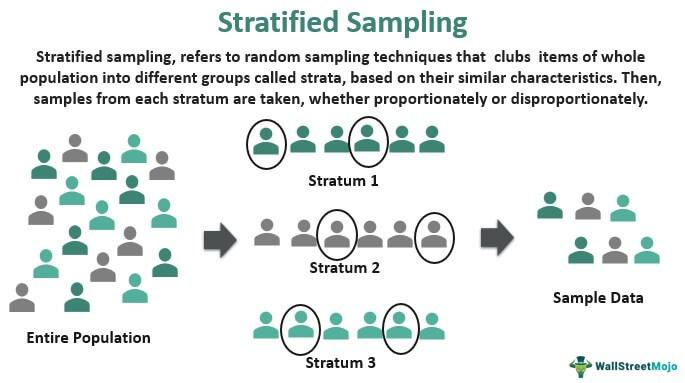

Algorithmic trading, often referred to as algo trading, is a method of executing orders using automated pre-programmed trading instructions. These instructions consider a variety of factors including timing, price, and volume, and are designed to make swift, effective trades to capitalize on opportunities in financial markets. The foundation of successful algorithmic trading lies in the data employed during the decision-making processes. Reliable and accurate data are essential to optimize trading algorithms and enhance their ability to make profitable trades.

At the core of effective data utilization in algo trading are sampling methods, which are crucial for maintaining data reliability and accuracy. Among these methods, stratified sampling and random sampling stand out due to their distinct applications in ensuring robust algorithmic models. Random sampling provides an unbiased representation of a dataset by giving every data point an equal probability of selection. This is vital for model training, particularly in dynamic market environments where biases are detrimental to the quality of predictive models.



Meanwhile, stratified sampling involves segmenting a population into distinct subgroups, or strata, and drawing samples from each subgroup. This technique is particularly advantageous for handling heterogeneous data, which is common in financial markets, as it ensures that the variability within each subgroup is captured correctly, thereby enhancing data consistency and accuracy across the board.

This article will explore both random and stratified sampling methods in-depth, focusing on their implementation and benefits in the field of algo trading. By understanding these sampling techniques, traders can select appropriate strategies that meet their specific trading objectives, reflect current market conditions, and align with the characteristics of their data.

## Table of Contents

## Understanding Random Sampling in Algo Trading

Random sampling is a fundamental technique in data sampling, characterized by the principle that every data point within a dataset has an equal probability of selection. This method is particularly valuable in algorithmic trading, where unbiased sample representation is critical for accurate model training and subsequent decision-making processes.

The cornerstone of random sampling lies in its ability to eliminate selection bias, thereby providing a representative snapshot of the entire dataset. This characteristic ensures that the trained models in algorithmic trading are not skewed by any underlying biases present within the dataset. Consequently, models designed using randomly sampled data have a higher likelihood of delivering consistent performance across diverse market conditions.

However, like any method, random sampling has its limitations, particularly in volatile market environments. One of the primary advantages of random sampling is its simplicity and ease of implementation. The randomness inherently provides a safeguard against the inadvertent inclusion of bias, leading to models that generally perform well under stable and moderately fluctuating market conditions.

Despite these advantages, random sampling may not always capture rare but critical events often observed in highly volatile markets. In such environments, random sampling can sometimes overlook outlier data points that could have significant implications for trading strategy performance. This oversight can result in models that are less resilient to extreme market movements. The failure to adequately address rare events can lead to misjudgments in risk assessment and subsequently affect trading outcomes adversely.

In practice, while implementing random sampling, algorithm developers often use programming languages such as Python, leveraging libraries like NumPy for efficient sample selection. A typical example of implementing random sampling in Python is shown below:

```python
import numpy as np

# Assume data is a numpy array of market data
sample_size = 100
random_sample = np.random.choice(data, size=sample_size, replace=False)
```

In conclusion, while random sampling offers advantages in terms of simplicity and the elimination of bias, its potential shortcomings in volatile market environments necessitate careful consideration. Traders and model developers might need to complement random sampling with other techniques or adjustments to ensure the robustness and reliability of their models in real-world trading scenarios.

## Exploring Stratified Sampling Methods

Stratified sampling is a statistical method utilized to enhance the representativeness of a sample by dividing an entire population into distinct subgroups known as 'strata' based on shared characteristics. This method is particularly useful in [algorithmic trading](/wiki/algorithmic-trading), where financial data often exhibit heterogeneity due to varying market sectors, asset classes, or trading volumes. By ensuring each stratum is sampled in proportion to its size within the overall population, stratified sampling aims to produce more consistent and accurate datasets for model training and [backtesting](/wiki/backtesting) in algorithmic trading strategies.

### Advantages in Financial Markets

Financial markets are characterized by a high degree of heterogeneity, with assets differing significantly in terms of [volatility](/wiki/volatility-trading-strategies), [liquidity](/wiki/liquidity-risk-premium), cap size, and sector classification. This complexity makes simple random sampling less effective for developing robust trading algorithms, as it might not adequately capture the diversity present in the market. Stratified sampling offers several advantages in this context:

1. **Enhanced Representativeness**: By accounting for the natural divisions within financial data, stratified sampling improves the representativeness of the sample. Each stratum contributes proportionately according to its prevalence, thus reducing the likelihood of bias that can skew trading models trained on non-representative data.

2. **Reduced Variance**: Stratified sampling can lead to lower variance in estimations compared to simple random sampling, which is particularly beneficial in financial markets where precise estimates are critical for risk management and strategy development. The formula for estimating the variance using stratified sampling is:
$$
   \text{Var}(X) = \sum_{h=1}^{H} \left( \frac{N_h}{N} \right)^2 \frac{\sigma_h^2}{n_h}

$$

   Where $N_h$ and $\sigma_h^2$ are the size and variance of each stratum, $N$ is the total population size, and $n_h$ is the sample size for each stratum.

3. **Improved Accuracy in Parameter Estimation**: Stratified sampling increases the accuracy of parameter estimates. This is crucial for the calibration of predictive models in trading algorithms where even minor parameter errors can lead to significant financial losses.

4. **Ensures Adequate Sample Size Among Key Segments**: In financial markets, certain segments or asset classes might be more crucial for specific trading strategies. Stratified sampling ensures these segments are adequately represented, enhancing the reliability of insights derived from the data.

Implementing stratified sampling in algorithmic trading requires identifying relevant strata within financial data, which may include market capitalization, historical volatility, or geographical region. The choice of these strata relies on the specific objectives and hypotheses of the trading strategy. By employing stratified sampling, traders can enhance the quality of their data inputs, leading to more reliable and effective trading strategies.

## Proportionate vs. Disproportionate Stratified Sampling

In proportionate stratified sampling, each stratum within a population is sampled in direct proportion to its size relative to the entire population. This method ensures that every subgroup is represented according to its actual prevalence, providing a sample that mirrors the demographic composition of the dataset. This can be particularly beneficial in algo trading, where maintaining fidelity to the market's overall structure is crucial for accurately modeling and predicting market behaviors.

Disproportionate stratified sampling, on the other hand, involves selecting different sample sizes from various strata based not on their population size but on specific research objectives or a focused market analysis. This method is advantageous when certain strata are deemed more important for the research outcome than others or when some strata are underrepresented or hold more significant insights for the trading strategy.

### Scenarios for Using Proportionate Stratified Sampling

1. **Market Representation:** When a trading strategy aims to reflect the dynamics of the entire market accurately, proportionate sampling is preferred. For example, if a trading model is being developed for the S&P 500 index, each sector could be sampled in proportion to its weight in the index.

2. **Risk Management:** By maintaining a balance that reflects the true structure of the market, traders can more effectively manage risks associated with over- or under-exposure to particular market segments.

### Scenarios for Using Disproportionate Stratified Sampling

1. **Focus on Volatile Markets:** In cases where certain market segments exhibit higher volatility or are more influential on the trading strategy, disproportionate sampling might be employed to allocate greater sampling resources to these critical segments.

2. **Advanced Research Needs:** When specific hypotheses concerning smaller or emerging market segments require testing, disproportionate sampling allows for more in-depth analysis of these segments. For instance, if a trading strategy focuses on emerging tech companies within the stock market, this method would prioritize data collection from these companies to drive deeper insights.

By choosing the appropriate stratified sampling approach, algorithmic trading strategies can be more accurately tailored to fit specific needs and objectives, enhancing decision-making processes and ultimately improving trade outcomes.

## Sampling Methods and Their Impact on Algo Trading

Sampling methods significantly affect model performance and decision-making in algorithmic trading, as they determine the quality and relevance of the data used for strategy development. A well-chosen sample can lead to more robust and accurate predictive models, enhancing trading execution and performance, while a poorly selected sample can result in inefficient strategies and increased financial risk.

In algorithmic trading, the primary goal is to leverage data-driven models to predict market movements and execute trades profitably. The choice of sampling method directly influences the reliability of the data fed into these models. Random sampling offers a uniform chance of selection for each data point, which helps in maintaining an unbiased dataset. However, in volatile market conditions, it might not always capture the essential patterns or rare events crucial for developing effective trading algorithms. Stratified sampling, on the other hand, provides a structured approach by dividing the data into homogenous subgroups. This ensures that each subgroup is adequately represented, making it particularly advantageous when dealing with heterogeneous financial data.

Poorly chosen samples can lead to inaccurate model predictions, skewed risk assessments, and suboptimal trading outcomes. For instance, if a sample does not accurately represent the volatility or [volume](/wiki/volume-trading-strategy) patterns of the market, the model may improperly estimate risk exposures, leading to potential financial losses. Additionally, overfitting is a common issue when the sampled data is not representative. The model may perform exceptionally well on the training data but fail in real-world trading scenarios.

Successful trading strategies have often employed strategic sampling methods to mitigate these risks. For example, quantitative strategies that trade based on market microstructures or statistical [arbitrage](/wiki/arbitrage) may benefit from disproportionate stratified sampling. This approach allows the model to focus on specific aspects of the data that are essential for identifying arbitrage opportunities.

In conclusion, effective sampling is crucial in algorithmic trading for building robust models that make reliable predictions. Choosing the right sampling technique involves understanding the trading objectives, market dynamics, and the nature of the available data. By doing so, traders can enhance model performance, improve decision-making accuracy, and ultimately achieve better trading outcomes.

## Conclusion

Effective sampling is key to robust and reliable algorithmic trading strategies. By selecting the most appropriate sampling method, traders can optimize their algorithms to adapt to various trading objectives and market conditions. Sampling plays a crucial role in determining the quality and representativeness of the data used to train models. A carefully chosen sample enhances model performance by providing a comprehensive view of market dynamics, which is critical for making informed trading decisions.

Random sampling, with its ability to provide an unbiased representation of data, is particularly valuable in environments where uniformity and impartiality are essential. However, its efficacy may diminish in volatile markets, where diverse data characteristics require more nuanced sampling approaches. Stratified sampling methods are especially useful in such contexts by allowing for meticulous attention to heterogeneity in data. This technique ensures that different segments of the market are proportionally represented, thereby maintaining data consistency and improving the reliability of trading models.

The choice between proportionate and disproportionate stratified sampling should align with specific research needs. Proportionate stratified sampling provides a balanced approach corresponding to the size of each stratum within the population. Conversely, disproportionate sampling emphasizes specific market segments, which can be advantageous when targeting niche opportunities or addressing particular market anomalies.

In summary, the integration of strategic sampling methods can significantly enhance trading performance and mitigate risks. By selecting the appropriate sampling technique, traders ensure that their algorithms are both adaptive and reliable, thus yielding more consistent and profitable outcomes. Implementing informed sampling decisions is not merely an operational task but a strategic endeavor that can dictate the efficacy of algorithmic trading frameworks.

## FAQs

### What are the primary benefits of using stratified sampling in algo trading?

Stratified sampling offers several advantages when applied to algorithmic trading. By dividing the population into distinct subgroups or strata, stratified sampling enables the selection of samples that accurately reflect the diversity of data present in financial markets. This method enhances statistical efficiency, as it reduces variance compared to simple random sampling, particularly when there are clear divisions within the data. For example, in financial markets where there are distinct sectors like technology, healthcare, and finance, stratified sampling ensures each sector is proportionally represented in the dataset, leading to more robust models. Additionally, improved data representation facilitates better risk assessments and decision-making processes by ensuring the diversity of trading behaviors and market conditions are captured accurately. 

### How does random sampling ensure unbiased results in financial data analysis?

Random sampling is fundamental in achieving unbiased results because each data point has an equal probability of being selected. This uniform probability minimizes selection bias, ensuring that the sample is a representative subset of the entire dataset. In the context of financial data analysis, this is critical as it allows for the development of models that can generalize well to unseen data. The unbiased nature of random sampling helps to prevent the skewing of data insights, which is vital in high-stakes environments like trading where decisions are made under uncertainty. By ensuring equal representation, random sampling aids in maintaining the integrity of predictive algorithms, enhancing their reliability in forecasting market movements.

### When is it appropriate to use disproportionate stratified sampling?

Disproportionate stratified sampling is most suitable when certain strata within the population are of particular interest or importance to the study aims. In algorithmic trading, this approach is appropriate when one needs to focus on specific market segments that may have a heightened impact on trading outcomes. For instance, if a trading strategy primarily targets emerging markets due to their volatility and potential for high returns, disproportionate sampling can allocate more samples to these strata while reducing the focus on more stable, mature markets. This allows for more granular analysis and better model performance in areas of specific interest by providing deeper insight into the dynamics of these targeted segments. Disproportionate stratified sampling can also be useful when there is an imbalance in sample sizes across strata, and the goal is to ensure each stratum is adequately analyzed despite size discrepancies.

## References & Further Reading

[1]: Bergstra, J., Bardenet, R., Bengio, Y., & Kégl, B. (2011). ["Algorithms for Hyper-Parameter Optimization."](https://dl.acm.org/doi/10.5555/2986459.2986743) Advances in Neural Information Processing Systems 24.

[2]: ["Advances in Financial Machine Learning"](https://www.amazon.com/Advances-Financial-Machine-Learning-Marcos/dp/1119482089) by Marcos Lopez de Prado

[3]: ["Evidence-Based Technical Analysis: Applying the Scientific Method and Statistical Inference to Trading Signals"](https://www.amazon.com/Evidence-Based-Technical-Analysis-Scientific-Statistical/dp/0470008741) by David Aronson

[4]: ["Machine Learning for Algorithmic Trading"](https://github.com/PacktPublishing/Machine-Learning-for-Algorithmic-Trading-Second-Edition) by Stefan Jansen

[5]: ["Quantitative Trading: How to Build Your Own Algorithmic Trading Business"](https://books.google.com/books/about/Quantitative_Trading.html?id=j70yEAAAQBAJ) by Ernest P. Chan