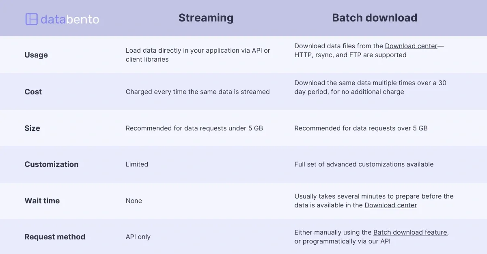

## Table of Contents

## What is streaming data?

Streaming data is information that flows continuously in real-time, like a river of data that never stops. Imagine watching a live sports game on the internet; the video and score updates you see are examples of streaming data. Instead of waiting for a whole file to download before you can use it, streaming data lets you access and use the information as it arrives.

This kind of data is very useful for things like tracking live events, monitoring systems, or analyzing social media trends as they happen. For example, businesses might use streaming data to keep an eye on their website traffic or to see what people are saying about their products on social media right now. Because the data keeps coming in, it helps make quick decisions and respond to changes as they occur.

## What is batch download data?

Batch download data is when you get a lot of information all at once, like downloading a whole bunch of files or a big report. Imagine you're getting a package in the mail; you wait until the whole package arrives before you open it. With batch download data, you wait until all the data is ready before you can use it. This is different from streaming data, where you can start using the information as soon as it starts coming in.

Batch download data is useful when you need everything at once, like when you're doing a big project or need a complete set of information. For example, if you're a scientist studying climate data, you might download a year's worth of weather data all at once to analyze it. This way, you can be sure you have all the data you need before you start your work.

## How does streaming data differ from batch download data?

Streaming data and batch download data are two different ways to get information. Streaming data comes in a steady flow, like water from a tap. You can start using it right away, even if you don't have all of it yet. It's great for things like watching videos online or checking live updates on a sports game. With streaming data, you don't have to wait for everything to arrive before you can start using it.

On the other hand, batch download data is like getting a big package in the mail. You wait until the whole package is there before you can open it. This means you need to wait until all the data is downloaded before you can use any of it. Batch download data is useful when you need a complete set of information all at once, like for a big project or a detailed report. It's different from streaming because you can't start using the data until everything is ready.

## What are the advantages of streaming historical market data?

Streaming historical market data means you get old stock market information in real-time, bit by bit. This is helpful because you don't have to wait for a big file to download before you can start looking at the data. Instead, you can start analyzing the market trends as soon as the data starts coming in. This can save time and let you make quicker decisions, which is important in the fast-paced world of trading.

Another advantage is that streaming data can be easier to manage. When you download a huge file with all the historical data at once, it can take up a lot of space on your computer and might be hard to sort through. But with streaming, you get the data in smaller pieces, which can be easier to handle and organize. This way, you can focus on the parts of the data that matter most to you without getting overwhelmed by a big download.

## What are the disadvantages of streaming historical market data?

Streaming historical market data can be tricky because it might not always be complete. When you get data in small pieces over time, you might miss out on some parts if there's a problem with the connection or if the data source stops sending information. This can make it hard to have a full picture of the market, which is important for making good decisions about buying or selling stocks.

Another problem is that streaming data can be more expensive. Because you're getting the data in real-time, the service that provides it might charge more money than if you just downloaded a big file of historical data all at once. This can add up, especially if you need a lot of data for your analysis. So, while streaming can be fast and convenient, it might not be the cheapest way to get the information you need.

## What are the advantages of batch downloading historical market data?

Batch downloading historical market data means you get all the information at once, like getting a big package in the mail. This is good because you can be sure you have all the data you need before you start looking at it. You don't have to worry about missing any pieces of information, which can be important when you're trying to understand what happened in the market over time.

Another advantage is that batch downloading can be cheaper. When you download a big file all at once, it might cost less than getting the same information in small pieces over time. This can save you money, especially if you need a lot of data for your work. So, while it might take longer to get all the data, batch downloading can be a more affordable way to get everything you need.

## What are the disadvantages of batch downloading historical market data?

Batch downloading historical market data can take a long time. You have to wait until the whole file is ready before you can start using it. This can be a problem if you need to make quick decisions about buying or selling stocks. If the market is moving fast, waiting for a big download can make you miss out on important opportunities.

Another issue is that batch downloads can use up a lot of space on your computer. When you get a big file with all the historical data at once, it can take up a lot of room. This can be a problem if your computer doesn't have much storage left. Plus, sorting through a huge file can be hard and time-consuming, making it tough to find the information you need quickly.

## In what scenarios is streaming data more suitable for historical market analysis?

Streaming data is more suitable for historical market analysis when you need to start looking at the data right away. Imagine you're a trader who needs to understand past market trends quickly to make decisions today. With streaming data, you don't have to wait for a big file to download. Instead, you can start analyzing the information as soon as it starts coming in. This can help you see patterns or changes in the market faster, which is important in the fast-moving world of trading.

Another scenario where streaming data works well is when you're working with limited storage on your computer. If you download a huge file of historical data all at once, it can take up a lot of space. But with streaming, you get the data in smaller pieces, which can be easier to manage. This way, you can focus on the parts of the data that matter most to you without filling up your computer's storage. So, if you're worried about space, streaming data can be a good choice for historical market analysis.

## In what scenarios is batch downloading data more suitable for historical market analysis?

Batch downloading data is more suitable for historical market analysis when you need all the information at once to do a complete study. Imagine you're a researcher working on a big project about how the stock market has changed over the last ten years. You want to make sure you have every piece of data before you start your analysis. With batch downloading, you can download a big file with all the historical data and be sure that you have everything you need. This is important because missing even a small part of the data could change your results.

Another scenario where batch downloading works well is when you want to save money. Streaming data can be more expensive because you're getting the information in real-time. But with batch downloading, you might pay less for a big file of historical data all at once. If you're on a budget and need a lot of data for your analysis, batch downloading can be a more affordable option. So, if you need a complete set of data and want to keep costs down, batch downloading is the way to go.

## How can the choice between streaming and batch downloading impact data analysis and decision-making?

The choice between streaming and batch downloading can really change how you do data analysis and make decisions. If you pick streaming data, you can start looking at the information right away, even if you don't have all of it yet. This is great if you need to make quick choices, like in trading where the market moves fast. You can see patterns and changes as they happen, which helps you decide what to do next without waiting for a big download to finish. But, streaming data might not always be complete, so you could miss some important pieces of information.

On the other hand, batch downloading gives you all the data at once, which is good if you need everything to do a full study. Imagine you're doing a big project on past market trends; you want to make sure you have every piece of data before you start. With batch downloading, you can be sure you have a complete set of information, which is important for making good decisions based on all the facts. But, it can take longer to get all the data, and it might use up a lot of space on your computer. So, the choice depends on whether you need speed and can handle some missing data, or if you need everything and can wait a bit longer.

## What technical considerations should be taken into account when implementing streaming vs. batch downloading solutions?

When you choose to implement a streaming solution, you need to think about how to handle the data as it comes in. Streaming data means you get information bit by bit, so you need a system that can process and store these small pieces without losing any. This can be tricky because you have to make sure your connection stays strong and that you have enough computing power to deal with the data in real-time. Also, streaming might need special software or tools that can manage this kind of data flow, which can add to the cost and complexity of your setup.

On the other hand, batch downloading involves getting all the data at once, which means you need to consider how to store and manage big files. You'll need enough space on your computer or server to hold all the data, and you might need to wait longer for the download to finish. This can be simpler to set up because you don't need real-time processing, but it can still be challenging to sort through a huge file once you have it. You'll also need to think about how to keep the data safe and secure, since a big file with all the information could be a bigger target for hackers.

## How do leading financial data providers support streaming and batch downloading of historical market data?

Leading financial data providers like Bloomberg, Refinitiv, and Alpha Vantage offer both streaming and batch downloading options for historical market data. For streaming, they provide real-time APIs that send data in small pieces as it becomes available. This lets users see the latest market trends as they happen, which is great for traders who need to make quick decisions. These providers often have special tools and software that help users manage and analyze the streaming data without losing any information. But, using these services can be more expensive because of the real-time nature of the data.

For batch downloading, these providers let users download big files with all the historical data at once. This is useful for researchers or analysts who need a complete set of information for long-term studies. The data comes in a big package, so users don't have to worry about missing any pieces. Batch downloading can be cheaper than streaming, but it takes longer to get all the data, and it can use up a lot of space on your computer. These providers usually have secure systems to make sure the big files are safe from hackers.

## What are the ways to explore batch downloads?

Batch download is a method of acquiring historical market data where large volumes of information are retrieved at one time. Typically, this method uses protocols such as HTTP, rsync, or FTP, enabling the efficient transfer of data through established, reliable channels. An essential advantage of batch downloads is their ability to handle extensive datasets, often exceeding 5 GB, which is useful for traders and analysts requiring comprehensive historical data for in-depth analysis.

This method is particularly cost-effective for market participants who need to access the same datasets repeatedly. Unlike streaming methods, where costs accrue with each request, batch downloads usually entail a one-time cost per dataset download, making them economically advantageous for recurring use. Additionally, the estimated cost-effectiveness can be quantified as:

$$
\text{Cost}_{\text{batch}} = \text{Initial Cost} + n \times \text{Additional Cost}
$$

Where $\text{Initial Cost}$ is the cost of the first download session, $n$ is the number of accesses to the same data set, and $\text{Additional Cost}$ represents any minor costs incurred with subsequent accesses, which are typically negligible.

While the initial setup of a batch download might involve some wait time, particularly due to file preparation and the queueing process on the server, this is offset by the stability and reliability of obtaining complete datasets in one transaction. This wait time is sometimes seen as a trade-off for the ability to heavily customize data extraction parameters, ensuring that the received data matches specific analytic needs. Users can often select specific variables, adjust time frames, and format outputs according to their requirements, providing a tailored data set that might not be achievable through streaming.

In comparison to streaming data, batch downloads are non-instant, as they do not provide data in real-time or near real-time. Instead, batch downloads focus on delivering comprehensive data sets needed for extensive analysis rather than immediate decision-making processes. Consequently, for those in need of stable, large volumes of historical data with the flexibility to customize what they retrieve, batch downloads offer a robust solution.

## References & Further Reading

[1]: ["Advances in Financial Machine Learning"](https://www.amazon.com/Advances-Financial-Machine-Learning-Marcos/dp/1119482089) by Marcos Lopez de Prado

[2]: ["Machine Learning for Algorithmic Trading"](https://github.com/PacktPublishing/Machine-Learning-for-Algorithmic-Trading-Second-Edition) by Stefan Jansen

[3]: ["Quantitative Trading: How to Build Your Own Algorithmic Trading Business"](https://www.amazon.com/Quantitative-Trading-Build-Algorithmic-Business/dp/1119800064) by Ernest P. Chan

[4]: ["Evidence-Based Technical Analysis: Applying the Scientific Method and Statistical Inference to Trading Signals"](https://www.amazon.com/Evidence-Based-Technical-Analysis-Scientific-Statistical/dp/0470008741) by David Aronson

[5]: Al-Dulaimi, H., & Alzubaidi, A. (2020). ["A Survey on Streaming Data and Data Streaming Processing"](https://www.semanticscholar.org/paper/A-survey-on-deep-learning-tools-dealing-with-data-Alzubaidi-Bai/4a07ded5f56aa76c75e844f353e046414b427cc2), 2020 3rd International Conference on Engineering Technology and its Applications (IICETA).

[6]: DeGroot, R. A., Lee, K., & Crossman, J. (2018). ["Historical Market Data"](https://www.jstor.org/stable/2287844), Second International Conference on Artificial Intelligence and Data Processing (IDAP).

[7]: Hu, Y. (2018). ["An Efficient Algorithm for Big Data Processing in Financial Market"](https://journalofbigdata.springeropen.com/articles/10.1186/s40537-021-00419-9), IEEE Access.