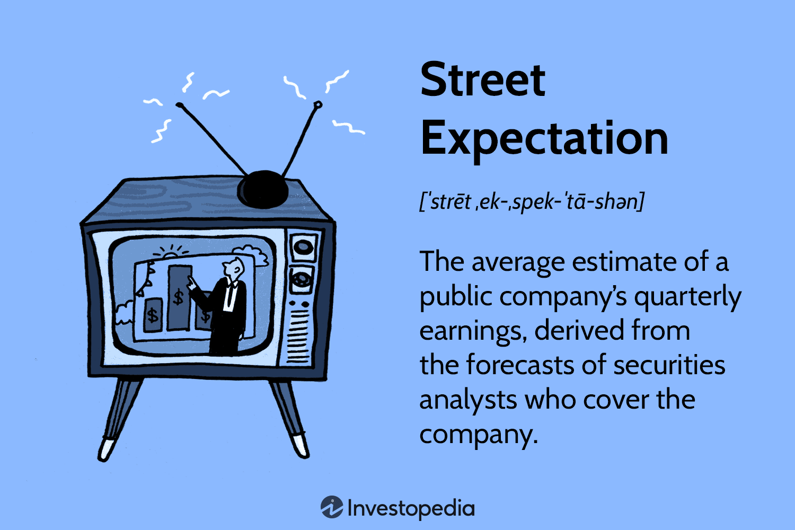

Financial markets operate through the dynamic interplay of market psychology, street expectations, and algorithmic trading. These elements collectively influence trading strategies and market movements, serving as foundational pillars for market analysis. For traders and investors, mastering the interactions among these factors is paramount to thriving in volatile and unpredictable market conditions.

Market psychology embodies the collective sentiment and emotional behavior driving decisions in the marketplace. It acknowledges that traders and investors are not always guided by rational thought, but rather by emotions and psychological trends. This dimension of financial markets has a significant impact on asset prices, often leading to trends that defy fundamental analysis.



Street expectations, commonly associated with analyst forecasts for company earnings, play a pivotal role during earnings season. These forecasts drive market expectations and reactions, influencing stock price volatility significantly. When a company’s financial performance diverges from these expectations, the resulting market reactions can create substantial price fluctuations. For investors, understanding street expectations allows for strategic positioning in anticipation of earnings reports.

Algorithmic trading introduces the methodical execution of trades using computer algorithms that adhere to predefined criteria like timing, price, and volume. This approach minimizes the emotional aspect of trading, yet it isn’t entirely free of biases, as human traders design these algorithms. The quantifiable nature of algorithmic trading allows for rapid execution of trades based on complex mathematical models, deeply affecting market liquidity and volatility. Algorithms not only magnify existing market trends but also stabilize prices under certain conditions by providing liquidity.

Understanding how market psychology, street expectations, and algorithmic trading intersect enriches the arsenal of tools available to traders and investors. By appreciating these dimensions, one advances the capacity to interpret market signals accurately and develop strategies that harness the strengths of each element. This guide aims to equip readers with essential insights into these interconnected domains, ultimately enhancing their ability to navigate the complexities of financial markets.

## Table of Contents

## Understanding Market Psychology

Market psychology encapsulates the emotional and cognitive patterns that influence investors' decision-making within financial markets. At its core, this concept underscores the reality that financial markets are, to a significant extent, guided by human behavior rather than purely objective analysis. Fundamental to understanding market psychology is the recognition of emotional and cognitive biases, which collectively drive market trends and shape price action.

Emotional biases, such as fear and greed, are powerful drivers of market moods and can lead to pronounced market swings. For instance, during periods of market euphoria, investors may exhibit overconfidence, leading to inflated asset prices. Conversely, during tumultuous times, fear might dominate, resulting in sharp sell-offs and market corrections. These emotional responses often manifest in herd behavior, where participants collectively follow predominant market trends, sometimes to their detriment.

Cognitive biases also play a critical role. Behavioral economics, a field that combines insights from psychology and economic theory, suggests that market participants are not always rational actors. Biases like overconfidence, anchoring, and confirmation bias can skew perceptions and decision-making processes. Overconfidence might lead to excessive trading, while anchoring, or the fixation on a particular price level, can prevent investors from adjusting their positions based on new information.

Herd behavior, a phenomenon where individuals mimic the actions of a larger group, can lead to significant market anomalies. For example, if a large number of investors begin selling off a stock due to perceived negative sentiment, others might follow suit, amplifying the downward pressure on that stock's price, even if the fundamentals have not changed dramatically.

Understanding these components of market psychology is indispensable for traders who wish to anticipate market movements effectively. By acknowledging the emotional and cognitive forces at play, traders can develop strategies that account for potential [volatility](/wiki/volatility-trading-strategies) driven by emotional extremes. Employing tools like sentiment analysis and contrarian investing can help traders identify when the market may be reaching a psychological extreme, thus offering potential entry and [exit](/wiki/exit-strategy) points that align with broader market trends.

In summary, market psychology is an essential [factor](/wiki/factor-investing) that reflects the inherent human biases and behaviors that permeate financial markets. Recognizing and understanding these biases and behaviors enable traders to craft informed and robust trading strategies that acknowledge not just the quantitative data but the qualitative forces that move markets.

## The Concept of Street Expectation

Street expectation refers to the average forecast of a company's quarterly earnings, predominantly made by securities analysts who assess numerous factors such as financial statements, market conditions, and macroeconomic indicators. This expectation is a critical metric for investors and traders, as it plays a pivotal role in guiding investment decisions and stock valuations. Analysts' forecasts are typically aggregated by financial data providers, forming a consensus estimate that serves as a benchmark for evaluating actual earnings results.

During earnings season, when companies report their financial performance for the quarter, street expectations are scrutinized closely. The degree to which a company's reported earnings meet, exceed, or fall short of these expectations can dramatically influence its stock price movements. For instance, when a company surpasses the consensus estimate, it may experience a positive stock price reaction as it signals stronger-than-expected performance. Conversely, failing to meet these expectations might lead to a negative reaction, as investors reassess the company's valuation and growth prospects.

One of the primary reasons why street expectations have such a pronounced impact on stock prices is due to the perception of future earnings potential. Earnings reports that beat expectations may suggest that the company is on a robust growth trajectory, thus warranting a higher valuation. Conversely, missing expectations might indicate potential challenges, prompting analysts and investors to lower their valuation models.

Understanding street expectations enables investors to position themselves advantageously ahead of earnings reports. This knowledge allows investors to anticipate potential stock price volatility and tailor their trading strategies accordingly. For example, some investors may choose to take positions in companies they expect to outperform the street’s estimates, potentially benefiting from a post-earnings price surge. Alternatively, options strategies, such as straddles or strangles, can be employed to capitalize on anticipated volatility regardless of the direction of price movement. This approach is especially useful in contexts where binary outcomes are expected, but the directional movement is uncertain.

Moreover, street expectations are not static; they are subject to revisions as new information becomes available. Economic indicators, industry trends, and company-specific news can all lead analysts to update their forecasts, which in turn adjust the consensus. Therefore, keeping abreast of these revisions is also a key component of strategic investment planning. 

In summary, street expectations are a cornerstone of market analysis, influencing stock prices and investment strategies significantly during earnings season. Being aware of these expectations and understanding the factors that drive them are indispensable for investors looking to optimize their positions in the financial markets.

## Algorithmic Trading and its Influence

Algorithmic trading utilizes computer algorithms to execute trades based on predefined criteria, such as timing, price, and [volume](/wiki/volume-trading-strategy), revolutionizing the way financial markets operate. These algorithms analyze vast amounts of data at unprecedented speeds, identifying opportunities and executing trades more efficiently than human traders. By reducing the influence of emotions—common in human decision-making—[algorithmic trading](/wiki/algorithmic-trading) offers a systematic approach to trading. However, while it minimizes emotional biases, it remains subject to biases inherent in the algorithms' design and the data that feeds them.

These algorithms can significantly impact market dynamics. On one hand, they may exacerbate market trends, contributing to increased volatility. This occurs because many algorithms are designed to capitalize on short-term price movements, perpetuating trends through practices like [momentum](/wiki/momentum) trading. On the other hand, algorithmic trading can enhance market stability by providing [liquidity](/wiki/liquidity-risk-premium). The presence of numerous algos that continuously buy and sell can narrow bid-ask spreads and improve price discovery.

Traders leveraging algorithmic strategies gain access to quantitative insights that extend beyond traditional human analysis. Algorithms use complex mathematical models and statistical techniques to make trading decisions, often employing [machine learning](/wiki/machine-learning) to adapt to evolving market patterns. For instance, a simple algorithm could be programmed in Python to execute a trade when specific conditions are met:

```python
def execute_trade(price, moving_avg):
    if price > moving_avg:
        print("Buy")
    elif price < moving_avg:
        print("Sell")
    else:
        print("Hold")
```
This snippet demonstrates a basic moving average strategy, a common method in algorithmic trading.

Overall, algorithmic trading represents a blend of technological innovation and financial acumen, allowing traders to harness computational power for strategic market participation. It underscores the importance of integrating robust data analysis and precise execution criteria to navigate complex financial landscapes efficiently.

## Interplay: Market Psychology and Algorithmic Trading

Algorithmic trading, with its structured and objective approach, operates based on predefined criteria and quantitative models. However, the influence of market psychology on these algorithms is significant due to inherent biases and the interpretation of market signals. 

Traders often design algorithms with embedded biases that reflect collective psychological tendencies. For instance, during periods of market euphoria or panic, algorithms might be programmed to increase sensitivity to certain types of price movements or trading volumes, thus reflecting the prevalent market sentiment. Such biases can manifest in increased buying during bullish phases and selling during bearish phases, often amplifying existing market trends.

Market psychology influences algorithmic trading through the interpretation of market signals. Algorithms typically analyze data inputs, such as price movements, trade volumes, and other quantitative indicators, which are themselves shaped by the mood and behavior of market participants. As a result, algorithms may react to these signals in a manner influenced by prevalent emotional states, such as fear or greed.

Recognizing the phases of market cycles is critical for traders who wish to adjust their algorithms accordingly. For example, during a bull market, algorithms might incorporate strategies that capitalize on upward momentum, whereas, in a bear market, they might switch to more defensive strategies that focus on capital preservation. This adaptability allows algorithms to more accurately reflect and respond to changing market conditions, ultimately improving their performance.

Integrating psychological insights into algorithmic models offers a competitive advantage. By understanding the emotional drivers of market behavior, traders can develop algorithms that not only rely on quantitative data but also account for the less tangible, yet critical, elements of trader sentiment. Such integration can lead to the development of robust trading strategies that are better equipped to navigate volatile and unpredictable market environments.

Leveraging sentiment analysis tools and machine learning techniques, traders can refine their algorithms over time. Python, a versatile programming language, offers several libraries, such as pandas and scikit-learn, that can facilitate the incorporation of sentiment data into trading models. By training algorithms to recognize and adjust to shifts in market sentiment, traders can enhance the resilience and effectiveness of their trading strategies.

```python
import pandas as pd
from sklearn.model_selection import train_test_split
from sklearn.ensemble import RandomForestClassifier
from sklearn.metrics import accuracy_score

# Sample code for sentiment analysis in trading
data = pd.read_csv('market_data.csv')
X = data[['price_movement', 'volume', 'sentiment_score']]
y = data['market_trend']

X_train, X_test, y_train, y_test = train_test_split(X, y, test_size=0.3, random_state=42)

model = RandomForestClassifier(n_estimators=100, random_state=42)
model.fit(X_train, y_train)

predictions = model.predict(X_test)
accuracy = accuracy_score(y_test, predictions)

print(f'Model Accuracy: {accuracy * 100:.2f}%')
```

The code snippet above illustrates how machine learning can be used to predict market trends by incorporating sentiment scores along with traditional quantitative factors. This integration is crucial for developing algorithms that are not only precise but also adaptable to the ever-evolving landscape of financial markets.

## The Role of Sentiment Indicators in Trading

Sentiment indicators are essential tools in evaluating the emotional state of the financial markets, often serving as proxies for market fear or greed. Among the most widely recognized sentiment indicators is the Volatility Index (VIX), which is colloquially referred to as the "fear index." The VIX measures expected volatility in the stock market over the coming 30 days, derived from options prices on the S&P 500. A high VIX value typically indicates increased fear or uncertainty in the market, while a low VIX suggests complacency or confidence among investors.

Sentiment indicators help traders identify emotional extremes that could precede market reversals. For example, an extremely high VIX might signal panic selling and could suggest a potential bottoming in stock prices. Conversely, a very low VIX might indicate excessive optimism, possibly pointing to an overbought condition in the market and a forthcoming correction. Such market conditions often coincide with turning points, where significant shifts in trend direction occur.

Leveraging sentiment indicators requires a careful analysis of both historical data and current market conditions. Experienced traders often use these tools in conjunction with other analyses to refine their entry and exit points. During periods of high volatility, sentiment indicators become particularly valuable, enabling traders to better assess risk and make informed decisions. By understanding the prevailing market sentiment, traders can position themselves advantageously, whether by hedging existing positions or seeking new opportunities aligned with anticipated market movements. 

Overall, sentiment indicators like the VIX offer traders a quantifiable measure of market psychology, allowing them to align their strategies more closely with the underlying emotions driving market activity. In volatile conditions, these indicators act as a rational counterbalance to the often impulsive human reactions that can distort market behavior.

## Conclusion: Leveraging Psychological and Analytical Tools

A comprehensive trading strategy that successfully weaves together market psychology insights with algorithmic trading methodologies stands to outperform those strategies that lean solely on one facet. Recognizing the collective emotional state of market participants, often manifested in psychological indicators and sentiment metrics, allows traders to anticipate and navigate market shifts effectively. Emotional tides, such as fear during market downturns or greed in exuberant bull markets, can have significant impacts on price movements, thus understanding these emotions offers a strategic advantage.

Algorithmic trading, which relies on the systematic execution of trades through pre-defined criteria, can be significantly enhanced by integrating psychological insights. This combination enables traders to not only interpret quantitative signals but also to adjust their algorithms in response to evolving market sentiments. By blending the analytical precision of algorithms with the softer, yet crucial, nuances of market psychology, traders can forge strategies that are both adaptable and robust.

For example, implementing a dynamic sentiment analysis module within an algorithm could allow it to pivot based on real-time mood indicators. Tools like machine learning can be employed to process sentiment data, identifying patterns that correlate with market changes. Here's a simplified Python snippet to illustrate how sentiment analysis might be incorporated into an algorithmic strategy:

```python
import nltk
from nltk.sentiment.vader import SentimentIntensityAnalyzer

def analyze_sentiment(text):
    sia = SentimentIntensityAnalyzer()
    sentiment_scores = sia.polarity_scores(text)
    return sentiment_scores

# Example usage
market_news = "The market is experiencing widespread panic due to economic uncertainty."
sentiment = analyze_sentiment(market_news)
if sentiment['compound'] < -0.5:
    # Execute a protective strategy
    print("Implementing risk-averse trading strategy")
```

Continuous learning and maintaining current knowledge are imperative for traders aiming to sustain success against the backdrop of constantly shifting markets. The integration of psychological insights into trading systems should be an ongoing process, continually refined with fresh data and evolving market conditions. This dedication to staying informed and adaptable ensures that traders remain at the forefront, optimizing their strategies for consistent performance.

In summary, the convergence of psychological understanding and algorithmic analysis forms a potent toolkit for navigating financial markets. By embracing both dimensions, traders enhance their ability to predict and react to market movements with calculated precision and insight-driven intuition.

## References & Further Reading

[1]: Bergstra, J., Bardenet, R., Bengio, Y., & Kégl, B. (2011). ["Algorithms for Hyper-Parameter Optimization."](https://dl.acm.org/doi/10.5555/2986459.2986743) Advances in Neural Information Processing Systems 24.

[2]: ["Advances in Financial Machine Learning"](https://www.amazon.com/Advances-Financial-Machine-Learning-Marcos/dp/1119482089) by Marcos Lopez de Prado

[3]: ["Evidence-Based Technical Analysis: Applying the Scientific Method and Statistical Inference to Trading Signals"](https://www.amazon.com/Evidence-Based-Technical-Analysis-Scientific-Statistical/dp/0470008741) by David Aronson

[4]: ["Machine Learning for Algorithmic Trading"](https://github.com/stefan-jansen/machine-learning-for-trading) by Stefan Jansen

[5]: ["Quantitative Trading: How to Build Your Own Algorithmic Trading Business"](https://www.amazon.com/Quantitative-Trading-Build-Algorithmic-Business/dp/1119800064) by Ernest P. Chan