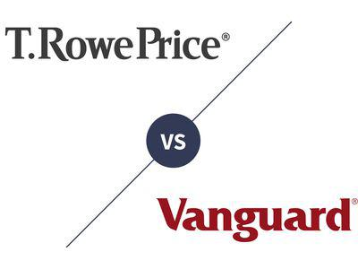

In recent years, algorithmic trading has surged in popularity within financial markets, marking a significant shift in how trade executions are approached and managed. This method, which relies on sophisticated algorithms and data processing capabilities, offers traders the advantage of executing trades at speeds and efficiencies far beyond human capacity. As a result, algorithmic trading has revolutionized traditional investment practices, providing a critical competitive edge in fields where milliseconds can make a substantial difference.

This article aims to provide a balanced examination of the advantages and disadvantages of algorithmic trading. On one hand, the automation and precision offered by algorithms can lead to disciplined and consistent trading strategies. On the other, the inherent risks and potential for technical errors necessitate a careful and informed approach. Through exploring both the benefits and the potential pitfalls, readers can better understand whether or not to incorporate these tools into their investment portfolios.



In addition to discussing algorithmic trading itself, this article will consider the role street names—such as "Wall Street" or "Main Street"—play in the broader context of investment strategies. These terms, which often symbolize the distinction between professional institutional investors and individual retail traders, offer a nuanced lens through which the cultural aspects of trading can be understood. By analyzing these distinctions, traders can align their strategic objectives with their risk tolerance, thereby enhancing their overall approach to investing.

Understanding these aspects is crucial for both novice and experienced traders alike. Whether one is just beginning their journey in financial markets or is a seasoned professional, the insights provided in this article are intended to inform and refine trading decisions. In a rapidly evolving trading landscape, being adaptable and informed remains the cornerstone of successful investment strategies.

## Table of Contents

## Understanding Algorithmic Trading

Algorithmic trading involves the use of computer algorithms to execute financial market trades based on predetermined criteria. These algorithms are designed to process complex calculations and analyze vast datasets at speeds unattainable by human traders, allowing for rapid decision-making and execution of trades. 

One of the primary attributes of algorithmic trading is its ability to leverage speed and data processing capabilities far beyond human capacity. The algorithms can parse through large volumes of historical and real-time data to identify potential trading opportunities. For instance, they can assess trends, patterns, and market conditions in milliseconds and execute trades based on these analyses. This immediate reaction to market changes is one of the core strengths of algorithmic trading.

To understand [algorithmic trading](/wiki/algorithmic-trading), it is essential to recognize its various components and how they function collectively. Essentially, an algorithmic trading system consists of the following elements:

1. **Data Collection and Analysis**: High-frequency data streams are collected, which can include market data, economic news releases, social media sentiment, etc.

2. **Signal Generation**: The algorithm identifies profitable trading opportunities based on the analyzed data. This could be achieved using statistical models, technical indicators, and machine learning techniques.

3. **Risk Management**: Algorithms are programmed to manage trading risks by setting up stop-loss limits or adjusting exposure to mitigate potential losses.

4. **Execution**: Once a trading signal is generated, the algorithm executes the trade without delay, ensuring that the trade is conducted at the optimal time and price.

Algorithmic trading is categorized into various types based on the strategies used:

- **Statistical Arbitrage**: It exploits market inefficiencies across related securities. Algorithms find statistical correlations and deviations to generate profit.

- **Market Making**: This involves placing a buy and a sell order simultaneously to capture the spread between them, facilitating liquidity for the financial markets.

- **Trend Following**: Algorithms track market trends based on technical indicators and execute buy or sell orders depending on the direction of the trend.

- **Mean Reversion**: This strategy assumes that asset prices deviate and eventually return to their mean value. When prices are realized to be above or below average, trades are executed accordingly.

Understanding these operational details and types of algorithmic strategies is crucial for evaluating the broader implications and potential benefits, alongside the risks, associated with this trading method. By acknowledging the complexity and variety of algorithmic trading, traders and financial institutions can better assess how it fits into their broader investment strategies.

## Advantages of Algorithmic Trading

Algorithmic trading offers numerous advantages that have made it an integral part of modern financial markets. One of the most significant benefits is its unparalleled speed and efficiency. Algorithms can execute orders in fractions of a second, far quicker than any human trader could manage. This rapid execution is crucial in high-frequency trading environments where market conditions can change within milliseconds.

In addition to speed, algorithmic trading significantly reduces human error and emotional bias, leading to more disciplined trading decisions. Human traders are often influenced by emotions such as fear or greed, which can lead to rash or poorly timed trades. Algorithms, however, operate based purely on predefined rules and data analysis, ensuring consistency and objectivity.

Another key advantage is the ability to backtest and optimize trading strategies. Backtesting involves running a trading strategy on historical data to assess its viability. This process helps traders refine their algorithms by identifying strengths and weaknesses in the strategy before it goes live in the market. The ability to iteratively test and improve strategies can lead to more robust and profitable trading systems.

Furthermore, algorithmic trading facilitates high-frequency trading ([HFT](/wiki/high-frequency-trading-strategies)), which capitalizes on small price discrepancies in the market. HFT strategies exploit these inefficiencies to generate profits, often executing thousands of trades in a single day. The speed of algorithmic systems makes them ideal for such fast-paced trading approaches.

Finally, algorithmic trading allows for greater diversification through simultaneous trading in multiple markets. Unlike manual trading, which limits a trader to focusing on a few markets at a time, algorithms can be programmed to monitor and execute trades across various asset classes, geographies, and market conditions. This capability enhances a portfolio's diversification, reducing overall risk and increasing the potential for returns.

Overall, the advantages of algorithmic trading, including speed, reduced emotional bias, strategy optimization, high-frequency trading, and diversification, position it as a powerful tool for both individual and institutional investors seeking to improve their trading performance.

## Disadvantages of Algorithmic Trading

Algorithmic trading, despite its numerous advantages, presents specific challenges that can hinder its efficacy if not properly managed. Automation, a critical feature of algorithmic trading, significantly enhances efficiency but also introduces potential risks due to technical faults. These faults can lead to erroneous trades that may result in considerable financial losses. For instance, an unexpected system failure, network issue, or bug within the program can cause incorrect order execution, which can be costly.

The setup and implementation of algorithmic trading systems require in-depth expertise in both trading and technology. This dual requirement presents a barrier to entry for those lacking in either field. Creating effective algorithms demands comprehensive knowledge of market conditions, statistical analysis, and programming skills. The complexity involved in devising these algorithms means that improper construction can lead to inadequate performance.

Over-optimization is a common pitfall in algorithmic trading, where strategies are excessively tailored to historical data, a phenomenon known as curve fitting. This practice often results in models that perform exceptionally well on past data but fail under live, dynamic market conditions. The algorithms are effectively 'taught' to anticipate past events that may not recur, hence they are less adaptable to future market fluctuations.

Algorithmic trading is also known for its contribution to increased market [volatility](/wiki/volatility-trading-strategies), particularly through high-frequency trading strategies. This volatility can trigger flash crashes, where rapid sell-offs occur, leading to severe, albeit temporary, market drops. Such incidents raise concerns about the robustness of financial markets and their susceptibility to algorithm-induced disruptions.

Regulatory and compliance issues are another set of challenges associated with algorithmic trading. The complexity of these trading algorithms often falls outside the scope of existing regulatory frameworks, making it difficult for authorities to monitor and control their activities effectively. As financial markets increasingly incorporate algorithmic strategies, regulators are tasked with developing new frameworks to ensure market stability and integrity, posing additional compliance challenges for traders.

In summary, while algorithmic trading offers significant advantages, the risks associated with technical faults, the need for substantial skillsets, over-optimization, market volatility, and regulatory issues must be carefully managed to ensure these systems function reliably and effectively.

## Street Names: An Unexpected Connection

Street names might seem unrelated, but they offer a unique perspective on traditional versus automated trading strategies. At the heart of the financial world, iconic street names like "Wall Street," "Main Street," and "Upper Street" encapsulate distinct levels of market engagement and investment philosophies.

Understanding terms like "Wall Street" often refers to the epicenter of global finance, encompassing investment banks, hedge funds, and other institutions that heavily rely on complex algorithmic trading strategies. These professional investors leverage advanced technologies and large datasets to exploit minute price discrepancies, aiming for substantial returns on extensive capital.

Conversely, "Main Street" symbolizes retail investors and individual traders who tend to engage in more traditional trading methods. Historically, these investors may have favored strategies based on [fundamental analysis](/wiki/fundamental-analysis) or personal research rather than automated algorithms. Despite the rise of technology, many Main Street investors still value human intuition and experiential knowledge, considering the broader economic factors influencing market trends.

"Upper Street," although less famous, could metaphorically signify a middle ground where both elements meet—perhaps representing small financial advisories and boutique investment firms who blend traditional investment philosophies with emerging technological tools. These firms might use algorithmic insights for efficiency while maintaining a personalized touch in client relations and investment strategy.

Exploring these distinctions can help traders align their strategies with their objectives and risk tolerance. For instance, an investor prioritizing high-speed trades and high-frequency tactics may resonate with Wall Street's aggressive, technology-driven approach. Alternatively, those focused on steady growth or long-term investments might find Main Street's traditionally grounded strategies more appealing. 

In the digital age, these concepts help bridge classic trading philosophies with modern methodologies. The integration of "traditional street wisdom" and algorithmic precision allows traders to develop diversified strategies. For example, a trader might use algorithmic programs to handle high-[volume](/wiki/volume-trading-strategy) transactions while applying traditional analyses for long-term portfolio decisions. This blend of strategies not only aids in risk management but can also enhance decision-making processes, allowing investors to effectively navigate the ever-evolving financial landscape. 

By understanding the implicit cultural and functional roles of these street names, investors can better comprehend how different strategies fit within the broader market context, facilitating informed and balanced trading approaches.

## Balancing Street Wisdom with Algorithmic Insights

Balancing traditional street wisdom with algorithmic insights involves leveraging both the technological efficiencies provided by algorithms and the experiential knowledge gleaned from historical market practices. Algorithms offer unprecedented speed and data processing capabilities, allowing investors to execute trades with precision and minimal lag. They reduce human error and emotional biases, which can often cloud judgment during periods of market volatility. However, traditional street wisdom, accumulated over decades of trading experience, offers essential insights into market behavior that algorithms may overlook.

Integrating quantitative methods with qualitative insights enhances trading decisions. Quantitative methods use mathematical models and data analysis to identify trading opportunities. These include statistical [arbitrage](/wiki/arbitrage) and [machine learning](/wiki/machine-learning) models, which can process massive datasets far beyond human capacity. Python, for instance, is a favored tool among quantitative analysts due to its extensive libraries such as NumPy and pandas for data manipulation and analysis. A simple example of a moving average crossover strategy in Python would look something like this:

```python
import pandas as pd

def moving_average_strategy(df, short_window=40, long_window=100):
    signals = pd.DataFrame(index=df.index)
    signals['signal'] = 0.0

    # Create short simple moving average
    signals['short_mavg'] = df['close'].rolling(window=short_window, min_periods=1).mean()

    # Create long simple moving average
    signals['long_mavg'] = df['close'].rolling(window=long_window, min_periods=1).mean()

    # Create signals
    signals['signal'][short_window:] = np.where(
        signals['short_mavg'][short_window:] > signals['long_mavg'][short_window:], 1.0, 0.0)

    # Generate trading orders
    signals['positions'] = signals['signal'].diff()

    return signals
```

This algorithmic approach to trading could be enhanced by incorporating qualitative insights. Such insights might include understanding geopolitical events, market sentiment, and broader economic indicators that can influence market movements. These factors are often interpreted better through human intuition and historical experience than through purely quantitative methodologies.

Establishing a balance between these approaches allows for a comprehensive understanding of market dynamics. For instance, while an algorithm may detect a pattern that suggests an optimal buy or sell point, a seasoned trader might recognize external factors affecting that decision. By blending human intuition with technological precision, traders can adjust algorithmic signals to better align with their objectives and anticipated risk.

Actionable strategies for blending insights from both worlds include utilizing sentiment analysis alongside quantitative models. Sentiment analysis gauges market sentiment through various sources like news articles and social media, offering a contextual backdrop to algorithmic signals. Another strategy involves incorporating feedback loops into trading algorithms, where human insights continuously refine and adapt the algorithm's criteria based on market changes.

In conclusion, the fusion of traditional and algorithmic strategies offers a multidimensional approach to trading that leverages the strengths of both. By embracing both quantitative technologies and qualitative insights, traders can enhance their decision-making processes to better navigate the complexities of modern financial markets.

## Conclusion: Making Informed Trading Decisions

The decision to adopt algorithmic trading hinges on a comprehensive understanding of its array of advantages and inherent challenges. Algorithmic trading offers speed, efficiency, and reduced emotional bias, which can markedly enhance the trading process. However, these benefits must be judiciously balanced against potential drawbacks such as technical faults, over-optimization, and regulatory complexities.

For both seasoned and novice investors, it is crucial to assess the efficiency that algorithmic systems bring to the table against the accompanying risks. This strategic evaluation requires not only an understanding of technological principles but also a recognition of market idiosyncrasies and the trader's own objectives. 

Insight into cultural symbols such as "Wall Street" and "Main Street" provides an additional layer of understanding. These terms encapsulate the divide between institutional and retail investors and serve as a metaphorical guide to distinguish between the large-scale operations of financial markets and the individualized strategies of individual traders. Incorporating these insights allows investors to anchor their strategies in real-world contexts and align them with personalized risk tolerances and investment goals.

Ultimately, informed decision-making in trading results from the integration of technological capabilities with strategic wisdom. This synthesis ensures that traders can harness the best of both worlds—leveraging the precision and power of algorithms while maintaining the strategic discretion often found in seasoned street wisdom. As the trading landscape continually evolves with technological advancements and market dynamics, adaptability and informed readiness remain crucial for sustained success. Balancing algorithmic efficiency with qualitative market insights fosters a robust approach to navigating the complexities of financial markets.

## References & Further Reading

[1]: Bergstra, J., Bardenet, R., Bengio, Y., & Kégl, B. (2011). ["Algorithms for Hyper-Parameter Optimization."](https://papers.nips.cc/paper/4443-algorithms-for-hyper-parameter-optimization) Advances in Neural Information Processing Systems 24.

[2]: ["Advances in Financial Machine Learning"](https://www.amazon.com/Advances-Financial-Machine-Learning-Marcos/dp/1119482089) by Marcos Lopez de Prado

[3]: ["Evidence-Based Technical Analysis: Applying the Scientific Method and Statistical Inference to Trading Signals"](https://www.amazon.com/Evidence-Based-Technical-Analysis-Scientific-Statistical/dp/0470008741) by David Aronson

[4]: ["Machine Learning for Algorithmic Trading"](https://github.com/stefan-jansen/machine-learning-for-trading) by Stefan Jansen

[5]: ["Quantitative Trading: How to Build Your Own Algorithmic Trading Business"](https://www.amazon.com/Quantitative-Trading-Build-Algorithmic-Business/dp/1119800064) by Ernest P. Chan