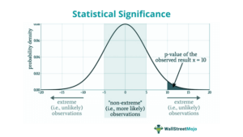

In modern society, public demonstrations and activism hold significant importance as mechanisms for expressing societal grievances and driving change. These expressions of civic engagement serve as a vital conduit for individuals and communities to voice their demands and exert pressure for social and political reform. As activists seek to address diverse issues, from climate change to economic inequality, public demonstrations become a crucial tool for rallying support and generating public awareness.

With the advent of technological advancements, particularly in financial markets, traditional forms of activism are increasingly intersecting with technology-driven strategies. The rise of technology has transformed various aspects of activism, offering new avenues for reaching wider audiences and facilitating organization and mobilization. This transformation is particularly evident in the context of financial markets, where algorithmic trading has emerged as a dominant force, reshaping how financial transactions occur.

This article explores the convergence of street protests, public demonstrations, activism, and algorithmic trading. It examines the impacts and implications of these intersecting forces, highlighting how they influence and shape one another in the contemporary world. Through an analysis of this convergence, we aim to shed light on the influence of activism on financial markets and vice versa, illustrating the interconnectedness of societal movements and economic systems.

Understanding these connections not only enriches our comprehension of modern activism but also provides insights into the broader socio-economic landscapes we navigate. As public demonstrations evolve to incorporate technological tools, the ripple effects on financial markets become more pronounced, creating new dynamics in how societal grievances are expressed and addressed. By examining these interactions, we gain a deeper understanding of the potential for activism to effect substantial change in both social and economic spheres.

## Table of Contents

## Understanding Street Protests and Public Demonstrations

Street protests and public demonstrations have been deeply woven into the fabric of societal development throughout history, serving as a vital tool for civic expression and political engagement. These acts of collective defiance or solidarity provide a visible platform for individuals and groups to express their opinions, grievances, and demands for change. Historically, protests have been pivotal in initiating reforms and influencing political agendas. For instance, events like the Civil Rights Movement in the United States during the 1960s demonstrate how organized public demonstrations have successfully led to significant legislative changes, advancing social justice and equality.

Effective protests require meticulous strategic planning. This involves organizing logistics, ensuring the safety of participants, and maximizing media engagement. Organizers often map out routes, secure necessary permits, and coordinate with law enforcement to mitigate the risk of violence or disorder. Participant safety is paramount, with plans accounting for medical assistance and legal support if needed. Additionally, engaging with media outlets and using effective communication strategies can amplify the message and objectives of the protest, reaching a broader audience and drawing attention to the cause.

The digital age has enhanced the [momentum](/wiki/momentum) of protests through real-time news coverage and social media platforms. In the past, traditional media played a crucial role in shaping public perception and response to demonstrations. Today, social media platforms like Twitter, Facebook, and Instagram allow protests to gain instant visibility, rally supporters, and engage in real-time communication. This increased visibility can lead to more significant impact and influence, as seen in movements such as the Arab Spring, where online networks were instrumental in mobilizing mass protests across several countries.

Analyzing the evolution of protests throughout history allows us to understand shifts in public sentiment and demands. As societies change, so do the issues that drive people to protest. Economic inequalities, racial discrimination, and environmental concerns have been recurring themes that often mobilize public demonstrations. By studying these patterns, one can identify underlying social tensions that may prompt future protests. Understanding such dynamics helps policymakers and society as a whole address grievances before they escalate into civil unrest.

Historically and into the modern era, street protests and public demonstrations remain a cornerstone of democratic expression, reflecting the persistent demand for societal reforms and justice.

## Activism in the Age of Information

The digital era has significantly reshaped the landscape of activism, providing new tools and methods for mobilization and information dissemination. The advent of social media platforms, such as Facebook, Twitter, and Instagram, has enabled activists to reach a global audience almost instantaneously. This global reach enhances their influence and strategic potential by facilitating the rapid spread of information and coordination of activities across borders. For example, the Arab Spring uprisings in the early 2010s illustrated how digital platforms could mobilize and sustain large-scale protests by enabling the sharing of real-time information and coordinating efforts among diverse groups.

Digital activism, however, is not without its challenges. One significant issue is the pervasive surveillance by governments and corporations, which can undermine the privacy and security of activists. Platforms that foster activism are often the same venues where surveillance is conducted, tracking users’ activities and potentially identifying protest leaders and participants. Digital activists must navigate these threats while organizing effective campaigns, often necessitating the use of encrypted communication tools and privacy safeguards.

Moreover, the digital sphere is rife with misinformation, which can distort facts and alter public perception of protest movements. The spread of false information or propaganda can discredit legitimate activism, creating confusion and diminishing support. Activists must therefore develop strategies to counteract misinformation, such as fact-checking initiatives and the promotion of credible content, to maintain the integrity and support of their movements.

Understanding these dynamics is vital for comprehending modern protest strategies and grassroots movements. The rise of digital activism represents a double-edged sword: while technology has fundamentally increased accessibility to activism, it has also introduced a suite of complex challenges that activists must overcome. By adapting to these changes, activists can harness the power of digital tools to effectively promote social and political change on a global scale.

## Algorithmic Trading and Its Societal Impacts

Algorithmic trading, often referred to as algo trading, utilizes complex algorithms to execute trades at unimaginable speeds, resulting in a profound transformation within financial markets. The automation and high-frequency capabilities inherent in algo trading increase market efficiency by facilitating rapid trade execution and price discovery. As a result, transaction costs are typically reduced, leading to more liquid and competitive markets.

However, this increased efficiency comes with a trade-off: heightened market [volatility](/wiki/volatility-trading-strategies). Algo trading can precipitate abrupt market moves, such as "flash crashes," where prices drop precipitously in moments, driven by erroneous trades or cascading automatic sell-offs. An example is the May 6, 2010, Flash Crash, where the Dow Jones Industrial Average plummeted nearly 1,000 points in mere minutes before recovering the majority of the drop within half an hour [1].

The societal implications of algo trading extend far beyond the trading floor. Financial markets are a cornerstone of modern economies; disruptions within them can send shockwaves through broader economic systems. These technological advancements in trading can contribute to economic disparities, as those with access to high-speed trading technologies gain an edge over average investors. For many, the rapid pace and complexity of algo trading create a sense of disenfranchisement, as they perceive markets as increasingly detached from tangible economic realities.

Algo trading also poses ethical and regulatory challenges, prompting discussions about fairness and transparency. While some proponents argue that this type of trading democratizes market participation by leveling the playing field through automation, critics highlight that it disproportionately benefits large financial institutions capable of deploying sophisticated algorithms. This technological divide underscores the economic disparities between institutional and individual investors.

Activist movements focusing on economic inequality frequently highlight the consequences of such disparities. By pushing for regulatory changes and increased transparency in trading practices, these movements aim to mitigate the societal impacts of algo trading and address broader issues of economic justice. The activism surrounding [algorithmic trading](/wiki/algorithmic-trading) serves as a reminder of the need for continuous evaluation of the relationship between technology and societal well-being.

Understanding algo trading's implications is crucial for comprehending its role in shaping contemporary socio-economic dynamics. As financial markets continue to evolve with technological advancements, their influence on policy and public life remains profound. The ever-evolving landscape requires vigilance and adaptability from regulators, investors, and society to ensure that the benefits of modern trading technologies are widely shared and their risks effectively managed.

---

[1] U.S. Commodity Futures Trading Commission and the U.S. Securities & Exchange Commission, "Findings Regarding the Market Events of May 6, 2010: Report of the Staffs of the CFTC and SEC to the Joint Advisory Committee on Emerging Regulatory Issues," September 30, 2010.

## The Intersection of Activism and Financial Markets

Activists increasingly see financial markets and institutions as strategic targets to amplify their protests and demands. This focus is driven by the immense influence financial systems have on shaping both policy and daily life, often perceived as reinforcing economic disparities. One of the prominent movements that spotlighted these issues was Occupy Wall Street. Initiated in 2011, this movement brought attention to the vast economic inequities and the disproportionate power held by financial elites. The slogan "We are the 99%" became emblematic, highlighting the wealth gap between the wealthiest 1% of society and the rest of the population.

Financial markets, with their influence on global economies and policymaking, have thus become focal points for demonstrations. These markets are often criticized for their opacity and tendency to prioritize profit over societal welfare. Activists argue that the policies and outcomes driven by financial institutions frequently exacerbate economic inequality, environmental degradation, and social injustices.

Through protests and advocacy, activist groups seek to hold corporations accountable. Their aim is to push for equitable economic policies that prioritize social and environmental considerations alongside financial objectives. This involves demanding transparency in financial dealings and advocating for regulations that limit reckless financial behavior that can lead to crises affecting the broader populace.

Moreover, by focusing on financial markets, activists highlight the power dynamics between public movements and financial systems. The interplay between these entities underscores the potential of collective action to influence economic governance. Actions such as divestment campaigns, shareholder activism, and initiatives promoting sustainable investing illustrate how public pressure can alter corporate behavior and market practices.

The engagement between activism and financial systems serves as a powerful reminder of the potential for societal change through strategic targeting of economic structures. As financial entities hold significant sway over global affairs, the pressure from informed and organized movements may catalyze reforms, leading to a more equitable distribution of resources and opportunities. Through continuous advocacy and the strategic use of digital tools, activists aim to reshape the financial landscape into one that is accountable to public interests and responsive to the demands for justice and equality.

## Case Studies: Activism Influencing Algorithmic Trading

The intersection of activism and algorithmic trading has become increasingly evident in recent years, with several notable instances showcasing the influence of public sentiment on financial systems. One prominent example is the GameStop short squeeze in early 2021, which demonstrated the potential of collective action to disrupt traditional trading practices. This event, driven largely by retail investors congregating on social media platforms like Reddit, led to unprecedented volatility in GameStop's stock price, forcing institutional investors to re-evaluate their trading strategies and risk management approaches.

The GameStop phenomenon underscored the power of digital platforms in galvanizing grassroots movements that can challenge established financial institutions. Retail investors, organized through forums such as r/WallStreetBets, executed a coordinated buying strategy that resulted in significant losses for hedge funds engaged in short selling. This collective action highlighted the demand for greater transparency in financial markets and questioned the fairness of practices such as naked short selling.

In response to these events, regulatory bodies have been prompted to consider reforms aimed at increasing market transparency and protecting retail investors. The U.S. Securities and Exchange Commission (SEC) launched investigations into the trading activities surrounding GameStop, examining potential market manipulation and the adequacy of existing regulations[1]. These regulatory reviews may lead to changes in how algorithmic trading systems are monitored and governed, particularly concerning their interaction with retail traders.

Another example is the impact of environmental, social, and governance ([ESG](/wiki/esg-investing)) activism on algorithmic trading. Activist groups advocating for sustainable and ethical investment practices have influenced the development of trading algorithms that incorporate ESG criteria. This shift allows investors to align their portfolios with social and environmental values, consequently exerting pressure on companies to adhere to more responsible business practices. Algorithmic trading platforms now increasingly [factor](/wiki/factor-investing) in ESG ratings as part of the decision-making processes, reflecting the growing importance of ethical considerations in financial markets.

Additionally, the increasing call for financial transparency and fairness has led to the emergence of decentralized finance (DeFi) platforms, which aim to democratize financial services through the use of blockchain technology. These platforms challenge traditional banking and trading systems by offering increased transparency, reduced transaction costs, and a lower barrier to entry for investors. The rise of DeFi can be seen as a direct response to the perceived inequities in conventional financial markets, emphasized by activist narratives.

In summary, the cases of GameStop and ESG-driven trading practices illustrate how activism can significantly impact algorithmic trading and financial systems at large. Public sentiment, amplified through digital platforms, has the capacity to influence trading strategies and catalyze regulatory changes. As activism continues to evolve, it is likely to further shape the landscape of financial markets, promoting transparency and fairness in a manner that aligns with broader socio-economic objectives.

References:
[1] U.S. Securities and Exchange Commission, "SEC Announces Enforcement Task Force Focused on Climate and ESG Issues," SEC.gov, March 4, 2021.

## Conclusion

The convergence of street protests, activism, and algorithmic trading reflects the complex tapestry of modern socio-economic relations. These intersections highlight the evolving dynamics in which citizens increasingly interact with both traditional forms of activism and advanced digital technologies. As the world becomes more interconnected, the fusion of these elements enables individuals and groups to exert greater influence on financial markets and broader economic systems.

Activism, enriched by digital tools and platforms, has found a new battleground in financial markets. This convergence signifies an era where public sentiment and technological prowess can challenge established financial practices and norms. As citizens become more adept at utilizing technology, their capacity to impact economic frameworks grows, potentially leading to shifts in market dynamics, regulatory landscapes, and corporate accountability.

The future of activism promises continued evolution as it harnesses technology to combat economic inequalities and advocate for systemic change. This fusion of digital advancements and activism not only empowers movements but also poses new challenges, requiring strategic navigation of both opportunities and pitfalls. The potential for significant societal shifts remains high as informed and strategic activism becomes increasingly entwined with technological innovation.

These developments underscore the importance of understanding the intricate links between activism and financial markets to better navigate the complexities of globalized communities. As citizens engage with these arenas, their collective efforts can drive meaningful change, fostering a future where socio-economic landscapes are shaped by both grassroots initiatives and digital advancements.

## References & Further Reading

[1]: U.S. Commodity Futures Trading Commission and the U.S. Securities & Exchange Commission. (2010). ["Findings Regarding the Market Events of May 6, 2010."](https://www.sec.gov/sec-cftc-prelimreport.pdf) Report of the Staffs of the CFTC and SEC to the Joint Advisory Committee on Emerging Regulatory Issues, September 30, 2010.

[2]: U.S. Securities and Exchange Commission. (2021). ["SEC Announces Enforcement Task Force Focused on Climate and ESG Issues."](https://www.sec.gov/newsroom/press-releases/2021-42) SEC.gov, March 4, 2021.

[3]: Tufekci, Z. (2017). ["Twitter and Tear Gas: The Power and Fragility of Networked Protest."](https://link.springer.com/article/10.1007/s11266-017-9927-0) Yale University Press.

[4]: Graeber, D. (2013). ["The Democracy Project: A History, a Crisis, a Movement."](https://archive.org/details/democracyproject0000graeber) Spiegel & Grau.

[5]: Mason, P. (2015). ["PostCapitalism: A Guide to Our Future."](https://www.amazon.com/Postcapitalism-Guide-Future-Paul-Mason/dp/0374536732) Farrar, Straus and Giroux.

[6]: Lopez de Prado, M. (2018). ["Advances in Financial Machine Learning."](https://www.amazon.com/Advances-Financial-Machine-Learning-Marcos/dp/1119482089) Wiley.

[7]: Chan, E. P. (2008). ["Quantitative Trading: How to Build Your Own Algorithmic Trading Business."](https://github.com/justinchou/books-quantitative-trading) John Wiley & Sons.

[8]: Abu-Lughod, J. (1998). ["The Arab World: A Structural Overview."](https://www.semanticscholar.org/paper/Zones-of-Theory-in-the-Anthropology-of-the-Arab-Abu-Lughod/101867e6cf971addf26e7f7913da87f327328974) Halstead Press.