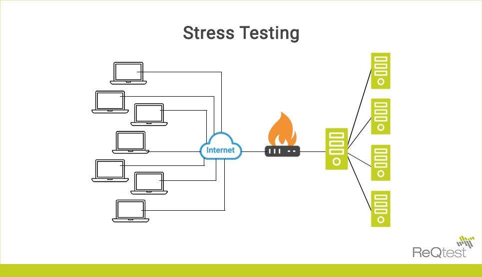

In today's rapidly evolving financial landscape, understanding and managing risk is more critical than ever. Both individual traders and large institutions face a multitude of risks that can impact their financial health. The increasing complexity of global markets, driven by factors such as technological advancements, regulatory changes, and geopolitical tensions, has heightened the importance of robust financial strategies. To navigate this environment effectively, a comprehensive approach is required, encompassing key tools such as risk assessment, financial analysis, stress testing, and algorithmic trading.

Risk assessment serves as a foundational pillar, identifying potential threats that could undermine investment goals. It involves evaluating numerous risk types, including market, credit, liquidity, and operational risks. This evaluation allows for the prioritization of risks and the formulation of strategies to mitigate their impact. Financial analysis supports this process by providing in-depth insights into financial health and potential vulnerabilities within portfolios.



Stress testing, a critical component of financial analysis, evaluates how portfolios perform under extreme, plausible scenarios, thereby measuring their resilience to drastic market changes. The ability to foresee potential adverse conditions enables institutions to prepare for and mitigate negative impacts, safeguarding against unforeseen events. Algorithmic trading, by leveraging advanced algorithms to execute trades, enhances market efficiency, liquidity, and price accuracy. The integration of machine learning and artificial intelligence within these algorithms allows for more sophisticated and adaptive strategies.

This article aims to provide an overview of these critical concepts, shedding light on their roles in enhancing decision-making processes in modern financial markets. We will explore the significance of risk assessment, financial analysis, stress testing, and algorithmic trading, along with the methodologies and tools finance professionals utilize to implement them effectively. The ultimate objective is to form a strategic blueprint that traders and financial institutions can deploy to safeguard their investments and capitalize on opportunities in volatile markets. By embedding these methodologies within core financial strategies, the finance industry can move towards a future of more transparent, well-managed, and sustainable financial ecosystems.

## Table of Contents

## Understanding Risk Assessment in Finance

Risk assessment is a crucial component of financial management, serving as the initial step in the process of identifying and mitigating threats that could undermine investment objectives. This process includes evaluating a broad spectrum of risks such as market, credit, liquidity, and operational risks. By effectively prioritizing these risks, financial managers can address their potential impacts proactively.

Market risk, which arises from fluctuations in market prices, can adversely affect investment portfolios. Credit risk involves the possibility that a counterparty will default on its obligations, while liquidity risk relates to the difficulty of converting assets into cash without significant loss. Operational risk pertains to losses resulting from inadequate or failed internal processes, people, or systems.

To assess these risks, quantitative methods like Value at Risk (VaR) models, scenario analysis, and stress testing are widely employed. VaR models estimate the maximum potential loss of a portfolio over a specified period, given normal market conditions and a certain confidence interval. For example, if a portfolio has a 1-day VaR of $1 million at a 95% confidence level, there is a 5% chance that the portfolio will lose more than $1 million in a day. Scenario analysis involves evaluating a portfolio under hypothetical situations, while stress testing examines the effects of extreme conditions on financial stability.

Qualitative factors are equally significant in risk assessment. These include market sentiment, which reflects the overall attitude of investors towards particular financial markets, and can influence price movements significantly. Regulatory changes also play a critical role, as financial entities must comply with evolving regulations that may impact operations. Geopolitical events can disrupt markets by introducing uncertainties, such as trade wars or political instability.

Maintaining a dynamic risk assessment process enables financial entities to adapt to ever-changing market conditions. A proactive approach to risk management involves regularly updating models and strategies to incorporate new data and insights. This adaptability ensures that entities remain vigilant and prepared for potential threats, ultimately safeguarding their financial health. By continuously monitoring and refining risk assessment processes, financial organizations can bolster their resilience against unforeseen events and strengthen their strategic planning capabilities.

## The Role of Stress Testing in Financial Analysis

Stress testing serves as a crucial mechanism within financial analysis, designed to assess how investment portfolios and financial institutions withstand adverse conditions that deviate significantly from normal market environments. This tool facilitates the examination of portfolios against hypothetical scenarios that include extreme economic downturns, shifts in interest rates, or other financial shocks, thus providing insights into potential weaknesses and vulnerabilities.

The ability of a financial institution to remain resilient amidst severe market disruptions is a pivotal concern for regulators, which often mandate stress testing as part of comprehensive risk management practices. For instance, the Dodd-Frank Wall Street Reform and Consumer Protection Act requires large financial institutions to conduct annual stress tests to ensure they possess sufficient capital buffers to absorb losses during economic crises. These regulatory requirements aim to safeguard the broader financial system and promote financial stability by ensuring that institutions adopt robust capital and risk management frameworks.

Stress testing methodologies are diverse, allowing institutions to gain multiple perspectives on financial vulnerabilities. Historical stress testing examines past market conditions to evaluate potential future impacts, while hypothetical stress testing constructs plausible adverse scenarios that have not yet occurred. Simulated stress testing employs complex models to predict how portfolios might perform under specified market disruptions. Reverse stress testing, on the other hand, starts with the assumption of failure and works backward to understand the conditions that could lead to such an outcome. This reverse approach can unveil hidden vulnerabilities and offer unique insights not otherwise apparent.

A sound stress testing framework not only illuminates areas of concern but also facilitates the development of strategic remediation actions. By identifying potential threats in advance, institutions can devise and implement contingency plans to bolster their risk management strategies. For example, they might adjust their asset allocations, enhance [liquidity](/wiki/liquidity-risk-premium) provisions, or seek additional capital if stress testing results indicate vulnerability in these areas. Moreover, this proactive approach aids in refining the overall risk management architecture, ensuring that institutions are better prepared to face future disruptions.

In summary, stress testing is a pivotal tool in financial analysis used to gauge the fortitude of portfolios and institutions under adverse conditions. By employing various types of stress tests, financial entities can obtain a comprehensive understanding of potential risks and implement measures to mitigate these threats. As financial markets continue to evolve, regular and thorough stress testing will remain an indispensable component of effective financial risk management.

## Algorithmic Trading: Transforming Modern Finance

Algorithmic trading has become a pivotal element in the contemporary financial landscape, relying on advanced computer algorithms to execute trades informed by pre-defined criteria. This method leverages the power of computational speed and data-driven decisions, yielding significant improvements in trading efficiency. Notably, [algorithmic trading](/wiki/algorithmic-trading) enhances market liquidity and price accuracy by facilitating rapid transactions that would be unachievable through manual trading processes.

The impact of algorithmic trading on market structure is profound, as it accounts for a significant portion of trading [volume](/wiki/volume-trading-strategy) in major financial markets. By automating the trading process, it reduces transaction costs, minimizes human error, and allows traders to capitalize on fleeting market opportunities. Trades can be executed swiftly based on statistical models, technical indicators, and other sophisticated quantitative techniques.

Back-testing algorithmic trading systems is crucial to ensure their reliability across diverse market conditions. This process involves testing the algorithm against historical data to evaluate its performance and refine its decision-making logic. Likewise, stress-testing these systems is essential, simulating extreme market conditions to determine their robustness and identify potential vulnerabilities. These practices help mitigate risks and enhance the adaptability of trading strategies.

The integration of [machine learning](/wiki/machine-learning) and [artificial intelligence](/wiki/ai-artificial-intelligence) (AI) in algorithmic trading signifies the advent of more sophisticated and adaptive strategies. Machine learning models can analyze vast datasets, uncover hidden patterns, and optimize trading algorithms in real-time. For instance, [reinforcement learning](/wiki/reinforcement-learning), a type of machine learning, is used to develop algorithms that can improve themselves through trial and error in dynamic trading environments.

Despite its advantages, algorithmic trading's dependence on technology presents unique risks. System failures, such as software bugs or network outages, can lead to significant financial losses. Moreover, algorithms might inadvertently contribute to market manipulations or exacerbate [volatility](/wiki/volatility-trading-strategies), as observed during events like the May 6, 2010 "Flash Crash." Consequently, robust oversight and precise controls are essential. Regulatory measures, alongside sophisticated monitoring systems, help mitigate the risks associated with algorithmic trading, ensuring that such systems operate within safe and ethical boundaries.

In summary, algorithmic trading continues to transform modern finance by offering enhanced trading capabilities while necessitating stringent processes and policies to manage its intrinsic risks.

## Integration of Risk Assessment and Stress Testing in Algorithmic Trading

The integration of risk assessment and stress testing within algorithmic trading provides a comprehensive approach to managing financial uncertainties. Algorithmic trading, grounded in the use of computer algorithms for executing trades, demands precision and foresight, enabling rapid, data-driven decision-making. This precision becomes feasible when stress testing and risk assessment are woven into the fabric of algorithmic strategies.

Stress testing serves as a keystone method by allowing trading systems to evaluate their performance under extreme market scenarios, thus preparing for unexpected conditions. In practice, stress testing requires simulating adverse market events to determine potential impacts on trading algorithms. For instance, a common approach would involve historical stress testing that revisits past market turmoil to evaluate how the current algorithm might have fared. This way, stress tests ensure that algorithms remain robust even if market disruptions arise.

Risk assessment processes complement these tests by aligning algorithmic systems with an investor's risk appetite and market volatility. This involves the development of mathematical models that quantify risk levels associated with various financial instruments. Value at Risk (VaR) is a conventional metric, calculated as:

$$
\text{VaR} = \text{Portfolio Value} \times \text{Volatility} \times \sqrt{\text{Time Period}}
$$

These risk metrics guide the configuration and real-time adjustment of trading algorithms to ensure alignment with predefined risk thresholds.

The implementation of Monte Carlo simulations and scenario analysis software further enhances the integration process. Monte Carlo simulations offer a probabilistic assessment of potential portfolio outcomes by running numerous simulations with random variables, giving traders a spectrum of possible future scenarios. An example in Python might involve leveraging libraries such as NumPy and SciPy to perform these simulations efficiently:

```python
import numpy as np

# Assuming some initial parameters for the simulation
initial_price = 100
volatility = 0.2
time_horizon = 1  # in years
num_simulations = 10000

# Monte Carlo simulation for potential asset prices
np.random.seed(0)
price_paths = np.zeros(num_simulations)
for i in range(num_simulations):
    random_shock = np.random.normal(0, volatility)
    price_paths[i] = initial_price * np.exp((volatility ** 2 / 2 + random_shock) * time_horizon)

estimated_risk = np.percentile(price_paths, 5)  # For a 95% VaR
print(f"Estimated 5% VaR: {estimated_risk}")
```

Backtesting frameworks also play a critical role, offering a retrospective evaluation of algorithm performance by applying historical data to predictive models. Through this analysis, finance professionals can identify potential weaknesses and recalibrate strategies to mitigate risks.

This integrated approach not only safeguards trading portfolios but also enhances strategic planning and regulatory compliance. By embedding risk assessment and stress testing into algorithmic systems, traders can fortify their strategies against financial uncertainties and ensure adherence to regulatory standards. Such consolidation ultimately fosters more resilient and informed trading operations, aligning algorithmic trades with comprehensive risk management frameworks in the ever-dynamic financial markets.

## Challenges and Future Directions

In the ever-evolving financial landscape, financial professionals face a myriad of challenges in implementing robust risk management strategies. Among these, data quality and computational resources are paramount. The accuracy of data inputs directly influences the reliability of financial models. Inconsistencies or inaccuracies in data can lead to flawed outcomes, making high-quality data a critical requirement for effective financial analysis and decision-making.

Computational resources also play a vital role. The increasing complexity of financial models demands advanced computational power to process vast amounts of data and execute intricate algorithms. Limited resources can hinder the ability to perform necessary analyses such as back-testing, scenario analysis, and real-time stress testing.

Market dynamics are constantly shifting, further complicating the efforts to maintain up-to-date financial models. This process is labor-intensive, requiring continuous monitoring of market trends and stringent adherence to regulatory requirements. As financial markets and regulations evolve, financial professionals must ensure that their models remain relevant and compliant.

Looking ahead, the future of financial analysis is poised to benefit significantly from greater automation and real-time analytics. Automation simplifies processes like data collection and model recalibration, allowing for a more efficient handling of large datasets and complex computations. Real-time analytics provide an edge by offering immediate insights and facilitating timely decision-making, crucial in fast-paced financial markets.

The integration of climate and geopolitical risk factors represents another frontier for financial analysis. These factors introduce new dimensions of risk that financial professionals must account for to ensure comprehensive risk management strategies. By incorporating these elements into existing frameworks, institutions can better predict and mitigate potential disruptions.

Innovations like AI-driven stress tests hold promise for advancing risk management capabilities. Such tests can enhance the accuracy and depth of financial analyses by leveraging machine learning algorithms to evaluate a more extensive range of scenarios. Additionally, enhanced collaboration tools between financial institutions can lead to shared insights and best practices, fostering a cooperative approach to addressing common challenges.

The successful navigation of future challenges will require continuous learning, flexibility, and investment in technology. Financial professionals must stay abreast of industry developments and be prepared to adapt to new tools and methodologies. By prioritizing these areas, the finance industry can create more robust frameworks to manage risks and capitalize on opportunities in an increasingly complex market environment.

## Conclusion

In an era where financial markets are characterized by their complexity and rapid evolution, the strategies employed for managing risks and capturing opportunities must equally advance. The integration of risk assessment, stress testing, and algorithmic trading creates a comprehensive framework that supports informed decision-making and enhances financial resilience. This synergy allows traders and financial institutions to align their strategies with real-time market dynamics, fostering a proactive rather than reactive approach to risk management.

Risk assessment provides the foundational knowledge needed to identify and understand potential threats to investment goals, while stress testing evaluates the robustness of financial portfolios under extreme, hypothetical conditions. Together, they offer insights crucial for developing and adjusting trading strategies that withstand a variety of market scenarios. Their combined use allows for an anticipatory stance in risk mitigation, reducing the likelihood of being caught off guard by unforeseen events.

Algorithmic trading, on the other hand, automates decision-making processes and facilitates the execution of complex trading strategies at an unprecedented speed. By embedding risk assessment and stress testing within algorithmic frameworks, traders can ensure their algorithms are not only fast and efficient but also resilient to market volatilities. This integration is further strengthened by advanced tools such as Monte Carlo simulations and scenario analysis software, which allow for the creation of robust and adaptable trading systems.

The application of these methodologies results in strategies that are inherently more adaptable and capable of capitalizing on market opportunities while safeguarding against potential losses. This leads to enhanced financial performance and stability, which are critical in navigating the uncertainties inherent in today's financial landscapes.

By adopting these methodologies at the core of their financial strategies, individuals and institutions can not only protect their investments but also contribute to a financial ecosystem that is more transparent, well-managed, and sustainable. This holistic approach ensures the finance industry is not just prepared for the challenges of today, but is also poised to capitalize on future advancements and opportunities, fostering a robust economic environment for all stakeholders involved.

## References & Further Reading

[1]: Hull, J. C. (2018). ["Risk Management and Financial Institutions."](https://books.google.com/books/about/Risk_Management_and_Financial_Institutio.html?id=1J1QDwAAQBAJ) Wiley.

[2]: Basel Committee on Banking Supervision. (2009). ["Principles for sound stress testing practices and supervision."](https://www.bis.org/bcbs/publ/d450.htm) Bank for International Settlements.

[3]: Lopez de Prado, M. (2018). ["Advances in Financial Machine Learning."](https://www.amazon.com/Advances-Financial-Machine-Learning-Marcos/dp/1119482089) Wiley.

[4]: Brunnermeier, M. K., & Pedersen, L. H. (2009). ["Market Liquidity and Funding Liquidity."](https://www.princeton.edu/~markus/research/papers/liquidity.pdf) American Economic Review, 99(2), 193-197.

[5]: Chan, E. P. (2009). ["Quantitative Trading: How to Build Your Own Algorithmic Trading Business."](https://github.com/ftvision/quant_trading_echan_book) Wiley.