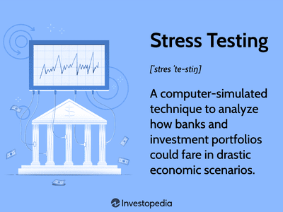

## Table of Contents

## What is stress testing in financial analysis?

Stress testing in financial analysis is a method used to see how well a bank or financial institution can handle tough situations. It involves creating pretend scenarios where the economy is doing badly, like a big drop in stock prices or a rise in unemployment. The goal is to check if the bank has enough money to survive these tough times without going bankrupt.

By doing stress tests, banks can find out their weak spots and fix them before a real crisis happens. Regulators, like government agencies, also use these tests to make sure banks are safe and sound. If a bank doesn't pass a stress test, it might need to hold more money or change how it does business to be better prepared for future problems.

## How does Value at Risk (VaR) analysis work?

Value at Risk (VaR) analysis is a way to measure how much money an investment or a portfolio might lose over a certain period of time, usually under normal market conditions. It gives you a number that says, "There's a certain chance (like 5% or 1%) that you could lose this much money in the next day, week, or month." For example, if your VaR is $1 million at a 5% level over one day, it means there's a 5% chance you could lose $1 million or more in one day.

To calculate VaR, people often use historical data, statistical models, or computer simulations. They look at how prices have moved in the past and use that information to guess how they might move in the future. This helps them figure out the worst-case loss they might face. VaR is useful for banks, investment firms, and anyone who wants to understand and manage the risks in their investments, but it's important to remember that it's just an estimate and can't predict every possible outcome.

## Why are stress testing and VaR important for financial institutions?

Stress testing and VaR are important for financial institutions because they help them understand and manage risks. Stress testing lets banks see how they would handle really bad situations, like a big economic crash. By pretending that these bad things happen, banks can find out if they have enough money to survive. This helps them fix any weak spots before a real crisis hits. It's like practicing for a storm so you know your house won't fall down.

VaR is also really useful because it tells banks how much money they might lose on a normal day. It gives them a number that says, "There's a small chance you could lose this much money." This helps banks plan and make sure they have enough money set aside to cover those losses. Both stress testing and VaR are like safety checks that help keep banks strong and ready for whatever might happen in the future.

## What are the common methods used to calculate VaR?

There are three main ways to calculate VaR: the historical method, the variance-covariance method, and the Monte Carlo simulation. The historical method looks at how prices moved in the past. It takes those past movements and uses them to guess how prices might move in the future. For example, if you want to know the VaR for the next day, you look at what happened on past days and see how bad the worst days were. This method is easy to understand but assumes that the future will be a lot like the past.

The variance-covariance method, also called the parametric method, uses math formulas to figure out VaR. It assumes that price changes follow a normal pattern, like a bell curve. By using this pattern and knowing things like the average return and how much prices usually move around (the standard deviation), you can calculate VaR. This method is quick and easy to use but it can be less accurate if prices don't follow a normal pattern.

The Monte Carlo simulation is a bit more complicated. It uses a computer to run lots of pretend scenarios of how prices might move. Each scenario is different, and after running many of them, you can see how often you would lose a certain amount of money. This method can be very accurate because it can handle many different kinds of price movements, but it takes a lot of computer power and time. Each of these methods has its own pros and cons, so people choose the one that fits their needs best.

## Can you explain the difference between historical simulation and Monte Carlo simulation in VaR?

Historical simulation for VaR looks at what happened in the past to guess what might happen in the future. It takes all the price changes from past days and uses them to see how bad things could get. If you want to know the VaR for the next day, you look at the worst days in the past and use that to predict the worst that could happen tomorrow. This method is simple because it doesn't need fancy math, but it assumes that the future will be a lot like the past, which might not always be true.

Monte Carlo simulation, on the other hand, uses a computer to create many different pretend scenarios of how prices might move. It doesn't just look at what happened before; it makes up new possibilities. Each scenario is different, and after running thousands or even millions of these scenarios, you can see how often you would lose a certain amount of money. This method can be very accurate because it can handle all sorts of different price movements, but it takes a lot of computer power and time to run all those scenarios.

## How do regulatory requirements influence stress testing practices?

Regulatory requirements play a big role in how banks do stress testing. Governments and financial watchdogs want to make sure banks can survive tough times, so they set rules that banks must follow. These rules say how often banks need to do stress tests, what kind of bad scenarios they should imagine, and what they need to do if they don't pass the tests. For example, in the United States, the Federal Reserve runs stress tests every year to see if big banks can handle a bad economy. If a bank fails, it might have to hold more money or change how it does business to be safer.

Because of these rules, banks have to take stress testing seriously. They can't just do it once and forget about it; they need to keep testing and improving. This helps banks be ready for real problems and makes the whole financial system stronger. When everyone knows that banks are being checked regularly, it builds trust that the banks won't fail suddenly. So, regulatory requirements don't just protect the banks, they also help keep the economy stable and safe for everyone.

## What are the limitations of Value at Risk as a risk management tool?

Value at Risk (VaR) is a useful tool for understanding risk, but it has some big limitations. One problem is that VaR only tells you the most you might lose on a normal day. It doesn't say anything about how bad things could get if something really unusual happens. Imagine you're driving a car and VaR is like knowing the speed limit. It doesn't tell you what to do if a deer jumps in front of you. So, if the market does something crazy, VaR might not help you much.

Another issue with VaR is that it's based on guesses about the future, which can be wrong. VaR uses past data or math models to predict what might happen, but the future isn't always like the past. If something new and unexpected happens, like a big economic crisis, VaR might not see it coming. Also, different people might calculate VaR in different ways, so one person's VaR number might not match someone else's. This can make it hard to compare risks across different banks or investments.

## How can stress testing be integrated into a firm's overall risk management framework?

Stress testing can be a big part of how a company manages risk by helping them see how they would handle really bad situations. Imagine you're playing a game and you want to know if you can win even if everything goes wrong. Stress testing is like playing that game over and over with different bad things happening each time. By doing this, a company can find out where they might lose money and fix those problems before they happen for real. They can also use what they learn to make better plans and have more money saved up, just in case.

To make stress testing work well with other ways of managing risk, a company needs to use it together with other tools like Value at Risk (VaR). VaR is good for normal days, but stress testing is better for really bad days. By using both, a company can get a fuller picture of their risks. They can also share what they learn from stress tests with everyone in the company, so everyone knows what to do if a crisis hits. This helps everyone be ready and makes the whole company stronger and safer.

## What advanced techniques can be used to enhance the accuracy of stress tests?

To make stress tests more accurate, companies can use something called scenario analysis. This means they don't just look at one bad situation, but many different ones. They can imagine all sorts of problems, like a big drop in the stock market, a sudden rise in unemployment, or even a natural disaster. By testing how they would do in all these different cases, they get a better idea of what might go wrong and can plan better. It's like practicing for a test by trying out lots of different questions, not just one.

Another way to improve stress tests is by using more advanced computer models. These models can take into account lots of different things at the same time, like how different parts of the economy affect each other. For example, they can show how a problem in one country might cause trouble in another. By using these models, companies can see more clearly how different bad situations might play out. It's like using a more detailed map to find your way instead of a simple one.

## How do you interpret and act on the results of a stress test?

When you get the results of a stress test, you need to look at them carefully to see what they mean. The results will show how your bank or business might do if something really bad happens, like a big drop in the stock market or a lot of people losing their jobs. If the results say you might lose a lot of money or even go bankrupt, that's a warning sign. It means you need to pay attention and maybe change some things to make your business stronger. On the other hand, if the results show you can handle the bad situation pretty well, it's good news, but you still need to keep an eye on things and be ready for anything.

Acting on the results of a stress test means making plans to fix any problems you found. If the test shows you might not have enough money to survive a crisis, you might need to save more money or change how you do business to be safer. For example, you could decide to lend less money or invest in things that are less risky. It's also important to tell everyone in your company about the results so they know what to do if a real crisis happens. By using the stress test results to make your plans better, you can help make sure your business stays strong no matter what comes your way.

## What are the challenges in modeling tail risk in VaR and stress testing?

Modeling tail risk, which is the chance of really bad things happening, is hard for both VaR and stress testing. For VaR, the main problem is that it usually assumes things will follow a normal pattern, like a bell curve. But in real life, big, unexpected events happen more often than a normal curve would predict. These events are called "tail events" because they're far out on the tails of the curve. If you only use a normal curve to calculate VaR, you might miss these tail events and think you're safer than you really are.

Stress testing tries to catch these tail events by imagining really bad situations, but it has its own challenges. One big problem is deciding which bad situations to imagine. If you don't think of the right ones, your stress test won't be very helpful. Also, stress tests often use past data to guess what might happen in the future, but the future can be different from the past. So, even if you come up with the right bad situations, your guesses about how bad they'll be might be off. Both VaR and stress testing are useful, but they need to be used carefully to really understand tail risk.

## How can machine learning and AI be utilized to improve stress testing and VaR analysis?

Machine learning and AI can make stress testing and VaR analysis better by finding patterns in lots of data that people might miss. Imagine you're trying to guess what will happen in a game, but you have to look at thousands of past games to do it. Machine learning can look at all that data really fast and find out what usually happens before something bad. This helps make stress tests more realistic because they can be based on a wider range of possible bad situations. For VaR, machine learning can help predict how prices might move in the future by learning from how they moved in the past, making the guesses more accurate.

Another way AI helps is by making models that can change and learn over time. In the real world, things keep changing, and what worked yesterday might not work today. AI can keep learning from new data and update the models used for stress testing and VaR. This means the models stay useful and can catch new risks that come up. By using AI, companies can be better prepared for whatever might happen because their risk management tools are always getting smarter and more accurate.

## What is Understanding Value at Risk (VaR)?

Value at Risk (VaR) is a fundamental statistical tool used in finance to measure the potential loss in value of an asset or a portfolio over a defined period at a certain confidence level. As a measure, VaR provides a threshold value, denoting that there is a predefined probability that the actual loss will exceed this value within the specified time frame. Typically, the confidence levels used are 95% or 99%, which translate into a 5% or 1% chance that the loss will surpass the VaR estimate. 

Mathematically, VaR can be expressed through the following equation:

$$
\text{Pr}(\Delta P < -\text{VaR}) = \alpha
$$

where $\Delta P$ represents the change in portfolio value, and $\alpha$ is the significance level (e.g., 0.05 for a 95% confidence level).

Different models for estimating VaR include:

1. **Historical Simulation**: This model uses past market data to simulate the range of potential losses. By ranking historical returns from worst to best, the VaR level corresponds to the return at the chosen percentile. While this method makes no assumptions about the return distribution, it relies heavily on past data, which may not account for unforeseen future events.

2. **Variance-Covariance Method**: Assuming that asset returns are normally distributed, this parametric approach calculates VaR using the mean and standard deviation of the returns. The formula is usually given as:

   \[ \text{VaR} = \mu + Z \cdot \sigma
$$

   where $\mu$ is the expected return, $Z$ is the Z-score corresponding to the desired confidence level from a standard normal distribution, and $\sigma$ is the standard deviation of returns. Its major drawback is the reliance on the assumption of normality, which is often violated in financial markets.

3. **Monte Carlo Simulation**: This model uses computational algorithms to simulate a wide range of possible future returns based on assumed probabilistic models. It generates random price paths for the assets and calculates potential portfolio values, thus deriving VaR from the simulated distribution of returns.

Despite its utility, VaR has notable limitations. One primary criticism is its inability to accurately predict extreme market conditions or tail risks, known as "black swan" events. These are rare but severe instances that lie beyond the regular confidence intervals of VaR. Moreover, VaR treats risks as if they happen under normal market conditions, often disregarding the potential for systemic breaks or the contagion effect during market crises.

VaR remains a widely adopted risk management tool due to its simplicity and clarity in assessing potential losses. However, it's crucial for investors and risk managers to recognize its limitations and complement VaR with other risk assessment methods to ensure comprehensive risk management.

## What are the key differences and complementary roles?

Value at Risk (VaR) and stress testing are pivotal components of financial risk management, each with distinct methodologies and objectives. VaR is a statistical measure that quantifies the potential loss in value of an asset or portfolio over a specific timeframe, given a certain confidence level. It provides a snapshot of expected losses under normal market conditions. For example, a one-day VaR at a 95% confidence level indicates that there is a 5% chance of the portfolio incurring a loss greater than the VaR value on any given day.

In contrast, stress testing evaluates the resilience of a financial institution by simulating extreme market conditions. It is scenario-based and involves assessing the impacts of hypothetical adverse events, such as economic downturns or financial crises, which fall outside the regular VaR calculations. Unlike VaR's reliance on probabilistic models, stress testing applies predefined stress scenarios that reflect unusual yet plausible risks.

The primary differences between these two approaches lie in their focus and applicability. VaR is instrumental for daily risk management, providing quantitative insights into potential short-term losses due to market volatility. This statistical measure is integral for setting risk limits and capital reserves on a routine basis. In mathematical terms, VaR can be expressed as:

$$
\text{VaR}_\alpha = -\inf \{ x \in \mathbb{R} : P(X \leq x) > \alpha \}
$$

where $\alpha$ represents the confidence level and $X$ is the return of the portfolio.

On the other hand, stress testing is more concerned with assessing vulnerabilities to catastrophic events that may have profound, long-lasting effects on an organization's financial stability. By going beyond normal market fluctuations, stress testing provides insights into tail risks—extreme but plausible risks that occur infrequently.

When combined, VaR and stress testing form a comprehensive risk assessment framework. This integration ensures that financial entities are prepared for both ordinary market behaviors and extraordinary disruptions. VaR's statistical assessment provides a consistent measure for regular risk control, while stress testing complements it by highlighting potential systemic risks and identifying weaknesses under extreme conditions.

Together, these tools allow for informed decision-making, facilitate strategic adjustments, and enhance the robustness of risk management practices. By balancing day-to-day analytical evaluations with scenario-based explorations of large-scale disturbances, investors and institutions can better safeguard assets and optimize trading strategies amid the dynamic landscape of financial markets.

## References & Further Reading

[1]: Jorion, P. (2007). ["Value at Risk: The New Benchmark for Managing Financial Risk"](https://link.springer.com/article/10.1007/s11408-007-0057-3). McGraw-Hill.

[2]: Hull, J. C. (2012). ["Risk Management and Financial Institutions"](https://books.google.com/books/about/Risk_Management_and_Financial_Institutio.html?id=1J1QDwAAQBAJ). Wiley.

[3]: Taleb, N. N. (2007). ["The Black Swan: The Impact of the Highly Improbable"](https://www.jstor.org/stable/23045073). Random House.

[4]: Glasserman, P. (2003). ["Monte Carlo Methods in Financial Engineering"](https://link.springer.com/book/10.1007/978-0-387-21617-1). Springer.

[5]: Tsay, R. S. (2005). ["Analysis of Financial Time Series"](https://cpb-us-w2.wpmucdn.com/blog.nus.edu.sg/dist/0/6796/files/2017/03/analysis-of-financial-time-series-copy-2ffgm3v.pdf). Wiley.

[6]: Cont, R. (2001). ["Empirical properties of asset returns: stylized facts and statistical issues"](http://rama.cont.perso.math.cnrs.fr/pdf/empirical.pdf). Quantitative Finance.

[7]: Pérignon, C., & Smith, D. R. (2010). ["The level and quality of Value-at-Risk disclosure by commercial banks"](https://www.sciencedirect.com/science/article/pii/S0378426609001940). Journal of Banking & Finance.