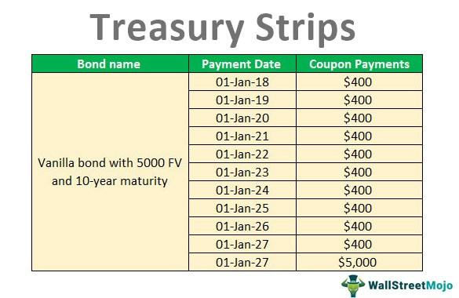

## Table of Contents

## What are strip bonds?

Strip bonds are a type of investment where a bond is split into its interest payments and its principal repayment. Instead of getting regular interest payments like with a normal bond, you buy each part separately. The parts that represent the interest payments are called coupons, and the part that represents the principal repayment at the end is called the residual. Each of these parts can be bought and sold on their own.

These bonds are popular because they let investors choose exactly when they want to get their money back. For example, if you need money at a specific time in the future, you can buy the part of the bond that matures at that time. Also, because strip bonds don't pay interest until they mature, they are often sold at a discount. This means you can buy them for less than their face value, and when they mature, you get the full face value, which can be a good way to make money.

## How do strip bonds work?

Strip bonds work by taking a regular bond and breaking it into smaller pieces. Imagine a bond like a savings account where you get interest payments every year and then get your money back at the end. With strip bonds, instead of getting all those interest payments over time, the bond is split up. Each interest payment becomes its own little bond, called a coupon, and the final payment of the bond's face value becomes another bond, called the residual. You can buy these pieces separately, so if you want money at a certain time, you can just buy the coupon or residual that matures then.

Because strip bonds don't give you any money until they mature, they are usually sold for less than what they will be worth at the end. This is called buying at a discount. For example, if a strip bond will be worth $1,000 when it matures, you might be able to buy it now for $900. When it matures, you get the full $1,000, so you make a profit of $100. This makes strip bonds a good choice for people who want to save money for a specific future date and want to know exactly how much money they will have then.

## What is the process of stripping a bond?

Stripping a bond means taking a regular bond and breaking it into smaller parts. Imagine a bond like a savings account where you get interest every year and then get your money back at the end. When you strip a bond, you separate each of those yearly interest payments into their own little bonds, called coupons. The final payment, which is the bond's face value, becomes another bond called the residual. So instead of one bond, you now have many smaller ones, each with its own maturity date.

This process is done by financial institutions like banks or brokers. They buy a regular bond and then split it up into these smaller pieces. Each piece can be sold to different investors. Because these smaller bonds don't pay any money until they mature, they are usually sold for less than what they will be worth at the end. This is called selling at a discount. For example, if a strip bond will be worth $1,000 when it matures, it might be sold now for $900. When it matures, the investor gets the full $1,000, making a profit of $100.

## What are the benefits of investing in strip bonds?

One big benefit of investing in strip bonds is that they let you plan your money for the future. Since each part of a strip bond matures at a different time, you can pick the ones that will give you money when you need it. For example, if you want money in 5 years to buy a house, you can buy a strip bond that will mature in 5 years. This way, you know exactly how much money you will have and when you will get it.

Another benefit is that strip bonds can be bought at a discount. This means you pay less for them now than what they will be worth when they mature. If a strip bond is worth $1,000 at the end but you can buy it for $900 now, you make a profit of $100 when it matures. This can be a good way to grow your money over time, especially if you don't need regular interest payments and can wait until the bond matures to get your money.

## What are the risks associated with strip bonds?

One risk of strip bonds is that they can lose value if interest rates go up. When interest rates rise, the price of bonds usually goes down. Since strip bonds are sold at a discount and their value comes from the difference between what you pay and what you get at maturity, a drop in bond prices can hurt your investment. If you need to sell your strip bond before it matures, you might get less money back than you expected.

Another risk is that strip bonds don't give you any money until they mature. This means if you need money sooner, you can't count on getting interest payments like you would with a regular bond. This can be a problem if you have unexpected expenses or if you need income to live on. You have to be sure you can wait until the bond matures to get your money.

## How are strip bonds priced?

Strip bonds are priced based on the idea that you buy them for less than what they will be worth when they mature. This is called buying at a discount. For example, if a strip bond will be worth $1,000 at the end, you might be able to buy it now for $900. The difference between what you pay and what you get at the end is your profit. The exact price depends on how long you have to wait until the bond matures and what interest rates are doing at the time.

Interest rates are important for pricing strip bonds. If interest rates go up after you buy a strip bond, the price of the bond can go down. This happens because new bonds being sold will have higher interest rates, making your older bond less attractive to other investors. If you need to sell your strip bond before it matures, you might get less money than you paid for it. So, when you buy a strip bond, you need to think about what might happen with interest rates in the future.

## What is the yield to maturity for strip bonds?

The yield to maturity for strip bonds is the total return you will get if you hold the bond until it matures. It is calculated by figuring out the interest rate that makes the present value of the bond's future payment equal to what you paid for it. For strip bonds, this can be a bit tricky because they are sold at a discount and don't give you any money until they mature. The yield to maturity shows you how much your money will grow over time, taking into account the discount you paid and the time until the bond matures.

For example, if you buy a strip bond for $900 that will be worth $1,000 when it matures in 5 years, the yield to maturity is the interest rate that makes $900 today equal to $1,000 in 5 years. This rate is what you earn for holding the bond until the end. It's important to know the yield to maturity because it helps you compare strip bonds to other investments and see which one gives you a better return for your money.

## How do strip bonds compare to traditional bonds in terms of returns?

Strip bonds and traditional bonds can give you different returns. With traditional bonds, you get interest payments every year or so, and then you get your money back at the end. The return you get is the interest you earn over time plus any profit if you sell the bond for more than you paid. With strip bonds, you don't get any interest payments until the bond matures. Instead, you buy the bond at a discount, so if you pay less than what it will be worth at the end, you make a profit when it matures. The return on a strip bond is this profit, and it depends on how big the discount is and how long you have to wait.

Comparing the returns can be tricky. If you need regular income, traditional bonds might be better because they give you interest payments you can use right away. But if you can wait until the bond matures, strip bonds might give you a higher return. This is because the discount on a strip bond can be bigger than the interest you would get from a traditional bond over the same time. Also, changes in interest rates can affect both types of bonds, but they might affect strip bonds more because their price depends a lot on the discount and the time until they mature.

## Can you provide an example of a strip bond investment?

Imagine you want to save money to buy a car in 5 years. You find a strip bond that will be worth $10,000 when it matures in exactly 5 years. Right now, you can buy this strip bond for $8,000. This means you pay $8,000 today, and in 5 years, you will get $10,000. The difference between what you pay and what you get at the end is your profit, which is $2,000. This is a good way to grow your money over time because you know exactly how much you will have when you need it.

Now, let's say interest rates go up after you buy the strip bond. If you need to sell the bond before it matures, you might not get the $8,000 back because the price of the bond could go down. This is a risk you have to think about when you invest in strip bonds. But if you can wait until the bond matures, you will still get the full $10,000, no matter what happens with interest rates.

## What are the tax implications of investing in strip bonds?

When you invest in strip bonds, you have to think about taxes. Even though you don't get any money until the bond matures, you still have to pay taxes on the interest you earn every year. This is called accrued interest, and it's the interest that adds up over time even though you don't see it until the end. The government says you have to pay taxes on this interest each year, even if you don't get the money yet. This can be hard because you have to pay taxes on money you haven't actually received.

If you sell a strip bond before it matures, there can be more tax issues. If you sell it for more than you paid, you have to pay capital gains tax on the profit. If you sell it for less than you paid, you might be able to use the loss to lower your taxes. It's important to keep track of how much you paid for the bond and how much you sell it for, so you know what to report on your taxes. Talking to a tax advisor can help you understand all the tax rules and make sure you do everything right.

## How do market conditions affect the performance of strip bonds?

Market conditions, especially changes in interest rates, can really affect how well strip bonds do. When interest rates go up, the prices of strip bonds usually go down. This happens because new bonds being sold will have higher interest rates, making your older bond less attractive to other investors. If you need to sell your strip bond before it matures, you might get less money back than you expected. On the other hand, if interest rates go down, the price of your strip bond can go up, which is good if you want to sell it early.

Another thing that can affect strip bonds is how much people want to buy them. If a lot of people want to buy strip bonds, their prices can go up. But if fewer people are interested, their prices can go down. Economic news, like whether people think the economy will grow or shrink, can also change how much people want to buy strip bonds. If the economy is doing well, people might be more willing to take risks and buy other investments, which can make strip bonds less popular. But if the economy is not doing well, people might want the safety of strip bonds more, which can make their prices go up.

## What strategies can be used to optimize a portfolio with strip bonds?

One way to make your portfolio better with strip bonds is to use them to match your future money needs. If you know you will need money at a certain time, like for buying a house or paying for school, you can buy a strip bond that matures when you need the money. This way, you know exactly how much money you will have and when you will get it. It's like setting a timer for your money. You can also mix strip bonds with other investments, like stocks or regular bonds, to balance risk and reward. Strip bonds can be a safe part of your portfolio because they give you a set amount of money at the end, which can help if the stock market goes down.

Another strategy is to think about interest rates when you buy strip bonds. If you think interest rates will go up, you might want to buy strip bonds that mature soon, so you don't lose as much money if their prices go down. If you think interest rates will go down, you might want to buy strip bonds that mature later, because their prices could go up. Also, you can use strip bonds to save on taxes. Since you have to pay taxes on the interest you earn each year, even if you don't get the money yet, you might want to buy strip bonds in a tax-free account like an IRA. This way, you don't have to worry about paying taxes on the interest until you take the money out of the account.

## What are Strip Bonds and how do they work?

Strip bonds, also known as zero-coupon bonds, represent a distinct category within fixed-income securities. In these instruments, both the principal and coupon payments are sold separately. This separation creates two individual securities: the principal, also known as the "residual," and the interest payments, often referred to as "coupons." 

A key characteristic of strip bonds is that they are typically sold at a deep discount to their par or face value. Investors do not receive periodic interest payments, as is common with traditional bonds. Instead, the bonds are structured to deliver returns solely at maturity. The face value is paid out at maturity, effectively encompassing the accumulation of interest income over the bond's life. This zero-coupon nature allows these bonds to avoid reinvestment risk, a concern with standard bonds where interest payments must be regularly reinvested at potentially varying interest rates.

The allure of strip bonds lies in this zero-coupon structure, which is particularly appealing to investors looking for long-term, predictable gains. Due to their structured payout at maturity, investors can precisely forecast the length of their investment horizon and the expected returns. Such predictability makes strip bonds an attractive option for those seeking to match future financial obligations, such as retirement funding or education expenses.

The pricing of strip bonds is significantly influenced by prevailing interest rates and the credit rating of the issuer. As interest rates rise, the present value of future cash flows decreases, leading to a lower price for strip bonds. Conversely, a decline in interest rates typically results in price appreciation. Additionally, an issuer's creditworthiness impacts the bond's price; higher credit ratings generally translate to lower yields, given the reduced risk of default.

Mathematically, the price $P$ of a strip bond can be expressed as the present value of its face value $F$ discounted by the yield $Y$ over the number of periods $n$:

$$
P = \frac{F}{(1 + Y)^n}
$$

This formula reflects how the bond's pricing mechanics interact with [interest rate](/wiki/interest-rate-trading-strategies) movements and emphasizes the potential for capital gains at maturity if purchased at a deep discount. 

Investors need to consider the potential for capital gains, as the difference between the purchase price and the face value at maturity can yield significant returns. However, as with any investment, it is crucial to assess the risks and market conditions, including interest rate forecasts and the issuer's financial health.

## What are the financial returns on strip bonds?

Strip bonds are unique financial instruments that primarily offer returns through their yield to maturity (YTM) and potential capital gains. As a type of zero-coupon bond, they do not pay periodic interest; instead, they provide all returns at maturity in the form of their full face value. This characteristic becomes central when evaluating their financial returns.

### Yield to Maturity (YTM)

Yield to maturity is a critical measure for strip bond investors. It represents the total return anticipated if the bond is held to its maturity date. The YTM calculation encompasses the bond's purchase price, its total face value, the time left until maturity, and the compounding effect of the bond's accrual. The formula for YTM of a zero-coupon bond like a strip bond is:

$$
\text{YTM} = \left( \frac{\text{Face Value}}{\text{Purchase Price}} \right)^{\frac{1}{n}} - 1
$$

where $n$ is the number of years until maturity. The YTM helps investors compare the potential returns of strip bonds against other investment vehicles, taking into account the lack of interim cash flows.

### Potential Capital Gains

Capital gains in strip bonds occur when the bond is purchased at a discount and either sold or held until reaching its face value at maturity. This gain is the difference between the bond's purchase price and its face value. For instance, if an investor buys a strip bond for $800 with a face value of $1,000, the capital gain would be $200 upon maturity, assuming no change in interest rates affecting its market value.

### Tax Implications

Investors must also consider the tax implications associated with strip bonds, often referred to as "phantom income." Although investors do not receive cash flows until the bond matures, they are required to report imputed interest income annually on their tax returns. This imputed interest is essentially the increase in the bond's value each year, calculated as:

$$
\text{Imputed Interest} = \left( \text{YTM} \times \text{Adjusted Cost Base} \right)
$$

where the adjusted cost base is updated yearly to reflect the accrued value of the bond.

### Example

Consider a strip bond purchased at $800 with a face value of $1,000 maturing in 5 years. To compute the YTM, use:

```python
def calculate_ytm(face_value, purchase_price, n):
    return (face_value / purchase_price) ** (1 / n) - 1

ytm = calculate_ytm(1000, 800, 5)
print(f"Yield to Maturity: {ytm:.2%}")
```

The calculated YTM helps investors assess the return on investment, offering clarity on potential returns when held to maturity.

Through their structured format, strip bonds present a strategic approach to fixed-income investing, allowing investors to plan long-term gains by evaluating YTM and leveraging potential capital gains within a tax-implicated environment.

## References & Further Reading

[1]: Fabozzi, F. J. (2007). ["Fixed Income Analysis"](https://books.google.com/books/about/Fixed_Income_Analysis.html?id=lujLawVLS3YC). CFA Institute Investment Series. 

[2]: ["Advances in Financial Machine Learning"](https://www.amazon.com/Advances-Financial-Machine-Learning-Marcos/dp/1119482089) by Marcos Lopez de Prado

[3]: ["Fixed Income Securities: Tools for Today’s Markets"](https://www.amazon.com/Fixed-Income-Securities-Markets-Finance/dp/1119835550) by Bruce Tuckman and Angel Serrat

[4]: ["Machine Learning for Algorithmic Trading"](https://github.com/stefan-jansen/machine-learning-for-trading) by Stefan Jansen

[5]: ["Quantitative Trading: How to Build Your Own Algorithmic Trading Business"](https://www.amazon.com/Quantitative-Trading-Build-Algorithmic-Business/dp/1119800064) by Ernest P. Chan