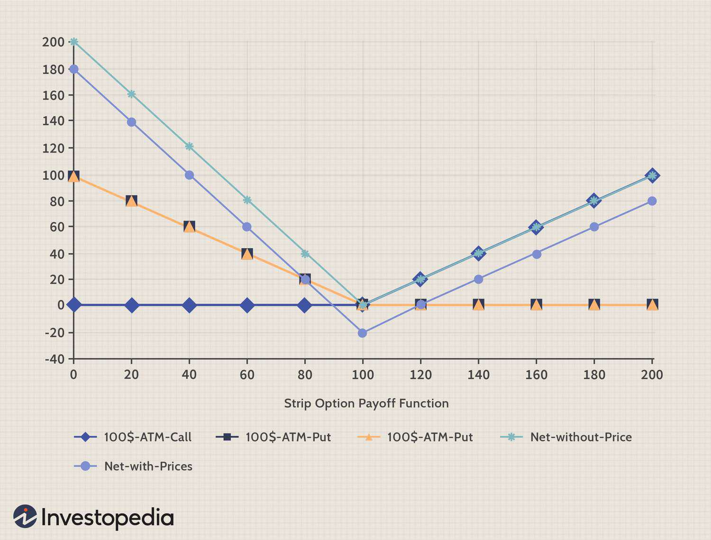

## Table of Contents

## What are strip options?

Strip options are a type of financial option that involves trading options on a group of assets, like stocks or commodities, all at the same time. Instead of buying or selling options on one asset, you do it for several assets together. This can be useful if you want to manage risk or make a profit from the overall performance of a group of assets.

For example, if you think a group of technology stocks will do well, you might buy strip options on those stocks. This way, you can benefit if all or most of the stocks go up in value. Strip options can be complex and are usually used by experienced investors who understand how they work and the risks involved.

## How do strip options differ from other types of options?

Strip options are different from other types of options because they involve trading options on a group of assets at the same time. Most other options, like call options or put options, are traded on just one asset. With strip options, you can buy or sell options on several assets together, which can help you manage risk or make a profit based on how the whole group of assets performs.

For example, if you buy a call option, you're betting that the price of one specific stock will go up. But if you use strip options, you're betting on a group of stocks, like all the stocks in a certain industry. This can be useful if you think the whole industry will do well, but it's also more complicated. Strip options are usually used by experienced investors who know how to handle the extra complexity and risks involved.

## What is a market neutral strategy?

A [market neutral strategy](/wiki/market-neutral-strategy) is a way of investing that tries to make money no matter if the market goes up or down. It does this by balancing investments that will do well if the market goes up with investments that will do well if the market goes down. This way, the gains from one side can offset the losses from the other side, keeping the overall investment stable.

For example, an investor might buy some stocks they think will go up and also short sell some other stocks they think will go down. By doing this, they aim to make money from the difference between the two, without being affected much by the overall market movement. This strategy can be complex and requires a lot of research and careful management, but it can help reduce risk and provide more consistent returns.

## What is a bearish strategy in trading?

A bearish strategy in trading is when someone thinks the price of something, like a stock or a commodity, will go down. They use different ways to make money if their guess is right. For example, they might short sell, which means they borrow something and sell it, hoping to buy it back later at a lower price and keep the difference.

Another way to use a bearish strategy is by buying put options. This gives the trader the right to sell something at a certain price before a certain time. If the price goes down like they thought, they can sell it at the higher price they agreed on and make money. Bearish strategies can be risky because if the price goes up instead, the trader could lose money.

## How can strip options be used in a market neutral bearish strategy?

Strip options can be used in a market neutral bearish strategy by buying put options on a group of assets that an investor thinks will go down in value. This means the investor is betting that the overall value of the group of assets will decrease. By using strip options, the investor can manage the risk better because they are not betting on just one asset, but on a whole group. This can help them make money if their guess about the market going down is right.

To keep the strategy market neutral, the investor might also buy call options on another group of assets that they think will go up in value. This way, if the market does something unexpected and goes up instead of down, the gains from the call options can help offset the losses from the put options. By balancing these two sets of options, the investor tries to make money no matter what the market does, but with a focus on making more if the market goes down as they expect.

## What are the benefits of using strip options in a market neutral bearish strategy?

Using strip options in a market neutral bearish strategy can help investors manage risk better. Instead of betting on just one stock or asset going down, they bet on a whole group of assets. This can spread out the risk because if one asset doesn't go down as expected, the others might still do well. It's like not putting all your eggs in one basket. This way, investors can feel more confident that they will make money if the market goes down, even if some parts of the market don't behave as expected.

Another benefit is that strip options can help keep the strategy balanced. By buying put options on a group of assets that are expected to go down, and also buying call options on another group that might go up, investors can aim to make money no matter what the market does. This is the market neutral part. If the market goes down as expected, the put options will make money. But if the market goes up instead, the call options can help cover the losses. This balance can make the strategy less risky and help investors sleep better at night knowing they have a plan for different market situations.

## What are the risks associated with using strip options in a market neutral bearish strategy?

Using strip options in a market neutral bearish strategy can be risky. One big risk is that the market might not go down like you expect. If it goes up instead, the put options you bought on the group of assets could lose a lot of value. Even though you have call options on another group of assets to balance things out, those might not make enough money to cover all your losses. This means you could still lose money even if you tried to be market neutral.

Another risk is that managing strip options can be really complicated. You need to pick the right group of assets for your put options and another group for your call options. If you don't pick well, or if something unexpected happens in the market, your whole strategy could fail. Plus, options can be expensive, so you need to make sure the potential gains are worth the cost. All of this takes a lot of research and careful watching, which can be hard and stressful.

## How do you set up a basic strip option trade for a market neutral bearish strategy?

To set up a basic strip option trade for a market neutral bearish strategy, start by [picking](/wiki/asset-class-picking) a group of assets you think will go down in value. These could be stocks in a certain industry or a basket of commodities. Buy put options on these assets. A put option gives you the right to sell the asset at a set price before a certain time. If the price of the assets goes down like you expect, you can sell them at the higher price you agreed on and make money.

Next, to keep your strategy market neutral, you need to balance your bet. Pick another group of assets that you think might go up in value. Buy call options on these assets. A call option gives you the right to buy the asset at a set price before a certain time. If the market goes up instead of down, the call options can help cover the losses from your put options. By doing this, you're trying to make money no matter what the market does, but you're focusing more on making money if it goes down.

## What are some advanced techniques for optimizing strip options in market neutral bearish strategies?

One advanced technique for optimizing strip options in a market neutral bearish strategy is to use delta hedging. Delta is a measure of how much the price of an option changes when the price of the underlying asset changes. By adjusting your positions based on delta, you can make your strategy even more neutral to market movements. For example, if you find that your put options are too sensitive to small changes in the asset prices, you can buy or sell more call options to balance it out. This way, you can fine-tune your strategy to make it less risky and more likely to make money if the market goes down.

Another technique is to use different expiration dates for your options. Instead of buying all your put and call options with the same expiration date, you can spread them out. This can help you manage the timing of when you make money. For example, you might buy some put options that expire soon if you think the market will go down quickly, and some that expire later if you think it might take longer. By doing this, you can keep your strategy active and flexible, ready to take advantage of different market conditions. This can help you make more money and reduce the risk of losing everything if the market doesn't move as you expect.

## How do market conditions affect the performance of strip options in a market neutral bearish strategy?

Market conditions play a big role in how well strip options work in a market neutral bearish strategy. If the market goes down like you expect, your put options on the group of assets you chose will make money. This is great because it matches your bearish bet. But if the market stays the same or goes up, your put options could lose value. Even though you have call options on another group of assets to balance things out, they might not make enough money to cover all your losses. So, the overall market direction is very important for your strategy to work well.

Also, how much the market moves matters a lot. If the market goes down a lot, your put options can make a big profit. But if it only goes down a little, you might not make much money, even if you guessed right. On the other hand, if the market goes up a lot, your call options might help a bit, but they might not be enough to keep you from losing money overall. So, you need to watch the market closely and be ready to change your strategy if things don't go as planned. This way, you can try to make the most of the market conditions and keep your risks under control.

## Can you provide a case study of a successful use of strip options in a market neutral bearish strategy?

In early 2020, an experienced investor named Sarah used strip options to set up a market neutral bearish strategy. She believed that the travel industry would be hit hard by the growing concerns about a global health crisis. Sarah bought put options on a group of airline and hotel stocks, betting that their prices would fall. To balance her strategy and keep it market neutral, she also bought call options on a group of technology stocks, thinking they might do well as more people worked from home. As the health crisis worsened, the travel stocks indeed dropped significantly, and Sarah's put options made a lot of money. The technology stocks also went up, but not enough to offset all the gains from the put options, so Sarah ended up making a nice profit.

Sarah's success came from carefully choosing her groups of assets and timing her options. She knew the travel industry was vulnerable and picked the right stocks to bet against. By also buying call options on technology stocks, she protected herself from the risk of the market going up instead of down. This balance helped her stay calm and stick to her strategy even when the market was very uncertain. Sarah's case shows how strip options can be used effectively in a market neutral bearish strategy if you do your homework and pick the right assets to bet on and against.

## What are the tax implications of trading strip options in a market neutral bearish strategy?

When you trade strip options in a market neutral bearish strategy, you need to think about taxes. The money you make or lose from options can be taxed differently depending on how long you hold them. If you hold your options for less than a year, any profit you make is usually taxed as short-term capital gains. This means you pay your regular income tax rate on that money, which can be high. But if you hold your options for more than a year, any profit could be taxed as long-term capital gains, which usually have a lower tax rate. So, how long you keep your options can make a big difference in how much tax you pay.

Also, the way you set up your strategy can affect your taxes. If you use strip options to create a market neutral strategy, you might have gains and losses from both your put options and your call options. You can use losses from one part of your strategy to offset gains from another part, which can help lower your tax bill. But it's important to keep good records of all your trades, because the IRS looks closely at options trading. Talking to a tax advisor can help you understand all the rules and make sure you're doing everything right.

## What is the Understanding Strip Options Market Neutral Strategy?

Strip Options are an innovative approach to options trading, specifically devised to benefit from bearish market conditions. At their core, strip options are an extension of the straddle strategy, presenting a distinctive configuration that caters to traders with a bearish outlook. 

In a typical straddle strategy, a trader buys both a call option and a put option on the same underlying asset, with identical strike prices and expiration dates. This creates a balanced approach, where the trader stands to gain from significant price movements in either direction. However, strip options modify this setup by incorporating a stronger emphasis on downward price movements. By purchasing two put options alongside one call option, with all options sharing the same strike price and expiration date, strip options offer increased potential for profit when the underlying asset's price falls.

This structure—a combination of two puts and one call—provides a strategic advantage in volatile and bearish market environments. The additional put option amplifies the opportunity to profit from declines in the asset's price. Consequently, strip options become a preferred choice for traders anticipating substantial downward movements, as they can potentially achieve higher returns compared to other neutral strategies like the standard straddle or strangle.

To illustrate the effectiveness of strip options, consider an example scenario: 

Suppose a stock is currently priced at $100. A trader executes a strip options strategy by purchasing two puts and one call, each with a strike price of $100. The premiums for the call and each put might be $4 and $5, respectively. Thus, the total cost of the strategy would be:

$$
\text{Total Cost} = (1 \times 4) + (2 \times 5) = 14
$$

In this scenario, the breakeven points are calculated based on the price movements needed to cover the initial cost. For a substantial downward movement:

$$
\text{Breakeven Point (Downside)} = 100 - (14/2) = 93
$$

For upward movement, the calculation is:

$$
\text{Breakeven Point (Upside)} = 100 + 14 = 114
$$

Therefore, the investor will start to observe gains if the asset price falls below $93 or rises above $114 by expiration. This asymmetric payoff is where the strip strategy shines in bearish markets.

In essence, strip options provide traders with a robust method to capitalize on market [volatility](/wiki/volatility-trading-strategies), particularly when a downturn is expected. Understanding the balance of risk and reward inherent in this strategy is critical for effectively employing it in trading portfolios.

## What are the scenarios for profit and risk?

Strip Options Strategy offers a defined structure for evaluating profit and risk, making it a pragmatic choice for traders who anticipate significant market movement, particularly downward. This strategy's profit potential is primarily rooted in the expectation of a decline in the underlying asset's price, although it also accommodates profits in scenarios of significant upward movement.

### Profit Scenarios

The profit mechanism of the Strip Options Strategy is based on its composition, involving two long put options and one long call option. This setup inherently provides greater sensitivity to downward price moves. Here’s how the profit dynamics unfold:

1. **Downward Price Movement**: If the underlying asset price falls significantly, both put options become more valuable. The profit, in this case, is amplified because the trader holds two puts. The formula for profit in case of a price drop can be expressed as:
$$
   \text{Profit} = 2 \times (\text{Strike Price} - \text{Asset Price at Expiration}) - \text{Total Premium Paid}

$$
   This equation highlights the benefit of the strategy in bearish conditions, with doubled profit impact from the dual put options.

2. **Upward Price Movement**: While the strategy is designed with a bearish bias, substantial profits can also be achieved if the underlying asset's price rises significantly enough to exceed the total premium cost. The lone call option will generate profit if:
$$
   \text{Profit} = (\text{Asset Price at Expiration} - \text{Strike Price}) - \text{Total Premium Paid}

$$
   This ensures that gains can still be realized, albeit typically requiring a larger upward move compared to the downward movement needed for similar profit levels.

### Risk Scenarios

The maximum potential loss in a Strip Options Strategy is straightforward: it is limited to the total premium paid for all three options. This defines the risk exposure clearly and provides a capped downside, a significant aspect for traders managing risk:

- **Loss Scenario**: If the asset price remains near the strike price at expiration, all options may expire worthless, resulting in a maximum loss equivalent to the premiums paid:
$$
  \text{Maximum Loss} = \text{Premium of Call} + 2 \times \text{Premium of Puts}

$$

### Breakeven Points

Determining the breakeven points for this strategy further illuminates its risk-reward profile. These are the prices at which the gains from changes in the underlying asset price are exactly offset by the premiums paid.

1. **Downside Breakeven**: The price decrease required to cover the cost of premiums is given by:
$$
   \text{Breakeven (Down)} = \text{Strike Price} - \frac{\text{Total Premium Paid}}{2}

$$
   This calculation benefits from the double put positions, reducing the move required to reach breakeven when prices fall.

2. **Upside Breakeven**: For upward movements, the breakeven is set at the point where the call option's gain offsets the premium:
$$
   \text{Breakeven (Up)} = \text{Strike Price} + \text{Total Premium Paid}

$$

Understanding these scenarios equips traders with the knowledge to evaluate the Strip Options Strategy effectively, integrating it within their broader trading practices depending on market forecasts and risk tolerances. These calculations form the groundwork for assessing potential outcomes and crafting informed trading decisions.

## References & Further Reading

[1]: "Options, Futures, and Other Derivatives" by John C. Hull.

[2]: Natenberg, S. (1994). "Option Volatility and Pricing: Advanced Trading Strategies and Techniques."

[3]: Szado, E. (2008). "VIX Futures and Options: A Case Study of Portfolio Diversification During the 2008 Financial Crisis." The Journal of Alternative Investments, 11(2), 75-89.

[4]: ["Algorithmic Trading: Winning Strategies and Their Rationale"](https://www.wiley.com/en-us/Algorithmic+Trading%3A+Winning+Strategies+and+Their+Rationale-p-9781118746912) by Ernie Chan.

[5]: Chaboud, A., Chiquoine, B., Hjalmarsson, E., & Vega, C. (2014). "Rise of the Machines: Algorithmic Trading in the Foreign Exchange Market." The Journal of Finance, 69(5), 2045-2084.

[6]: "Trading Options Greeks: How Time, Volatility, and Other Pricing Factors Drive Profit" by Dan Passarelli.

[7]: Lhabitant, F. S. (2004). "Hedge Funds: Myths and Limits."