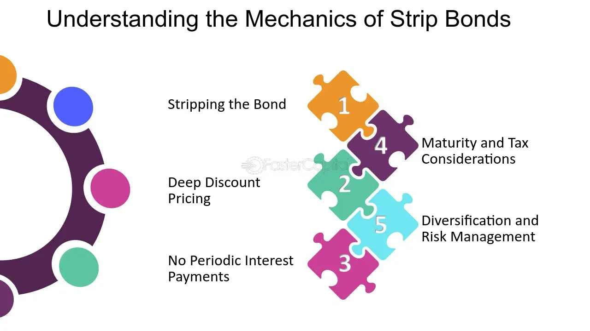

## Table of Contents

## What is a stripped bond?

A stripped bond is a type of bond where the principal and interest payments are separated and sold as individual securities. This process is called "stripping." When you buy a stripped bond, you are buying either the principal part or one of the interest payments, but not both together like with a regular bond.

This can be useful for investors who want to focus on either getting their money back at the end (the principal) or receiving regular income (the interest). For example, someone saving for a future goal might buy the principal part, while someone needing regular income might buy the interest part. Stripped bonds can be more complex to understand and manage than regular bonds, but they offer flexibility for different investment needs.

## How does a stripped bond differ from a regular bond?

A stripped bond is different from a regular bond because it splits the bond into smaller pieces. A regular bond gives you both the money you lent (the principal) and the interest payments all together. But with a stripped bond, these are separated. You can buy just the principal or just one of the interest payments. This means you can choose what part of the bond you want, depending on what you need.

For example, if you want to save up for something big in the future, you might buy the principal part of a stripped bond. This way, you get a lump sum when the bond matures. On the other hand, if you need regular income, you might buy the interest part. A regular bond doesn't let you choose like this; you get both the principal and interest together. So, stripped bonds can be more flexible but also more complicated to manage than regular bonds.

## What are the components of a stripped bond?

A stripped bond is made up of two main parts: the principal and the interest payments. The principal is the amount of money you get back when the bond reaches the end of its term. This part is also called the "corpus" or "residual." When you buy the principal part of a stripped bond, you are buying the promise to get your money back at a specific future date.

The other part of a stripped bond is the interest payments. These are the regular payments you would normally get from a bond. When a bond is stripped, each interest payment can be sold separately. These individual interest payments are called "coupons." If you buy a coupon, you are buying the right to receive one specific interest payment at a certain time. This way, investors can choose to buy just the interest they need or want, without having to buy the whole bond.

## Who typically issues stripped bonds?

Stripped bonds are usually issued by governments or big financial companies. Governments, like the U.S. Treasury, often create stripped bonds to give investors more choices. They take regular bonds and split them into smaller parts that people can buy separately. This helps investors who want to plan their money in different ways.

Big financial companies also issue stripped bonds. They buy regular bonds and then break them into pieces to sell to investors. This can be helpful for people who want to focus on either getting their money back at the end or getting regular payments. These companies make it easier for people to pick exactly what they need from a bond.

## What is the process of stripping a bond?

Stripping a bond means taking a regular bond and breaking it into smaller pieces. A regular bond gives you back your money plus interest payments over time. But when it's stripped, the bond is split into two parts: the principal, which is the money you get back at the end, and the interest payments, which are called coupons. Each coupon is one of the regular payments you would get from the bond. 

The process starts with someone, usually a government or a big financial company, buying a regular bond. They then take this bond and separate it into the principal and the individual interest payments. These pieces are then sold to investors. This way, people can choose to buy just the principal if they want a lump sum later, or they can buy one or more coupons if they need regular income. It's like taking a whole cake and cutting it into slices so people can pick just the piece they want.

## How are the interest payments and principal of a stripped bond handled?

When a bond is stripped, it gets split into two parts: the principal and the interest payments. The principal is the money you get back at the end of the bond's term. It's like the big payment you receive when the bond matures. If you buy the principal part of a stripped bond, you're buying the right to get this lump sum at a specific future date. Governments or big financial companies do the stripping, and they sell this principal part to investors who want to save up for something big in the future.

The interest payments, called coupons, are the other part of a stripped bond. These are the regular payments you would get from a regular bond, but with a stripped bond, each payment is sold separately. So, if you buy a coupon, you're buying the right to receive one specific interest payment at a certain time. This can be good for people who need regular income. They can buy just the coupons they need without having to buy the whole bond.

## What are the tax implications of investing in stripped bonds?

When you invest in stripped bonds, the tax rules can be a bit different than with regular bonds. With stripped bonds, you have to pay taxes on the interest you earn, even if you don't get the money right away. This is called "original issue discount" (OID). It means you have to report a part of the bond's value as income each year, even if you don't get paid until the bond matures. This can be tricky because you're paying taxes on money you haven't actually received yet.

The tax on the principal part of a stripped bond works differently. If you buy the principal part, you don't have to pay taxes on it until you get your money back when the bond matures. But, if you sell the principal part before it matures, you might have to pay capital gains tax on any profit you make from the sale. So, it's important to think about these tax rules when you're deciding whether to invest in stripped bonds, as they can affect how much money you keep at the end.

## What are the risks associated with stripped bonds?

Investing in stripped bonds can be riskier than regular bonds because they can be more complicated. One risk is that the price of stripped bonds can change a lot. If interest rates go up, the price of your bond can go down. This is because new bonds will pay higher interest, making your bond less valuable. If you need to sell your bond before it matures, you might get less money than you paid for it. This is called interest rate risk.

Another risk is that you might have to pay taxes on the interest even before you get it. This is different from regular bonds where you only pay taxes when you get the interest. With stripped bonds, you have to report a part of the bond's value as income each year, which can be tricky because you're paying taxes on money you haven't received yet. This can affect how much money you keep at the end.

Lastly, stripped bonds can be harder to buy and sell because they are not as common as regular bonds. This means if you need to sell your bond quickly, it might be harder to find someone to buy it. This is called liquidity risk. So, it's important to think about these risks before you decide to invest in stripped bonds.

## How can stripped bonds be used in investment strategies?

Stripped bonds can be a useful part of an investment plan because they let you pick exactly what you need. If you're saving up for something big in the future, like a house or college tuition, you can buy just the principal part of a stripped bond. This way, you know you'll get a big lump sum of money when the bond matures. It's like putting money in a savings account that you can't touch until a certain date, but it might grow more than a regular savings account.

On the other hand, if you need regular income, you can buy the interest payments, or coupons, from stripped bonds. This can be good for people who are retired or need money coming in every month. You can choose which coupons to buy based on when you need the money. This flexibility can help you plan your finances better, but you have to remember that stripped bonds can be more complicated and might be harder to sell if you need to get your money out quickly.

## What are the advantages of investing in stripped bonds compared to other fixed-income securities?

Stripped bonds have some special advantages compared to other fixed-income securities like regular bonds. One big advantage is that they let you pick exactly what you need. If you want to save up for a big purchase in the future, like a house or a car, you can buy just the principal part of a stripped bond. This means you'll get a big lump sum of money when the bond matures, which can be really helpful for planning your savings. It's like putting money in a savings account that you can't touch until a certain date, but it might grow more than a regular savings account.

Another advantage is that if you need regular income, you can buy the interest payments, called coupons, from stripped bonds. This can be great for people who are retired or need money coming in every month. You can choose which coupons to buy based on when you need the money, giving you more control over your income. While stripped bonds can be more complicated and might be harder to sell if you need to get your money out quickly, the flexibility they offer can be a big help in planning your finances.

## How do market conditions affect the pricing of stripped bonds?

Market conditions can change the price of stripped bonds a lot. When interest rates go up, the price of stripped bonds usually goes down. This is because new bonds will pay more interest, making the old ones less valuable. If you need to sell your stripped bond before it matures, you might get less money than you paid for it. This is called interest rate risk. Also, if the economy is not doing well, people might want to sell their bonds, which can make the price go down.

On the other hand, if interest rates go down, the price of stripped bonds can go up. This is because your bond is now paying more interest than new bonds, making it more valuable. But, stripped bonds can be harder to buy and sell because they are not as common as regular bonds. This means if you need to sell your bond quickly, it might be harder to find someone to buy it. This is called liquidity risk. So, market conditions can make the price of stripped bonds go up or down, and it's important to think about this when you're investing.

## What advanced financial models are used to value stripped bonds?

To figure out the value of stripped bonds, people use something called the discounted cash flow (DCF) model. This model looks at all the money you will get from the bond in the future, like the principal or the interest payments, and then brings that money back to today's value. It does this by using a discount rate, which is like the interest rate you could get if you invested your money somewhere else. If interest rates go up, the discount rate goes up, and the value of the stripped bond goes down because the future payments are worth less today.

Another model used is the binomial model, which can be a bit more complicated. It looks at how the price of the bond could change over time, based on different possible paths for interest rates. It breaks down the time until the bond matures into smaller steps and figures out the value of the bond at each step, depending on whether interest rates go up or down. This helps investors see how much the bond might be worth in different situations, making it easier to decide if it's a good investment.

## What are the risks of stripped bonds?

Stripped bonds, while offering certain advantages, also come with inherent risks that investors must carefully consider. One of the primary risks is related to interest rate sensitivity. Since stripped bonds are zero-coupon bonds, they do not provide periodic interest payments. Instead, they are sold at a significant discount to face value and mature at par. This structure makes them highly sensitive to changes in interest rates. As interest rates rise, the present value of the bond's future cash flows decreases, leading to a decline in price. Mathematically, the price of a zero-coupon bond can be expressed as:

$$
P = \frac{F}{(1 + r)^t}
$$

where $P$ is the price, $F$ is the face value, $r$ is the interest rate, and $t$ is the time to maturity. A small increase in $r$ can lead to a substantial drop in $P$.

Inflation risk is another significant concern. While regular bonds pay interest which can be reinvested, helping to offset inflation, stripped bonds pay nothing until maturity. If inflation rises, the purchasing power of the fixed amount received at maturity can be significantly eroded.

Liquidity risks also play a role, as stripped bonds may not be as easily tradable as their coupon-bearing counterparts. Market conditions can impact the ability to buy or sell these bonds without affecting prices dramatically. In times of market stress, or when there are fewer participants, [liquidity](/wiki/liquidity-risk-premium) can dry up, potentially leading to unfavorable pricing for investors seeking to [exit](/wiki/exit-strategy) their positions.

From a taxation perspective, investors face the complexity of phantom income. With stripped bonds, investors are taxed on the imputed interest—interest that accrues even though they do not receive cash payments until maturity. For example, even if an investor receives no cash flows until maturity, they are required to report this interest annually to tax authorities such as the IRS, which can complicate tax planning and cash flow management.

Default risk is another consideration, primarily determined by the creditworthiness of the issuer. Since stripped bonds depend entirely on the payment at maturity, any default by the issuer directly impacts the investor's expected returns. Therefore, the lack of interim payments increases the reliance on the issuer's ability to meet their obligations.

Investors must weigh these risks carefully against the potential benefits stripped bonds offer, particularly when considering them as part of a broader investment strategy. Understanding the interplay of these factors is crucial in making informed investment decisions.

## What are the special considerations?

Stripped bonds, also known as zero-coupon bonds, present unique strategic considerations for investors. These bonds are created by separating the interest payments (coupons) from the principal repayment of traditional bonds. This separation results in individual securities sold at a discount and maturing at face value. Effective strategies for buying and selling stripped bonds require careful market analysis, tax considerations, and portfolio assessment.

### Reporting Phantom or Imputed Interest

Unlike traditional bonds, stripped bonds do not provide periodic coupon payments. Instead, investors receive a lump sum at maturity. Nonetheless, the IRS requires investors to report imputed interest annually, which is the interest that accrues but is not paid out until maturity. This interest is taxable and increases the investor's cost basis in the bond over time. The formula for calculating the annual imputed interest is typically based on the accruals of the Effective Yield (EY), using the formula:

$$

EY = \left(\frac{\text{Face Value}}{\text{Purchase Price}}\right)^{\frac{1}{n}} - 1 
$$

where $n$ is the number of years until maturity. Investors must report this interest as if they had received it, even though no cash is exchanged.

### Impact of Market Conditions

Stripped bonds are sensitive to interest rate changes due to their long duration. When interest rates rise, the present value of the bond decreases, and vice versa. This inverse relationship often leads to significant price fluctuations. Furthermore, inflation expectations can affect the desirability of stripped bonds, as they offer fixed payouts that may erode in real value with rising inflation. Market liquidity can also impact trading strategies; during volatile or low-liquidity periods, it may be challenging to buy or sell stripped bonds without affecting market prices adversely.

### Evaluating Stripped Bonds in a Portfolio

Incorporating stripped bonds into a diversified investment portfolio requires assessing their unique attributes. Their zero-coupon nature means they are often used to match future liabilities, a practice known as asset-liability matching. This feature is advantageous for investors with specific future cash flow needs, such as retirement savings or funding long-term projects. Nonetheless, diversification is crucial, as the risks associated with interest rate changes and tax implications must be mitigated by blending stripped bonds with other asset classes. 

When considering a purchase, investors should evaluate:

1. **Yield Comparisons:** Compare the yield to maturity of stripped bonds with those of other fixed-income securities.
2. **Interest Rate Forecasts:** Analyze economic indicators to estimate future interest rate movements.
3. **Tax Strategies:** Consider tax-advantaged accounts or strategies to mitigate the impact of imputed interest.

In summary, stripped bonds provide valuable strategic opportunities in portfolio management, particularly for investors seeking predictable future value. However, investors must navigate imputed interest reporting and remain vigilant of market conditions to optimize their bond investment strategies.

## References & Further Reading

[1]: Fabozzi, F. J. (2005). ["Fixed Income Analysis, Second Edition."](https://books.google.com/books/about/Fixed_Income_Analysis.html?id=lujLawVLS3YC) John Wiley & Sons.

[2]: Hull, J. C. (2018). ["Options, Futures, and Other Derivatives, 10th Edition."](https://www.semanticscholar.org/paper/Options%2C-Futures%2C-and-Other-Derivatives-Hull/89bdee500c8623864fc9eb7a471546aa713acc44) Pearson.

[3]: Sundaresan, S. M. (2009). ["Fixed Income Markets and Their Derivatives, Third Edition."](https://shop.elsevier.com/books/fixed-income-markets-and-their-derivatives/sundaresan/978-0-12-370471-9) Academic Press.

[4]: Fabozzi, F. J., & Mann, S. V. (2012). ["The Handbook of Fixed Income Securities, Eighth Edition."](https://www.amazon.com/Handbook-Fixed-Income-Securities-Eighth/dp/0071768467) McGraw-Hill Education.

[5]: Luenberger, D. G. (1997). ["Investment Science."](https://www.amazon.com/Investment-Science-David-G-Luenberger/dp/0199740089) Oxford University Press.

[6]: ["U.S. Treasury Securities."](https://en.wikipedia.org/wiki/United_States_Treasury_security) TreasuryDirect - U.S. Department of the Treasury. 

[7]: ["Algorithmic Trading and DMA"](https://www.amazon.com/Algorithmic-Trading-DMA-introduction-strategies/dp/0956399207) by Barry Johnson

[8]: ["Strips: What Are They?"](https://www.icliniq.com/articles/skin-and-beauty/pore-strips-what-are-they) by Adam Hayes, Investopedia.