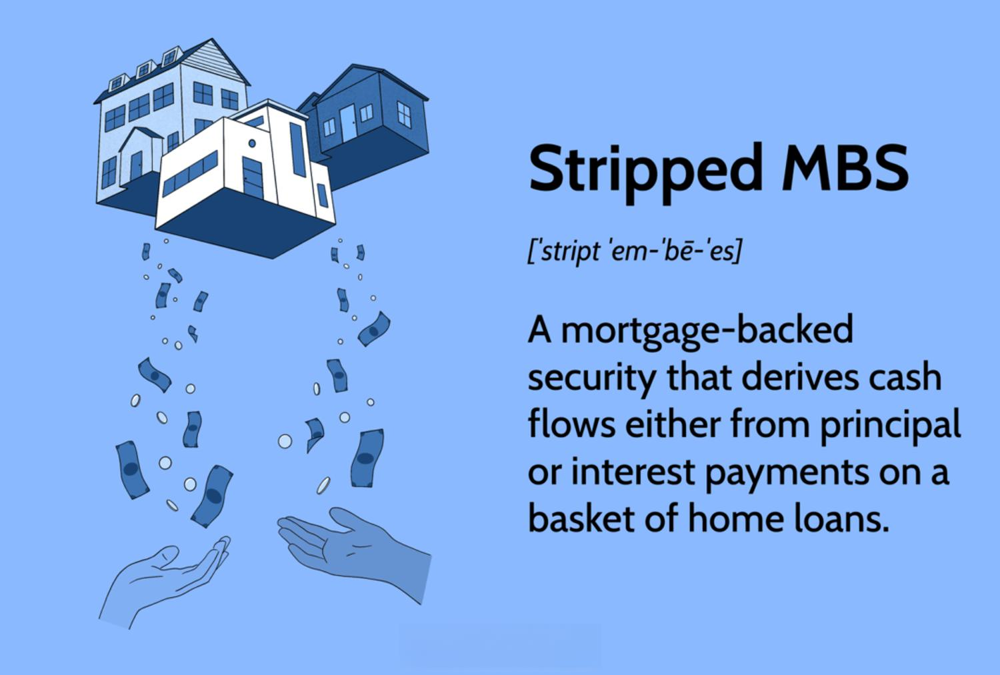

## Table of Contents

## What are Stripped Mortgage-Backed Securities (MBS)?

Stripped Mortgage-Backed Securities (MBS) are a type of investment that comes from breaking down regular mortgage-backed securities into smaller parts. These parts are usually the interest payments and the principal payments from the original mortgages. Investors can buy these parts separately, depending on what they want. For example, some investors might only want the interest payments, while others might want the principal payments.

These securities can be attractive to investors because they offer different ways to earn money from mortgages. By splitting the payments, investors can choose the part that fits their investment goals better. However, they also come with risks, like changes in interest rates or people paying off their mortgages early. This means that while they can be a good investment, they also need careful thought and understanding before buying them.

## How do Stripped MBS differ from traditional MBS?

Stripped MBS and traditional MBS both come from mortgages, but they work a bit differently. Traditional MBS are securities that are backed by a pool of mortgages. When people pay their mortgage, that money goes to the investors who own the MBS. These securities give investors a mix of both the interest and principal payments from the underlying mortgages.

Stripped MBS, on the other hand, take those same mortgage payments and split them into two parts: one part is just the interest payments, and the other part is just the principal payments. This means investors can choose to buy only the interest part, called an Interest-Only (IO) strip, or only the principal part, called a Principal-Only (PO) strip. This gives investors more options to match their investment goals, but it also means they need to understand how changes in interest rates or early mortgage payoffs might affect their returns.

## What is the basic mechanism behind Stripped MBS?

Stripped MBS work by taking the payments from a bunch of mortgages and splitting them into two different parts. One part is all the interest payments from the mortgages, and the other part is all the principal payments. This means that when people pay their mortgages, the money goes into these two separate piles. Investors can then choose to buy either the interest part, called an Interest-Only (IO) strip, or the principal part, called a Principal-Only (PO) strip.

This separation gives investors more choices. Some investors might want to only get the interest payments because they think it will give them a steady income. Others might want the principal payments because they think it will give them a good return when people pay off their mortgages. But, it's important for investors to understand that things like changes in interest rates or people paying off their mortgages early can affect how much money they make from these investments.

## What are the main components of Stripped MBS?

Stripped MBS have two main parts: the interest payments and the principal payments from a bunch of mortgages. These parts are called Interest-Only (IO) strips and Principal-Only (PO) strips. When people pay their mortgages, the money gets split into these two parts. Investors can choose to buy either the IO strips, which give them just the interest payments, or the PO strips, which give them just the principal payments.

This separation lets investors pick what fits their goals best. Some might like the steady income from interest payments, so they buy IO strips. Others might want the bigger return when people pay off their mortgages, so they buy PO strips. But, investors need to be careful because things like changes in interest rates or people paying off their mortgages early can change how much money they make from these investments.

## Who typically invests in Stripped MBS and why?

Stripped MBS are usually bought by investors who want to match their investments with their specific goals. These investors might be big financial institutions like banks, insurance companies, or pension funds. They might also be hedge funds or individual investors who know a lot about the market. They choose Stripped MBS because they can pick either the interest part (IO strips) or the principal part (PO strips) of the mortgage payments, which helps them build their investment portfolios the way they want.

Investors might buy IO strips if they are looking for a steady income. This is because IO strips give them the interest payments from the mortgages, which can be a good source of regular cash flow. On the other hand, investors might buy PO strips if they think they can make a good profit when people pay off their mortgages. PO strips give them the principal payments, which can be a big return if interest rates go down or if people pay off their mortgages early. But, these investors need to understand the risks, like how changes in interest rates or early mortgage payoffs can affect their returns.

## What are the risks associated with investing in Stripped MBS?

Investing in Stripped MBS can be risky because of changes in interest rates. When interest rates go up, the value of IO strips can go up because the interest payments from the mortgages get bigger. But, when interest rates go down, people might pay off their mortgages early, which means less interest for the IO strip investors. On the other hand, PO strips can be affected too. If interest rates go down, people might pay off their mortgages early, which means more principal payments for PO strip investors. But if interest rates go up, people might not pay off their mortgages as quickly, and PO strip investors might not get their money back as fast as they hoped.

Another risk is called prepayment risk. This happens when people pay off their mortgages earlier than expected. For IO strip investors, this can be bad because they lose out on the interest payments they were expecting. For PO strip investors, early payoffs can be good because they get their principal payments sooner, but it's hard to predict when this will happen. This makes it tricky for investors to know how much money they will really make from their investments.

Overall, investing in Stripped MBS needs careful thinking. Investors need to understand how interest rates and prepayments can change their returns. They also need to keep an eye on the housing market and the economy because these can affect how people pay their mortgages. It's important for investors to do their homework and maybe even talk to a financial advisor before buying Stripped MBS.

## How are the cash flows from the underlying mortgages divided in Stripped MBS?

In Stripped MBS, the cash flows from the underlying mortgages are split into two parts: the interest payments and the principal payments. When people make their mortgage payments, the money they pay is divided into these two separate streams. The interest part goes into what's called an Interest-Only (IO) strip, and the principal part goes into a Principal-Only (PO) strip. This separation allows investors to choose which part they want to buy based on their investment goals.

Investors who buy IO strips receive the interest payments from the mortgages. This can be attractive for those looking for a steady income stream because they get regular interest payments. On the other hand, investors who buy PO strips receive the principal payments. These investors might be looking for a bigger return when people pay off their mortgages. The way the cash flows are divided makes it possible for investors to pick the part that fits their needs, but they also need to consider the risks involved, like changes in interest rates or people paying off their mortgages early.

## What role do Principal Only (PO) and Interest Only (IO) strips play in Stripped MBS?

In Stripped MBS, Principal Only (PO) and Interest Only (IO) strips are the two main parts that come from splitting the payments of a bunch of mortgages. PO strips are made up of just the principal payments that people make on their mortgages. When someone pays off their mortgage, the money they pay back goes to the investors who own the PO strips. This can be good for investors who want to get a big return when people pay off their mortgages early.

IO strips, on the other hand, are made up of just the interest payments from the mortgages. Investors who buy IO strips get the interest that people pay on their mortgages every month. This can be a good choice for investors who want a steady income because they get regular payments. But, both PO and IO strips can be affected by things like changes in interest rates or people paying off their mortgages early, so investors need to think carefully about these risks.

## How do interest rate changes affect the value of Stripped MBS?

When interest rates change, it can really affect the value of Stripped MBS. For IO strips, if interest rates go up, the value of these strips can go up too. This is because the interest payments from the mortgages get bigger, so investors who own IO strips get more money. But, if interest rates go down, people might pay off their mortgages early to get a new loan with a lower rate. This means less interest for IO strip investors, which can make the value of their strips go down.

For PO strips, it works a bit differently. If interest rates go down, people might pay off their mortgages early to take advantage of the lower rates. This means PO strip investors get their principal payments sooner, which can be good for them and might make the value of their strips go up. But, if interest rates go up, people might not pay off their mortgages as quickly. This means PO strip investors might have to wait longer to get their money back, which can make the value of their strips go down. So, it's important for investors to keep an eye on interest rates because they can change how much money they make from their Stripped MBS.

## What are some strategies for managing a portfolio of Stripped MBS?

Managing a portfolio of Stripped MBS involves keeping an eye on interest rates and how quickly people are paying off their mortgages. Investors need to understand that when interest rates go up, the value of IO strips can go up because they get more interest payments. But if rates go down, people might pay off their mortgages early, which can hurt the value of IO strips. On the other hand, when rates go down, PO strips might do well because people pay off their mortgages faster, giving investors their principal payments sooner. But if rates go up, people might not pay off their mortgages as quickly, which can make PO strips less valuable. So, it's important to watch these trends and adjust the portfolio to balance the risks and rewards.

Another strategy is to diversify the portfolio. This means not putting all the money into just IO or PO strips but mixing them up. By having both types of strips, investors can balance the risk of [interest rate](/wiki/interest-rate-trading-strategies) changes and prepayments. For example, if IO strips are doing well because rates are going up, the PO strips might not be doing as well, but having both can help smooth out the returns. It's also a good idea to look at different types of mortgages that back the MBS, like those with different interest rates or from different parts of the country. This can help spread out the risk even more.

Lastly, staying informed about the housing market and the economy is key. Changes in these areas can affect how people pay their mortgages, which in turn affects the value of Stripped MBS. By keeping up with economic reports and housing market trends, investors can make better decisions about when to buy or sell their strips. Talking to a financial advisor can also help because they can give advice based on the latest information and help investors manage their portfolio to meet their goals.

## How do regulatory requirements impact the issuance and trading of Stripped MBS?

Regulatory requirements play a big role in how Stripped MBS are issued and traded. These rules are set by government agencies to make sure that the financial markets are safe and fair for everyone. For example, the Securities and Exchange Commission (SEC) in the United States has rules that companies need to follow when they create and sell Stripped MBS. They have to give investors clear information about the risks and how the securities work. This helps investors make smart choices and keeps the market honest. Also, banks and other financial institutions that deal with Stripped MBS have to follow rules from agencies like the Federal Reserve, which can affect how much they can invest in these securities and how they manage their risks.

These regulations can also affect how Stripped MBS are traded. For instance, there might be rules about how much information needs to be shared when these securities are bought and sold. This can make the market more transparent but can also add more steps and costs to the trading process. Sometimes, changes in regulations can lead to more or fewer Stripped MBS being issued. If the rules get stricter, it might be harder for companies to issue new Stripped MBS, which can slow down the market. On the other hand, if the rules are relaxed, it might be easier to issue and trade these securities, which can make the market grow. So, understanding these regulations is important for anyone involved in the Stripped MBS market.

## What advanced modeling techniques are used to predict the performance of Stripped MBS?

To predict how Stripped MBS will perform, people use advanced modeling techniques like Monte Carlo simulations and prepayment models. Monte Carlo simulations are like playing out different scenarios many times to see what might happen. They help investors see how changes in interest rates or how quickly people pay off their mortgages can affect the value of IO and PO strips. By running these simulations, investors can get a better idea of the risks and rewards and make smarter choices about their investments.

Prepayment models are another important tool. These models try to guess when people will pay off their mortgages early. They look at things like interest rates, how the economy is doing, and even the kind of mortgages in the pool. By understanding prepayment behavior, investors can predict how much money they might get from IO and PO strips. This helps them manage their portfolio better and plan for different situations that might come up.

## References & Further Reading

[1]: Fabozzi, F. J. (Ed.). (2016). ["The Handbook of Mortgage-Backed Securities, 7th Edition."](https://academic.oup.com/book/7943) Oxford University Press.

[2]: ["Inside the Black Box: A Simple Guide to Quantitative and High Frequency Trading"](https://www.amazon.com/Inside-Black-Box-Quantitative-Frequency/dp/1118362411) by Rishi K. Narang

[3]: Gorton, G. B., & Metrick, A. (2012). ["Securitized Banking and the Run on Repo."](https://www.sciencedirect.com/science/article/pii/S0304405X1100081X) Journal of Financial Economics, 104(3), 425-451.

[4]: ["Algorithmic Trading: Winning Strategies and Their Rationale"](https://www.wiley.com/en-us/Algorithmic+Trading%3A+Winning+Strategies+and+Their+Rationale-p-9781118746912) by Ernest P. Chan

[5]: Vink, D., Thibeault, A., & Eichholtz, P. (2008). ["The Effect of Market Characteristics on the Yield Spread of Mortgage-Backed Securities."](https://EconPapers.repec.org/RePEc:ner:maastr:www.merit.unu.edu/publications/wppdf/2008/wp2008-063.pdf) 

[6]: ["The Mortgage-Backed Securities Workbook"](https://www.amazon.com/Mortgage-Backed-Securities-Workbook-Andrew-Davidson/dp/0578148153) by Andrew Davidson

[7]: Shiller, R. J. (2008). ["The Subprime Solution: How Today's Global Financial Crisis Happened, and What to Do about It."](https://www.jstor.org/stable/j.cttq94jd) Princeton University Press.