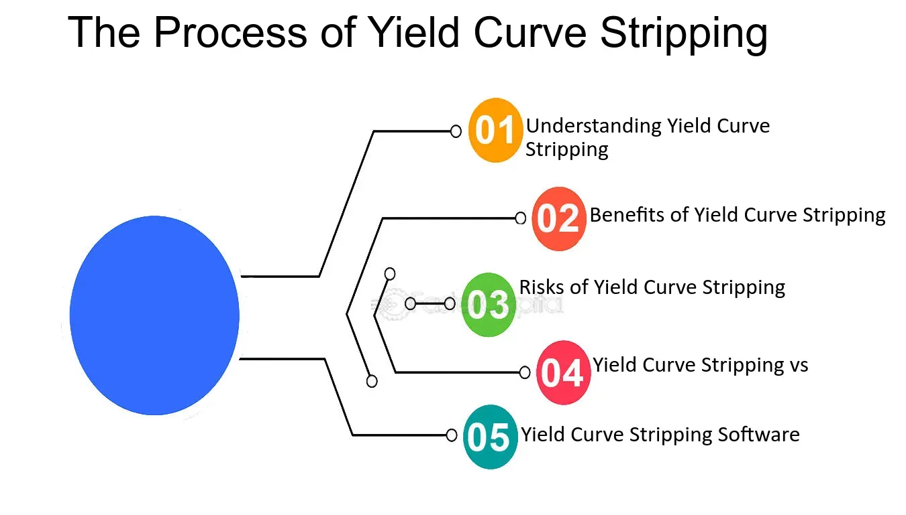

## Table of Contents

## What is stripped yield?

Stripped yield is a way to measure the return on an investment that has been split into smaller parts. Imagine you buy a bond that pays interest every year and also gives you your money back at the end. If you separate the interest payments from the final payment, you have created "strips." The yield, or return, on these strips is what we call stripped yield.

Calculating stripped yield can be a bit tricky because you need to consider the value of each strip separately. Each part of the bond (the interest payments and the final payment) might be sold at different prices. By figuring out the total return from all these parts together, you can understand the stripped yield. This helps investors see if buying these separate pieces is a good deal compared to buying the whole bond.

## How does stripped yield differ from other types of yields?

Stripped yield is different from other types of yields because it focuses on bonds that have been split into smaller parts, called strips. When a bond is stripped, the interest payments and the final payment are separated and sold as individual securities. The stripped yield is the return an investor gets from these individual pieces. This is different from the yield to maturity of a regular bond, which is the total return if you hold the bond until it matures. With stripped yield, you're looking at the return from each part of the bond separately, which can be more complicated but gives a clearer picture of what each part is worth.

Other types of yields, like current yield or yield to call, look at the bond as a whole. Current yield is simple; it's just the annual interest payment divided by the bond's current price. Yield to call is used for bonds that can be paid off early by the issuer, and it calculates the return if the bond is called before it matures. These yields don't break the bond into pieces like stripped yield does. They give you an overall return on the bond, which can be easier to understand but might not show the value of each part of the bond as clearly as stripped yield does.

## What are the components of a stripped yield?

A stripped yield comes from a bond that has been split into smaller pieces. These pieces are called strips, and they include the interest payments and the final payment you get when the bond matures. When you buy these strips, you are buying them separately, not as part of the whole bond. The stripped yield is the return you get from these individual pieces. It's calculated by looking at the price you pay for each strip and the amount of money you will get from it over time.

Calculating the stripped yield can be a bit tricky. You need to figure out the value of each strip on its own. The interest payments might be sold at different prices than the final payment, and you need to add up the returns from all these pieces to get the total stripped yield. This is different from other types of yields that look at the bond as a whole. With stripped yield, you see the return from each part of the bond separately, which can help you understand if buying these pieces is a good investment compared to buying the whole bond.

## How is stripped yield calculated?

To calculate stripped yield, you need to look at each part of the bond separately. When a bond is stripped, it's split into the interest payments and the final payment. Each of these parts is sold as a separate security, and they might be sold at different prices. You need to figure out how much money you will get from each part and when you will get it. Then, you compare this to the price you paid for each part. The stripped yield is the return you get from all these parts together, but you have to calculate it for each piece and then add them up.

Calculating stripped yield can be a bit tricky because you need to consider the time value of money. This means that getting money sooner is better than getting it later. You use a formula to figure out the present value of each payment you will get from the strips. This formula takes into account the time until you get the money and the interest rate you could earn if you invested the money somewhere else. By adding up the present values of all the payments and comparing them to the total price you paid for the strips, you can find the stripped yield. This gives you a clear picture of the return you can expect from buying these separate pieces of the bond.

## What are the benefits of using stripped yield for investors?

Stripped yield helps investors by giving them a clear picture of what they can earn from different parts of a bond. When a bond is split into pieces, each part can be bought and sold separately. This means investors can choose to buy just the interest payments or just the final payment, depending on what they think will give them the best return. By looking at the stripped yield, investors can see how much money they will make from each piece over time. This can help them make smarter choices about which parts of the bond to buy.

Another benefit of using stripped yield is that it can help investors manage their money better. Because each part of the bond can be sold at different times, investors can plan when they will get their money back. This can be useful if they need money at certain times in the future. By understanding the stripped yield, investors can see if buying these separate pieces fits with their plans for when they need to use the money. This can make their investment strategy more flexible and tailored to their needs.

## Can you explain the process of stripping a bond?

Stripping a bond means breaking it into smaller pieces. When you buy a regular bond, you get interest payments every year and then your money back at the end. But if you strip the bond, you separate these payments. The interest payments become one type of security, and the final payment becomes another. Each piece can then be sold to different investors. This process is done by financial institutions like banks or investment firms.

Once the bond is stripped, the pieces are sold in the market. Investors can buy just the interest payments, called coupons, or just the final payment, called the principal or residue. Each piece might be sold at different prices, depending on how much people want to buy them. This gives investors more choices. They can pick the pieces that fit their needs, like if they want money sooner or later. The process of stripping a bond makes it more flexible for investors to manage their money.

## What are the risks associated with investing in stripped yields?

Investing in stripped yields can be riskier than buying a regular bond. One big risk is that the price of the strips can change a lot. Since each part of the bond is sold separately, the value of the interest payments and the final payment can go up or down based on what people want to buy. If you need to sell your strips before they pay out, you might get less money than you expected. This is called interest rate risk, because changes in interest rates can make the value of your strips go down.

Another risk is that you might not get your money back if the company that issued the bond goes bankrupt. When you buy strips, you are still relying on the company to pay you back. If they can't, you could lose your investment. This is called credit risk. Also, because strips are more complicated than regular bonds, it can be harder to understand what you are buying. If you don't understand the risks well, you might make a bad investment choice.

## How do market conditions affect stripped yields?

Market conditions can have a big impact on stripped yields. When interest rates change, the value of the strips can go up or down. If interest rates go up, the price of the strips usually goes down because new bonds with higher interest rates become more attractive. On the other hand, if interest rates go down, the price of the strips can go up because people want to buy them to lock in the higher interest rates they offer. This means that if you need to sell your strips before they pay out, you might get more or less money than you expected, depending on what's happening in the market.

Another way market conditions affect stripped yields is through the demand for the strips. If a lot of people want to buy the strips, their prices can go up. If not many people want them, their prices can go down. This can be influenced by how safe people think the strips are, or by what's happening in the economy. For example, if the economy is doing well, people might be more willing to take risks and buy strips. But if the economy is struggling, people might want safer investments and not buy as many strips. This all affects the stripped yield because it changes how much money you can expect to get back from your investment.

## What role do stripped yields play in portfolio diversification?

Stripped yields can help investors spread out their money in different ways. When you buy strips, you are buying parts of a bond that pay out at different times. This means you can get money back at different points in the future, which can help you plan your money better. If you have other investments that pay out at different times, adding strips to your portfolio can make it more balanced. This way, you are not relying on just one type of investment to give you money when you need it.

Another way stripped yields help with diversification is by letting you pick and choose what parts of a bond you want to buy. Some investors might want the interest payments because they need money more often. Others might want the final payment because they are planning for something big in the future. By choosing different strips, you can mix and match to fit your needs. This can make your portfolio more flexible and less risky because you are not putting all your money into one type of investment.

## How do tax considerations impact the attractiveness of stripped yields?

Tax considerations can make stripped yields more or less attractive to investors. When you buy strips, you don't get interest payments right away like you do with a regular bond. Instead, you might have to wait until the strips mature to get your money. This can change how much tax you have to pay each year. If you are in a high tax bracket, you might like strips because you can delay paying taxes on the interest until you get the money. But if you need to pay taxes on the interest each year even though you haven't received it yet, that could make strips less attractive.

The way you are taxed on strips can also depend on where you live. Some places have different rules about how to tax the interest from bonds. If your area has special tax benefits for certain types of bonds, that could make strips more appealing. But if the tax rules are not in your favor, you might think twice about buying strips. It's important to understand the tax laws in your area and how they apply to strips before deciding if they are a good fit for your investment goals.

## What are the historical performance trends of stripped yields?

Stripped yields have had ups and downs over time, just like other investments. When interest rates go up, the prices of strips usually go down. This happened a lot in the 1980s when interest rates were very high. People who bought strips back then might have seen the value of their investment drop if they needed to sell before the strips paid out. On the other hand, when interest rates go down, like they did in the early 2000s, the prices of strips can go up. Investors who bought strips during those times could have made good money if they sold at the right time.

Another thing that has affected the performance of stripped yields is how safe people think they are. During times when the economy is doing well, like in the mid-2010s, more people were willing to buy strips because they felt confident about getting their money back. But during times of economic trouble, like the 2008 financial crisis, fewer people wanted to take the risk, and the prices of strips could drop. Overall, the performance of stripped yields depends a lot on what's happening with interest rates and how people feel about the economy.

## How can advanced investors use stripped yields for strategic financial planning?

Advanced investors can use stripped yields to plan their money better by picking and choosing which parts of a bond they want to buy. If they need money at certain times in the future, they can buy the strips that will pay out then. This can help them match their investments with their plans. For example, if they know they will need money in five years for a big purchase, they can buy strips that will mature around that time. This way, they can be sure they will have the money when they need it, without having to sell other investments at the wrong time.

Another way advanced investors can use stripped yields is to manage their taxes better. Because strips don't pay interest until they mature, investors can delay paying taxes on that interest. This can be a big help if they are in a high tax bracket now but expect to be in a lower one later. By choosing when to get their money back, they can plan their taxes more carefully. This can make their overall investment strategy more efficient and help them keep more of their earnings.

## What is Understanding Stripped Yield?

Stripped yield is a financial concept that calculates the return on a bond, excluding embedded options and accrued interest. This approach focuses exclusively on the bond's credit, delineating the bond's intrinsic value from ancillary monetary incentives. By stripping these elements, the yield provides a purer measure of the income generated solely by the bond's credit quality.

Stripped yield is especially beneficial for analyzing bonds with complex structures. Brady bonds are a prominent example; these are bonds issued by developing countries, often with features such as principal or interest guarantees. By focusing on the stripped yield, investors can more effectively assess the sovereign credit risk associated with these bonds, independent of additional financial instruments attached to them, like U.S. Treasury bond guarantees.

To compute the stripped yield, one typically removes components such as the coupon payments related to embedded options or any accrued interest not directly linked to the bond's credit. This calculation allows a clearer comparison between different securities. Here is a simple formula to represent stripped yield:

$$
\text{Stripped Yield} = \frac{\text{Coupon Payment} - \text{Embedded Options}}{\text{Market Price of the Bond}}
$$

This stripped-down metric becomes a vital tool for investors seeking clarity when evaluating sovereign risk. By concentrating on the sovereign entity's creditworthiness alone, the stripped yield offers a more accurate assessment of the potential risks and rewards of investing in sovereign debt securities.

In the fixed-income market, understanding stripped yield complements the analytical framework necessary for informed investment decisions. When investors apply stripped yield to compare bonds, they achieve a more transparent view of their true credit exposure, enabling well-informed strategic allocation and risk assessment decisions.

## How can one integrate financial formulas and yields?

Combining financial formulas with yield data significantly enhances algorithmic trading strategies by providing a robust framework for evaluating asset performance and potential risks. Financial formulas like Net Present Value (NPV) and Return on Investment (ROI) are critical tools in assessing the viability and profitability of investments.

Net Present Value is a method used to determine the present value of future cash flows generated by an asset, discounted back at a specified rate. The NPV formula is given by:

$$

\text{NPV} = \sum \left( \frac{C_t}{(1 + r)^t} \right) - C_0 
$$

where $C_t$ is the cash inflow during the period, $r$ is the discount rate, $t$ is the number of time periods, and $C_0$ is the initial investment cost. A positive NPV indicates that the projected earnings, in present dollars, exceed the anticipated costs, thus signifying a potentially lucrative investment opportunity.

Return on Investment measures the gain or loss generated relative to the amount of money invested and is expressed as a percentage. The formula for ROI is:

$$

\text{ROI} = \left( \frac{\text{Net Profit}}{\text{Cost of Investment}} \right) \times 100 
$$

Yield types, such as bond yield and dividend yield, offer vital insights into an asset's profitability profile. The bond yield reflects the return an investor can expect from a bond, while the dividend yield assesses the dividend income relative to the current share price.

In algorithmic trading, these financial insights are integrated into high-frequency trading algorithms, enabling rapid and informed trading decisions. For instance, algorithms may use yield data to target underpriced bonds or high dividend stocks, all while factoring in the calculations for expected NPV and ROI. Through automated processes, these algorithms can conduct complex analysis and execute trades at speeds impossible for human traders, especially in volatile markets.

An example of such integration in Python might look like this:

```python
def calculate_npv(rate, cash_flows):
    npv = sum([cf / (1 + rate) ** t for t, cf in enumerate(cash_flows)])
    return npv

def calculate_roi(net_profit, investment_cost):
    roi = (net_profit / investment_cost) * 100
    return roi

# Sample data
cash_flows = [100, 200, 300]
rate = 0.05
net_profit = 150
investment_cost = 1000

npv = calculate_npv(rate, cash_flows)
roi = calculate_roi(net_profit, investment_cost)

print(f"Net Present Value: {npv}")
print(f"Return on Investment: {roi}%")
```

These computations become integral to formulating strategies that dynamically adjust to the ever-changing market conditions, thus optimizing the trading outcomes and enhancing the traders' ability to manage risks and maximize returns.

## References & Further Reading

[1]: Bergstra, J., Bardenet, R., Bengio, Y., & Kégl, B. (2011). ["Algorithms for Hyper-Parameter Optimization."](https://dl.acm.org/doi/10.5555/2986459.2986743) Advances in Neural Information Processing Systems 24.

[2]: ["Advances in Financial Machine Learning"](https://www.amazon.com/Advances-Financial-Machine-Learning-Marcos/dp/1119482089) by Marcos Lopez de Prado

[3]: ["Evidence-Based Technical Analysis: Applying the Scientific Method and Statistical Inference to Trading Signals"](https://www.amazon.com/Evidence-Based-Technical-Analysis-Scientific-Statistical/dp/0470008741) by David Aronson

[4]: ["Machine Learning for Algorithmic Trading"](https://github.com/stefan-jansen/machine-learning-for-trading) by Stefan Jansen

[5]: ["Quantitative Trading: How to Build Your Own Algorithmic Trading Business"](https://www.amazon.com/Quantitative-Trading-Build-Algorithmic-Business/dp/1119800064) by Ernest P. Chan