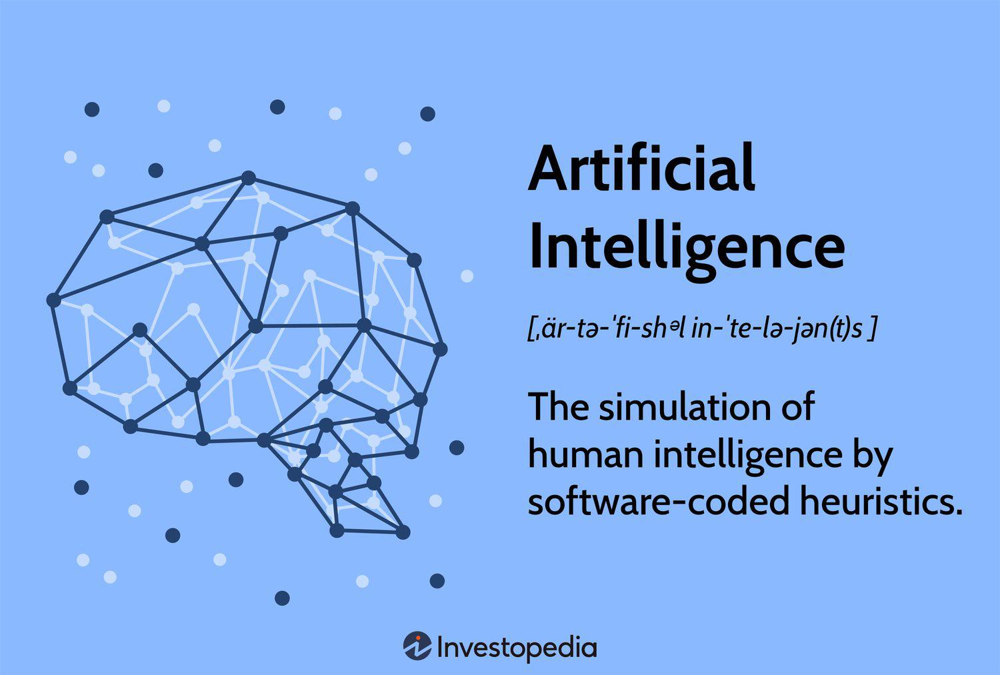

In the rapidly advancing world of finance and technology, artificial intelligence (AI) has significantly transformed various sectors by incorporating sophisticated methods for automated planning and algorithmic trading. AI's integration into these fields has revolutionized decision-making processes, offering speed, precision, and efficiency far superior to traditional approaches. One of the fundamental techniques driving these innovations is the STRIPS (Stanford Research Institute Problem Solver) methodology, which has been pivotal in the development of AI systems.

STRIPS was introduced to address complex automated planning problems by defining a formal language that efficiently models and solves these challenges. In the domain of AI, STRIPS is particularly valued for its ability to generate optimized sequences of actions, transitioning systems from an initial state to a desired goal state through strategic planning. This capability is integral to various AI applications, notably in algorithmic trading, where rapid decision-making and adaptability to market changes are crucial.



Algorithmic trading involves the use of computer programs to execute trades based on predefined criteria, making it an ideal application for STRIPS-based planning. By leveraging the systematic approach of STRIPS, AI systems can optimize trading strategies, improving the timing and execution of trades within the fast-paced and complex environment of financial markets. Hence, STRIPS not only contributes to enhanced trading efficiency but also helps in achieving targeted financial goals through strategic action planning.

This article examines the application of STRIPS in artificial intelligence, emphasizing its role in automated planning for algorithmic trading. As financial markets continue to evolve, the integration of STRIPS in AI planning methodologies signifies an ongoing intersection of technology, finance, and strategic innovation.

## Table of Contents

## Understanding STRIPS in Artificial Intelligence

STRIPS (Stanford Research Institute Problem Solver), originating in the late 1960s, is a pivotal formal language designed for the specification and resolution of automated planning problems. As a methodological approach within artificial intelligence (AI), STRIPS is instrumental in formulating plans that comprise sequences of actions aiming to transform systems from an initial state to a desired goal state.

At its core, STRIPS is characterized by its symbolic representation of planning problems, which enables it to navigate the complexities associated with dynamic environments. This representation comprises a set of states, actions, and goals that articulate the conditions necessary for planning processes. The planning task in STRIPS is to find a sequence of actions (a plan) that transitions the system from an initial state to a state where the goal conditions are satisfied.

The efficiency of STRIPS in AI planning is significantly bolstered by its use of heuristics. These heuristics guide the search for solutions by estimating the cost or difficulty of reaching the goal state from the current state, often expediting the discovery of optimal or satisfactory plans. The STRIPS language captures the preconditions and effects of actions, allowing planners to systematically explore and evaluate possible sequences of actions.

Symbolic representations in STRIPS involve describing states using a logical collection of propositions that reflect the current attributes of the system. Actions within this framework are defined by operators, each characterized by specific preconditions (conditions that must hold before the action can be executed) and effects (the outcome produced by executing the action). By applying these operators, STRIPS iteratively refines its understanding of the planning problem, searching through potential sequences until it identifies one that satisfies the specified goals.

In AI, the impact of STRIPS extends beyond its foundational language design, as its principles underpin many contemporary planning systems. Its influence is observable in domains requiring complex decision-making and structured problem-solving, exemplified by applications ranging from robotics to [algorithmic trading](/wiki/algorithmic-trading). Thus, STRIPS remains integral to the development of efficient and effective AI planning methodologies.

## Components of STRIPS

STRIPS, an acronym for Stanford Research Institute Problem Solver, involves three primary components: states, goals, and actions. These elements are essential for the definition and resolution of automated planning problems in [artificial intelligence](/wiki/ai-artificial-intelligence).

### States
States in STRIPS are defined by a collection of logical propositions that represent the current scenario or configuration. These propositions are essentially facts or conditions that describe the environment at a given point in time. For instance, in a trading algorithm context, a state might include propositions such as "market_open," "stock_A_up," or "trader_available." The representation of states using logical propositions allows for a structured depiction of the system's status, enabling the planner to make informed decisions based on the available information.

### Goals
Goals in STRIPS are specified as a set of conditions that need to be satisfied to achieve a desired outcome. These conditions are formed similarly to states using logical propositions. The objective of the planning process is to identify a sequence of actions that transitions the system from its initial state to a state where the goal conditions are met. For example, in an algorithmic trading scenario, a goal might be to "maximize_profit" or "complete_trade_order." By explicitly defining goals, STRIPS enables planners to focus on achieving specific outcomes rather than getting bogged down in extraneous detail.

### Actions
Actions in STRIPS are defined by two main components: preconditions and effects. Preconditions are logical conditions that must be satisfied for an action to be executed. If the preconditions are not met, the action cannot occur. Effects are the changes that result from the execution of an action. They describe how the state of the world changes after the action takes place.

In a formal representation, an action $A$ can be described as:
$$
A = \langle \text{Preconditions}, \text{Effects} \rangle
$$

**Python Example**:

```python
class Action:
    def __init__(self, preconditions, effects):
        self.preconditions = preconditions
        self.effects = effects

# Example of a hypothetical action
preconditions = {'market_open': True, 'trader_available': True}
effects = {'trade_executed': True, 'stock_A_up': False}

trade_action = Action(preconditions, effects)
```

By structuring actions in this way, STRIPS allows planners to manipulate the system's state in a controlled manner, guided by logical reasoning. The planner must evaluate the preconditions of potential actions and select those that contribute to reaching the goal state effectively. This approach ensures that every action taken is purposeful and directed towards achieving the planning objectives.

## How STRIPS Works in Automated Planning

The STRIPS (Stanford Research Institute Problem Solver) algorithm is integral to automated planning, maintained through a structure that encompasses a database of predicates representing the world state. This database serves as a repository of logical propositions detailing the current scenario at any point in time. Each state within this database is defined by a distinct set of predicates that together illustrate a snapshot of the system's present conditions.

Planning within the STRIPS framework involves a systematic search through a space of potential actions. The objective is to identify a sequence of actions that successfully transition the system from an initial state to a state that meets the defined goal conditions. This process is akin to solving a complex puzzle where the pieces are actions derived from the current state and potential transformations.

A primary mechanism utilized by STRIPS is backward chaining, an inferential strategy that begins with the end goal and traces backward to identify a viable path from the initial state. In backward chaining, the algorithm identifies the goal state, and subsequently searches for actions whose effects can satisfy the goal conditions. It then recursively determines the preconditions for these actions, effectively working its way backward to bridge the gap to the initial state. 

For illustration, consider a simplified Python pseudocode demonstrating a backward chaining process:

```python
def backward_chain(goal_state, actions, initial_state):
    plan = []
    current_state = goal_state

    while current_state != initial_state:
        for action in actions:
            if action['effect'] in current_state:
                if all(precond in current_state for precond in action['preconditions']):
                    plan.append(action)
                    for effect in action['effects']:
                        current_state.remove(effect)
                        for precond in action['preconditions']:
                            current_state.add(precond)
                    break

    return plan[::-1]  # Reverse the plan to show the sequence from the initial state to goal
```

In this approach, each action comprises preconditions and effects. The algorithm iteratively selects actions whose effects align with the goal conditions and resolves their preconditions, progressively constructing a reverse path toward the initial state. It continues this iterative search until it successfully assembles a complete sequence of actions to achieve the goal.

In conclusion, the structured methodology of the STRIPS algorithm in automated planning embodies a detailed and methodical search through action sequences. This process leverages the representation of the world's state through predicates and strategically employs backward chaining to efficiently solve complex planning problems in various domains, including algorithmic trading and beyond.

## Applications of STRIPS in AI and Algo Trading

STRIPS, a technique developed to address planning problems, has proven pivotal in various AI applications, including robotics and algorithmic trading. In AI-driven robotics, STRIPS enables machines to determine sequences of actions to achieve specific tasks, ensuring efficient operation within dynamic environments. The abstraction provided by STRIPS allows robots to transition smoothly from an initial to a goal state, even amidst the complexities of real-world constraints.

In algorithmic trading, STRIPS enhances the strategic implementation of trades. This sector benefits from its systematic approach to planning, crucial when dealing with rapidly changing financial markets. By defining clear actions and goals, trading algorithms can optimize the execution of orders and adapt plans based on market intelligence. For instance, an algorithm might use STRIPS to sequence trades, automate responses to market movements, and optimize buying and selling strategies. This enables cutting-edge trading systems to reduce latency and improve accuracy in decision-making, ultimately maximizing profit potential.

Leveraging STRIPS for trading involves defining states that reflect market conditions, such as price levels, and goals like achieving a specific profit margin. Actions are specified with preconditions (e.g., a stock price reaching a threshold) and effects (e.g., executing a buy order), ensuring that each action taken is conducive to reaching set objectives. This integration allows these systems to navigate complex trading scenarios by automatically resetting and optimizing their strategy when faced with new data feeds or unexpected market shifts.

The structured methodology of STRIPS, which focuses on defining clear sequences of actions, presents a robust framework that excels in dynamic and uncertain financial contexts. Despite certain limitations in handling non-deterministic actions, its application in trading marks a significant stride toward highly adaptive, intelligent trading mechanisms that operate autonomously, offering unprecedented control over trading processes and outcomes.

## Advantages of Using STRIPS in Trading Algorithms

STRIPS offers a structured approach to problem-solving in trading algorithms by providing precise definitions of states and actions. This clarity facilitates the formulation of effective trading strategies, allowing for the seamless achievement of specific trading objectives. By defining clear states—representations of current market conditions—and setting distinct actions—trading orders or decisions—STRIPS enables the creation of a logical sequence of operations that lead to desired trading outcomes.

In the context of algorithmic trading, STRIPS can significantly enhance the decision-making process by optimizing both the timing and execution of trades. This is achieved through a systematic evaluation of possible actions, assessing their alignment with pre-set conditions and projected market environments. As STRIPS assesses potential actions, it formulates a sequence that optimally fits trading goals while adapting to real-time data. 

The mathematical underpinnings of STRIPS in trading can be illustrated through its use of state-action representations and transitions. For instance, if $S_0$ represents the initial state of the market, and the goal state $G$ is a favorable market condition for executing a trade, STRIPS computes a pathway $\{a_1, a_2, \ldots, a_n\}$ such that the sequence of actions transitions from $S_0$ to $G$. This path is derived by iteratively selecting actions based on their preconditions and postconditions, aiming for minimal trade slippage and maximum alignment with current market forecasts.

Python can be employed to simulate these strategies using libraries like NumPy for numerical operations and pandas for handling time-series data. Here is a basic pseudocode representation:

```python
import numpy as np
import pandas as pd

# Define initial state S0 and Goal state G
S0 = {'market_trend': 'neutral', '[volume](/wiki/volume-trading-strategy)': 1000}
G = {'market_trend': 'bullish', 'volume': 1500}

# Define actions with preconditions and effects
actions = [
    {'action': 'buy', 'precondition': S0['market_trend'] == 'bullish', 'effect': {'volume': 200}},
    {'action': 'sell', 'precondition': S0['market_trend'] == 'bearish', 'effect': {'volume': -200}}
]

# Function to plan trading actions
def plan_trading_actions(initial_state, goal_state, actions):
    current_state = initial_state
    plan = []

    while current_state != goal_state:
        for action in actions:
            if eval(action['precondition']):
                plan.append(action['action'])
                current_state['volume'] += action['effect']['volume']
                break

    return plan

# Execute the plan
trading_plan = plan_trading_actions(S0, G, actions)
print(f"Trading plan to reach goal: {trading_plan}")
```

This structured approach helps traders efficiently navigate the complexities of financial markets by not only focusing on the end goal but also maintaining a rigorous methodology for action sequencing. Consequently, using STRIPS enhances the likelihood of superior yields by ensuring that trades are executed at optimal times and under the most favorable conditions.

## Limitations and Future Directions

While STRIPS offers an efficient framework for automated planning, it operates under the assumption of a static world, where the environment remains unchanged except for the planner's actions. This static nature can limit its effectiveness in dynamic and uncertain environments found in algorithmic trading. Furthermore, STRIPS does not inherently support non-deterministic actions, where outcomes are not always predictable. This limitation is critical in trading scenarios where market conditions can change rapidly and unpredictably.

Future advancements in automated planning technologies, such as the Planning Domain Definition Language (PDDL), are designed to address these limitations by allowing for a more expressive formalism. PDDL enhances planning processes by integrating features like time and resource constraints, as well as complex logical constructs. This allows for modeling dynamic environments and incorporating contingencies for non-deterministic events. For example, PDDL can represent market events as timed events, providing a more realistic depiction of trading scenarios.

The continuous evolution in planning languages and methodologies is set to enhance the applicability of STRIPS-based systems by expanding their capabilities to handle more complex and volatile trading environments. Improvement in computational power and the integration of advanced [machine learning](/wiki/machine-learning) models can further support this evolution. By enabling adaptive and responsive planning, these advancements will potentially improve the robustness and efficiency of trading algorithms, leading to better decision-making and execution strategies in rapidly changing markets.

Employing hybrid systems that combine STRIPS with machine learning for predictive analytics and real-time data processing can offer a potent solution for modern trading challenges. This synergy between traditional planning methodologies and contemporary AI techniques could revolutionize algorithmic trading by enabling more sophisticated planning under uncertainty.

## Conclusion

STRIPS continues to be a fundamental component in the field of artificial intelligence planning, playing a crucial role in algorithmic trading systems. Its primary strength lies in its structured approach, which offers a clear and systematic framework for tackling complex planning problems. By breaking down planning into states, goals, and actions, STRIPS allows for the efficient generation of sequences of actions necessary to achieve specific outcomes.

Despite inherent limitations—such as the assumption of a static environment and lack of support for non-deterministic actions—STRIPS provides a solid foundation for automated planning. Its ability to maintain a database of predicates and employ strategies like backward chaining is particularly beneficial in creating responsive and adaptable trading algorithms. This systematic methodology facilitates the execution of trading strategies that are both precise and responsive to market conditions. 

Looking ahead, ongoing advancements in AI planning methodologies, including the development of more sophisticated languages like PDDL (Planning Domain Definition Language), promise to enhance the utility of STRIPS. These advancements aim to address its current limitations and allow for more nuanced handling of intricate and variable environments found in financial markets. The continuous evolution of these tools is expected to expand the potential of STRIPS, increasing its effectiveness in managing the dynamic nature of algorithmic trading. This progress ensures that STRIPS will remain a key player in the development of AI-driven trading systems that can navigate the complexities of modern markets.

## References & Further Reading

[1]: Fikes, R. E., & Nilsson, N. J. (1971). ["STRIPS: A New Approach to the Application of Theorem Proving to Problem Solving."](https://www.sciencedirect.com/science/article/pii/0004370271900105) Artificial Intelligence, 2(3), 189-208.

[2]: Nilsson, N. J. (1998). ["Artificial Intelligence: A New Synthesis"](https://www.sciencedirect.com/book/9781558604674/artificial-intelligence-a-new-synthesis). Morgan Kaufmann.

[3]: Ghallab, M., Nau, D., & Traverso, P. (2004). ["Automated Planning: Theory and Practice"](https://www.sciencedirect.com/book/9781558608566/automated-planning). Morgan Kaufmann.

[4]: Russell, S. J., & Norvig, P. (2020). ["Artificial Intelligence: A Modern Approach"](https://www.amazon.com/Artificial-Intelligence-A-Modern-Approach/dp/0134610997). Pearson.

[5]: Jansen, S. (2020). ["Machine Learning for Algorithmic Trading: Predictive models to extract signals from market and alternative data for systematic trading strategies with Python"](https://www.amazon.com/Machine-Learning-Algorithmic-Trading-alternative/dp/1839217715). Packt Publishing.

[6]: Lopez de Prado, M. (2018). ["Advances in Financial Machine Learning"](https://www.amazon.com/Advances-Financial-Machine-Learning-Marcos/dp/1119482089). Wiley.

[7]: Chan, E. P. (2009). ["Quantitative Trading: How to Build Your Own Algorithmic Trading Business"](https://github.com/ftvision/quant_trading_echan_book). Wiley.