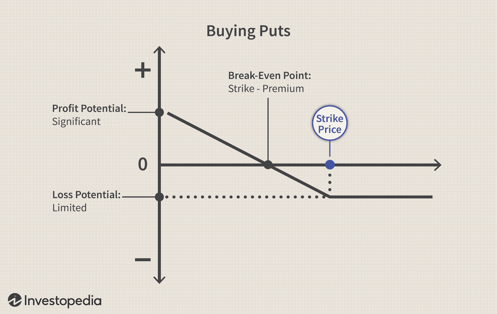

The stock market has long been an attraction for investors seeking substantial returns on their investments. Its dynamic nature and potential for significant profit make it a compelling avenue for individuals looking to grow their wealth. However, navigating the complexities of the stock market requires more than just intuition; it demands a strategic understanding of key elements such as strong buy recommendations and the evolving role of algorithmic trading.

Strong buy recommendations are crucial tools for investors aiming to spot stocks that are expected to outperform market averages. These recommendations often signal that a particular stock has the potential for substantial appreciation, offering an entry point for profit maximization. They are typically based on rigorous analyses of factors like company performance and prevailing market conditions, serving as a guide for identifying promising investment opportunities.



In parallel, algorithmic trading has emerged as a transformative force in the financial markets. By utilizing sophisticated computer programs to execute trades based on pre-set criteria, algorithmic trading increases the speed and efficiency of trading far beyond what human capabilities can match. This advancement enables the analysis of vast quantities of data to identify lucrative trading opportunities quickly, making algorithmic trading an invaluable tool in implementing strong buy recommendations.

This article will explore the nexus between strong buy recommendations and algorithmic trading, examining their use and potential in crafting successful investment strategies. We will discuss the fundamentals underpinning strong buy indicators, highlight key algorithmic trading platforms, and evaluate strategic approaches for leveraging these technologies. By focusing on these aspects, readers will be equipped with the knowledge to effectively navigate the stock market landscape, aiming for optimal investment outcomes.

## Table of Contents

## Understanding Strong Buy Recommendations

Strong buy recommendations are employed by financial analysts to indicate stocks forecasted to significantly outperform the market. Characteristically, such recommendations are paired with elevated price targets, forecasting considerable potential for stock appreciation. Analysts derive these ratings through a comprehensive analysis that incorporates company performance, industry conditions, market trends, and economic indicators. These recommendations are valuable for investors as they highlight stocks perceived as having substantial growth prospects and an attractive risk-reward ratio.

A strong buy rating signifies a higher confidence level in the stock’s future performance compared to other recommendations such as "buy" or "hold." While a "buy" recommendation suggests favorable conditions for purchasing a stock, a strong buy implies an even more robust potential relative to peer investments. On the other hand, a "hold" rating advises investors to maintain their current positions in a stock, reflecting a neutral stance on its immediate market potential.

Several critical factors influence analysts in issuing a strong buy rating. Company fundamentals such as revenue growth, profit margins, and return on equity play a pivotal role. Additionally, broader market conditions, including economic indicators and industry-specific trends, are considered. Analysts also assess competitive positioning and management effectiveness, alongside anticipated future catalysts like product launches or regulatory approvals, which could drive stock value.

Understanding the nuances between different rating levels is crucial for investors, as these guide decision-making processes. A strong buy recommendation suggests that the stock is undervalued and poised for significant gains, encouraging investors to capitalize on what analysts predict to be favorable market catalysts. In contrast, a "buy" or "hold" rating might advise a more cautious approach, highlighting less certainty or potential for gains.

Investors should recognize that analysts’ recommendations, including strong buys, are based on forecasts and models subject to change with new information. It's essential to consider these ratings within the broader context of an individual’s investment strategy, risk tolerance, and financial goals. By interpreting these recommendations wisely, investors can enhance their portfolio performance and seize promising opportunities in the stock market.

## Algorithmic Trading: An Overview

Algorithmic trading utilizes computer algorithms to automatically execute trades based on predetermined criteria. This approach revolutionizes trading by offering speed and efficiency that surpass traditional human trading capabilities. The core advantage of [algorithmic trading](/wiki/algorithmic-trading) lies in its ability to process and analyze vast amounts of market data swiftly, facilitating timely decision-making.

At its essence, algorithmic trading involves setting specific rules for trade execution, such as timing, price, and quantity. These rules are programmed into computer algorithms, allowing them to conduct trades with minimal human intervention. This mechanization enables traders to capitalize on market opportunities more rapidly than manual methods.

The history of algorithmic trading dates back to the 1970s with the development of program trading—a strategy that involved trading a large number of stocks simultaneously. However, it gained significant traction in the 1990s with the advancement of electronic trading platforms. Today, it accounts for a substantial portion of trading activity across global financial markets.

The advantages of algorithmic trading extend beyond speed. Algorithms can be designed to detect patterns in historical data and real-time market conditions, making it possible to identify optimal entry and [exit](/wiki/exit-strategy) points for trades. By using sophisticated mathematical models and statistical analysis, algorithms are adept at managing complex trading strategies that would be challenging for humans to handle. For instance, algorithms can implement high-frequency trading ([HFT](/wiki/high-frequency-trading-strategies)) strategies, executing thousands of trades per second to exploit minor price changes.

Another strength of algorithmic trading is its ability to minimize human errors and emotional biases, which can lead to inconsistent trading decisions. By adhering strictly to programmed criteria, algorithms ensure discipline in trade execution. Furthermore, algorithmic strategies can be backtested using historical data to evaluate their performance before being deployed in live market conditions, enhancing the strategy’s robustness.

The evolution of algorithmic trading has been propelled by technological advancements, such as faster computer processors and advanced data analytics. The introduction of [machine learning](/wiki/machine-learning) techniques further augments the capability of trading algorithms, allowing them to learn from new data and adapt to changing market dynamics.

Despite its advantages, algorithmic trading is not without challenges. The complexity of developing and maintaining trading algorithms requires significant expertise in both quantitative analysis and programming. Additionally, algorithmic strategies must be continuously monitored to ensure they perform as expected under different market conditions.

Overall, algorithmic trading represents a paradigm shift in the way financial markets operate, offering traders a powerful tool to enhance efficiency and precision in executing trades. As technology continues to evolve, the role of algorithms in trading is likely to expand, reshaping the landscape of the financial industry.

## Top Algorithmic Trading Platforms

There are numerous algorithmic trading platforms available to help traders automate their strategies, each offering unique features and capabilities. A comprehensive understanding of these platforms can assist investors in selecting the one best suited to their trading needs. Here, we examine three prominent platforms: TradeStation, [Interactive Brokers](/wiki/interactive-brokers-api), and QuantConnect.

### TradeStation

TradeStation is well-regarded for its robust trading tools and comprehensive market data. It's particularly popular among professional traders and those experienced in algorithmic trading. TradeStation offers a powerful proprietary language, EasyLanguage, which allows users to create custom trading strategies. Features include advanced charting tools, a wide array of technical indicators, and direct market access.

- **Features**: Advanced charting, EasyLanguage coding, high-quality data feeds.
- **Pricing**: TradeStation operates on a per-trade cost basis or a monthly flat fee for frequent traders. The specific costs depend on the trading volume and types of assets traded.
- **Ideal User Base**: Professional traders, experienced algorithmic traders, and those who require advanced customization options.

### Interactive Brokers

Interactive Brokers stands out for its extensive range of markets and low-cost trading solutions. It is favored by both retail and institutional traders, offering access to global markets. The platform provides the Trader Workstation (TWS), known for its flexibility and advanced trading algorithms. It also supports multiple programming languages such as Python and Java, allowing for sophisticated algorithmic trading.

- **Features**: Global market access, Trader Workstation (TWS), support for multiple coding languages.
- **Pricing**: Interactive Brokers charges low commissions per share or a percentage of the trade value, often lower than many competitors. They also offer a tiered pricing structure for different levels of trading volume.
- **Ideal User Base**: Both retail and institutional traders seeking international market exposure and low commission rates.

### QuantConnect

QuantConnect is a cloud-based platform that emphasizes algorithmic trading and quantitative analysis. It allows users to design and test strategies in a streamlined environment with access to extensive historical data. One of QuantConnect's significant advantages is its open-source framework, Lean, which supports Python and C#.

- **Features**: Cloud-based backtesting, extensive historical data, open-source Lean framework.
- **Pricing**: QuantConnect offers a free tier with limited backtesting and live trading capabilities, and a paid plan providing more extensive resources and data access.
- **Ideal User Base**: Quant developers and quantitative analysts looking for a collaborative and flexible environment.

### Considerations for Selecting a Trading Platform

When choosing an algorithmic trading platform, investors should consider several factors:

1. **Trading Objectives**: Different platforms cater to varied trading goals and experience levels. It's vital to align the platform's functionalities with your personal objectives.

2. **Cost Structure**: Analyze the fee structure, including commissions, and assess how they match your trading volume and style.

3. **Data Access**: Ensure the platform offers the type of data (e.g., historical, real-time) relevant to your strategies.

4. **Programming Support**: Check if the platform supports the programming languages you are comfortable with or willing to learn.

5. **Community and Support**: A platform with an active user community and robust support can offer additional resources and shared insights, beneficial for both novices and experts.

In conclusion, selecting the right algorithmic trading platform involves a careful evaluation of your trading needs, financial resources, and technical expertise. Each platform has strengths tailored to specific user bases, making it crucial to assess their offerings against individual investment strategies.

## Developing a Strong Buy Algorithmic Strategy

Creating a successful algorithmic trading strategy that leverages strong buy recommendations requires a thoughtful blend of quantitative analysis and strategic planning. The first step involves the development of criteria-based trading algorithms. These algorithms are designed to automatically execute trades when specific conditions are met, offering the potential for more objective and disciplined trading strategies.

To create criteria-based algorithms, investors must first define the parameters that constitute a "strong buy" signal. This may include metrics such as a high price-to-earnings growth ratio, significant upward earnings revisions, or strong relative performance compared to industry peers. The algorithm then continuously monitors the stock market for securities that match these criteria.

Backtesting is a crucial process to ensure the reliability of the developed trading strategy. This involves applying the algorithm to historical market data to gauge how it would have performed in past scenarios. Backtesting helps to validate the algorithm’s effectiveness and can be conducted using various software platforms. The goal is to identify potential weaknesses and improve robustness before deploying the strategy in live markets. Here is a simple example of a [backtesting](/wiki/backtesting) approach using Python with a pseudo-code structure:

```python
def backtest_strategy(data, buy_criteria):
    initial_capital = 100000  # Initial capital in USD
    positions = []
    for date, stock_data in data.items():
        for stock, metrics in stock_data.items():
            if meets_buy_criteria(metrics, buy_criteria):
                positions.append({'date': date, 'stock': stock, 'price': metrics['price']})
    return calculate_performance(positions, initial_capital)
```

Innovation in strategy development is also key. This involves not only looking at historical performance but also considering current market conditions and projecting realistic trading scenarios. Factors like interest rates, inflation, and geopolitical events can significantly impact the effectiveness of a trading strategy, requiring continuous adaptation and testing.

Diversification and risk management are integral components of an advanced algorithmic strategy. Diversification involves spreading investments across multiple assets to reduce exposure to any single security’s downturns. Risk management techniques such as stop-loss orders and dynamic position sizing help protect the portfolio from significant losses.

Moreover, risk management involves setting boundaries for acceptable losses and determining appropriate leverage levels. Strategies must be regularly reviewed and refined based on ongoing performance and as new market data becomes available. This requires a willingness to pivot and update algorithms based on emerging trends and analytics.

By combining the predictive power of strong buy recommendations with the precision of algorithmic trading, investors can craft strategies that aim to outperform the market while accounting for intricate market dynamics and personal risk tolerance.

## Advantages and Challenges of Algorithmic Trading

Algorithmic trading has reshaped the landscape of financial markets by offering remarkable benefits such as speed, precision, and improved market access. One of its primary advantages is the unparalleled speed at which trades can be executed. Using sophisticated algorithms, trades are conducted in milliseconds—much faster than any human could achieve. This swift execution allows traders to capitalize on fleeting market opportunities that might otherwise be missed.

With reduced human intervention, algorithmic trading minimizes errors typically associated with manual trading. Algorithms follow predefined rules without variation, thereby reducing the chances of costly mistakes due to human error or emotional decision-making. Additionally, automation enhances market access by enabling participation in multiple markets simultaneously, thereby allowing traders to execute diversified strategies effortlessly.

Despite these advantages, algorithmic trading also presents significant challenges. The complexity of developing effective algorithms requires a deep understanding of both market dynamics and programming. Traders must regularly monitor their systems to ensure performance and adaptability in changing market conditions. Furthermore, over-reliance on past data—a phenomenon known as overfitting—can lead to strategies that perform well in historical tests but falter in live trading.

Another challenge arises from high-frequency trading issues, which can lead to unpredictable market impacts. High-frequency trading, while capable of generating profit quickly, can also contribute to market [volatility](/wiki/volatility-trading-strategies) and flash crashes. Regulatory considerations add another layer of complexity, as different jurisdictions impose varying rules and regulations on algorithmic trading practices. Compliance with these regulations is crucial to avoid penalties and ensure ethical trading.

Investors must carefully consider these pros and cons before relying on algorithmic strategies. Balancing the benefits of speed and precision with the potential pitfalls of complexity and regulatory challenges is essential for successful integration into a trading strategy.

Real-world examples illustrate both the successes and failures of algorithmic trading. For instance, high-frequency trading firms like Renaissance Technologies have achieved remarkable success by leveraging algorithms to consistently outperform the market. Conversely, the 2010 "Flash Crash" exemplified the potential dangers when algorithmic trading strategies malfunction, leading to a rapid, temporary plunge in U.S. equity markets that erased nearly $1 trillion in market value within minutes. Such examples underscore the need for rigorous testing, monitoring, and regulatory compliance to harness the full potential of algorithmic trading without succumbing to its risks.

## Conclusion: Maximizing Investment Potential

Investors can effectively optimize their portfolios by combining analysts' insights with automated trading systems. This approach allows for the harnessing of strong buy recommendations alongside the precision and speed of algorithmic trading. By doing so, significant market opportunities, which may otherwise be overlooked by traditional trading methods, can be successfully identified and exploited.

Achieving success in this dynamic market requires a meticulous approach. Careful planning is fundamental, involving the selection of reliable data sources, understanding market trends, and recognizing patterns that predict stock performance. Rigorous strategy design is equally crucial; it involves developing algorithms that align with financial objectives and testing these against historical data to evaluate their reliability. Continual monitoring and adjustments are necessary to accommodate the ever-changing nature of financial markets.

Investors are encouraged not only to remain informed about current market trends but also to keep abreast of technological advancements in trading methodologies. The financial landscape is evolving rapidly, and adaptability is essential. Continuous learning and adjustment of strategies ensure that investors can not only safeguard their investments but also achieve growth.

A proactive approach to investing is advocated, whereby readers are inspired to actively seek further resources that provide education on both financial markets and algorithmic trading. By doing so, investors position themselves advantageously, ready to respond to new developments and complex scenarios. This mindset fosters not just present-day success but also paves the way for sustained growth and profit in the future.

## References & Further Reading

[1]: Bergstra, J., Bardenet, R., Bengio, Y., & Kégl, B. (2011). ["Algorithms for Hyper-Parameter Optimization."](https://dl.acm.org/doi/10.5555/2986459.2986743) Advances in Neural Information Processing Systems 24.

[2]: ["Advances in Financial Machine Learning"](https://www.amazon.com/Advances-Financial-Machine-Learning-Marcos/dp/1119482089) by Marcos Lopez de Prado

[3]: ["Evidence-Based Technical Analysis: Applying the Scientific Method and Statistical Inference to Trading Signals"](https://www.amazon.com/Evidence-Based-Technical-Analysis-Scientific-Statistical/dp/0470008741) by David Aronson

[4]: ["Machine Learning for Algorithmic Trading"](https://github.com/stefan-jansen/machine-learning-for-trading) by Stefan Jansen

[5]: ["Quantitative Trading: How to Build Your Own Algorithmic Trading Business"](https://www.amazon.com/Quantitative-Trading-Build-Algorithmic-Business/dp/1119800064) by Ernest P. Chan