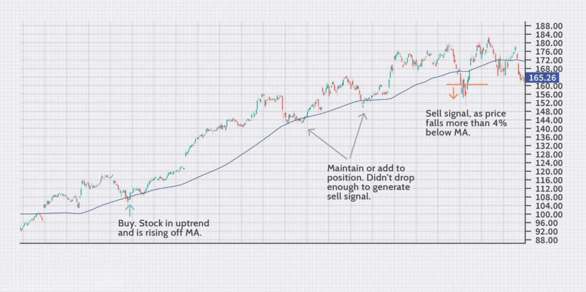

## Table of Contents

## What is a strong sell signal?

A strong sell signal is a clear sign that tells investors it might be a good time to sell a stock or other investment. It happens when there are strong signs that the price of the investment will go down soon. These signs can come from looking at charts, studying the company, or seeing what's happening in the market. For example, if a stock's price has been going down a lot and it breaks through an important support level, that could be a strong sell signal.

Another way to spot a strong sell signal is by watching the company's news and reports. If a company reports bad earnings or if there's bad news about the company, that can make the stock price drop. Also, if many people are selling the stock and the trading volume is high, this can be another sign that it's time to sell. It's important for investors to pay attention to these signals to avoid losing money.

## How can a strong sell signal be identified in the stock market?

A strong sell signal in the stock market can be identified by looking at the price charts of a stock. If the stock's price has been going down a lot and it suddenly drops below a key support level, this is a strong sign that the price might keep falling. Support levels are like floors where the price usually stops dropping, so if it breaks through, it's a big warning. Also, if the stock's price makes a pattern that looks like a head and shoulders or a double top, these are also signs that the price might go down soon.

Another way to spot a strong sell signal is by keeping an eye on the company's news and financial reports. If the company reports bad earnings or if there's negative news about the company, like losing a big customer or facing a lawsuit, the stock price can drop quickly. High trading [volume](/wiki/volume-trading-strategy), where a lot of people are selling the stock, can also be a sign that it's time to sell. When many investors are trying to get out of the stock, it often means they see trouble ahead.

It's important for investors to pay attention to these signals to avoid losing money. While no signal is perfect, combining chart patterns with news and high trading volume can give a clearer picture of when it might be a good time to sell. Always remember, though, that investing involves risks, and it's wise to do your own research or talk to a financial advisor before making any big decisions.

## What are the common indicators used to determine a strong sell signal?

To spot a strong sell signal, you can look at the price chart of a stock. If the stock's price keeps going down and suddenly drops below a key support level, this is a big warning sign. Support levels are like floors where the price usually stops dropping. If it breaks through, it means the price might keep falling. Also, certain patterns on the chart, like a head and shoulders or a double top, can show that the price might go down soon. These patterns are signs that the stock's upward trend is over.

Another way to find a strong sell signal is by watching the company's news and financial reports. If the company reports bad earnings or if there's bad news like losing a big customer or facing a lawsuit, the stock price can drop fast. High trading volume, where lots of people are selling the stock, is another sign. When many investors are trying to sell, it often means they see trouble coming. By combining chart patterns with news and high trading volume, you can get a clearer picture of when it might be a good time to sell.

## Can a strong sell signal be observed in other financial markets besides stocks?

Yes, a strong sell signal can be seen in other financial markets like [forex](/wiki/forex-system), commodities, and cryptocurrencies. In the forex market, if a currency pair breaks below a key support level, it might be a sign to sell. Also, if there's bad economic news about a country, the value of its currency can drop, which is another sell signal. In the commodities market, if the price of oil or gold goes below a support level or if there's bad news like a big drop in demand, that can be a sign to sell.

In the [cryptocurrency](/wiki/cryptocurrency) market, things can move very fast. If the price of Bitcoin or another crypto drops below a key level or if there's bad news like a hack or a big sell-off, that can be a strong sell signal. High trading volume, where lots of people are selling, is also a sign to watch in all these markets. By looking at charts, news, and trading volume, you can spot strong sell signals in different financial markets and decide when it might be a good time to sell.

## What is the impact of a strong sell signal on individual investors?

A strong sell signal can have a big effect on individual investors. When they see this signal, it might make them feel worried or scared about their investment. They might decide to sell their stocks or other investments to avoid losing more money. This can lead to a quick drop in the price of the investment because lots of people are selling at the same time. If an investor waits too long to sell after seeing a strong sell signal, they might end up losing more money than they wanted to.

On the other hand, some investors might not see or understand the strong sell signal. They might keep holding onto their investment, hoping the price will go back up. This can be risky because if the price keeps falling, they could lose a lot of money. It's important for individual investors to pay attention to these signals and think carefully about what to do next. They might need to talk to a financial advisor to make the best decision for their situation.

## How does a strong sell signal affect the overall market sentiment?

A strong sell signal can change how people feel about the market. When a lot of people see this signal, they might start to feel worried or scared. They might think that the prices of stocks or other investments will keep going down. This can make more people want to sell their investments, which can make the whole market feel negative. When everyone is selling, it can make the prices drop even more, and this can make the bad feeling in the market even stronger.

But, not everyone will see or understand the strong sell signal in the same way. Some people might not notice it, or they might think it's not a big deal. They might keep holding onto their investments, hoping that the prices will go back up. This can make the market sentiment a bit mixed, with some people feeling negative and others still feeling okay. Overall, a strong sell signal can make the market feel more negative, but how much it affects the market can depend on how many people see and react to the signal.

## What are the psychological effects on traders when a strong sell signal occurs?

When a strong sell signal happens, traders can feel a lot of different emotions. Many traders might start to feel scared or worried. They might think that the price of their investments will keep going down, and this can make them want to sell quickly to avoid losing more money. This fear can make them act fast without thinking everything through, which is called panic selling. Panic selling can make the prices drop even more, which can make other traders feel even more scared.

On the other hand, some traders might feel confused or unsure when they see a strong sell signal. They might not understand what it means or they might not agree with it. These traders might decide to keep holding onto their investments, hoping that the prices will go back up. This can make them feel stressed because they are waiting to see what will happen next. Overall, a strong sell signal can make traders feel a mix of fear, worry, confusion, and stress, and these feelings can affect how they decide to trade.

## How should an investor react to a strong sell signal?

When an investor sees a strong sell signal, they should first take a deep breath and not panic. It's important to look at the signal carefully and think about what it means. A strong sell signal is a warning that the price of an investment might go down soon. But, it's not always right, so the investor should check other things too, like the company's news and what other people are doing in the market. They should also think about their own reasons for investing and if those reasons have changed.

If after looking at everything, the investor still thinks the strong sell signal is a big warning, they might decide to sell their investment. Selling can help them avoid losing more money if the price does go down. But, they should also think about the costs of selling, like taxes and fees, and if they have other places to put their money. If they decide not to sell, they should be ready for the price to go down and have a plan for what to do next. Talking to a financial advisor can also help them make a good decision.

## What strategies can be employed to mitigate losses when a strong sell signal is detected?

When a strong sell signal is detected, one good strategy is to sell the investment quickly. This can help stop the losses from getting bigger if the price keeps going down. But, before selling, it's smart to check other things like the company's news and what other people are doing in the market. This can help make sure the sell signal is really a big warning. Also, think about the costs of selling, like taxes and fees, and if there are other good places to put the money after selling.

Another strategy is to use a stop-loss order. This is like telling the computer to sell the investment automatically if the price drops to a certain level. It can help limit how much money is lost without needing to watch the market all the time. But, stop-loss orders can sometimes sell too early if the price goes down a little and then goes back up. So, it's important to set the stop-loss level carefully. Talking to a financial advisor can also help figure out the best way to use these strategies and make smart choices about what to do next.

## Are there any historical examples of strong sell signals that led to significant market downturns?

One famous example of a strong sell signal leading to a big market drop happened before the 2008 financial crisis. In the summer of 2007, the housing market started to show signs of trouble. Many people were buying homes with loans they couldn't pay back, and when these loans started to fail, it sent a strong sell signal to investors. The stock market began to drop, and by September 2008, big banks like Lehman Brothers went bankrupt. This led to a huge drop in the stock market, known as the Great Recession, where many people lost a lot of money.

Another example was in early 2000, just before the dot-com bubble burst. Tech stocks had been going up a lot because of the internet boom, but then they started to show strong sell signals. Many tech companies were not making money, and their stock prices were too high. When investors realized this, they started selling their stocks, and the market dropped a lot. By the end of 2002, the Nasdaq, which has a lot of tech stocks, had lost more than 75% of its value. This showed how important it is to pay attention to strong sell signals.

## How reliable are strong sell signals in predicting market movements?

Strong sell signals are not always right, but they can be a good warning for investors. They are based on looking at charts, news about the company, and how many people are selling. If a lot of these things show a strong sell signal, it's more likely that the price of the investment will go down soon. But, sometimes the market can surprise everyone, and the price might not drop as much as expected or might even go up. So, it's important for investors to check other things too and not just rely on one signal.

Even though strong sell signals can help, they are not perfect. The market can be hard to predict because it depends on what a lot of people think and do. Sometimes, a strong sell signal might make many people sell their investments quickly, which can make the price drop a lot. But other times, the market might not react as strongly, and the price might stay the same or go up. Investors should use strong sell signals as one part of their decision-making and always be ready for surprises in the market.

## What advanced technical analysis tools can enhance the detection of strong sell signals?

Advanced technical analysis tools can help investors spot strong sell signals better. One tool is the Relative Strength Index (RSI), which measures how fast a stock's price is going up or down. If the RSI goes above 70, it means the stock might be overbought and could drop soon. Another tool is the Moving Average Convergence Divergence (MACD), which looks at the difference between two moving averages. When the MACD line crosses below the signal line, it can be a strong sell signal because it shows that the stock's upward trend might be ending.

Another helpful tool is the Bollinger Bands, which are lines drawn above and below the stock's price to show how much it's moving. If the price goes below the lower Bollinger Band, it can be a sign that the price might keep falling. Also, using chart patterns like head and shoulders or double tops can help spot strong sell signals. These patterns show that the stock's price might be about to drop. By using these tools together, investors can get a clearer picture of when it might be a good time to sell.

## What are some strategies for managing strong sell signals?

Investment strategies in the stock market are especially crucial when responding to strong sell signals. These are warnings from analysts or algorithms suggesting that an asset's value is expected to decline significantly. Effectively managing these signals can safeguard portfolios and position investors to minimize potential losses. Several strategies are particularly pertinent in addressing such situations: diversification, stop-loss orders, and delta-neutral strategies.

**Diversification** is a foundational principle in risk management. By spreading investments across various asset classes, sectors, or geographic regions, investors can reduce the impact of any single asset's poor performance on the overall portfolio. For example, if a strong sell signal is issued for a particular stock or sector, a well-diversified portfolio may contain investments that gain from the same conditions that caused the initial asset's underperformance. The performance formula for a diversified portfolio could be represented as:

$$
\text{Portfolio Return} = \sum_{i=1}^{n} w_i \cdot r_i
$$

where $w_i$ is the weight of asset $i$ in the portfolio, and $r_i$ is the return of asset $i$. This approach helps in balancing the overall returns and reducing volatility.

**Stop-loss orders** are another effective tool for protecting investments against further losses following a strong sell signal. A stop-loss order is an automated instruction to sell a security once it reaches a specified price. This mechanism limits an investor's loss on a position in a security, thereby preventing significant financial damage. The implementation of a stop-loss order can be programmed using the following Python code snippet:

```python
def stop_loss(current_price, stop_price):
    if current_price <= stop_price:
        execute_sell_order()
```

This code ensures that if the current trading price of a stock falls to or below the predetermined stop price, an automatic order to sell the stock is executed.

**Delta-neutral strategies** involve constructing a portfolio that is not significantly affected by small changes in the price of the underlying asset. These strategies are particularly useful in managing risks in options trading and can be effective during times of market volatility. The delta of an option is a measure of how much the option's price is expected to move per 1-point move in the underlying asset's price. A delta-neutral strategy involves balancing positions such that the overall delta of the portfolio is zero. This could involve taking long and short positions in different options and stocks to offset each other. The formula for a delta-neutral portfolio is:

$$
\text{Delta of Portfolio} = \sum_{i=1}^{n} \Delta_i \cdot \text{Position Size}_i = 0
$$

In summary, by incorporating diversification, stop-loss orders, and delta-neutral strategies, investors can respond more effectively to strong sell signals, thereby preserving capital and maintaining a balanced exposure to the market's uncertainties. Each technique offers distinct advantages and can be tailored to suit individual investment goals and risk tolerances.

## References & Further Reading

[1]: Bergstra, J., Bardenet, R., Bengio, Y., & Kégl, B. (2011). ["Algorithms for Hyper-Parameter Optimization."](https://dl.acm.org/doi/10.5555/2986459.2986743) Advances in Neural Information Processing Systems 24.

[2]: ["Advances in Financial Machine Learning"](https://www.amazon.com/Advances-Financial-Machine-Learning-Marcos/dp/1119482089) by Marcos Lopez de Prado

[3]: ["Evidence-Based Technical Analysis: Applying the Scientific Method and Statistical Inference to Trading Signals"](https://www.amazon.com/Evidence-Based-Technical-Analysis-Scientific-Statistical/dp/0470008741) by David Aronson

[4]: ["Machine Learning for Algorithmic Trading"](https://github.com/stefan-jansen/machine-learning-for-trading) by Stefan Jansen

[5]: ["Quantitative Trading: How to Build Your Own Algorithmic Trading Business"](https://www.amazon.com/Quantitative-Trading-Build-Algorithmic-Business/dp/1119800064) by Ernest P. Chan