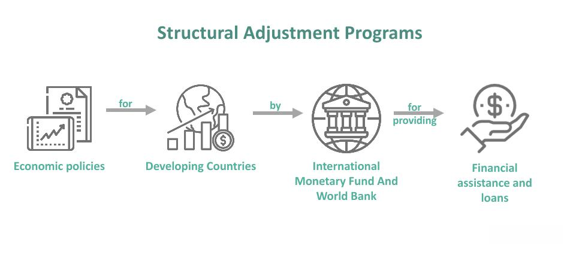

The intricate relationship between structural adjustment programs (SAPs), economic reforms, and the evolution of financial markets presents a fascinating study of economic dynamics. Structural Adjustment Programs have long been a subject of intense debates with divergent viewpoints on their efficacy. Implemented primarily by the International Monetary Fund (IMF) and the World Bank, these programs have historically aimed to create more adaptable and market-oriented economies by imposing conditions for loans and financial aid. Although proponents argue that SAPs can lead to competitive economic environments and reduced dependency on foreign aid, critics highlight potential adverse effects, including heightened social inequality and the erosion of welfare systems in economically vulnerable nations.

This article explores the intersection between SAPs and emerging financial technologies, such as algorithmic trading, within global economic contexts. By examining SAP-driven economic reforms, we can assess their broader implications on different economies. Algorithmic trading, characterized by the use of automated systems to execute trading strategies at speeds and frequencies beyond human capability, is increasingly influencing market dynamics. This technological innovation is altering finance by enhancing trading precision and efficiency, both in developed and developing countries.

Unpacking the motivations for economic reforms under SAPs, the article analyzes their resultant impact across diverse economic landscapes. Some nations achieve stabilization and growth, while others encounter challenges, including increased poverty and social disruption. The nuanced outcomes of SAPs emphasize the need for a robust assessment of their long-term benefits and shortcomings. As global markets continue to evolve, understanding these complex interactions can inform future policy decisions and financial strategies.

Moreover, the role of algorithmic trading in reshaping finance, especially post-SAP liberalized markets, introduces new opportunities and challenges. As financial markets integrate these advanced technologies, they reflect broader trends towards modernization and efficiency. The article will examine how these developments impact economies worldwide, with a focus on balancing economic efficiencies with the preservation of socio-economic inclusivity. Ultimately, this exploration aims to illuminate the dual forces of economic reform and technological innovation as pivotal elements in determining the future pathways of global economies.

## Table of Contents

## Understanding Structural Adjustment Programs (SAPs)

Structural Adjustment Programs (SAPs) are comprehensive economic policies implemented by countries as preconditions for securing financial assistance from international financial institutions such as the International Monetary Fund (IMF) and the World Bank. These entities propose SAPs with the intention of restructuring the economic framework of a nation to foster stability and growth. The primary components of these programs typically include fiscal austerity measures, trade liberalization, and the privatization of state-owned industries.

Fiscal austerity is a central aspect of SAPs, focusing on reducing government deficits through cuts in public spending and increases in taxation. This approach is designed to stabilize national economies and reduce debt but often results in reduced funding for public services, impacting social welfare.

Trade liberalization under SAPs encourages opening domestic markets to international trade by reducing tariffs and other trade barriers. This policy aims to integrate national economies into the global market, fostering competition and efficiency. However, it can also lead to challenges for local industries unable to compete with international corporations.

Privatization involves transferring the ownership of state-owned enterprises to private entities. Proponents argue that this shift leads to increased efficiency and profitability of these enterprises, attributing inefficiencies to often bureaucratic and underperforming state management. The transition is expected to foster a more dynamic economic environment by inviting private investment and encouraging innovation and competition.

Proponents of SAPs argue that these reforms are crucial in creating competitive economies less reliant on foreign aid by enhancing growth prospects through increased capital inflows and technological advancements. They contend that SAPs drive structural changes that establish a foundation for long-term economic stability and independence.

Conversely, critics of SAPs highlight their adverse social impacts, arguing that austerity measures and privatization can exacerbate inequality by disproportionately affecting the marginalized and impoverished segments of society. Reduced expenditure on healthcare, education, and other social services can lead to deteriorating social conditions and increased poverty levels. The emphasis on economic rationality often overlooks social equity, leading to heightened social unrest and political instability.

Historically, the outcomes of SAPs have been mixed, with evidence suggesting that while some countries have experienced positive growth and macroeconomic stabilization, others have endured significant social challenges and economic stagnation. The success or failure of SAPs is frequently contingent upon the specific socioeconomic context of each country, its implementation strategy, and the prevailing global economic environment.

In summary, Structural Adjustment Programs represent a controversial but pivotal approach employed by international financial institutions to drive economic reform. They are characterized by their potential to catalyze economic growth and integration into the global economy, juxtaposed with significant social and economic challenges that question the overall efficacy of such reforms.

## Impact of SAPs on Developing Economies

Structural Adjustment Programs (SAPs) have significantly influenced developing economies, primarily by promoting economic liberalization. However, the trade-off often comes at the expense of vital social services. This liberalization usually involves reducing state intervention in the economy, encouraging private sector involvement, and opening markets to international trade. While these measures aim to stimulate economic growth, they can also lead to adverse socio-economic consequences.

Case studies from regions such as Latin America, Sub-Saharan Africa, and Southeast Asia illuminate the mixed impacts of SAPs. In Latin America, countries like Mexico and Argentina adopted SAPs in the late 20th century. These programs often led to macroeconomic stabilization and reduced hyperinflation, but they also resulted in increased social inequality and reduced social service funding. For instance, in Mexico, the implementation of SAPs coincided with cuts to public health and education, affecting the most vulnerable populations.

Sub-Saharan Africa presents a similar dichotomy. Countries such as Ghana and Zambia embraced SAPs in the 1980s and 1990s. While these countries experienced some economic stabilization, the cost was significant in terms of social welfare. In Zambia, for example, the privatization of state-owned enterprises led to widespread job losses, disproportionately affecting low-income communities. Additionally, cuts in public spending under SAPs often resulted in the deterioration of healthcare and educational infrastructures, sparking debates on the sustainability of such reforms.

In Southeast Asia, economies like Indonesia and Thailand implemented SAPs with varying outcomes. Indonesia's compliance with SAPs following the Asian financial crisis resulted in economic stabilization; however, it also led to increased poverty rates and social unrest. In contrast, Thailand managed to achieve economic growth and stability, showcasing the potential for SAPs to succeed under specific conditions.

The impact of SAPs on public sectors, notably healthcare and education, has been profound. The reduction in public spending typically mandated by SAPs can lead to deteriorating service quality and accessibility. For instance, in many African countries, SAP-induced budget cuts have been linked to increased mortality rates and declining literacy, raising ethical concerns about the prioritization of economic objectives over social welfare.

Ultimately, the long-term consequences of SAPs in developing economies call into question their effectiveness and ethical underpinnings. Critics argue that while SAPs may provide short-term economic relief, they frequently exacerbate social inequalities and undermine essential public services. The tension between achieving economic growth and maintaining social welfare underlines the need for alternative economic models. These alternatives often focus on inclusive growth strategies that prioritize local economic empowerment and sustainable development, advocating for reforms tailored to the specific socio-economic contexts of developing regions. 

External references:
1. International Monetary Fund, "Structural Adjustment Programs," https://www.imf.org/en/Topics/Structural-Adjustment
2. World Bank, "Economic Growth through Structural Adjustment," https://www.worldbank.org/en/research/structural-adjustment
3. Babb, S. (2005). The Social Consequences of Structural Adjustment. Latin American Politics and Society.

## Algorithmic Trading in Financial Markets

Algorithmic trading refers to the use of computer algorithms to automate trading strategies in financial markets. This advancement encompasses techniques that execute orders at speeds and frequencies that are beyond human capacity, thus significantly transforming global market operations. High-Frequency Trading ([HFT](/wiki/high-frequency-trading-strategies)), a subset of [algorithmic trading](/wiki/algorithmic-trading), facilitates trades in microseconds, allowing traders to capitalize on minute price discrepancies. The precision granted by algorithmic trading minimizes human error, which can often result from emotional decision-making in traditional trading.

The interplay between algorithmic trading and market dynamics has been particularly noteworthy following economic liberalizations introduced by Structural Adjustment Programs (SAPs). These reforms generally emphasize market openness, which can create fertile ground for the implementation of algorithmic trading. Algorithmic trading can optimize order execution, enhance [liquidity](/wiki/liquidity-risk-premium), and improve price discovery processes, making financial markets more efficient post-SAP liberalizations.

Despite its benefits, algorithmic trading also poses certain risks. The increased speed and frequency of transactions can amplify market [volatility](/wiki/volatility-trading-strategies). Instances of "flash crashes," where markets rapidly plummet due to automated trading algorithms, exemplify this risk. Additionally, the concentration of trading activities among a few algorithmic traders can lead to systemic risks, potentially destabilizing entire markets.

For developing nations, integrating algorithmic trading poses unique opportunities and challenges. On one hand, it can lead to the modernization of financial markets, instilling greater efficiency and transparency into trading activities. On the other hand, developing countries may face hurdles such as insufficient technological infrastructure, limited regulatory frameworks, and the risk of exacerbating existing economic inequalities.

Overall, as financial markets continue to evolve, the application of algorithmic trading—a technological innovation—presents both challenges that require vigilant oversight and opportunities for enhancing market operations in both developed and developing economies.

## Challenges and Controversies in Economic Reforms

Structural Adjustment Programs (SAPs) necessitate significant shifts in national economic policies, often inciting public dissent and political instability. These changes typically involve austerity measures, liberalization, and privatization, which can profoundly affect social and economic structures within a country.

Privatization, a critical component of SAPs, often leads to employment uncertainties. By transferring state-owned enterprises to private control, SAPs aim to enhance efficiency and stimulate competition. However, this process can result in job losses, especially when newly privatized firms downsize to boost profitability. This shift frequently highlights the tension between the economic goals of increased efficiency and the social imperative to safeguard employment.

Austerity measures, another staple of SAPs, reduce government spending and fiscal deficits with the aim of macroeconomic stabilization. Nevertheless, these measures are contentious because they can suppress economic growth rather than encourage it. By decreasing public expenditure, austerity can limit essential services and infrastructure development, sometimes exacerbating poverty and hindering long-term economic expansion.

In response to the challenges posed by SAPs, there is a mounting demand for reforms that prioritize social equity. Critics of SAPs argue for policies that do not compromise socio-economic welfare in the pursuit of economic objectives. Inclusive growth strategies are proposed as viable alternatives to traditional SAP approaches. These strategies emphasize empowering local economies, fostering sustainable development, and maintaining a balance between macroeconomic efficiency and social well-being. These models advocate for growth that is broad-based and equitable, enabling all segments of society to benefit from economic progress.

In conclusion, the tension between economic reforms and social welfare under SAPs underscores the complexities of orchestrating successful economic policy shifts. As global financial dynamics evolve, it becomes increasingly vital to reconcile economic competitiveness with social equity, ensuring that future reforms are both effective and inclusive.

## The Future of Economic Reforms and Financial Markets

Emerging markets stand on the precipice of significant transformation as they navigate the complexities introduced by Structural Adjustment Programs (SAPs) and the advent of advanced technologies like algorithmic trading. The interplay between traditional economic reform strategies and modern technological innovations opens avenues for prosperity, yet presents challenges that require careful consideration. 

Technological integration in emerging markets provides substantial potential to leverage economic reforms toward sustainable growth. By utilizing algorithmic trading, these markets can increase efficiency, reduce transaction costs, and attract international investors through enhanced financial transparency. Algorithmic trading platforms can automate trading strategies by executing orders based on predefined criteria, helping to improve liquidity and pricing accuracy in financial markets. For example, Python libraries like NumPy and pandas can assist in processing large datasets to inform trading decisions, offering a practical gateway for emerging markets to modernize their financial infrastructures.

The successful incorporation of technological advancements into economic frameworks, while maintaining macroeconomic stability, is crucial for future financial development. Policymakers must strike a balance between fostering economic efficiencies and ensuring market stability. Unregulated or poorly supervised adoption of algorithmic trading can lead to increased market volatility and systemic risks, as evidenced by incidents like the 2010 Flash Crash. Therefore, regulatory bodies should implement robust risk management strategies and monitoring systems to mitigate potential adverse effects.

Policymakers face the formidable task of crafting frameworks that prioritize economic efficiencies while not overlooking socio-economic inclusivity. Economic reforms must ensure that growth does not come at the cost of social welfare. Ensuring access to technology and financial literacy among the wider population can empower local economies, promoting a more equitable growth trajectory. Policy frameworks should incorporate technological advancements in a way that complements broader social objectives, such as reducing inequality and improving the quality of life for all citizens.

The ongoing evolution of financial markets indicates that future success will depend on harmonizing traditional economic reforms with contemporary technological advancements. This harmonization requires a dual focus on technological proficiency and socio-economic responsibility. As emerging markets continue to progress, fostering an environment that encourages collaboration between the public sector, private entities, and international partners will be vital. Such partnerships can facilitate knowledge transfer, foster innovation, and ultimately, enable emerging markets to secure a stable and prosperous future in the global economic landscape.

## Conclusion

Structural adjustment programs (SAPs) and algorithmic trading have emerged as significant forces transforming the global economic landscape. These dual catalysts—economic reform and technological innovation—play crucial roles in shaping future economic pathways.

Despite considerable debate and controversy, SAPs have had a lasting impact on how economies transition and grow. Initially implemented as conditions for loans by international financial bodies like the International Monetary Fund (IMF) and the World Bank, these programs aim to foster competitive economies through fiscal austerity, trade liberalization, and privatization. However, their legacy is mixed, often criticized for exacerbating social inequalities and undermining welfare in struggling economies. Nonetheless, SAPs have indelibly influenced economic policies, prompting governments to reconsider traditional economic practices and navigate new growth trajectories.

Simultaneously, algorithmic trading is revolutionizing financial markets by leveraging technological advancements to enhance market efficiencies. This method, characterized by automated, pre-programmed trading instructions, introduces precision and minimizes human error. While algorithmic trading offers substantial benefits, such as increased trade speed and efficiency, it also demands vigilant oversight to mitigate the risks of market volatility and systemic disruptions. The integration of such technology into financial markets, especially in developing nations, underscores the critical need for balanced regulation to harness its potential for economic modernization.

The success of future economic reforms will significantly depend on their adaptability to local contexts and the eagerness to incorporate technological advancements. Economic reforms must strive for macroeconomic stability while embracing innovation to facilitate sustainable growth. Policymakers are encouraged to design frameworks that not only address efficiency but also promote socio-economic inclusivity, ensuring that the gains from reforms and technological advancements are equitably distributed.

In conclusion, the interplay between structural adjustment programs and algorithmic trading is reshaping economies worldwide. As these dynamics evolve, the challenge lies in harmonizing traditional economic reforms with contemporary technological developments to create a balanced and sustainable economic future.

## References & Further Reading

[1]: Babb, S. (2005). ["The Social Consequences of Structural Adjustment"](https://www.jstor.org/stable/29737717). Latin American Politics and Society, 47(3), 23-50.

[2]: Stiglitz, J. E. (2002). ["Globalization and its Discontents"](https://www.researchgate.net/publication/4755241_Joseph_E_Stiglitz_2002_Globalization_and_Its_Discontents). W.W. Norton & Company.

[3]: Lopez de Prado, M. (2018). ["Advances in Financial Machine Learning"](https://www.amazon.com/Advances-Financial-Machine-Learning-Marcos/dp/1119482089). Wiley.

[4]: Chan, E. P. (2009). ["Quantitative Trading: How to Build Your Own Algorithmic Trading Business"](https://github.com/ftvision/quant_trading_echan_book). Wiley.

[5]: International Monetary Fund, ["Structural Adjustment and Economic Growth."](https://www.researchgate.net/publication/233868994_The_Impacts_of_the_World_Bank_and_IMF_Structural_Adjustment_Programmes_on_Africa_The_Case_Study_of_Cote_D'Ivoire_Senegal_Uganda_and_Zimbabwe) 

[6]: World Bank, ["Adjustment Lending Retrospective."](https://documents.worldbank.org/en/publication/documents-reports/documentdetail/363591468313755270/adjustment-lending-retrospective) 