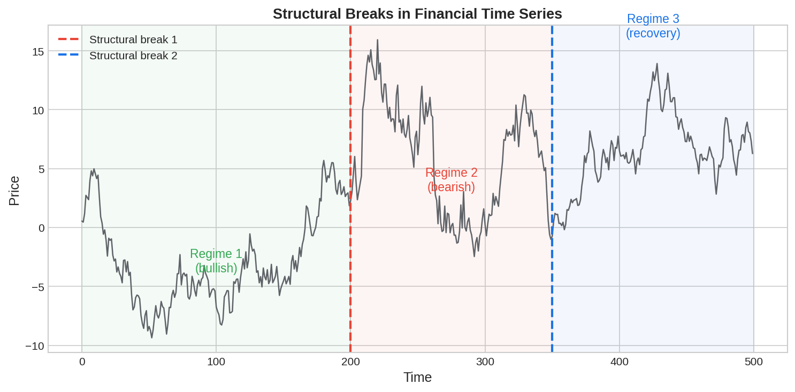
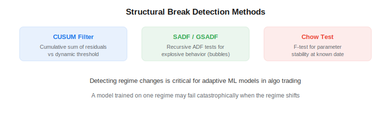

Structural breaks are abrupt changes in the statistical properties of a financial time series — shifts in mean, variance, trend, or correlation that invalidate models trained on pre-break data. In *Advances in Financial Machine Learning* (2018), Marcos Lopez de Prado emphasizes that ignoring structural breaks is one of the primary reasons ML models fail in live trading: a model trained during a low-volatility bull market will perform poorly when a crisis regime begins. Detecting these breaks is essential for building adaptive [systematic trading strategies](https://paperswithbacktest.com/wiki/systematic-trading-strategies).

## Why Structural Breaks Matter

Financial markets operate in regimes — periods with relatively stable statistical properties separated by abrupt transitions. The 2008 financial crisis, COVID-19 crash, and interest rate hiking cycles are examples of macro-level regime changes. At a micro level, corporate events, regulatory changes, and liquidity shifts create structural breaks in individual securities.



## Detection Methods

### CUSUM Filter

The [CUSUM filter](https://paperswithbacktest.com/wiki/cusum-filter) is the primary structural break detector in the AFML framework. It tracks the cumulative sum of deviations from an expected value and signals a break when this sum exceeds a threshold:

$$S_t = \max(0, S_{t-1} + y_t - E[y_t] - h)$$

where $h$ is the threshold parameter. CUSUM is particularly useful for generating the event timestamps that seed the [triple-barrier method](https://paperswithbacktest.com/wiki/triple-barrier-method).

### Supremum Augmented Dickey-Fuller (SADF) Test

The [SADF test](https://paperswithbacktest.com/wiki/supremum-augmented-dickey-fuller-sadf-test) detects explosive behavior (bubbles) by running recursive ADF unit root tests over expanding windows and taking the supremum. A value exceeding the critical value indicates the time series has entered an explosive (non-stationary) regime — useful for detecting speculative bubbles.

### Chow Test

The Chow test evaluates whether a linear regression model's parameters change at a known breakpoint. It runs separate regressions on pre-break and post-break data and tests whether the two sets of coefficients are statistically different using an F-test.



## Python Implementation

```python
import numpy as np
import pandas as pd

def cusum_filter(returns, threshold):
    events = []
    s_pos = s_neg = 0
    for i in range(len(returns)):
        s_pos = max(0, s_pos + returns.iloc[i] - threshold)
        s_neg = min(0, s_neg + returns.iloc[i] + threshold)
        if s_pos > threshold:
            events.append(returns.index[i])
            s_pos = 0
        elif s_neg < -threshold:
            events.append(returns.index[i])
            s_neg = 0
    return pd.DatetimeIndex(events)

def chow_test(y, X, breakpoint):
    from scipy import stats
    n = len(y)
    k = X.shape[1]
    # Full model
    beta_full = np.linalg.lstsq(X, y, rcond=None)[0]
    rss_full = np.sum((y - X @ beta_full)**2)
    # Sub-models
    beta1 = np.linalg.lstsq(X[:breakpoint], y[:breakpoint], rcond=None)[0]
    rss1 = np.sum((y[:breakpoint] - X[:breakpoint] @ beta1)**2)
    beta2 = np.linalg.lstsq(X[breakpoint:], y[breakpoint:], rcond=None)[0]
    rss2 = np.sum((y[breakpoint:] - X[breakpoint:] @ beta2)**2)
    # F-statistic
    f_stat = ((rss_full - rss1 - rss2) / k) / ((rss1 + rss2) / (n - 2*k))
    p_value = 1 - stats.f.cdf(f_stat, k, n - 2*k)
    return f_stat, p_value
```

## Practical Applications

| Application | Method | When to Use |
|---|---|---|
| Event sampling for labeling | CUSUM | Generating trade entry timestamps |
| Bubble detection | SADF/GSADF | Identifying explosive price behavior |
| Model retraining triggers | CUSUM on residuals | When model predictions start drifting |
| Regime-aware allocation | Rolling Chow test | Adjusting portfolio weights at breaks |

## Limitations and Risks

All structural break tests involve a tradeoff between sensitivity and false positives. A low CUSUM threshold detects breaks quickly but triggers too often; a high threshold misses genuine breaks. The Chow test requires specifying the breakpoint in advance, making it more of a confirmation tool than a detection tool. Online detection methods like CUSUM are preferred for real-time trading.

## Conclusion

Structural breaks are the silent killer of backtested strategies. A model that ignores regime changes will eventually encounter a break that destroys its edge. By integrating break detection — the [CUSUM filter](https://paperswithbacktest.com/wiki/cusum-filter) for event sampling, SADF for bubble detection, and rolling break tests for model monitoring — into the ML pipeline, algo traders can build strategies that adapt to changing markets rather than being blindsided by them.

---

**Explore further on PapersWithBacktest:**
- Browse [backtested strategies](https://paperswithbacktest.com/strategies) with Python code and performance metrics
- Access [clean historical market data](https://paperswithbacktest.com/datasets) for equities, crypto, and futures
- Take the [algo trading course](https://paperswithbacktest.com/course) — 60+ video lessons and notebooks
- Related wiki pages: [CUSUM Filter](https://paperswithbacktest.com/wiki/cusum-filter) · [SADF Test](https://paperswithbacktest.com/wiki/supremum-augmented-dickey-fuller-sadf-test) · [Fractional Differentiation](https://paperswithbacktest.com/wiki/fractional-differentiation)
