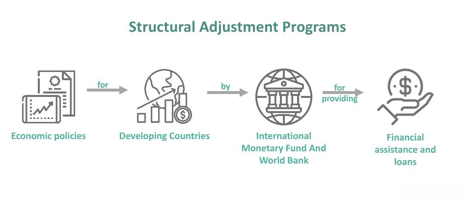

## Table of Contents

## What is a structural break in time series analysis?

A structural break in time series analysis is when there's a big change in how the data behaves over time. Imagine you're tracking the average temperature in a city. Usually, it might go up and down a little each year. But then, something big happens, like a new factory opens that makes the city much hotter. That's a structural break because the way the temperature changes after the factory opens is different from before.

These breaks can make it hard to predict future trends because the old patterns don't work anymore. For example, if you're using past data to guess future stock prices, and there's a structural break due to a new law or a big event, your guesses might be way off. That's why it's important to spot these breaks and adjust your methods to make better predictions.

## How can structural breaks impact statistical models?

Structural breaks can mess up statistical models because they change how the data behaves. Imagine you're using a model to predict the number of ice creams sold each day based on past data. If there's a structural break, like a new ice cream shop opening nearby, the old data won't help you predict sales anymore. Your model might keep saying you'll sell the same number of ice creams, but in reality, sales could go up a lot. This means your predictions will be wrong, and you might not make good decisions based on those predictions.

To fix this, you need to find the structural breaks and update your model. If you can spot when the big change happened, you can start using only the new data to make better predictions. For example, after the new ice cream shop opens, you'd use the data from that point forward to see how sales have changed. This way, your model can adapt to the new situation and give you more accurate predictions. It's like learning a new way to do things when the old way doesn't work anymore.

## What are common causes of structural breaks in economic data?

Structural breaks in economic data often happen because of big changes in laws or policies. For example, if a government decides to raise the minimum wage, it can change how much people earn and spend. This change can make the data look different from before, because now people have more money to buy things. Another example is when a country joins a trade agreement, which can affect how much they import and export, leading to a shift in economic patterns.

Another common cause is big events like financial crises or natural disasters. When a financial crisis hits, like the one in 2008, it can make the economy behave in a totally new way. People might stop spending as much, businesses might close, and unemployment might go up. All these changes can create a break in the data. Natural disasters, like hurricanes or earthquakes, can also mess up the economy by destroying businesses and homes, which leads to different spending and rebuilding patterns.

Sometimes, technological changes can cause structural breaks too. When a new technology comes out, like the internet or smartphones, it can change how people work, shop, and communicate. This can lead to new industries growing and old ones shrinking, which changes the economic data. For example, the rise of online shopping has shifted how retail sales are tracked and analyzed.

## How can one detect structural breaks in a dataset?

Detecting structural breaks in a dataset can be done by looking at the data closely and using special tests. One way is to plot the data over time and look for big changes or patterns that seem different from before. For example, if you see a sudden jump or drop in the numbers, that could be a sign of a structural break. You can also use statistical tests like the Chow test, which helps you figure out if there's a significant change at a certain point in your data. These tests compare the data before and after the suspected break to see if they behave differently.

Another way to detect structural breaks is by using computer algorithms that automatically search for changes in the data. These algorithms can go through the data and find points where the pattern changes a lot. For instance, the Bai-Perron test can find multiple breaks in the data by looking at how well different parts of the data fit together. By using these methods, you can spot where the structural breaks happen and understand why the data might be behaving differently after those points. This helps you make better predictions and decisions based on the new patterns in the data.

## What are the differences between a structural break and a regime shift?

A structural break and a regime shift both mean big changes in how data behaves over time, but they are a bit different. A structural break happens when there's a sudden change in the data's pattern. Imagine you're tracking the number of cars sold each year. If a new law makes cars cheaper, you might see a sudden jump in sales. That jump is a structural break because the data starts behaving differently right after the law changes.

A regime shift, on the other hand, is a longer-lasting change in the overall state of things. It's like when the weather changes from winter to summer. The whole system shifts to a new way of working. For example, if a country's economy moves from being mostly about farming to being about technology, that's a regime shift. The change affects everything and lasts a long time. So, while a structural break is more about a specific point of change, a regime shift is about a broader and more lasting transformation.

## What statistical tests are used to identify structural breaks?

One common test to find structural breaks is the Chow test. This test helps you see if there's a big change in your data at a certain point. Imagine you're looking at the number of people visiting a park each month. If a new playground is built, you might expect more visitors after it opens. The Chow test compares the data before and after the playground to see if there's a significant difference. If the test shows a big change, you know there's a structural break.

Another useful test is the Bai-Perron test. This test is good because it can find more than one structural break in your data. It's like looking for multiple points where the data changes a lot. For example, if you're studying the sales of a store, there might be a break when they start selling online and another when they open a new branch. The Bai-Perron test goes through the data and finds these points where the pattern shifts. Both tests help you understand when and why your data is behaving differently.

## How do structural breaks affect forecasting accuracy?

Structural breaks can make forecasting less accurate because they change how the data behaves over time. Imagine you're trying to guess how many people will visit a beach next summer based on past years. If a new amusement park opens near the beach this year, more people might come to the beach too. If your forecast doesn't account for this change, it might predict the same number of visitors as before, which would be wrong. The new park is a structural break that makes old data less useful for predicting the future.

To make better forecasts, you need to spot these structural breaks and adjust your methods. If you can find when the big change happened, you can use only the new data to make your predictions. For example, after the amusement park opens, you'd look at beach visitor numbers from that point forward to see the new trend. By doing this, your forecasts can be more accurate because they're based on the latest patterns. It's like learning a new way to predict things when the old way doesn't work anymore.

## Can you explain the Chow test for detecting structural breaks?

The Chow test is a way to find out if there's a big change in your data at a certain point. Imagine you're looking at the number of people buying ice cream each month. If a new ice cream shop opens nearby, you might expect more people to buy ice cream after it opens. The Chow test helps you see if there's a real change by comparing the data before and after the shop opened. It's like checking if the number of ice cream buyers is different enough to say that something big happened.

To use the Chow test, you split your data into two parts: before the suspected change and after it. Then, you run a statistical test to see if the difference between these two parts is big enough to matter. If the test shows a big difference, it means there's a structural break at that point. This helps you understand when something important changed in your data, so you can make better guesses about the future based on the new pattern.

## What are the implications of ignoring structural breaks in time series analysis?

If you ignore structural breaks in time series analysis, your predictions can be way off. Imagine you're guessing how many people will visit a park next month based on last year's data. If a new playground was built in the park this year, more people might come. But if you don't notice this change and keep using old data, you'll think the same number of people will visit as before. This can lead to bad decisions, like not hiring enough staff or not preparing for the extra visitors.

Ignoring structural breaks can also make your models less useful over time. When the way data behaves changes, like after a new law or a big event, the old patterns don't help anymore. If you keep using the same old model without updating it, you won't be able to predict what will happen next. It's important to find these breaks and adjust your methods so your predictions stay accurate and helpful.

## How can one model structural breaks using econometric techniques?

To model structural breaks using econometric techniques, you can use methods like the Chow test or the Bai-Perron test to find where the breaks happen. The Chow test helps you check if there's a big change at a certain point by splitting your data into two parts: before and after the suspected break. If the test shows a big difference, you know there's a structural break. The Bai-Perron test is useful because it can find more than one break in your data. It looks for points where the data's pattern changes a lot. By using these tests, you can spot when the big changes happened and start using the new data patterns to make better predictions.

Once you find the structural breaks, you can adjust your models to fit the new data. One way to do this is by using dummy variables. These are special variables that turn on or off at the point of the break. For example, if a new law changes how people spend money, you can add a dummy variable that equals zero before the law and one after it. This helps your model see the change and predict better. Another way is to use segmented regression, where you fit different lines or curves to the data before and after each break. This way, your model can follow the new patterns and give you more accurate forecasts. By updating your model to account for structural breaks, you can make better decisions based on the latest trends.

## What are the advanced methods for handling multiple structural breaks?

Handling multiple structural breaks can be tricky, but there are advanced methods that make it easier. One popular method is the Bai-Perron test, which is good at finding more than one break in your data. It's like searching for several points where the data changes a lot. Imagine you're looking at the number of cars sold each year. There might be a break when a new car model comes out and another when a new factory opens. The Bai-Perron test helps you find these points so you can see when big changes happened and why the data started behaving differently.

Once you find the breaks, you can use a technique called segmented regression to make your model fit the new patterns. This means you fit different lines or curves to the data before and after each break. It's like drawing a new path for each part of your data. For example, if you're studying the sales of a store, you might fit one line to the data before they started selling online, another line for after they started selling online, and a third line after they opened a new branch. By doing this, your model can follow the new trends and give you more accurate predictions. This way, you can make better decisions based on the latest patterns in your data.

## How do structural breaks influence policy-making and economic decision-making?

Structural breaks can really change how governments and businesses make decisions. Imagine the government is trying to decide how much money to spend on new roads. If they don't know about a big change, like a new factory opening that will make more people drive, they might not build enough roads. This can lead to traffic jams and unhappy people. By finding these big changes, the government can plan better and spend money where it's needed most. It's like knowing when to change your plans because something important has happened.

Businesses also need to watch out for structural breaks to make good choices. If a company is guessing how many new computers to make next year, they need to know if a new technology is coming out that will change how many people want to buy them. If they ignore this change, they might make too many or too few computers, which can lose them money. By spotting these breaks and adjusting their plans, businesses can make better products and keep their customers happy. It's all about staying on top of big changes to make smart decisions.

## What is the impact of structural breaks on algo trading?

Structural breaks can have profound effects on the performance of algorithmic trading systems, particularly through altering the statistical properties of financial time series. These breaks manifest as sudden changes in data patterns that previously followed a more predictable and statistically consistent path. When such disruptions occur, algorithms that depend heavily on historical data for pattern recognition and signal generation may give erroneous outcomes, leading to potentially severe financial consequences.

The primary issue lies in the fact that trading algorithms are typically calibrated using historical data under the assumption of stationary statistical properties. When a structural break occurs, these properties can shift, rendering existing models inadequate. For instance, parameters such as mean, variance, and autocorrelation, which are often assumed to be stable over time, can abruptly change. This shift can cause the underlying assumptions of models, such as those used in regression analysis or time series forecasting, to become invalid.

$$
Y_t = \beta_0 + \beta_1 X_t + \epsilon_t
$$

In the above linear regression model, sudden changes in $\beta_0$ or $\beta_1$ can lead the model to produce incorrect predictions. This points to a critical vulnerability in strategies that rely on constant model coefficients.

Beyond erroneous predictions, the inability to recognize and swiftly react to structural breaks can lead to increased transaction costs. As algorithms continue to execute trades based on now-invalid theories, traders may experience slippage, where the execution price of a trade deviates from its intended price, or face higher market impact costs because they are acting on outdated or irrelevant signals.

Moreover, structural breaks can reduce trading efficiency. Algorithms not equipped to handle these breaks may experience degraded performance, manifesting as wider bid-ask spreads, increased price [volatility](/wiki/volatility-trading-strategies), or a tangible decline in [liquidity](/wiki/liquidity-risk-premium). The cumulative effect of these factors can lead to a significant reduction in the overall profitability of trading strategies.

Therefore, recognizing the impact of structural breaks is crucial for developing resilient algorithmic trading systems. It underscores the need for continuous monitoring and adaptive algorithms that reassess and recalibrate their models in response to detected disruptions, thereby mitigating the adverse effects and maintaining trading performance under changing market conditions.

## How can we detect structural breaks?

Detecting structural breaks is a critical process in ensuring the effectiveness and reliability of algorithmic trading systems. Various statistical tests have been traditionally used to identify structural breaks, such as the Chow test and the CUSUM (Cumulative Sum Control Chart) test. 

### Statistical Methods for Detecting Structural Breaks

1. **Chow Test**: The Chow test is employed to identify changes in the parameters of a linear regression model at a known point in time. By dividing the dataset into two separate intervals and running regressions on each, the Chow test determines if the coefficients differ significantly, indicating a structural break. The null hypothesis of this test states that no structural break exists, and a statistically significant result suggests a break at the specified point.
$$
   F = \frac{(RSS_1 - (RSS_2 + RSS_3)) / k}{(RSS_2 + RSS_3) / (n_2 + n_3 - 2k)}

$$

   where $RSS_1$ is the residual sum of squares for the combined dataset, $RSS_2$ and $RSS_3$ are for the separate intervals, $k$ is the number of parameters, and $n_2$ and $n_3$ are the number of observations in the intervals.

2. **CUSUM Test**: The CUSUM test monitors the sum of forecast errors and identifies shifts or breaks by observing cumulative sums that diverge from expected values. It is particularly useful for detecting breaks in regression coefficients over time. The CUSUM chart plots the cumulative sum of deviations of the predicted values from the actual values, and a break is indicated when this sum deviates beyond control limits.

### Machine Learning Techniques

Modern advancements have introduced [machine learning](/wiki/machine-learning) techniques that offer enhanced flexibility and accuracy in structural break detection through pattern recognition and anomaly detection. 

1. **Reinforcement Learning**: Reinforcement learning algorithms can be tailored to detect structural breaks by adjusting the reward functions to recognize regimes or behavioral changes in data patterns. These models can learn from an environment over time, updating predictions and dynamically adapting to changes in the statistical properties of the market.

2. **Neural Networks**: Neural networks, especially deep learning models, are advantageous in recognizing complex patterns and non-linear relationships indicative of potential breaks. By training models on historical data, neural networks can identify anomalies that suggest structural shifts, updating trading algorithms to account for these changes.

```python
import numpy as np
from sklearn.neural_network import MLPClassifier

# Toy dataset simulating regime changes
X = np.random.rand(1000, 10)
y = np.array([0]*500 + [1]*500)  # Simulated structural break after 500 data points

# Neural network for detecting structural breaks
nn_model = MLPClassifier(hidden_layer_sizes=(50,), max_iter=1000, random_state=42)
nn_model.fit(X, y)

# Predicting structural breaks
predictions = nn_model.predict(X)
```

Incorporating these modern machine learning techniques complements traditional statistical tests, offering a robust approach for real-time detection and adaptation to structural breaks in financial time series. As trading algorithms continue to rely on accurate data interpretations, the integration of these methods becomes imperative for sustaining trading performance amidst fluctuating market conditions.

## How can algo trading strategies be adapted to structural breaks?

To manage structural breaks effectively, trading strategies in algorithmic trading must exhibit both adaptability and robustness to varying market conditions. Adaptive algorithms are designed to adjust to these changes by incorporating feedback mechanisms that allow them to recalibrate as new data becomes available. This dynamic nature is crucial because financial markets are continuously influenced by numerous factors, such as economic announcements, geopolitical events, or sudden shifts in investor sentiment, all of which can lead to structural breaks.

The foundation of such adaptive strategies lies in their ability to continuously evaluate model performance and update parameters based on new information. This is often achieved through real-time data processing and machine learning techniques. For instance, algorithms can employ [reinforcement learning](/wiki/reinforcement-learning), where the model continuously learns from market interactions and iteratively improves its decision-making process.

A fundamental aspect of these strategies is the statistical detection and accommodation of structural breaks. This involves identifying when a break has occurred and adjusting the trading algorithm accordingly. One common approach is to apply techniques like the Kalman filter, which can adjust model estimates recursively as new observations are made. The Kalman filter is particularly useful in scenarios where the system is subject to continuous but imperfect observations.

$$
\hat{x}_{k|k} = \hat{x}_{k|k-1} + K_k (z_k - H \hat{x}_{k|k-1})
$$

This equation represents the Kalman filter update step, where $\hat{x}_{k|k}$ is the updated estimate, $K_k$ is the Kalman gain, $z_k$ is the observation, and $H$ is the measurement matrix. The system can thus modify its expectations dynamically in response to incoming data that might indicate a structural shift.

Additionally, incorporating structural break awareness into strategy design can significantly enhance the resilience of an algorithmic trading system. By embedding structural break detection and response mechanisms directly into trading strategies, such systems are capable of maintaining their effectiveness even under rapidly changing market conditions. An example is using Bayesian inference to model potential structural breaks as probabilistic events, allowing the trading strategy to modify its parameters proactively based on the likelihood of a structural shift.

Python code to simulate a basic adaptive algorithm might include tools like `pandas` for data handling and `numpy` for numerical analysis. Here is an example of implementing a simple moving average (SMA) crossover strategy that adapts based on detected structural breaks:

```python
import pandas as pd
import numpy as np

def adaptive_sma_strategy(price_data, short_window=40, long_window=100):
    signals = pd.DataFrame(index=price_data.index)
    signals['price'] = price_data['price']
    signals['short_mavg'] = price_data['price'].rolling(window=short_window, min_periods=1, center=False).mean()
    signals['long_mavg'] = price_data['price'].rolling(window=long_window, min_periods=1, center=False).mean()

    # Identify potential structural breaks
    change_points = []  # List to store indices of structural breaks
    threshold = signals['price'].std() * 2  # Example threshold for significant movement

    for i in range(1, len(signals)):
        if abs(signals['price'].iloc[i] - signals['price'].iloc[i-1]) > threshold:
            change_points.append(i)

    # Recalculate moving averages at change points
    for point in change_points:
        new_short_window = short_window * 0.9  # Adjust short window based on break
        new_long_window = long_window * 1.1   # Adjust long window based on break
        signals.loc[point:, 'short_mavg'] = price_data['price'][point:].rolling(window=int(new_short_window), min_periods=1).mean()
        signals.loc[point:, 'long_mavg'] = price_data['price'][point:].rolling(window=int(new_long_window), min_periods=1).mean()

    # Create buy/sell signals
    signals['signal'] = 0.0
    signals['signal'][short_window:] = np.where(signals['short_mavg'][short_window:] > signals['long_mavg'][short_window:], 1.0, 0.0)
    signals['positions'] = signals['signal'].diff()

    return signals

# Example usage:
# price_data = pd.DataFrame({'price': [...]})  # Load your price data here
# signals = adaptive_sma_strategy(price_data, short_window=40, long_window=100)
```

In conclusion, dynamically adaptive systems that integrate structural break awareness are essential in maintaining the reliability and competitiveness of algorithmic trading strategies. By leveraging advanced statistical and machine learning techniques, these algorithms can adjust to real-time shifts in market conditions, leading to improved financial performance and risk management.

## References & Further Reading

[1]: Bergstra, J., Bardenet, R., Bengio, Y., & Kégl, B. (2011). ["Algorithms for Hyper-Parameter Optimization."](https://proceedings.neurips.cc/paper/2011/file/86e8f7ab32cfd12577bc2619bc635690-Paper.pdf) Advances in Neural Information Processing Systems 24.

[2]: ["Advances in Financial Machine Learning"](https://www.amazon.com/Advances-Financial-Machine-Learning-Marcos/dp/1119482089) by Marcos Lopez de Prado

[3]: ["Evidence-Based Technical Analysis: Applying the Scientific Method and Statistical Inference to Trading Signals"](https://www.amazon.com/Evidence-Based-Technical-Analysis-Scientific-Statistical/dp/0470008741) by David Aronson

[4]: ["Machine Learning for Algorithmic Trading"](https://github.com/PacktPublishing/Machine-Learning-for-Algorithmic-Trading-Second-Edition) by Stefan Jansen

[5]: ["Quantitative Trading: How to Build Your Own Algorithmic Trading Business"](https://books.google.com/books/about/Quantitative_Trading.html?id=j70yEAAAQBAJ) by Ernest P. Chan