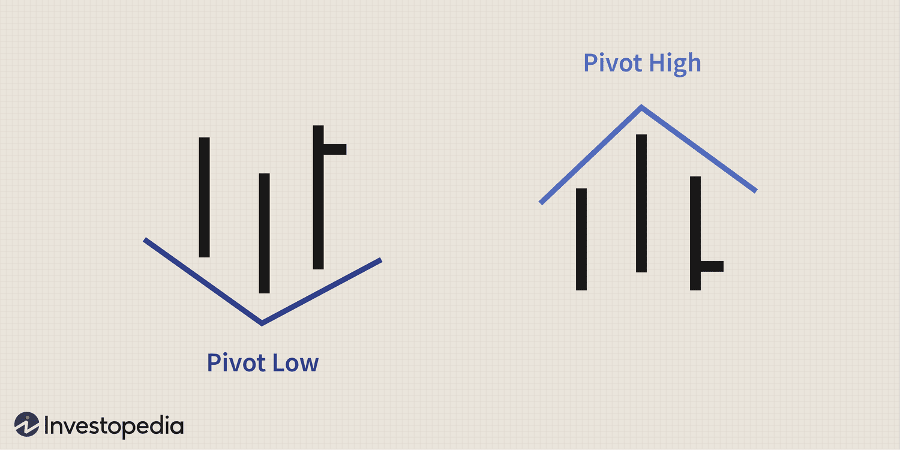

In the ever-evolving world of business, adaptability is crucial for maintaining success and relevance. This article investigates the relationship among business strategy, organizational change, structural pivots, and algorithmic trading as key components that enable companies to stay competitive and continually innovate. By effectively aligning these concepts, businesses can respond to shifting market conditions and consumer preferences, leveraging new technologies and approaches to optimize their operations and drive growth.

Business strategy forms the foundation for long-term planning and goal setting, ensuring that organizations are prepared for future challenges and opportunities. Organizational change becomes necessary as companies encounter evolving market dynamics and the need to realign their objectives with consumer demands. Structural pivots, or substantial shifts in a company’s core operations or market approach, are often required to maintain relevance and competitiveness in such a dynamic environment.

Algorithmic trading, using automated systems and complex algorithms for trading in financial markets, represents an advanced technological approach that businesses can incorporate into their strategies. This technique offers advantages like enhanced accuracy, improved speed, and more effective management of large transactions. Therefore, businesses aiming for success must embrace technological advancements like algorithmic trading alongside strategic pivots and organizational changes.

Together, these elements form a powerful toolkit for businesses to ensure their long-term success. By understanding and harnessing these concepts, organizations can create a dynamic environment that not only endures in the face of change but thrives through innovation and strategic foresight.

## Table of Contents

## Understanding Business Strategy and Organizational Change

Business strategy is the comprehensive plan devised by organizations to achieve their long-term goals and objectives. It serves as a roadmap guiding decision-making and resource allocation. A well-crafted business strategy considers various factors, including competitive positioning, market dynamics, and internal capabilities. Strategic planning often involves a thorough analysis of the industry landscape, identification of opportunities and threats, and leveraging organizational strengths to gain a competitive edge.

Organizational change, on the other hand, is an indispensable component for businesses striving to remain relevant. Adjustments may be required in response to shifts in consumer preferences, technological advancements, or changes in regulatory environments. Effective organizational change encompasses modifications to business processes, corporate culture, structure, and strategies.

Aligning business strategy with organizational change can catalyze growth and transformation. For instance, a company that anticipates market trends or technological disruptions can proactively adapt its strategy and operations, positioning itself advantageously against competitors. This alignment ensures that a company's strategic vision is not only conceived but also effectively implemented through adaptive and responsive operational changes.

A seamless integration of business strategy and organizational change necessitates continuous feedback and flexibility. By fostering a culture of innovation and openness to change, businesses can better maneuver through industry shifts and market [volatility](/wiki/volatility-trading-strategies). The alignment can lead to increased operational efficiency, enhanced customer satisfaction, and sustainable competitive advantage.

Strategic alignment often involves restructuring, realigning resources, and implementing new technologies to support intended changes. While the strategic plan sets the direction, organizational change provides the mechanism to advance towards the desired goals, ensuring that a company remains adaptable and capable of seizing new opportunities as they arise.

## Structural Pivot: A Necessary Maneuver

A structural pivot refers to a significant modification in a company's core operations, strategies, or market approach, undertaken to achieve better alignment with market demands or to leverage new opportunities. This maneuver is often necessary in response to changes in consumer preferences, technological advancements, or unforeseen disruptions. 

There are several types of structural pivots that businesses might consider:

1. **Market Pivot**: This involves changing the target market or altering the way a company addresses its target audience. A market pivot might occur if new customer segments are identified or if current markets become less profitable due to saturation or competition. For example, Twitter started as a podcast platform called Odeo before pivoting into a microblogging service, tapping into an emerging market for short-form communication.

2. **Product Pivot**: Sometimes, companies need to reposition their product offerings to better meet customer needs or to differentiate from competitors. A product pivot might involve changing the product's features, benefits, or even its core function. An example of this is Slack, which started as an offshoot of a gaming company's internal communication tools and ended up pivoting to become a leading business communication platform.

3. **Revenue Model Pivot**: Altering the way a business generates income can also constitute a structural pivot. This might involve transitioning from a one-time purchase model to a subscription-based model, implementing freemium options, or tapping into diverse revenue streams. Adobe's shift from selling software licenses to offering Creative Cloud subscriptions illustrates a successful revenue model pivot, allowing for more consistent revenue flow and customer engagement.

Understanding when to execute a pivot is crucial. Indicators for the need to pivot include stagnant growth, increased competition, customer feedback indicating a mismatch between offerings and needs, or emerging technology disruptions. The process of executing a pivot effectively involves careful market research, strategic planning, and, importantly, clear communication with stakeholders to manage expectations and ensure alignment across the organization.

In conclusion, executing a successful pivot requires a firm grasp of market conditions, robust strategic foresight, and the ability to effectively reorganize resources and operations to adapt to new circumstances. By embracing the concept of structural pivots, businesses can maintain relevance and ensure long-term competitiveness in ever-changing markets.

## Embracing Algorithmic Trading in Financial Markets

Algorithmic trading has revolutionized financial markets by leveraging automated systems and sophisticated algorithms to execute trades at high speeds that are beyond human capability. This technology utilizes mathematical models and computer programs to make trading decisions based on market data. The benefits of [algorithmic trading](/wiki/algorithmic-trading) include enhanced accuracy in trade execution, reduced transaction costs, and the capacity to handle large volumes of transactions efficiently.

The speed at which algorithmic trading operates allows it to react instantly to market changes, thus capturing fleeting trading opportunities that would be impossible for manual traders to exploit. This precision is achieved through pre-defined criteria that algorithms use to identify the right conditions for making trades. As such, algorithmic trading minimizes human error and emotional bias, which are common in traditional trading methods.

One of the key advantages of algorithmic trading is the ability to manage large transactions without significantly impacting market prices. Algorithms can break up large orders into smaller, more manageable ones, executing them at optimal times to reduce market impact and ensure a favorable average execution price. This method, known as "order slicing," is a fundamental aspect of algorithmic trading strategies like TWAP (Time Weighted Average Price) and VWAP (Volume Weighted Average Price).

Traditional businesses, particularly those in the financial sector, can integrate algorithmic trading into their strategies to enhance competitiveness and profitability. For example, a company can use algorithms to hedge against market risks or to capitalize on [arbitrage](/wiki/arbitrage) opportunities. The integration of [machine learning](/wiki/machine-learning) and [artificial intelligence](/wiki/ai-artificial-intelligence) into trading algorithms further enhances their predictive power, allowing businesses to anticipate market movements and make data-driven decisions.

To successfully implement algorithmic trading, businesses should follow a systematic approach. First, it's essential to develop a robust trading strategy that aligns with the company’s overall objectives. This involves identifying market conditions and selecting appropriate algorithms that can adapt to these conditions. Next, businesses should invest in the necessary technology infrastructure, including high-performance computing systems and secure data management solutions.

Risk management is another critical component of algorithmic trading. Companies need to establish strict risk controls and continuously monitor algorithmic performance to ensure compliance with regulatory standards and to mitigate any potential losses. Additionally, businesses should foster a culture of innovation and continuous improvement, encouraging teams to refine trading algorithms based on market feedback and technological advancements.

In summary, the integration of algorithmic trading provides traditional businesses with an opportunity to enhance accuracy, optimize trade execution, and manage large transactions effectively. By embracing this technology, companies can achieve a strategic advantage in financial markets, propelling better results and paving the way for growth and innovation.

## Strategies for Successful Implementation

Implementing change effectively within a business environment necessitates a comprehensive approach that involves clear planning, stakeholder alignment, and efficient communication. These core elements provide the foundation for introducing and managing structural pivots successfully.

### Step-by-Step Guide to Identifying Opportunities and Setting Goals

1. **Conduct a Situational Analysis**: Businesses must begin by thoroughly understanding their current position in the market. This includes a SWOT (Strengths, Weaknesses, Opportunities, and Threats) analysis to identify the internal and external factors affecting the organization. Tools such as PESTLE (Political, Economic, Social, Technological, Legal, and Environmental) analysis can further illuminate external influences.

2. **Set Clear, Measurable Objectives**: Once opportunities are identified, businesses should define clear, measurable, and achievable goals. These objectives should align with the overall mission and values of the organization, ensuring all actions are purposeful.

3. **Formulate a Strategic Pivot Plan**: The next step is to develop a robust plan that outlines the tactical changes necessary to achieve the newly-set goals. This includes determining the type of pivot—be it market, product, or revenue model—and detailing the resources required, timelines, and potential risks involved.

### Executing Structural Pivots

1. **Engage Stakeholders**: Successful implementation hinges on getting buy-in from all relevant stakeholders, including employees, investors, and customers. This requires transparent communication about the reasons for the change, expected outcomes, and how it aligns with their interests.

2. **Resource Allocation and Training**: Ensure that sufficient resources—both financial and human—are allocated to support the change. Additionally, provide necessary training and development programs to equip your team with the skills needed to navigate the transformation effectively.

3. **Implement Incremental Changes**: Where possible, execute changes incrementally to manage risk and allow for adjustments based on feedback. This Agile approach enables quick responses to unforeseen challenges and fosters continuous improvement.

### Continuous Monitoring and Adaptation

1. **Establish Key Performance Indicators (KPIs)**: Monitoring progress is crucial. Define KPIs that align with your objectives, allowing for regular assessment of the pivot's effectiveness. These metrics should provide clear insights into whether the changes are yielding the desired results.

2. **Regular Feedback Loops**: Maintain open lines of communication to gather feedback from all involved parties. This data is invaluable for understanding the impact of changes and identifying areas for further adjustment.

3. **Adapt and Evolve**: A flexible approach is essential. Be prepared to adapt strategies based on performance data and stakeholder feedback. Continuous learning and adaptation are vital for sustaining the competitive edge and achieving long-term success.

By following these strategic steps, businesses can navigate structural pivots with precision, ensuring they remain competitive and are well-positioned for future growth opportunities. The process requires dedication to clear communication, stakeholder involvement, and the flexibility to adapt as the business landscape evolves.

## Case Studies: Successful Structural Pivots

Netflix and Amazon are prime examples of companies that have successfully executed structural pivots, demonstrating how strategic changes can drive significant business growth and future-proofing.

### Netflix: From DVD Rental to Streaming Giant

Netflix transformed its business model to remain competitive and relevant. Initially launched in 1997 as a DVD rental service, Netflix faced significant disruption with the rise of digital distribution and online streaming. Recognizing the shift in consumer preferences from physical media to online content, Netflix pivoted from its traditional DVD rental business to a subscription-based streaming service in 2007. This pivot was not merely a change in content delivery but represented a broader strategic shift towards technology and consumer data-driven personalization. Through strategic content acquisitions, original programming, and leveraging user data for personalized recommendations, Netflix seismically shifted its business model. By 2020, streaming accounted for the vast majority of its revenue, underscoring the pivotal role this strategic change played in its growth and market dominance.

### Amazon: Evolution from Online Bookseller to Diversified Tech Powerhouse

Amazon's trajectory from an online bookstore to a global technology and e-commerce titan exemplifies a successful structural pivot. Founded in 1994, Amazon initially focused on selling [books](/wiki/algo-trading-books) online. Recognizing broader market opportunities, Amazon expanded its product offerings and diversified into multiple sectors including cloud computing, consumer electronics, digital streaming, and artificial intelligence. The introduction of Amazon Web Services (AWS) in 2006 marked a significant pivot, allowing businesses large and small to access robust cloud computing resources. This move not only diversified Amazon's revenue streams but propelled its financial growth, with AWS contributing a substantial portion of Amazon’s profitability. By continuously innovating its business model and embracing technological advancements, Amazon solidified its position as a leader across various industries.

### Key Insights and Inspiration

These case studies provide valuable lessons on the importance of recognizing market changes and the willingness to adapt and innovate. Key insights include:

1. **Timing and Market Awareness**: Both Netflix and Amazon capitalized on emerging technologies and shifting consumer behaviors. Effective timing was crucial in their successful pivots.

2. **Investment in Technology**: Both companies leveraged technology not only to enhance their service delivery but also to explore new business opportunities. Embracing technological advancements can lead to operational improvements and new revenue streams.

3. **Focus on Customer Experience**: Enhancing customer experience was at the core of both companies’ strategic pivots. Understanding customer needs and preferences can guide successful pivots and fuel growth.

4. **Leadership and Vision**: Visionary leadership that is willing to challenge the status quo and embrace transformation is essential for executing successful pivots. Both Netflix's Reed Hastings and Amazon's Jeff Bezos epitomized this trait.

Businesses can draw inspiration from these examples to develop or refine their strategies for growth. By remaining adaptable, open to innovation, and focused on delivering value, companies can successfully navigate structural pivots and secure long-term success.

## Conclusion

Adaptability and innovation are essential for ensuring business sustainability and fostering growth. In today’s fast-paced and technology-driven market, the ability of a company to pivot strategically and integrate advanced technologies, such as algorithmic trading, is pivotal. Strategic pivots involve shifts in business models or operational approaches that allow companies to realign with evolving market demands and stay competitive. For instance, companies like Netflix and Amazon have demonstrated how structural pivots can transform entire industries, setting benchmarks for innovation and adaptability.

By leveraging advanced technologies like algorithmic trading, businesses can gain critical advantages such as improved transaction efficiency, accuracy, and scalability. These technologies allow companies to process vast amounts of data swiftly and make informed decisions, aiding in managing risks and optimizing strategies. Algorithmic trading can be particularly beneficial for businesses operating in financial markets, enabling them to harness data-driven insights for better investment outcomes.

The core of business longevity lies in the ability to foresee changes, embrace them as opportunities, and continuously seek improvement. This requires an open mindset towards change, encouraging innovation across all organizational levels. Businesses should foster a culture that values learning and experimentation while maintaining a strong strategic vision.

In conclusion, adaptability and innovation serve as the cornerstones for lasting business success. By implementing well-thought-out strategic pivots and embracing state-of-the-art technologies, companies can not only sustain themselves in challenging environments but also lead in their respective industries. Emphasizing continuous improvement and embracing change as an avenue for growth are crucial for thriving in the ever-evolving landscape of business.

## References & Further Reading

[1]: ["Advances in Financial Machine Learning"](https://www.amazon.com/Advances-Financial-Machine-Learning-Marcos/dp/1119482089) by Marcos Lopez de Prado

[2]: ["Evidence-Based Technical Analysis: Applying the Scientific Method and Statistical Inference to Trading Signals"](https://www.amazon.com/Evidence-Based-Technical-Analysis-Scientific-Statistical/dp/0470008741) by David Aronson

[3]: ["Machine Learning for Algorithmic Trading"](https://github.com/stefan-jansen/machine-learning-for-trading) by Stefan Jansen

[4]: ["Quantitative Trading: How to Build Your Own Algorithmic Trading Business"](https://www.amazon.com/Quantitative-Trading-Build-Algorithmic-Business/dp/1119800064) by Ernest P. Chan

[5]: ["The Lean Startup: How Today's Entrepreneurs Use Continuous Innovation to Create Radically Successful Businesses"](https://www.amazon.com/Lean-Startup-Entrepreneurs-Continuous-Innovation/dp/0307887898) by Eric Ries

[6]: Christensen, C. M. (1997). ["The Innovator's Dilemma: When New Technologies Cause Great Firms to Fail"](https://www.hbs.edu/faculty/Pages/item.aspx?num=46) Harvard Business Review Press. 

[7]: ["Adaptive Markets: Financial Evolution at the Speed of Thought"](https://www.jstor.org/stable/j.ctvc7778k) by Andrew W. Lo