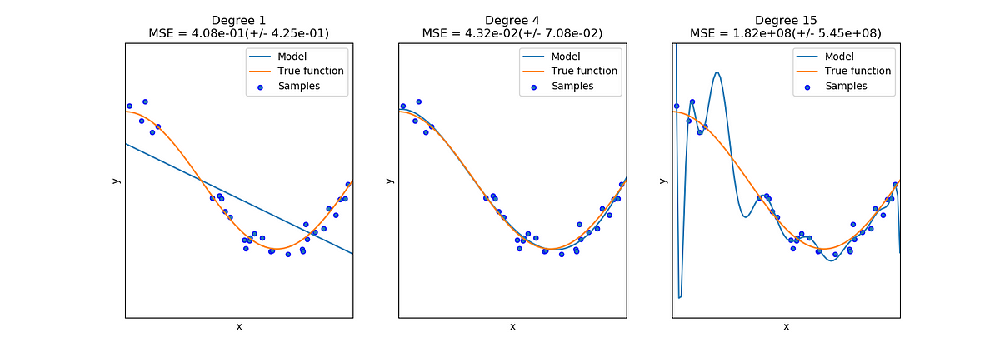

## Table of Contents

## What is Structural Risk Minimization (SRM) in the context of machine learning?

Structural Risk Minimization (SRM) is a principle in machine learning that aims to find a good balance between the model's ability to fit the training data well and its ability to generalize to new, unseen data. In simpler terms, SRM helps in choosing a model that not only performs well on the data it was trained on but also performs well on new data. This is important because a model that fits the training data too closely might not work well with new data, a problem known as overfitting.

To achieve this balance, SRM uses a concept called the " VC dimension," which measures the complexity of a model. A model with a higher VC dimension can represent more complex functions but might overfit the training data. SRM works by organizing models into a nested structure, where simpler models are considered before more complex ones. The goal is to select the model that minimizes the sum of the empirical risk (how well the model fits the training data) and a penalty term that increases with the model's complexity. This approach helps in finding a model that generalizes well, thus improving its performance on new data.

## How does SRM differ from Empirical Risk Minimization (ERM)?

Structural Risk Minimization (SRM) and Empirical Risk Minimization (ERM) are two different approaches to selecting the best model in machine learning. ERM focuses on finding a model that best fits the training data. It does this by minimizing the average loss, or "empirical risk," on the training set. In other words, ERM tries to make the model perform as well as possible on the data it has seen, without considering how complex the model is.

On the other hand, SRM takes a step further by also considering the complexity of the model. SRM aims to minimize not just the empirical risk but also a penalty term that reflects the model's complexity. This penalty term is based on the VC dimension, which measures how complex a model can be. By doing this, SRM tries to find a balance between fitting the training data well and keeping the model simple enough to perform well on new, unseen data. This makes SRM a better approach for avoiding overfitting and improving generalization.

In simple terms, ERM is like trying to get the highest score on a test you've already seen, while SRM is like trying to get a good score on a test you haven't seen yet, by choosing a study method that's not too hard or too easy.

## What is the main goal of using SRM in machine learning models?

The main goal of using Structural Risk Minimization (SRM) in machine learning models is to find a model that works well not just on the data it was trained on, but also on new data it hasn't seen before. This is important because a model that fits the training data too closely might not work well with new data, which is a problem called overfitting. SRM helps to avoid overfitting by balancing how well the model fits the training data with how complex the model is.

SRM does this by organizing models into a structure where simpler models are considered before more complex ones. It then chooses the model that minimizes both the average loss on the training data (called empirical risk) and a penalty for the model's complexity. This penalty is based on something called the VC dimension, which measures how complex a model can be. By considering both the empirical risk and the complexity penalty, SRM helps to pick a model that generalizes well to new data, making it a useful approach in machine learning.

## Can you explain the concept of the VC dimension and its role in SRM?

The VC dimension, or Vapnik-Chervonenkis dimension, is a way to measure how complex a model can be. It's named after the people who came up with it, Vladimir Vapnik and Alexey Chervonenkis. Imagine you have a set of points and you want to see if a model can draw a line (or curve, or any shape) that separates these points into two groups in all possible ways. The VC dimension is the largest number of points where you can do this perfectly, no matter how the points are arranged. For example, a straight line can separate any arrangement of two points into two groups, so the VC dimension of a straight line is 2. A more complex model, like a circle, can do this for up to three points, so its VC dimension is 3.

In Structural Risk Minimization (SRM), the VC dimension is very important because it helps us choose the right model. SRM looks at both how well the model fits the training data and how complex the model is. The complexity is measured by the VC dimension. If a model has a high VC dimension, it can fit the training data very well, but it might not work well with new data because it's too complex. SRM tries to find a balance by choosing a model that fits the training data well but isn't too complex. This balance is found by adding a penalty to the model's performance on the training data, where the penalty gets bigger as the VC dimension gets bigger. So, SRM helps us pick a model that will work well on new data by considering both how well it fits the training data and its complexity.

## How does SRM help in balancing the trade-off between model complexity and generalization?

Structural Risk Minimization (SRM) helps balance the trade-off between model complexity and generalization by considering both how well a model fits the training data and how complex the model is. It does this by adding a penalty to the model's performance on the training data, where the penalty increases with the model's complexity, measured by the VC dimension. The VC dimension is a way to measure how complex a model can be, and SRM uses it to make sure the model isn't too complex. By choosing a model that minimizes both the average loss on the training data and this complexity penalty, SRM helps pick a model that will work well on new data.

For example, if we have two models: one simple and one complex, SRM will look at how well each model fits the training data. The complex model might fit the training data better, but it will have a higher penalty because of its higher VC dimension. SRM will then choose the model that has the best balance between fitting the training data and keeping the complexity low. This way, SRM helps us find a model that generalizes well to new data, avoiding the problem of overfitting where a model fits the training data too closely but doesn't work well with new data.

## What are the steps involved in implementing SRM in a machine learning algorithm?

To implement Structural Risk Minimization (SRM) in a machine learning algorithm, you first need to organize your models into a structure where simpler models are considered before more complex ones. This is done by sorting the models based on their VC dimension, which measures how complex a model can be. For example, a model with a lower VC dimension is simpler and should be tried before a model with a higher VC dimension. Once you have this structure, you train each model on your training data and calculate its empirical risk, which is how well the model fits the training data. The empirical risk is usually calculated as the average loss over the training set.

Next, you add a penalty to the empirical risk for each model, where the penalty gets bigger as the VC dimension gets bigger. This penalty helps to balance the model's complexity with how well it fits the training data. The formula for the total risk that SRM tries to minimize is something like this: $$ R_{\text{total}} = R_{\text{empirical}} + \lambda \cdot \text{VC dimension} $$, where $$ R_{\text{empirical}} $$ is the empirical risk, $$ \lambda $$ is a parameter that controls how much we care about the complexity, and VC dimension is the complexity of the model. You then choose the model that has the lowest total risk. This approach helps you pick a model that will work well on new data by balancing how well it fits the training data and its complexity.

In practice, implementing SRM might look something like this in Python code:

```python
import numpy as np

# Define models with different complexities
models = [model1, model2, model3]  # Assume these are sorted by increasing VC dimension

# Define the training data
X_train, y_train = get_training_data()

# Define the complexity penalty parameter
lambda_param = 0.1

# Initialize variables to keep track of the best model
best_model = None
best_total_risk = float('inf')

# Iterate through the models
for model in models:
    # Train the model
    model.fit(X_train, y_train)

    # Calculate the empirical risk (average loss on training data)
    empirical_risk = np.mean(model.loss(X_train, y_train))

    # Calculate the total risk with complexity penalty
    vc_dimension = model.vc_dimension  # Assume each model has a vc_dimension attribute
    total_risk = empirical_risk + lambda_param * vc_dimension

    # Update the best model if this one is better
    if total_risk < best_total_risk:
        best_total_risk = total_risk
        best_model = model

# Use the best model for predictions
predictions = best_model.predict(X_new)
```

This code shows how you can implement SRM by organizing models, calculating the empirical risk and adding a complexity penalty, and then choosing the model with the lowest total risk.

## How can SRM be applied to prevent overfitting in machine learning models?

Structural Risk Minimization (SRM) helps prevent overfitting in machine learning models by balancing how well a model fits the training data with how complex the model is. Overfitting happens when a model fits the training data too closely and doesn't work well with new data. SRM uses a concept called the VC dimension to measure how complex a model can be. By choosing a model that minimizes the sum of the empirical risk (how well the model fits the training data) and a penalty term based on the VC dimension, SRM helps pick a model that will work well on new data. This penalty term gets bigger as the model's complexity increases, so SRM encourages choosing simpler models that are less likely to overfit.

In practice, to apply SRM and prevent overfitting, you would first organize your models into a structure where simpler models are considered before more complex ones. Then, you would train each model on your training data and calculate its empirical risk, which is the average loss over the training set. Next, you would add a penalty to the empirical risk for each model, where the penalty is based on the model's VC dimension. The formula for the total risk that SRM tries to minimize is $$ R_{\text{total}} = R_{\text{empirical}} + \lambda \cdot \text{VC dimension} $$, where $$ R_{\text{empirical}} $$ is the empirical risk, $$ \lambda $$ is a parameter that controls how much we care about the complexity, and VC dimension is the complexity of the model. By choosing the model with the lowest total risk, SRM helps you find a model that generalizes well to new data, thus preventing overfitting.

## What types of models are best suited for SRM, and why?

Models that are best suited for Structural Risk Minimization (SRM) are those with a clear way to measure their complexity, like the VC dimension. This includes linear models, such as support vector machines (SVMs), and some types of neural networks. These models can be organized into a structure where simpler models are considered before more complex ones, making it easier to apply SRM. For example, in SVMs, the VC dimension can be related to the number of support vectors or the margin size, allowing SRM to balance the model's complexity with its performance on the training data.

SRM works well with these types of models because it helps pick a model that not only fits the training data well but also generalizes to new data. By adding a penalty to the empirical risk, which is the average loss on the training data, SRM discourages choosing overly complex models that might overfit. The formula for the total risk that SRM tries to minimize is $$ R_{\text{total}} = R_{\text{empirical}} + \lambda \cdot \text{VC dimension} $$, where $$ R_{\text{empirical}} $$ is the empirical risk, $$ \lambda $$ is a parameter that controls how much we care about the complexity, and VC dimension is the complexity of the model. This approach helps in finding a good balance, making SRM particularly useful for models where complexity can be clearly defined and managed.

## Can you discuss some practical examples where SRM has been successfully applied?

One practical example where SRM has been successfully applied is in the field of image classification using support vector machines (SVMs). In this case, researchers used SRM to choose the best SVM model for classifying different types of images. They started by organizing the SVM models into a structure based on their VC dimension, which measures how complex the model can be. Then, they trained each model on a set of images and calculated the empirical risk, which is how well the model fits the training data. By adding a penalty to the empirical risk based on the VC dimension, SRM helped them pick a model that not only worked well on the training images but also performed well on new images. This approach helped prevent overfitting, where the model might work well on the training data but not on new data.

Another example is in the field of financial forecasting, where SRM has been used to predict stock prices. In this case, researchers used different types of regression models, such as linear regression and polynomial regression, to forecast stock prices. They organized these models by their complexity, measured by the VC dimension. Then, they trained each model on historical stock price data and calculated the empirical risk. By adding a penalty to the empirical risk based on the VC dimension, SRM helped them choose a model that balanced fitting the historical data well with not being too complex. This resulted in a model that could predict stock prices more accurately on new data, helping to avoid overfitting and improving the model's generalization to future stock price movements.

## How does SRM influence the choice of model parameters and hyperparameters?

Structural Risk Minimization (SRM) influences the choice of model parameters and hyperparameters by helping to find a good balance between how well a model fits the training data and how complex it is. When choosing model parameters, SRM considers both the empirical risk, which is how well the model fits the training data, and a penalty based on the model's complexity, measured by the VC dimension. For example, if you're using a support vector machine (SVM), SRM might help you choose the right value for the margin size or the number of support vectors. By adding a penalty to the empirical risk, SRM encourages picking parameters that keep the model from being too complex, which helps prevent overfitting.

SRM also affects the choice of hyperparameters by organizing models into a structure where simpler models are considered before more complex ones. Hyperparameters are settings that control the model's behavior, like the learning rate in neural networks or the regularization parameter in linear regression. SRM helps you pick hyperparameters that lead to a model with the lowest total risk, which is calculated as $$ R_{\text{total}} = R_{\text{empirical}} + \lambda \cdot \text{VC dimension} $$. Here, $$ R_{\text{empirical}} $$ is the empirical risk, $$ \lambda $$ is a parameter that controls how much we care about the complexity, and VC dimension is the complexity of the model. By choosing hyperparameters that minimize this total risk, SRM helps you find a model that will work well on new data, not just the data it was trained on.

## What are the limitations and challenges of using SRM in real-world applications?

One of the main limitations of using Structural Risk Minimization (SRM) in real-world applications is that it can be difficult to measure the complexity of a model accurately. SRM uses the VC dimension to measure how complex a model can be, but calculating the VC dimension can be hard, especially for complex models like deep neural networks. This makes it challenging to apply SRM to these types of models because you need to know the VC dimension to add the right penalty to the model's performance on the training data. If you can't measure the complexity well, SRM might not work as well as you hope.

Another challenge is that SRM requires organizing models into a structure where simpler models are considered before more complex ones. This can be time-consuming and might not always be practical in real-world settings where you need to find a good model quickly. Also, the parameter $$ \lambda $$ in the SRM formula $$ R_{\text{total}} = R_{\text{empirical}} + \lambda \cdot \text{VC dimension} $$ that controls how much we care about the complexity can be tricky to set. If you set $$ \lambda $$ too high, you might end up with a model that's too simple and doesn't fit the data well. If you set it too low, you might choose a model that's too complex and overfits the training data. Finding the right balance can be a challenge.

## How does SRM integrate with other machine learning techniques like regularization and cross-validation?

Structural Risk Minimization (SRM) works well with other machine learning techniques like regularization and cross-validation. Regularization is a way to prevent overfitting by adding a penalty to the model's complexity, similar to what SRM does. In SRM, the penalty is based on the VC dimension, which measures how complex a model can be. Regularization often uses a different way to measure complexity, like the size of the model's parameters. By using both SRM and regularization together, you can find a model that fits the training data well but isn't too complex. The formula for SRM's total risk is $$ R_{\text{total}} = R_{\text{empirical}} + \lambda \cdot \text{VC dimension} $$, where $$ R_{\text{empirical}} $$ is how well the model fits the training data, $$ \lambda $$ is a parameter that controls how much we care about the complexity, and VC dimension is the complexity of the model. Regularization adds a similar penalty to the empirical risk, helping to find a good balance.

Cross-validation is another technique that works well with SRM. Cross-validation is a way to test how well a model works on new data by splitting the training data into different parts and using some parts to train the model and other parts to test it. This helps to make sure the model will work well on new data, which is what SRM aims to do. By using cross-validation, you can see how different models perform on different parts of the data, and then use SRM to pick the model that has the best balance between fitting the training data and not being too complex. This way, SRM and cross-validation together help you find a model that generalizes well to new data, avoiding the problem of overfitting.