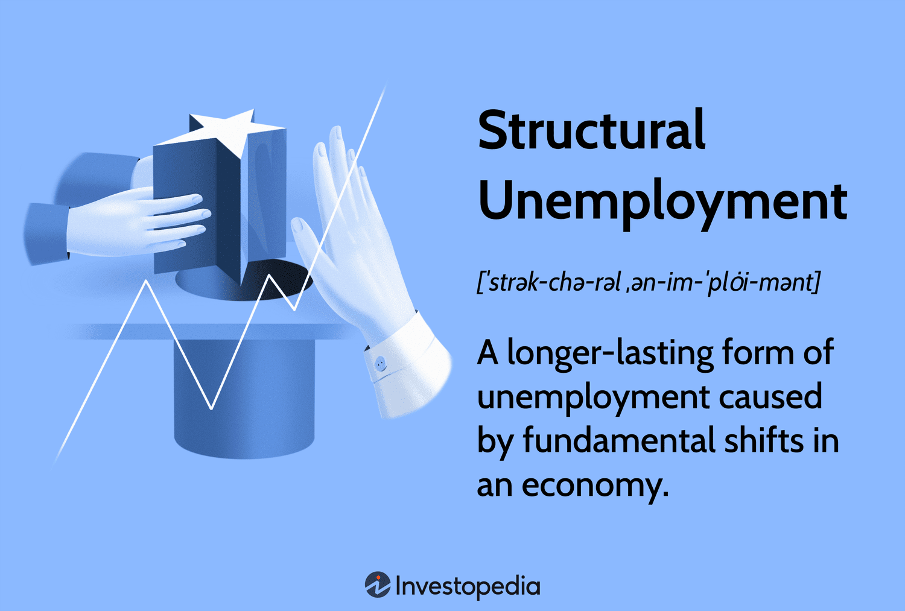

## Table of Contents

## What is structural unemployment?

Structural unemployment happens when there are not enough jobs in a certain industry or area because the economy has changed. This can be because of new technology, businesses moving to other countries, or changes in what people want to buy. For example, if a new machine can do the work of many people, those people might lose their jobs. This type of unemployment is different from other types because it is not just about the number of jobs, but about the kind of jobs that are available.

People who are structurally unemployed often need to learn new skills to get a job in a different industry. This can be hard and take a long time. Sometimes, they might need to move to a different place where there are more jobs. Governments and schools can help by offering training programs to teach new skills. Without this help, it can be very difficult for these people to find new work, and they might stay unemployed for a long time.

## How does structural unemployment differ from other types of unemployment?

Structural unemployment is different from other types of unemployment because it happens when the economy changes in big ways. For example, when new technology comes along or when businesses move to other countries, some jobs go away and don't come back. This means that even if there are jobs available, they might not be the right kind of jobs for people who lost their old jobs. They might need to learn new skills or move to a different place to find work.

Other types of unemployment, like cyclical unemployment, happen when the economy goes through ups and downs. Cyclical unemployment goes up when the economy is doing badly and goes down when the economy gets better. Frictional unemployment is another type, which happens when people are between jobs or looking for a new job that fits them better. Unlike structural unemployment, these other types are usually shorter and people can often find new jobs without needing to learn completely new skills or move.

## What are the main causes of structural unemployment?

Structural unemployment happens when big changes in the economy make some jobs go away for good. One main cause is new technology. When machines or computers can do a job better or cheaper than people, companies might not need as many workers. For example, if a factory starts using robots, the people who used to work there might lose their jobs. Another cause is when businesses move to other countries where it's cheaper to make things. This is called offshoring. When a company moves its factory to another country, the workers in the original country can lose their jobs and have a hard time finding new ones.

Another cause of structural unemployment is changes in what people want to buy. If people start buying less of something, like newspapers, the companies that make those things might need fewer workers. This can leave people without jobs in that industry. Also, sometimes the skills that people have don't match the skills that new jobs need. For example, if a lot of new jobs are in computer programming but most people don't know how to program, they might have trouble finding work. These big changes in the economy can make it hard for people to find new jobs without learning new skills or moving to a different place.

## Can you provide examples of industries affected by structural unemployment?

One industry that has been hit hard by structural unemployment is the coal industry. As countries move towards using cleaner energy like wind and solar power, fewer people are needed to mine coal. This means that many coal miners have lost their jobs and might find it hard to get new ones without learning new skills. The jobs that are available might be in different places or in completely different industries, like technology or renewable energy.

Another example is the retail industry. With the rise of online shopping, many traditional stores have closed down. This has left a lot of people who worked in these stores without jobs. The skills they had, like working at a cash register or helping customers in a store, might not be as useful in the new jobs that are available, which might be in areas like e-commerce or logistics. This makes it hard for them to find new work without retraining.

The manufacturing industry has also seen a lot of structural unemployment. Many factories have moved to other countries where it's cheaper to make things. This is called offshoring. When a factory moves, the workers who used to work there can lose their jobs. They might need to learn new skills or move to a different place to find work, which can be very difficult.

## How does technological advancement contribute to structural unemployment?

Technological advancement can cause structural unemployment when new machines or computers can do jobs that people used to do. For example, if a factory starts using robots to make things, the people who used to work there might lose their jobs. The robots can work faster and don't need breaks, so the company might not need as many workers. This means that even if there are jobs available, they might not be the right kind of jobs for the people who lost their old jobs. They might need to learn new skills, like how to fix the robots, to find work again.

This kind of change can be hard for workers. They might need to go back to school or take training programs to learn new skills. Sometimes, the new jobs might be in a different place, so they might need to move. If they can't learn new skills or move, they might stay unemployed for a long time. Governments and schools can help by offering training programs, but without this help, it can be very difficult for these people to find new work.

## What role do globalization and outsourcing play in structural unemployment?

Globalization and outsourcing can cause structural unemployment because companies sometimes move their factories or offices to other countries where it's cheaper to do business. When a company moves its factory to another country, the workers in the original country can lose their jobs. For example, if a clothing company moves its factory from the United States to Vietnam, the workers in the United States might not have jobs anymore. They might find it hard to get new jobs because the skills they have might not be useful in the jobs that are available in their area.

This can be a big problem because the jobs that are left might need different skills. The workers who lost their jobs might need to learn new things, like how to use computers or work in a different industry, to find work again. Sometimes, they might need to move to a different place where there are more jobs. If they can't learn new skills or move, they might stay unemployed for a long time. Governments and schools can help by offering training programs, but without this help, it can be very hard for these people to find new work.

## How can shifts in consumer demand lead to structural unemployment?

Shifts in consumer demand can lead to structural unemployment when people start wanting different things than before. For example, if people stop buying newspapers and start reading news online, the companies that make newspapers might need fewer workers. This means that the people who used to work at the newspaper might lose their jobs. The jobs that are left might be in different industries, like technology, where the skills needed are different from what these workers know.

When this happens, it can be hard for the workers to find new jobs. They might need to learn new skills, like how to make websites or use computers, to get a job in the new industry. Sometimes, they might need to move to a different place where there are more jobs in the new industry. If they can't learn new skills or move, they might stay unemployed for a long time. Governments and schools can help by offering training programs, but without this help, it can be very difficult for these people to find new work.

## What are the long-term effects of structural unemployment on an economy?

Structural unemployment can have big effects on an economy over a long time. When a lot of people can't find jobs because the economy has changed, they might not have money to spend. This can make the whole economy slow down because businesses sell less and might have to close. Also, if people are out of work for a long time, they might lose their skills or feel less confident about finding a new job. This can make it even harder for them to get back to work, which keeps the economy from growing as fast as it could.

Another long-term effect is that the government might have to spend more money to help people who are out of work. This can mean more money for unemployment benefits or training programs. If the government spends a lot on these things, it might have less money for other important things like schools or roads. Over time, this can make the economy weaker because it's not investing in things that could help it grow. So, structural unemployment can make the economy slower and less able to grow in the future.

## How can government policies help mitigate structural unemployment?

Government policies can help reduce structural unemployment by offering training programs. These programs can teach people new skills that they need to get jobs in industries that are growing. For example, if a lot of new jobs are in computer programming, the government can help people learn how to code. This can make it easier for them to find work again. Also, the government can work with schools and businesses to make sure that the training programs are teaching the right skills that employers need.

Another way the government can help is by giving people money while they are learning new skills. This can be through unemployment benefits or other financial help. This money can help people pay their bills while they are in training, so they don't have to worry about money and can focus on learning. The government can also help by creating jobs in areas where there are not many jobs. For example, they can start projects to build new roads or bridges, which can give people work and help the economy grow. By doing these things, the government can help people find new jobs and make the economy stronger.

## What strategies can individuals use to overcome structural unemployment?

One way individuals can overcome structural unemployment is by learning new skills. If the jobs they used to have are gone because of changes in the economy, they might need to learn how to do something different. They can go back to school or take classes to learn new things, like how to use computers or work in a different industry. This can help them find new jobs that are available. Sometimes, there are free or low-cost training programs offered by the government or community organizations that can help with this.

Another strategy is to be willing to move to a different place where there are more jobs. If the jobs in their area are gone, they might need to move to a city or a different part of the country where the economy is doing better. This can be hard because it means leaving friends and family, but it can also be a way to find new work. Being flexible and open to change can help people find new opportunities and overcome structural unemployment.

## How do economists measure and track structural unemployment?

Economists measure and track structural unemployment by looking at how long people are out of work and what kinds of jobs they used to have. They also look at how the economy is changing, like if new technology is making some jobs go away or if businesses are moving to other countries. By studying these things, economists can figure out if people are having trouble finding jobs because the kinds of jobs they want are not there anymore. They might use surveys to ask people about their job search and what skills they have, which can help them understand if the problem is structural unemployment.

Another way economists track structural unemployment is by looking at the unemployment rate and comparing it to other types of unemployment. They might look at how many people are out of work because the economy is going through a bad time (cyclical unemployment) or because they are between jobs (frictional unemployment). If the unemployment rate stays high even when the economy is doing well, it could be a sign of structural unemployment. Economists use this information to help governments and businesses make plans to create new jobs and training programs to help people find work again.

## What are some case studies or historical examples of structural unemployment?

One example of structural unemployment happened in the United States in the 1980s and 1990s. A lot of factories that made things like cars and steel moved to other countries where it was cheaper to make them. This left many workers in the U.S. without jobs. These workers had skills in making cars and steel, but the new jobs that were available needed different skills, like working with computers. Many of these workers had a hard time finding new jobs because they needed to learn new skills or move to a different place. The government tried to help by offering training programs, but it was still a big problem for a long time.

Another example is what happened to coal miners in the United Kingdom in the 1980s. The government decided to close a lot of coal mines because they were not making enough money and because people were starting to use other kinds of energy, like natural gas. This left many coal miners without jobs. The skills they had were very specific to working in coal mines, and it was hard for them to find new jobs. Many of them had to learn new skills or move to different parts of the country where there were more jobs. This caused a lot of problems for the miners and their families, and it took a long time for them to find new work.

## References & Further Reading

[1]: Autor, D. H., & Dorn, D. (2013). ["The Growth of Low Skill Service Jobs and the Polarization of the US Labor Market."](https://www.aeaweb.org/articles?id=10.1257/aer.103.5.1553) American Economic Review.

[2]: Malik, P. (2017). ["Impact of Automation on Employment in Indian Telecom Sector."](https://www.sciencedirect.com/science/article/pii/S0040162523001336) Journal of Industrial Relations.

[3]: Ciuca, V., & Micu, C. (2019). ["Economic Transition and Unemployment in Post-Communist Countries: The Case of Poland."](https://link.springer.com/article/10.1057/s10713-021-00066-3) Eastern European Economics.

[4]: Hossain, N., & Bayes, A. (2018). ["Structural Transformation and the Transition from Saleem to Sustainable Apparel Production in Bangladesh."](http://ascent-journals.com/IJMSEA/Vol18No2/1_Final%20Reprint.pdf) World Development.

[5]: Bluestone, B., & Harrison, B. (1982). ["The Deindustrialization of America."](https://onlinelibrary.wiley.com/doi/abs/10.1002/hrm.3930220413) Basic Books.

[6]: Fothergill, S., & Gore, T. (2013). ["The Impact of Deindustrialization in Northern England: Policy Implications and Challenges."](https://www.shu.ac.uk/centre-regional-economic-social-research/publications/the-state-of-the-coalfields-2019-economic-and-social-conditions-in-the-former-coalfields-of-england) Journal of Regional Studies.

[7]: "The Impact of Automated Trading in Fixed Income Markets." Bank for International Settlements. [www.bis.org](https://www.bis.org/fsi/publ/insights63.pdf).

[8]: World Economic Forum (2020). ["The Future of Jobs Report 2020."](https://www.weforum.org/publications/the-future-of-jobs-report-2020/)