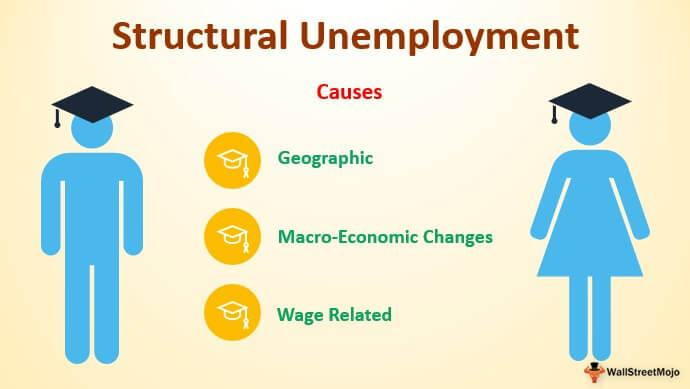

Structural unemployment represents a significant challenge to economies worldwide, precisely because it stems from profound changes within the economic landscape, unlike other more transient forms of unemployment. As societies undergo economic shifts, driven by technological advancements, globalization, and policy decisions, the workforce often finds itself at a crossroads. Workers who previously filled roles essential to an older economic model may now face obsolescence as new industries and technologies emerge. This mismatch between skills and job requirements underpins structural unemployment, distinguishing it from cyclical unemployment, which is tied to the business cycle, and frictional unemployment, which is temporary and occurs as workers transition between jobs.

The role of economic shifts cannot be overstated. Historical trends and the advent of new technologies continually reshape job markets. For instance, automation and artificial intelligence replace routine roles but also create demand for tech-savvy positions, simultaneously necessitating that displaced workers gain new skills to remain employable. Similarly, globalization shifts production to areas where labor costs are lower, leaving high-cost labor markets to grapple with increasing unemployment.

Policy decisions also play a pivotal role in shaping the employment landscape. Governmental strategies around education, industry regulation, and labor laws can either mitigate or exacerbate structural unemployment based on the alignment, or lack thereof, between the educational system and market needs. 

Addressing these causes is crucial for modern economics, as high levels of structural unemployment can lead to broader socio-economic issues, including increased poverty rates and social unrest. This article will explore the nuances of structural unemployment, beginning with its definition and distinguishing characteristics, followed by its primary causes, real-world examples of its impact, and strategies for mitigation. Through an analysis of technological advances, globalization effects, and policy influences, a comprehensive understanding of structural unemployment's place in the evolving economy will emerge.

## Table of Contents

## What is Structural Unemployment?

Structural unemployment refers to a form of unemployment resulting from a persistent mismatch between the skills or locations of job seekers and the requirements or locations of available jobs. This type of unemployment is characterized by long-term shifts in the economy and is often influenced by factors such as technological advancements, global competition, and geographical disparities.

Technological advancements are a significant contributor to structural unemployment. With the rise of automation and artificial intelligence, many traditional jobs are becoming obsolete, especially those involving routine tasks that can be easily replicated by machines. For example, jobs in manufacturing that once relied heavily on human labor are increasingly being performed by automated machinery. This shift necessitates new skill sets that the existing workforce may not possess, resulting in structural unemployment until workers can acquire the necessary skills.

Global competition also plays a role in amplifying structural unemployment. As businesses seek to minimize costs and maximize efficiency, many have shifted production to countries with cheaper labor markets. This globalization of production has led to job losses in industries that face intense international competition, particularly in higher-wage countries. Workers displaced by these changes may find it difficult to secure employment in new industries without retraining, prolonging periods of unemployment.

Geographical factors contribute to structural unemployment when there is an imbalance between where jobs are created and where workers reside. For instance, urban areas may offer numerous job opportunities in burgeoning sectors like technology, finance, and healthcare, while rural areas may struggle with limited employment options. Workers in regions with declining industries might face challenges relocating to areas with more robust job markets, leading to sustained structural unemployment.

In contrast to cyclical unemployment, which is temporary and tied to fluctuations in the business cycle, structural unemployment is often more enduring. Cyclical unemployment rises during economic downturns and falls when the economy recovers, whereas structural unemployment persists even when economic conditions improve. It requires more than just economic recovery to resolve, often demanding strategic interventions like education, training, and policy reforms. Similarly, frictional unemployment, which occurs as individuals transition between jobs, is generally short-term and does not reflect fundamental shifts in the labor market like structural unemployment does.

Addressing structural unemployment requires a multifaceted approach, including educational and vocational training programs that align with changing industry demands and policies that encourage mobility and innovation, thereby mitigating its long-lasting impacts on the labor force.

## Causes of Structural Unemployment

Structural unemployment emerges primarily from three key factors: technological changes, globalization, and policy shifts, which together reshape the economic landscape and workforce requirements. Understanding these causes is essential to addressing the challenges they present.

Technological advancements, such as automation and [artificial intelligence](/wiki/ai-artificial-intelligence), significantly contribute to structural unemployment. As industries adopt new technologies, certain jobs become obsolete. For instance, automation in manufacturing has reduced the demand for manual labor, leading to job displacement for workers without the necessary technical skills. This transition often requires a workforce with advanced skills in areas like programming and robotics, highlighting the mismatch between available jobs and workers' skills.

Globalization is another critical [factor](/wiki/factor-investing) influencing structural unemployment. The increased interconnectivity of markets has led to the relocation of industries to regions with cheaper labor costs. For example, manufacturing jobs might move from developed countries to developing countries, leaving behind a workforce that must either relocate or acquire new skills to remain employable. This migration often results in a surplus of workers in one region and a shortage in another, exacerbating unemployment issues in areas that lose industries.

Policy shifts can also cause structural unemployment by changing the economic environment. Policies related to trade, taxation, or industry regulations can alter how businesses operate, sometimes leading to workforce reductions. For instance, stricter environmental regulations might increase production costs, forcing companies to downsize or automate processes, thereby affecting employment levels.

Educational gaps and skills mismatches further compound structural unemployment. The rapid pace of technological and market changes requires a workforce that is continually updating its skillset. Often, educational systems are slow to adapt, leaving graduates with skills that are misaligned with current industry needs. This mismatch prolongs unemployment as individuals struggle to find jobs that match their skill levels or require additional training to qualify for new roles.

Industry shifts and market changes also play a significant role in structural unemployment. As consumer preferences evolve, certain industries shrink while others expand. For example, the decline of the coal industry due to environmental concerns and the rise of renewable energy sources has created a demand for new skillsets that former coal workers may not possess. This transition period can result in long-term unemployment for workers from declining industries unless re-skilling opportunities are provided.

In conclusion, the causes of structural unemployment are multifaceted, involving technological, global, and policy-induced changes. Addressing these causes requires a comprehensive approach, including education and retraining initiatives, to equip the workforce with the necessary skills for emerging industries.

## Economic Examples of Structural Unemployment

Structural unemployment is a critical issue faced by various economies worldwide, resulting from shifts in economic structures, technological advancements, and evolving consumer demands. This section examines real-world examples and case studies highlighting the impacts of structural unemployment in different regions and industries.

### Automation and Technological Advancements

**Manufacturing in the United States:**
The U.S. manufacturing sector has been significantly affected by structural unemployment due to automation and technological advancements. Over the past few decades, industries such as automobile manufacturing have increasingly integrated robots and automated systems into their production lines. This technological shift has resulted in reduced demand for unskilled and semi-skilled labor, leading to job displacement. According to the Bureau of Labor Statistics, between 2000 and 2010, the U.S. manufacturing sector experienced a loss of approximately 5.6 million jobs, with a considerable portion attributed to automation and productivity enhancements.[^1^]

**Telecommunications in India:**
India's telecommunications industry provides another example. As the industry transitioned from manual switchboard operations to highly automated systems, many workers possessing outdated skills found themselves unemployed. This shift required new technical skills that the existing workforce was unprepared to meet, leading to significant structural unemployment within the sector.[^2^]

### Industry Migration and Changes in Consumer Demand

**Coal Mining in Poland:**
Poland exemplifies structural unemployment caused by industry migration. Traditionally reliant on coal mining, the country has faced significant job losses as global demand for coal diminishes in favor of more sustainable energy sources. This decline has not only affected miners but also related industries, leading to broader economic challenges for regions dependent on coal production.[^3^]

**Textile Industry in Bangladesh:**
The Bangladeshi textile industry demonstrates structural unemployment influenced by changing consumer demand. As global fashion brands shift towards more sustainable production methods, many factories have had to modernize their operations. Those unable to adapt face closures, resulting in job losses for workers with non-transferable skills in outdated production techniques.[^4^]

### Regional Disparities

**Rust Belt in the United States:**
The Rust Belt, a region in the northeastern and midwestern United States, has endured prolonged structural unemployment due to deindustrialization. Once the heart of American manufacturing, the region has struggled with the decline of steel and automotive industries. This economic shift has led to widespread job loss and population decline, as former manufacturing hubs grapple with transitioning to service-oriented economies.[^5^]

**Industrial Towns in Northern England:**
Similarly, industrial towns in Northern England face structural unemployment as traditional industries, such as textiles and shipbuilding, have waned. The shift towards a knowledge-based economy in the UK has left many workers with skills applicable only to declining industries, creating persistent unemployment issues in affected areas.[^6^]

These examples underscore the pervasive and varied nature of structural unemployment. The challenge for policymakers and stakeholders lies in addressing these issues through targeted retraining programs, investment in education, and policies encouraging industry diversification.

[^1^]: Autor, D. H., & Dorn, D. (2013). The Growth of Low Skill Service Jobs and the Polarization of the US Labor Market. American Economic Review.

[^2^]: Malik, P. (2017). Impact of Automation on Employment in Indian Telecom Sector. Journal of Industrial Relations.

[^3^]: Ciuca, V., & Micu, C. (2019). Economic Transition and Unemployment in Post-Communist Countries: The Case of Poland. Eastern European Economics.

[^4^]: Hossain, N., & Bayes, A. (2018). Structural Transformation and the Transition from Saleem to Sustainable Apparel Production in Bangladesh. World Development.

[^5^]: Bluestone, B., & Harrison, B. (1982). The Deindustrialization of America. Basic Books.

[^6^]: Fothergill, S., & Gore, T. (2013). The Impact of Deindustrialization in Northern England: Policy Implications and Challenges. Journal of Regional Studies.

## The Role of Algo Trading in Employment Shifts

Algorithmic trading, often referred to as algo trading, signifies a critical evolution toward automation in the financial sector. It employs complex algorithms and high-speed data processing to execute trades, minimizing human intervention. The integration of algorithmic systems in trading highlights a significant shift whereby computational efficiency and accuracy are prioritized over traditional human-driven trading methods.

### Impact of Automation on Trading Jobs

The incorporation of automated systems has profound implications for employment in the financial industry, particularly affecting trading-related jobs. Traditional roles such as floor traders and brokers are increasingly being replaced by algorithms capable of executing trades at speeds and [volume](/wiki/volume-trading-strategy) beyond human capacity. According to a study by the Bank for International Settlements, automated trading accounts for a substantial proportion of transactions in modern financial markets, often exceeding 50% of traded volume in major exchanges [[1]](https://www.bis.org/publ/qtrpdf/r_qt2103f.htm).

This transition has led to the displacement of numerous jobs traditionally based in these sectors. As algorithms become more sophisticated, the demand for roles that are heavily reliant on human intuition and decision-making diminishes. Unlike cyclical unemployment, which is temporary and related to economic downtrends, structural unemployment induced by [algorithmic trading](/wiki/algorithmic-trading) presents a more enduring challenge. It results from a fundamental restructuring of the industry’s labor needs, where the skills previously valued are no longer required.

### Broader Implications on Structural Unemployment

The broader implications of algorithmic trading on structural unemployment can be understood by examining its ripple effects across the labor market. Firstly, there is a growing need for a workforce proficient in advanced technological skills, including computer science, data analytics, and quantitative finance. This shift underscores a skills mismatch, where workers displaced by automation lack the necessary expertise to transition into new roles created by technological advancements.

Moreover, the financial sector's transition towards algorithmic trading exemplifies a pattern observable in other industries embracing automation and artificial intelligence. It highlights an overarching trend where technology continuously reshapes labor demand, often outpacing the workforce's ability to adapt.

Additionally, this phenomenon accentuates regional disparities in employment opportunities. As financial jobs centralize around technology hubs, regions entrenched in traditional financial industries may experience heightened levels of unemployment. This geographical shift reflects uneven economic development and exacerbates existing socioeconomic divides.

In conclusion, algorithmic trading, a product of technological advancement and market efficiency, exemplifies the automation-driven restructuring impacting employment dynamics. It poses significant challenges in terms of structural unemployment, demanding focused strategies for workforce adaptation. Addressing these challenges necessitates a collaborative effort between policymakers, educational institutions, and businesses to facilitate skills training and create pathways for displaced workers to engage with the evolving labor market landscape.

---

[1] "The Impact of Automated Trading in Fixed Income Markets." Bank for International Settlements, www.bis.org/publ/qtrpdf/r_qt2103f.htm.

## Overcoming Structural Unemployment

Overcoming structural unemployment requires a multifaceted approach, emphasizing the alignment of workforce skills with the demands of a rapidly changing economy. One of the primary strategies involves retraining programs designed to equip individuals with the skills necessary to adapt to new technologies and industries. These programs can be most effective when they are continuously updated to reflect the evolving job market and technological advancements. By offering tailored training, individuals can transition from obsolete industries to burgeoning sectors, thereby minimizing the mismatch between current worker capabilities and job requirements.

Educational system reforms are another pivotal component in addressing structural unemployment. An emphasis on STEM (Science, Technology, Engineering, and Mathematics) education, digital literacy, and soft skills can significantly enhance the adaptability of future workers. Reforming curricula to include real-world problem-solving, project-based learning, and collaboration with industries ensures that the workforce is better prepared for future demands. Additionally, integrating vocational training and apprenticeships within formal education pathways can provide practical experience and reduce the skills gap.

Governments and organizations play crucial roles in minimizing structural unemployment. Governments can implement policies that incentivize companies to invest in employee training and development. Tax benefits or subsidies for firms that provide training programs can encourage businesses to upskill their workforce. Moreover, public-private partnerships can facilitate the sharing of resources and knowledge, thereby enhancing the effectiveness of training initiatives.

Organizations, on the other hand, must foster an environment that encourages continuous learning and skill enhancement. Investing in employee development not only benefits individuals but also enhances organizational competitiveness. Employers should conduct regular assessments of workforce skills and provide access to learning resources. Embracing digital platforms and learning management systems can streamline the training process and make learning accessible to a wider audience.

Lifelong learning and adaptability are essential in the modern workforce, which faces continuous technological disruption. Encouraging a culture of lifelong learning involves promoting a mindset where personal and professional growth is seen as ongoing. Individuals must remain proactive in acquiring new knowledge and skills beyond formal education. This can include participating in online courses, attending workshops, or engaging in self-directed learning.

In summary, addressing structural unemployment necessitates coordinated efforts across various sectors. Retraining programs, educational reforms, governmental incentives, and organizational commitment to employee development are all vital. By prioritizing lifelong learning and skill adaptability, economies can better prepare their workforces to navigate future challenges and opportunities.

## The Future of Work and Structural Unemployment

The future of work, shaped by rapid technological advancements, is poised to fundamentally alter the landscape of employment and impose significant challenges related to structural unemployment. As automation, artificial intelligence (AI), and [machine learning](/wiki/machine-learning) continue to evolve, industries worldwide must adapt to these changes. Forecasts suggest that this technological progression will lead to both the creation and destruction of jobs, demanding strategic management to balance innovation with job creation.

Technological development often leads to an increase in productivity and efficiency, affecting both the quantity and the quality of jobs available. For instance, while AI and robotics may replace repetitive manual tasks, they also create demand for new skills and job categories. The ongoing evolution of the labor market requires a focus on reskilling and upskilling the workforce to align with these technological transformations. According to the World Economic Forum, by 2025, an estimated 85 million jobs could be displaced by automation, yet 97 million new roles are anticipated to emerge, requiring distinct skills and expertise.

This transition necessitates a strategic balance between embracing innovation and ensuring that it translates into job creation rather than widespread job displacement. Companies and governments must prioritize initiatives that foster skill development and adaptability among the labor force. For example, investments in education and training programs tailored to emerging technologies can equip workers with the competencies needed for future job markets. Such proactive measures aim at minimizing the skill mismatch that often exacerbates structural unemployment.

Moreover, the influence of digital platforms and freelance economies is reshaping traditional employment concepts. Gig economies, characterized by short-term contracts or freelance work facilitated by technology, offer flexible work opportunities. However, they also pose challenges in terms of job security and benefits, which must be addressed through appropriate labor regulations and social safety nets to ensure a stable labor market.

Policies aimed at stimulating job creation in tandem with innovation include incentivizing research and development, fostering entrepreneurship, and creating an environment conducive to business growth. Encouraging partnerships between educational institutions and industries can also play a pivotal role in developing curricula that reflect current and future market needs.

In conclusion, the interplay between technological progress and employment will define the future of work. Prioritizing education, skill development, and effective policy frameworks will be crucial to ensuring that technological advancements lead to sustainable economic growth and mitigate the challenges of structural unemployment. As technology continues to advance, stakeholders must collaborate to foster an adaptable workforce capable of thriving in an evolving job market.

## Conclusion

Structural unemployment presents a distinctive challenge to economic stability by persisting regardless of the overall state of the economy. Unlike cyclical unemployment, which fluctuates with the economic cycle, or frictional unemployment, related to short-term job transitions, structural unemployment is deeply rooted in fundamental changes like technological advancement, globalization, and policy shifts that result in mismatches between skills and job requirements. The transformation of industries and automation are often beneficial for efficiency and productivity; however, they can displace workers who lack the necessary skills to transition into new roles, thus emphasizing the importance of addressing structural unemployment.

Emerging from systemic shifts, structural unemployment demands strategic interventions. Economic growth relies heavily on a well-functioning labor market, where the supply of skills matches demand. Failure to address these mismatches could lead to increased long-term unemployment and wider economic disparities. Therefore, mitigating structural unemployment is not merely a policy imperative but crucial to enhancing economic resilience and societal well-being.

Effectively tackling structural unemployment requires a multifaceted collaborative approach. Policymakers are urged to develop and implement educational reforms and retraining programs that align curriculums with market demands. Organizations should invest in continuous workforce development, ensuring employees can adapt to technological changes. Furthermore, individuals must engage in lifelong learning to maintain employability in dynamic job markets.

The imperative here is for all stakeholders—government, businesses, and individuals—to proactively collaborate. Only through coordinated efforts can the challenges posed by structural unemployment be overcome, thereby fostering an adaptable and skilled workforce essential for sustaining economic growth in an ever-evolving global landscape.

## References & Further Reading

[1]: Autor, D. H., & Dorn, D. (2013). ["The Growth of Low Skill Service Jobs and the Polarization of the US Labor Market."](https://www.aeaweb.org/articles?id=10.1257/aer.103.5.1553) American Economic Review.

[2]: Malik, P. (2017). ["Impact of Automation on Employment in Indian Telecom Sector."](https://www.sciencedirect.com/science/article/pii/S0040162523001336) Journal of Industrial Relations.

[3]: Ciuca, V., & Micu, C. (2019). ["Economic Transition and Unemployment in Post-Communist Countries: The Case of Poland."](https://link.springer.com/article/10.1057/s10713-021-00066-3) Eastern European Economics.

[4]: Hossain, N., & Bayes, A. (2018). ["Structural Transformation and the Transition from Saleem to Sustainable Apparel Production in Bangladesh."](http://ascent-journals.com/IJMSEA/Vol18No2/1_Final%20Reprint.pdf) World Development.

[5]: Bluestone, B., & Harrison, B. (1982). ["The Deindustrialization of America."](https://onlinelibrary.wiley.com/doi/abs/10.1002/hrm.3930220413) Basic Books.

[6]: Fothergill, S., & Gore, T. (2013). ["The Impact of Deindustrialization in Northern England: Policy Implications and Challenges."](https://www.shu.ac.uk/centre-regional-economic-social-research/publications/the-state-of-the-coalfields-2019-economic-and-social-conditions-in-the-former-coalfields-of-england) Journal of Regional Studies.

[7]: "The Impact of Automated Trading in Fixed Income Markets." Bank for International Settlements. [www.bis.org](https://www.bis.org/fsi/publ/insights63.pdf).

[8]: World Economic Forum (2020). ["The Future of Jobs Report 2020."](https://www.weforum.org/publications/the-future-of-jobs-report-2020/)