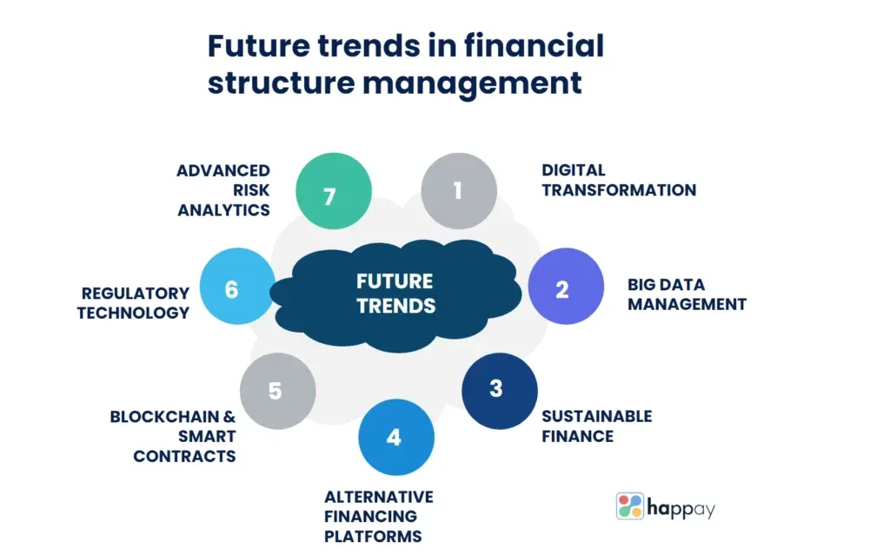

## Table of Contents

## What is a financial option?

A financial option is a contract that gives the buyer the right, but not the obligation, to buy or sell an asset at a specific price on or before a certain date. The asset could be stocks, commodities, or even currencies. The specific price is called the strike price, and the date is known as the expiration date. Options are popular in financial markets because they can be used for various purposes, like speculation, hedging, or generating income.

There are two main types of options: call options and put options. A call option gives the buyer the right to buy the underlying asset at the strike price. For example, if you think the price of a stock will go up, you might buy a call option. On the other hand, a put option gives the buyer the right to sell the underlying asset at the strike price. If you think the price of a stock will go down, you might buy a put option. Both types of options can be used to potentially profit from movements in the market.

## What are the basic types of financial options?

Financial options come in two basic types: call options and put options. A call option gives you the right to buy something, like a stock, at a set price before a certain date. It's like having a special ticket that lets you buy the stock at that price no matter what happens to its market price. People buy call options when they think the price of the stock will go up. If it does, they can buy the stock at the lower set price and then sell it at the higher market price to make a profit.

A put option, on the other hand, gives you the right to sell something at a set price before a certain date. It's like having a special ticket that lets you sell the stock at that price even if the market price drops. People buy put options when they think the price of the stock will go down. If it does, they can buy the stock at the lower market price and then sell it at the higher set price to make a profit. Both call and put options can be used to make money or to protect other investments from losing too much value.

## How does an option contract work?

An option contract is like a special agreement between two people. One person, called the buyer, pays a small fee to the other person, called the seller, for the right to do something with a certain thing, like a stock, at a set price before a certain date. This set price is called the strike price, and the date is called the expiration date. The buyer doesn't have to do anything if they don't want to, but they have the choice. The small fee the buyer pays is called the premium.

If it's a call option, the buyer can choose to buy the stock at the strike price. If the stock's price goes up a lot, the buyer can buy it at the lower strike price and then sell it at the higher market price to make money. If it's a put option, the buyer can choose to sell the stock at the strike price. If the stock's price goes down a lot, the buyer can buy it at the lower market price and then sell it at the higher strike price to make money. If the stock's price doesn't move enough, the buyer might decide not to do anything and just lose the premium they paid.

## What are the key terms used in options trading?

In options trading, there are several important words you need to know. The first is the "strike price," which is the set price at which you can buy or sell the stock if you choose to use your option. The "expiration date" is the last day you can use your option. If you don't use it by then, it goes away and you can't use it anymore. The "premium" is the small fee you pay to get the option. It's like the price of the ticket that gives you the right to buy or sell the stock at the strike price.

Another key term is the "underlying asset," which is the thing, like a stock or commodity, that the option is about. "Call options" give you the right to buy the underlying asset at the strike price, while "put options" give you the right to sell it at the strike price. "In-the-money" means that using the option would be good for you right now because the market price is better than the strike price. "Out-of-the-money" means the opposite—it wouldn't be good to use the option right now. "At-the-money" means the market price and the strike price are the same, so it's a toss-up whether using the option would be good or not.

## What is the difference between an option's premium and its intrinsic value?

An option's premium is the price you pay to buy the option. It's like the cost of the ticket that gives you the right to buy or sell the stock at the strike price. The premium includes two parts: the intrinsic value and the time value. The intrinsic value is the part of the premium that would be good for you right now if you used the option. For example, if you have a call option with a strike price of $50 and the stock is now worth $60, the intrinsic value is $10 because you could buy the stock for $50 and sell it right away for $60.

The time value is the other part of the premium. It's like the extra money you pay for the chance that the stock's price might move even more in your favor before the option expires. The time value goes down as the expiration date gets closer because there's less time for the stock's price to change a lot. So, the total premium you pay for an option is the sum of its intrinsic value and its time value. If an option has no intrinsic value because it's out-of-the-money, the entire premium you pay is just the time value, which is a bet on the stock's price moving in the right direction before the option expires.

## How do options expire and what happens at expiration?

Options have an expiration date, which is the last day you can use them. If you don't use your option by that date, it goes away and you can't use it anymore. This is called expiration. When an option expires, it can either be "in-the-money," "out-of-the-money," or "at-the-money." If it's in-the-money, it means using the option would be good for you right now because the market price is better than the strike price. If it's out-of-the-money, it means the opposite—it wouldn't be good to use the option right now. If it's at-the-money, the market price and the strike price are the same, so it's a toss-up whether using the option would be good or not.

At expiration, what happens depends on whether you have a call option or a put option and whether it's in-the-money or not. For a call option, if it's in-the-money, you can choose to buy the stock at the strike price, or the option might be automatically exercised for you, depending on your broker's rules. If it's out-of-the-money, the option expires worthless, and you lose the premium you paid. For a put option, if it's in-the-money, you can choose to sell the stock at the strike price, or it might be automatically exercised. If it's out-of-the-money, the option also expires worthless, and you lose the premium. If an option is at-the-money, what happens can depend on the specific rules of your broker, but usually, it will expire worthless unless you specifically choose to exercise it.

## What are the risks associated with trading options?

Trading options can be risky because you might lose the money you paid for the option if it doesn't work out. This is called the premium, and it's like buying a ticket that might not be worth anything if the stock's price doesn't move the way you hoped. If you buy a call option and the stock's price stays the same or goes down, you lose the premium. If you buy a put option and the stock's price stays the same or goes up, you also lose the premium. So, you could lose all the money you spent on the option if it expires worthless.

Another risk is that options can be complicated and hard to understand. If you don't know what you're doing, you might make bad choices and lose money. Options can also be used to bet on big moves in the stock's price, which can be very risky. If you're wrong about which way the stock's price will go, you could lose a lot of money quickly. It's important to learn about options and maybe talk to a financial advisor before you start trading them.

## How can options be used for hedging?

Options can be used for hedging to protect your investments from losing too much value. Imagine you own a stock and you're worried its price might go down. You can buy a put option, which gives you the right to sell the stock at a set price even if the market price drops. This way, if the stock's price does go down, you can still sell it at the higher set price and lose less money. It's like buying insurance for your stock.

Hedging with options can also help if you think the market might be risky but you don't want to sell your stocks. For example, if you have a bunch of stocks in your portfolio and you're worried about a market crash, you can buy put options on an index like the S&P 500. If the market does crash, the value of your put options will go up, which can help offset the losses in your stock portfolio. It's a way to protect your money without having to sell your stocks.

## What are some advanced options strategies?

Advanced options strategies can help you make money or protect your investments in different ways. One common strategy is called a "straddle." With a straddle, you buy both a call option and a put option on the same stock with the same strike price and expiration date. This strategy is good if you think the stock's price will move a lot, but you're not sure which way. If the stock's price goes up a lot, the call option will make you money. If it goes down a lot, the put option will make you money. The tricky part is that you need the stock's price to move enough to cover the cost of both options, or you'll lose money.

Another advanced strategy is called a "butterfly spread." This involves buying and selling options at three different strike prices. You buy one call option at a low strike price, sell two call options at a middle strike price, and buy another call option at a high strike price. All the options have the same expiration date. This strategy is good if you think the stock's price will stay close to the middle strike price. If it does, the options you sold will lose value, but the options you bought at the low and high strike prices will help you make money. It's a bit like betting that the stock's price won't move too much in either direction.

## How do market conditions affect option pricing?

Market conditions can change how much you pay for an option. The price of an option, called the premium, goes up or down based on things like how much the stock's price moves around, called [volatility](/wiki/volatility-trading-strategies). If people think the stock's price might jump around a lot, they'll pay more for the option because it's like buying a ticket to a potentially big event. Also, if interest rates go up, call options might cost more and put options might cost less. This is because higher interest rates make it more expensive to hold onto the stock you might buy with a call option, but cheaper to hold onto the money you might get from selling with a put option.

Another thing that affects option pricing is how long you have until the option expires. The more time left, the more the option might be worth because there's more chance for the stock's price to move in your favor. But as the expiration date gets closer, the time value part of the premium goes down because there's less time for the stock's price to change a lot. So, market conditions like volatility, interest rates, and time until expiration all play a big part in deciding how much you'll pay for an option.

## What role do options play in portfolio management?

Options can be a helpful tool in managing your investments. They can be used to protect your money from big losses. For example, if you own a stock and you're worried its price might go down, you can buy a put option. This gives you the right to sell the stock at a set price even if the market price drops. It's like buying insurance for your stock. If the stock's price does go down, you can sell it at the higher set price and lose less money. This way, options help you keep your portfolio safe without having to sell your stocks.

Options can also be used to make more money from your investments. If you think a stock's price will go up, you can buy a call option. This gives you the right to buy the stock at a set price. If the stock's price does go up, you can buy it at the lower set price and then sell it at the higher market price to make a profit. Options can also help you bet on big moves in the stock's price without having to buy the stock itself. This can be a way to make money from your portfolio even if the stock's price doesn't move much. So, options can be a flexible tool to both protect and grow your investments.

## How are options taxed and what are the implications for investors?

When you make money from options, you have to pay taxes on it. The tax rules can be a bit tricky because they depend on how long you hold the option and what kind of option it is. If you hold an option for less than a year before you sell it or it expires, any money you make is taxed as regular income. This can be at a high rate, depending on your income level. If you hold the option for more than a year, the money you make might be taxed at a lower rate, called the long-term capital gains rate. But this usually only applies to certain types of options, like those tied to stocks you already own.

Another thing to know is that if you lose money on options, you might be able to use those losses to lower your taxes. If you lose money on an option, you can use that loss to reduce the taxes you owe on other money you made from investments. This is called tax loss harvesting. But you have to be careful because the rules about how much you can use and when can be complicated. It's a good idea to talk to a tax advisor to make sure you're doing everything right and taking advantage of all the tax benefits you can.

## References & Further Reading

[1]: Bergstra, J., Bardenet, R., Bengio, Y., & Kégl, B. (2011). ["Algorithms for Hyper-Parameter Optimization."](https://papers.nips.cc/paper/4443-algorithms-for-hyper-parameter-optimization) Advances in Neural Information Processing Systems 24.

[2]: ["Advances in Financial Machine Learning"](https://www.amazon.com/Advances-Financial-Machine-Learning-Marcos/dp/1119482089) by Marcos Lopez de Prado

[3]: ["Evidence-Based Technical Analysis: Applying the Scientific Method and Statistical Inference to Trading Signals"](https://www.amazon.com/Evidence-Based-Technical-Analysis-Scientific-Statistical/dp/0470008741) by David Aronson

[4]: ["Machine Learning for Algorithmic Trading"](https://github.com/stefan-jansen/machine-learning-for-trading) by Stefan Jansen

[5]: ["Quantitative Trading: How to Build Your Own Algorithmic Trading Business"](https://www.amazon.com/Quantitative-Trading-Build-Algorithmic-Business/dp/1119800064) by Ernest P. Chan